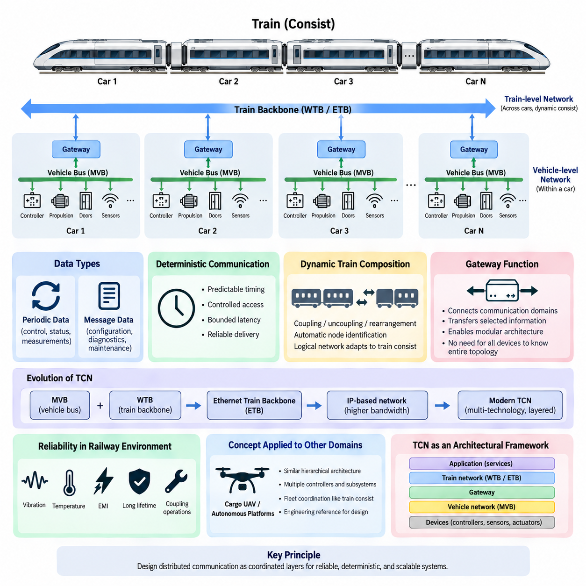
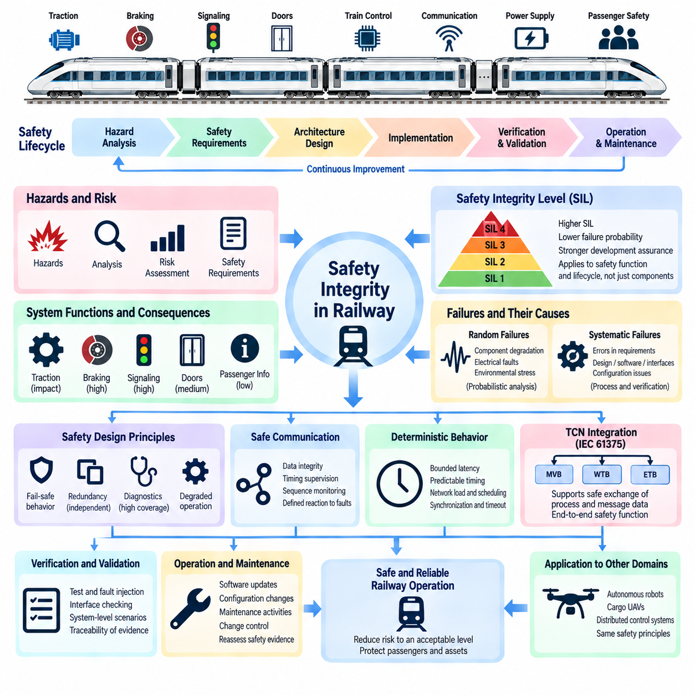
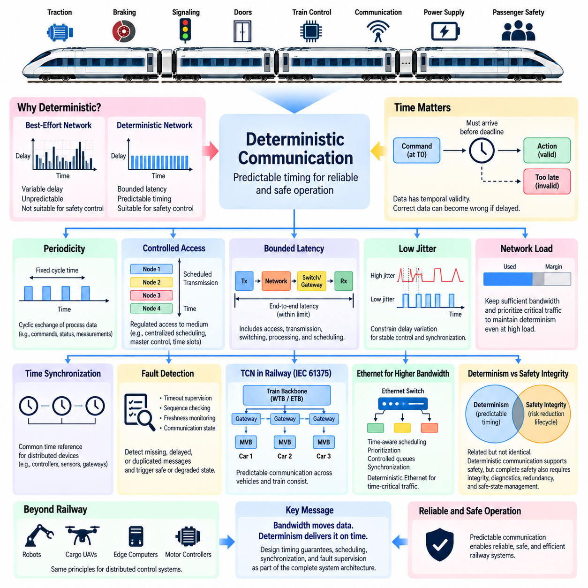
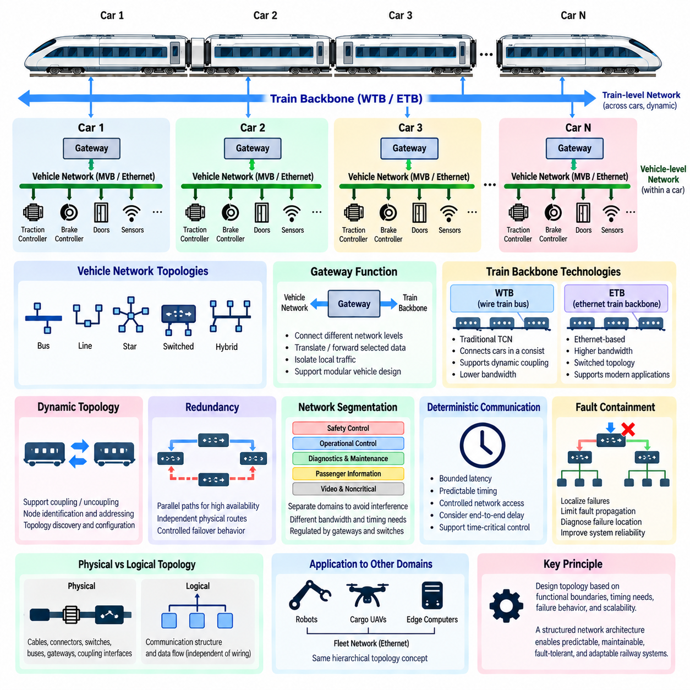
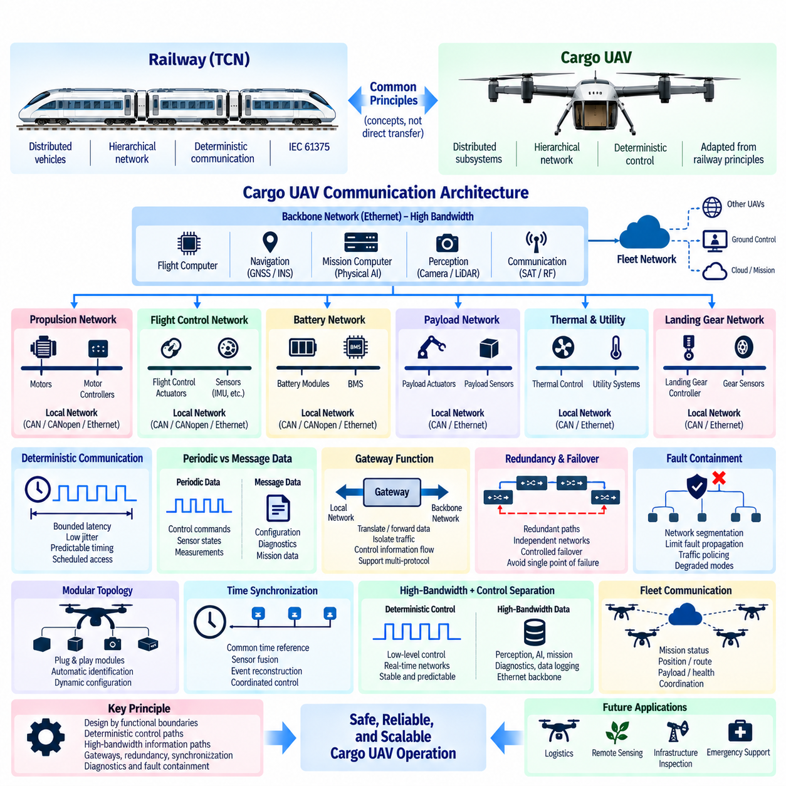

**Volume 08. Railway and Aerospace Protocols**

# Chapter 01. Railway Communication Overview

## 01.01. IEC 61375 (TCN) Standard

{width="7.268055555555556in" height="7.268055555555556in"}

IEC 61375는 열차 통신 네트워크(Train Communication Network, TCN)를 정의하며, 철도 차량과 열차 편성 전체에 분산된 전자 시스템 사이에서 신뢰성 높은 데이터 교환을 수행하기 위해 개발된 표준화된 통신 프레임워크(Communication Framework)이다. 서로 다른 공급업체의 장비가 하나의 통합된 열차 시스템에서 운용, 진단 및 제어 정보를 교환할 수 있도록 공통 아키텍처 원칙, 통신 인터페이스(Communication Interface), 네트워크 서비스를 제공한다.

TCN의 기본 개념은 모든 전자 장치를 하나의 거대한 네트워크에 직접 참여시키는 대신 철도 통신을 계층적으로 구성하는 것이다. 하나의 열차에는 여러 차량이 포함될 수 있으며, 각 차량에는 제어기, 센서, 추진 장치, 제동 시스템, 출입문, 승객 시스템 및 진단 장치가 존재한다. 따라서 IEC 61375는 차량 또는 편성 내부 통신과 전체 열차에 걸친 통신을 구분한다.

전통적인 TCN 아키텍처(Architecture)는 다기능 차량 버스(Multifunction Vehicle Bus, MVB)와 와이어 열차 버스(Wire Train Bus, WTB)라는 두 가지 중요한 네트워크 기술과 밀접하게 연관된다. MVB는 차량 내부 또는 비교적 고정된 차량 그룹에 위치한 장치 사이의 통신을 제공하며, WTB는 여러 편성을 연결할 수 있는 열차 수준의 백본(Backbone)을 제공한다. 두 네트워크를 결합하여 로컬 장비 통신에서 열차 전체의 정보 교환까지 구조화된 통신 경로를 구성한다.

이러한 분리는 철도 차량의 아키텍처 계층에 따라 서로 다른 통신 요구사항이 존재하기 때문에 특히 중요하다. 로컬 제어 정보는 짧고 예측 가능한 통신 주기를 요구할 수 있지만, 열차 수준 정보는 차량 경계를 넘어 전달되어야 하며 열차 편성의 변화에도 대응해야 한다. TCN은 특화된 네트워크 세그먼트(Network Segment)를 통해 이러한 요구사항을 처리하고, 게이트웨이(Gateway)를 이용하여 필요한 정보를 서로 다른 네트워크 사이에서 전달한다.

철도 시스템의 특징적인 요구사항 중 하나는 열차 편성을 동적으로 관리할 수 있어야 한다는 것이다. 운용 과정에서 차량이나 편성이 연결, 분리 또는 재배치될 수 있으므로 통신 아키텍처가 항상 영구적으로 고정된 물리적 구성에 의존할 수는 없다. 열차 백본 통신과 관련된 TCN 메커니즘은 연결된 노드(Node)의 식별과 구성을 지원하여 논리적 통신 구조가 실제 열차 편성을 반영할 수 있도록 한다.

결정론적 동작(Deterministic Behavior)은 철도 통신을 구성하는 또 하나의 핵심 원칙이다. 제어 시스템에서는 정보가 최종적으로 도착하는지만 확인하는 것이 아니라 허용 가능한 시간 범위 안에 도착할 수 있는지를 알아야 한다. 따라서 TCN은 제어된 통신 동작, 네트워크 자원에 대한 제한된 접근 및 예측 가능한 전송 특성을 중요하게 다룬다. 이러한 특성은 철도용 핵심 통신 네트워크를 일반적인 최선형 정보 네트워크(Best-Effort Network)와 구별한다.

TCN 통신은 서로 다른 종류의 철도 데이터도 지원해야 한다. 주기적 프로세스 데이터(Periodic Process Data)는 상태, 명령, 측정값 및 제어 상태와 같이 지속적으로 변화하는 운용 변수를 표현할 수 있으며, 메시지 기반 통신(Message-Oriented Communication)은 설정, 진단 및 유지보수 데이터처럼 반복성이 낮은 정보를 전달할 수 있다. 이러한 통신 패턴을 분리하면 각 애플리케이션(Application)의 시간적 특성에 따라 네트워크 자원을 적절하게 할당할 수 있다.

게이트웨이(Gateway)는 전체 TCN 아키텍처에서 핵심적인 역할을 담당한다. 게이트웨이는 서로 다른 통신 도메인(Communication Domain)을 연결하고 차량 수준 네트워크와 열차 수준 네트워크 사이에서 선택된 정보를 전달한다. 이를 통해 모든 장치가 전체 열차 토폴로지(Topology)를 이해할 필요가 없다. 이러한 방식은 서브시스템(Subsystem)을 로컬 단위로 구성하면서 필요한 운용 정보만 다른 차량, 상위 제어기 또는 열차 관리 기능으로 전달할 수 있도록 아키텍처의 모듈성(Modularity)을 제공한다.

IEC 61375 표준군은 철도 시스템에서 훨씬 높은 통신 대역폭(Bandwidth)이 요구됨에 따라 기존의 MVB 및 WTB 중심 아키텍처를 넘어 발전해 왔다. 특히 이더넷 열차 백본(Ethernet Train Backbone, ETB)과 같은 이더넷 기반 기술은 TCN 개념을 현대적인 인터넷 프로토콜(Internet Protocol, IP) 기반 철도 네트워크로 확장한다. 높은 대역폭은 고급 진단, 승객 정보, 상태 모니터링, 소프트웨어 서비스 및 데이터 집약적인 열차 관리 기능을 가능하게 한다.

따라서 현대적인 TCN은 하나의 물리적 버스(Physical Bus)가 아니라 아키텍처 프레임워크(Architectural Framework)로 이해해야 한다. 서로 다른 통신 기술이 열차 네트워크의 각 영역에 적용되면서도 열차 및 편성 통신을 위한 표준화된 원칙을 따를 수 있다. 이러한 계층적 관점은 기존의 결정론적 버스와 새로운 이더넷 기반 네트워크가 공존하도록 하며, 전통적인 분산 제어 시스템에서 점차 소프트웨어 정의 철도 플랫폼(Software-Defined Railway Platform)으로 발전할 수 있는 경로를 제공한다.

철도 통신은 전기적·기계적으로 가혹한 환경에서 동작하기 때문에 신뢰성(Reliability)이 필수적이다. 네트워크 장비는 진동, 온도 변화, 전자기 간섭(Electromagnetic Interference, EMI), 긴 차량 수명 및 반복적인 차량 연결 작업에서도 정상적으로 기능해야 한다. 따라서 통신 설계는 물리 계층(Physical Layer) 엔지니어링, 토폴로지, 이중화(Redundancy), 진단, 고장 격리(Fault Containment) 및 철도 전자 장비에 적용되는 환경 적합성 요구사항과 함께 고려되어야 한다.

IEC 61375는 이후의 철도 및 항공우주 핵심 통신 기술을 이해하는 데에도 중요한 개념적 기반을 제공한다. 로컬 네트워크(Local Network), 백본 통신(Backbone Communication), 게이트웨이, 결정론적 데이터 교환, 동적 시스템 구성으로 이루어진 계층 구조는 다수의 임베디드 제어기(Embedded Controller)를 하나의 운용 시스템으로 통합하는 방법을 보여준다. 이와 유사한 아키텍처 문제는 이동 로봇, 자율주행 플릿(Autonomous Fleet) 및 분산형 항공우주 플랫폼에서도 나타난다.

화물 무인항공기(Cargo UAV)와 피지컬 AI(Physical AI) 아키텍처에서 TCN은 직접 복제해야 하는 프로토콜이라기보다 엔지니어링 참조 모델(Engineering Reference)로서 가치가 있다. 대형 자율 플랫폼에는 비행 제어기, 추진 제어기, 배터리 시스템, 센서, 페이로드 장비, 엣지 컴퓨터(Edge Computer) 및 통신 게이트웨이가 포함될 수 있다. 여러 플랫폼으로 구성된 플릿은 개별 차량보다 상위의 또 다른 계층을 형성하며, 이는 차량 수준 통신에서 열차 수준 협조 제어로 확장되는 구조와 유사하다.

IEC 61375가 제공하는 보다 폭넓은 교훈은 신뢰할 수 있는 분산 통신을 구축하기 위해 명확한 아키텍처 경계(Architectural Boundary)가 필요하다는 것이다. 장치 네트워크, 차량 네트워크, 백본 네트워크, 게이트웨이, 타이밍 동작, 고장 처리 및 시스템 구성은 독립적인 인터페이스의 집합이 아니라 상호 조정된 계층으로 설계되어야 한다. 이러한 원칙은 MVB, WTB, 전체 TCN 아키텍처, ETB 및 기타 결정론적 핵심 통신 기술을 학습하기 위한 개념적 출발점을 제공한다.

## 01.02. Safety Integrity in Railway

{width="7.268055555555556in" height="7.268055555555556in"}

철도 안전 무결성(Railway Safety Integrity)은 안전 관련 기능(Safety-Related Function)이 요구되는 상황에서 올바르게 수행되고, 체계적 고장(Systematic Failure)이나 랜덤 고장(Random Failure)으로 인해 허용할 수 없는 위험을 발생시키지 않을 것이라는 신뢰 수준을 의미한다. 따라서 철도 엔지니어링에서 안전은 구현 이후 추가되는 특성이 아니라 위험 분석, 시스템 요구사항, 아키텍처, 구현, 검증, 유효성 확인, 운용 및 유지보수를 연결하는 구조화된 수명주기(Lifecycle)를 통해 확보된다.

철도 시스템은 추진(Traction), 제동(Braking), 신호(Signaling), 출입문, 열차 제어, 통신 네트워크, 전력 장비 및 승객 보호 시스템을 포함한 다양한 서브시스템(Subsystem)이 상호작용하는 구조로 이루어진다. 이러한 기능의 고장 결과는 크게 다를 수 있다. 승객 정보 시스템의 오작동은 서비스 품질을 저하시킬 수 있지만, 잘못된 제동 명령이나 이동 권한 명령(Movement-Authority Command)은 위험한 상태를 초래할 수 있다. 따라서 안전 엔지니어링은 각 기능의 잠재적 결과에 따라 기능을 평가한다.

안전 무결성(Safety Integrity) 개념은 안전 관련 기능이 어느 정도의 위험 감소(Risk Reduction)를 제공해야 하는지를 체계적으로 결정하는 방법을 제공한다. 위험요소(Hazard)를 식별하고 원인과 결과를 분석한 다음 적절한 안전 요구사항을 시스템과 서브시스템에 할당한다. 요구되는 무결성 수준은 아키텍처, 이중화(Redundancy), 진단, 개발 프로세스, 검증 수준 및 잔여 위험(Residual Risk)이 허용 가능한 수준으로 감소했음을 입증하기 위해 필요한 증거에 영향을 준다.

철도 안전 엔지니어링에서는 서로 다른 수준의 요구 안전 무결성을 표현하기 위해 일반적으로 안전 무결성 수준(Safety Integrity Level, SIL)을 사용한다. 높은 SIL 요구사항은 고장 발생 가능성을 더욱 낮춰야 하고 보다 강력한 개발 보증(Development Assurance)이 필요한 기능에 대응한다. SIL은 단순한 부품 품질 등급으로 해석해서는 안 되며, 하드웨어, 소프트웨어, 통신, 진단, 검증 및 운용 가정을 포함하는 안전 기능과 전체 수명주기 보증에 적용된다.

랜덤 하드웨어 고장(Random Hardware Failure)과 체계적 고장(Systematic Failure)을 구분하는 것은 매우 중요하다. 랜덤 고장은 부품 열화, 전기적 고장 또는 환경적 스트레스와 같은 물리적 메커니즘에서 발생하며 일반적으로 확률적으로 분석할 수 있다. 반면 체계적 고장은 요구사항, 아키텍처, 소프트웨어, 인터페이스, 설정 또는 엔지니어링 프로세스의 오류에서 발생한다. 이를 줄이기 위해서는 체계적인 개발 방법, 독립적 검증, 추적성(Traceability), 시험 및 형상 관리(Configuration Control)가 중요하다.

위험 분석(Hazard Analysis)은 안전 무결성을 확립하는 기초가 된다. 엔지니어는 운용 시나리오, 비정상 상태, 장비 고장, 통신 오류, 인간과 시스템의 상호작용 및 환경 영향을 분석하여 피해를 발생시킬 수 있는 상황을 식별한다. 이후 위험 사건을 예방하거나, 고장을 탐지하거나, 결과를 제한하거나, 정상 운용을 보장할 수 없을 때 철도 시스템을 정의된 안전 상태(Safe State)로 전환하기 위한 안전 요구사항을 도출한다.

고장 안전 동작(Fail-Safe Behavior)은 철도 설계의 기본 원칙이지만, 모든 고장이 발생하는 즉시 전체 열차를 정지시켜야 한다는 의미는 아니다. 대신 시스템은 해당 기능의 안전 요구사항에 부합하는 방식으로 탐지된 고장에 대응해야 한다. 아키텍처에 따라 비상 제동, 이동 금지, 고장 장비 격리, 성능 저하 운전(Degraded Operation), 기능 제한 또는 이중화된 제어 채널(Redundant Control Channel)로의 전환 등이 수행될 수 있다.

이중화(Redundancy)는 독립적인 채널을 이용하여 단일 고장(Single Failure)이 위험한 결과로 이어지는 것을 방지함으로써 안전 무결성을 향상시킬 수 있다. 그러나 중복된 하드웨어만으로 안전이 보장되는 것은 아니다. 이중화 채널이 전원 공급, 통신 경로, 소프트웨어 결함, 환경적 영향 또는 잘못된 요구사항을 공유할 수 있기 때문이다. 따라서 이중화 제어기, 센서, 네트워크, 전원 시스템 및 보팅 메커니즘(Voting Mechanism)을 설계할 때 공통 원인 고장(Common-Cause Failure)과 공통 모드 고장(Common-Mode Failure)을 고려해야 한다.

진단(Diagnostics)은 또 하나의 중요한 보호 계층을 제공한다. 안전 관련 장비는 프로세서 실행, 메모리 무결성, 통신 상태, 센서 타당성(Sensor Plausibility), 전원 상태, 입력 및 출력 동작과 내부 고장을 지속적으로 또는 주기적으로 검사한다. 진단 범위(Diagnostic Coverage)는 위험 고장이 위험 사건에 기여하기 전에 얼마나 효과적으로 탐지될 수 있는지를 결정한다. 탐지된 고장은 적절하고 예측 가능한 시스템 대응을 발생시켜야 한다.

분산된 철도 제어기 사이에서 안전 관련 정보가 전송되는 경우 통신 네트워크도 안전 논증(Safety Argument)의 일부가 된다. 메시지는 손상, 반복, 손실, 지연, 순서 변경, 삽입되거나 잘못된 목적지로 전달될 수 있다. 따라서 안전 통신 메커니즘(Safety Communication Mechanism)은 순서 감시, 타이밍 감독, 송신지와 목적지 식별, 무결성 검사, 최신성 정보(Freshness Information) 및 통신 고장에 대한 정의된 대응과 같은 기법을 사용한다.

결정론적 통신(Deterministic Communication)은 정확한 데이터라도 너무 늦게 도착하면 기능적으로 잘못된 데이터와 동일한 결과를 발생시킬 수 있기 때문에 안전 무결성과 밀접하게 관련된다. 따라서 안전 관련 철도 제어에서는 명확한 타이밍 가정과 제한된 통신 동작(Bounded Communication Behavior)이 필요하다. 정보가 요구되는 안전 대응 시간 내에 목적지에 도달할 수 있는지를 판단할 때 네트워크 부하, 게이트웨이 지연, 스케줄링, 동기화, 고장 복구 및 타임아웃 메커니즘(Timeout Mechanism)을 고려해야 한다.

IEC 61375에서 정의하는 열차 통신 네트워크(Train Communication Network, TCN)는 다수의 분산 철도 장치가 프로세스 데이터(Process Data)와 메시지 데이터(Message Data)를 교환하는 통신 아키텍처를 제공한다. MVB, WTB 및 이후의 이더넷 기반 열차 네트워크와 같은 TCN 기술은 이를 사용하는 애플리케이션의 안전 요구사항과 통합되어야 한다. 통신 네트워크는 전송 메커니즘을 제공하지만, 완전한 안전 기능은 종단 간 시스템 동작(End-to-End System Behavior)에 의해 결정된다.

검증 및 유효성 확인(Verification and Validation)은 안전 무결성이 설계 의도만으로 가정되는 것이 아니라 객관적인 증거를 통해 입증되어야 하기 때문에 필수적이다. 요구사항의 완전성과 일관성을 검토하고, 구현 결과를 규정된 동작과 비교하여 시험하며, 인터페이스를 검사하고, 필요한 경우 고장 조건을 주입(Fault Injection)하며, 시스템 수준의 시나리오를 검증한다. 추적성은 식별된 위험요소를 안전 요구사항, 설계 요소, 구현, 시험 및 최종 검증 증거와 연결한다.

안전 무결성은 개발 단계에서 끝나는 것이 아니라 전체 운용 수명주기 동안 지속된다. 소프트웨어 업데이트, 교체 부품, 네트워크 설정 변경, 유지보수 활동 및 열차 편성 변경은 개발 과정에서 설정된 가정을 변화시킬 수 있다. 따라서 형상 관리(Configuration Management)와 변경 관리(Change Control)는 단순한 행정 절차가 아니라 안전 활동이다. 중요한 변경이 발생하면 기존 위험 분석, 시험 또는 안전 증거가 여전히 유효한지를 평가해야 한다.

자율 로봇(Autonomous Robot), 화물 무인항공기(Cargo UAV) 및 피지컬 AI(Physical AI) 시스템에서 철도 안전 무결성은 유용한 엔지니어링 모델을 제공한다. 이러한 플랫폼 역시 분산 센서, 제어기, 통신 네트워크, 액추에이터, 전력 시스템 및 지능형 컴퓨팅을 결합한다. 여기서 적용할 수 있는 핵심 원칙은 안전이 AI 정확도나 개별 부품의 신뢰성만으로 결정되지 않으며, 위험요소, 통신 고장, 타이밍, 이중화, 진단, 성능 저하 운용 및 수명주기 증거를 하나의 통합된 시스템 관점에서 다루어야 한다는 것이다.

## 01.03. Deterministic Communication Principle

{width="7.268055555555556in" height="7.268055555555556in"}

결정론적 통신(Deterministic Communication)은 데이터 전달 시간이 정의된 범위 내에서 예측 가능하도록 보장하는 네트워킹 원칙이다. 철도 시스템에서 성공적인 통신은 메시지가 최종적으로 목적지에 도착했는지만으로 판단되지 않는다. 제동, 추진, 출입문 또는 신호 정보가 지연되면 전송된 데이터 자체가 정확하더라도 기능적으로 잘못된 정보가 될 수 있으므로, 제어 정보는 지정된 마감 시간(Deadline) 이전에 도착해야 한다.

이러한 요구사항은 결정론적 네트워크(Deterministic Network)를 일반적인 최선형 통신(Best-Effort Communication)과 구분한다. 최선형 네트워크에서는 패킷이 사용 가능한 자원을 놓고 경쟁하며 트래픽 상태에 따라 전송 지연이 달라질 수 있다. 이러한 동작은 많은 정보 서비스에서는 허용되지만, 안전 관련 철도 제어에서는 시스템 동작을 실제 적용 전에 분석할 수 있도록 제한된 지연시간(Bounded Latency), 제어된 네트워크 접근 및 예측 가능한 응답 시간이 요구된다.

따라서 결정론적 통신 시스템에서는 시간을 전송되는 정보의 일부로 간주한다. 제어 값(Control Value)은 논리적 의미뿐만 아니라 시간적 유효성(Temporal Validity)도 가진다. 예를 들어 특정 시점에 생성된 속도 명령은 지나치게 지연되면 더 이상 올바른 운전 상태를 나타내지 못할 수 있다. 따라서 철도 통신 아키텍처는 정보가 언제 전송되고, 수신되고, 처리되어야 하며, 어느 시점부터 유효하지 않은 것으로 판단해야 하는지를 결정하는 타이밍 제약조건(Timing Constraint)을 정의한다.

주기성(Periodicity)은 예측 가능한 통신을 확립하기 위해 사용되는 방법 중 하나이다. 많은 철도 제어 변수는 사전에 정의된 간격으로 주기적으로 교환되며, 이를 통해 제어기는 새로운 정보가 언제 제공되어야 하는지를 알 수 있다. 주기적 프로세스 데이터(Periodic Process Data)에는 명령, 장비 상태, 측정값 및 상태 정보가 포함될 수 있다. 안정적인 통신 주기(Communication Cycle)는 스케줄링을 단순화하고 누락되거나 과도하게 지연된 업데이트를 타이밍 감시(Timing Supervision)를 통해 탐지할 수 있도록 한다.

통신 매체(Communication Medium)에 대한 제어된 접근도 매우 중요하다. 여러 장치가 조정 없이 데이터를 전송하면 충돌, 혼잡 또는 예측할 수 없는 대기 시간이 발생할 수 있다. 따라서 결정론적 네트워크에서는 각 참여 장치가 언제 전송할 수 있는지를 제어하는 메커니즘을 사용한다. 적용 기술에 따라 중앙 집중식 스케줄링(Centralized Scheduling), 마스터 제어 통신(Master-Controlled Communication), 사전 정의된 전송 기회, 트래픽 클래스(Traffic Class) 또는 시간 인식 네트워크 자원 스케줄링(Time-Aware Scheduling)이 사용될 수 있다.

제한된 지연시간(Bounded Latency)은 정보가 생성된 시점부터 요구되는 수신 시점까지 허용되는 최대 시간을 의미한다. 전체 지연시간은 케이블을 통한 실제 전송 시간에만 국한되지 않는다. 네트워크 접근 대기, 프레임 전송, 스위칭 또는 게이트웨이 지연, 프로토콜 처리, 수신 노드 실행 및 스케줄링 지연이 모두 포함될 수 있다. 따라서 종단 간 타이밍 분석(End-to-End Timing Analysis)은 명목상의 네트워크 데이터 전송률만이 아니라 전체 통신 경로를 분석해야 한다.

지터(Jitter) 역시 중요한 특성이다. 반복적으로 전송되는 메시지는 평균 지연시간이 허용 범위에 있더라도 각각 서로 다른 전송 지연을 경험할 수 있다. 과도한 지터는 제어 루프(Control Loop), 동기화, 센서 융합(Sensor Fusion) 및 액추에이터 협조 동작에 영향을 줄 수 있다. 결정론적 통신은 이러한 시간 변동을 제한하여 주기적 태스크와 분산 제어기가 예측 불가능한 네트워크 동작에 계속 적응하는 대신 알려진 타이밍 조건을 기반으로 동작할 수 있도록 한다.

네트워크 부하(Network Load) 또한 제어된 상태로 유지되어야 한다. 낮은 사용률에서는 예측 가능하게 동작하는 통신 시스템도 트래픽이 네트워크 용량에 가까워지면 비결정론적(Non-Deterministic)으로 변할 수 있다. 따라서 철도 네트워크 엔지니어링에서는 대역폭 할당, 메시지 우선순위, 통신 주기, 최대 프레임 크기, 게이트웨이 트래픽 및 비정상 상태를 고려한다. 다른 네트워크 서비스가 추가적인 부하를 발생시키는 경우에도 핵심 트래픽의 예측 가능성을 유지할 수 있도록 충분한 통신 여유도(Communication Margin)가 필요하다.

분산 장치가 공통된 시간 기준을 공유해야 하는 경우 시간 동기화(Time Synchronization)는 결정론적 전송을 보완한다. 제어기, 센서, 게이트웨이 및 모니터링 장비는 이벤트를 연계하고, 메시지의 최신성(Freshness)을 평가하고, 예약된 전송을 조정하거나, 고장 상황을 재구성하기 위해 동기화된 시계를 필요로 할 수 있다. 참여 장치 사이의 시간 차이가 크다면 정밀한 네트워크 스케줄링의 효과가 제한되므로, 동기화 정확도는 해당 제어 기능에 적합해야 한다.

고장 탐지(Fault Detection)는 결정론적 동작과 밀접하게 연결된다. 수신기는 메시지가 언제 도착해야 하는지를 알고 있기 때문에 정보의 누락을 탐지할 수 있다. 타임아웃 감시(Timeout Supervision), 순서 검사(Sequence Checking), 최신성 감시(Freshness Monitoring) 및 통신 상태 감시를 통해 제어기는 현재 유효한 정보와 지연, 중복 또는 누락된 데이터를 구분할 수 있다. 통신 고장이 탐지되면 애플리케이션은 정의된 안전 상태(Safe State) 또는 성능 저하 운전 상태(Degraded Operating State)로 전환해야 한다.

IEC 61375에서 정의하는 열차 통신 네트워크(Train Communication Network, TCN)는 이러한 원칙을 분산 철도 통신에 적용한다. 다기능 차량 버스(Multifunction Vehicle Bus, MVB)와 같은 전통적인 기술은 차량 내부에서 프로세스 데이터(Process Data)의 예측 가능한 교환을 지원하며, 열차 수준 네트워크는 편성 전체의 통신 도메인을 연결한다. 정보가 네트워크 경계를 통과할 때 게이트웨이 처리가 종단 간 통신 경로의 일부가 되므로, 게이트웨이(Gateway) 역시 요구되는 타이밍 동작을 유지해야 한다.

현대 철도 시스템에서는 이더넷 열차 백본(Ethernet Train Backbone, ETB)을 포함한 이더넷 기반 통신이 점차 확대되고 있다. 이더넷은 훨씬 높은 대역폭을 제공하지만 높은 대역폭 자체가 결정성을 보장하지는 않는다. 스위칭 동작, 큐(Queue), 경쟁 트래픽, 우선순위, 스케줄링, 동기화 및 혼잡을 계속 제어해야 한다. 따라서 현대적인 결정론적 이더넷(Deterministic Ethernet) 기술은 이더넷의 높은 전송 용량과 시간 민감 트래픽(Time-Critical Traffic)의 예측 가능한 전달을 위한 메커니즘을 결합한다.

결정성(Determinism)과 안전 무결성(Safety Integrity)은 서로 관련되어 있지만 동일한 개념으로 취급해서는 안 된다. 결정론적 통신은 예측 가능한 타이밍 특성을 제공하는 반면, 안전 무결성은 안전 관련 기능이 전체 수명주기 동안 요구되는 위험 감소 수준을 달성하는지를 다룬다. 결정론적 네트워크는 안전 기능을 지원할 수 있지만, 완전한 안전은 메시지 무결성, 고장 탐지, 시스템 아키텍처, 소프트웨어 동작, 이중화, 진단 및 안전 상태 관리에도 의존한다.

이러한 원칙은 철도 시스템을 넘어 자연스럽게 확장될 수 있다. 자율 로봇(Autonomous Robot), 화물 무인항공기(Cargo UAV) 및 피지컬 AI(Physical AI) 플랫폼은 서로 다른 업데이트 주기로 동작하는 분산 센서, 엣지 컴퓨터(Edge Computer), 모터 제어기, 비행 제어기 및 액추에이터를 포함한다. 이들의 통신 아키텍처는 고속 제어 트래픽과 상대적으로 느린 인지, 진단, 로깅 및 플릿 데이터(Fleet Data)를 구분해야 한다. 결정론적 인터페이스는 비핵심 트래픽이 시간 민감 제어 경로를 방해하는 것을 방지할 수 있다.

핵심적인 엔지니어링 교훈은 통신 성능을 단순한 평균 속도가 아니라 타이밍 보장(Timing Guarantee)을 기준으로 규정해야 한다는 것이다. 대역폭(Bandwidth)은 네트워크가 얼마나 많은 정보를 전송할 수 있는지를 결정하지만, 결정론적 동작은 중요한 정보가 시스템이 필요로 하는 시점에 도착하는지를 결정한다. 지연시간 한계, 통신 주기, 스케줄링, 동기화, 고장 감시 및 성능 저하 동작을 함께 설계하면 전체 시스템 아키텍처의 일부로 시간적 동작을 검증할 수 있는 네트워크를 구축할 수 있다.

## 01.04. Railway Network Topology

{width="7.268055555555556in" height="7.268055555555556in"}

철도 네트워크 토폴로지(Railway Network Topology)는 철도 시스템 전체에서 통신 장치, 차량 네트워크(Vehicle Network), 열차 백본(Train Backbone), 게이트웨이(Gateway) 및 이중화 경로(Redundant Path)가 물리적·논리적으로 어떻게 상호 연결되는지를 정의한다. 고정된 산업용 기계와 달리 열차는 운용 중 연결되거나 분리될 수 있는 여러 차량으로 구성된다. 따라서 토폴로지는 개별 차량 내부의 안정적인 통신과 전체 열차 편성(Train Consist)에 걸친 적응 가능한 통신을 모두 지원해야 한다.

가장 낮은 아키텍처 계층에서는 전자 장치들이 차량 또는 기능 서브시스템(Functional Subsystem) 내부에서 연결된다. 제어기, 센서, 추진 장비, 제동 장치, 출입문 제어기, 승객 시스템 및 진단 장치는 로컬 통신 네트워크(Local Communication Network)를 통해 정보를 교환한다. 이러한 차량 수준 토폴로지는 불필요한 열차 전체 트래픽을 제한하고 시간 민감 제어 기능(Time-Critical Control Function)이 데이터를 생성하고 사용하는 장비 가까이에서 유지되도록 한다.

차량 네트워크는 통신 기술과 시스템 요구사항에 따라 버스(Bus), 라인(Line), 스타(Star), 스위치 기반(Switched) 또는 하이브리드(Hybrid) 구조를 사용할 수 있다. 전통적인 철도 네트워크에서는 비교적 단순한 배선으로 예측 가능한 통신을 제공하기 때문에 공유 버스 구조(Shared-Bus Structure)가 자주 사용된다. 현대적인 이더넷 기반 시스템에서는 장치 또는 서브네트워크가 이더넷 스위치(Ethernet Switch)를 통해 연결되어 높은 대역폭과 유연한 트래픽 관리를 제공하는 스위치 기반 토폴로지가 점차 확대되고 있다.

다기능 차량 버스(Multifunction Vehicle Bus, MVB)는 전통적으로 철도 차량 또는 고정된 편성 내부의 장치 간 통신과 연관된다. MVB 토폴로지는 분산 제어기(Distributed Controller)가 제어된 통신 환경에서 프로세스 데이터(Process Data)와 메시지 데이터(Message Data)를 교환할 수 있도록 지원한다. MVB를 통해 차량 장비는 열차 전체에 위치한 모든 장비와 직접 통신할 필요 없이 조정된 네트워크에 참여할 수 있으며, 이를 통해 명확한 아키텍처 경계를 유지할 수 있다.

차량 네트워크의 상위에는 서로 다른 차량이나 편성에 위치한 통신 도메인(Communication Domain)을 연결하는 열차 수준 백본(Train-Level Backbone)이 존재한다. 와이어 열차 버스(Wire Train Bus, WTB)는 전통적인 열차 통신 네트워크(Train Communication Network, TCN) 아키텍처에서 이러한 역할을 수행하도록 설계되었다. 철도 차량은 연결되거나 분리될 수 있기 때문에 백본은 물리적 열차 편성의 변화를 수용하고 현재 연결된 편성에 대응하는 논리적 네트워크(Logical Network)를 구성할 수 있어야 한다.

이러한 동적 토폴로지 요구사항(Dynamic Topology Requirement)은 철도 통신과 일반적인 임베디드 네트워크(Embedded Network)를 구분하는 주요 특징 중 하나이다. 여러 편성을 결합하여 구성된 열차는 항상 동일한 차량 수나 동일한 차량 순서를 유지하지 않을 수 있다. 따라서 통신 노드에는 식별(Identification), 주소 지정(Addressing), 토폴로지 탐색(Topology Discovery) 및 구성(Configuration) 메커니즘이 필요하며, 이를 통해 열차 전체 기능은 현재 어떤 통신 참여자가 존재하고 이들이 어떻게 연결되어 있는지를 파악할 수 있다.

게이트웨이(Gateway)는 서로 다른 네트워크 계층 사이의 아키텍처 경계를 형성한다. 게이트웨이는 차량 네트워크와 열차 백본을 연결하고, 선택된 정보를 변환하거나 전달하며, 로컬 트래픽을 격리하고, 모든 로컬 장치가 전체 열차 네트워크를 직접 이해해야 하는 필요성을 제거할 수 있다. 따라서 게이트웨이 기반 토폴로지는 모듈형 차량 설계(Modular Vehicle Design)를 지원하면서 열차 수준 제어기와 관리 시스템이 분산된 서브시스템에서 필요한 정보에 접근할 수 있도록 한다.

현대 철도 통신은 이더넷 열차 백본(Ethernet Train Backbone, ETB)을 통해 이러한 계층적 개념을 확장한다. ETB는 열차 편성 전체에 높은 대역폭의 이더넷 연결을 제공하며, 기존의 저대역폭 버스로 처리하기 어려운 애플리케이션을 지원할 수 있다. 스위치 기반 이더넷(Switched Ethernet)은 유연한 논리적 연결을 가능하게 하지만, 핵심 철도 애플리케이션에서는 여전히 트래픽 경로, 스위칭 지연, 우선순위, 이중화 및 고장 전파(Failure Propagation)를 제어해야 한다.

물리적 토폴로지(Physical Topology)와 논리적 토폴로지(Logical Topology)는 서로 구분해야 한다. 물리적 토폴로지는 실제 케이블, 커넥터, 스위치, 버스, 게이트웨이 및 차량 연결 인터페이스(Coupling Interface)를 의미한다. 논리적 토폴로지는 정확한 배선 구조와 관계없이 장치들이 어떻게 통신하고 애플리케이션 사이에서 데이터가 어떻게 흐르는지를 나타낸다. 예를 들어 물리적으로 이중화된 네트워크는 하위 계층에서 여러 물리적 경로를 유지하면서 애플리케이션에는 보다 단순한 논리적 통신 구조를 제공할 수 있다.

이중화(Redundancy)는 하나의 케이블, 커넥터, 스위치 또는 게이트웨이 고장이 반드시 핵심 열차 통신 전체의 중단으로 이어져서는 안 되기 때문에 중요한 토폴로지 설계 요소이다. 이중화 경로는 고장이 발생했을 때 대체 경로를 제공할 수 있지만, 그 효과는 물리적 독립성과 제어된 장애 전환 동작(Failover Behavior)에 따라 결정된다. 동일한 커넥터, 전원 공급 장치, 케이블 번들 또는 취약한 설치 위치를 공유하는 경로는 여전히 공통 원인 고장(Common-Cause Failure)의 영향을 받을 수 있다.

네트워크 분할(Network Segmentation)은 신뢰성과 관리성도 향상시킨다. 안전 관련 제어, 운용 제어, 진단, 승객 정보, 영상 및 유지보수 서비스는 서로 매우 다른 대역폭과 타이밍 요구사항을 가질 수 있다. 통신 도메인을 분리하면 대용량 또는 비핵심 트래픽이 결정론적 제어 트래픽(Deterministic Control Traffic)을 방해하는 것을 방지할 수 있다. 이후 게이트웨이와 스위치를 이용하여 각 도메인 경계를 통과할 수 있는 정보를 제어할 수 있다.

토폴로지는 결정론적 통신 성능(Deterministic Communication Performance)에 직접적인 영향을 미친다. 모든 버스 접근 메커니즘, 스위치, 게이트웨이 및 네트워크 전환은 일정한 전송 지연과 처리 지연을 발생시킨다. 따라서 여러 네트워크 도메인을 통과하는 통신 경로는 차량 내부의 로컬 경로와 상당히 다른 타이밍 특성을 가질 수 있다. 철도 아키텍처에서는 높은 명목 대역폭이 자동으로 예측 가능한 통신을 제공한다고 가정하지 않고 종단 간 지연시간(End-to-End Latency)을 평가해야 한다.

고장 격리(Fault Containment) 역시 철도 네트워크를 계층적으로 구성하는 중요한 이유이다. 모든 장비가 하나의 제한 없는 통신 도메인에 연결된다면 오작동하는 노드 또는 과도한 트래픽을 발생시키는 장치가 시스템의 광범위한 영역에 영향을 줄 수 있다. 분할된 토폴로지는 고장을 국부화할 수 있으며, 게이트웨이와 스위치는 고장의 전파를 제한할 수 있다. 또한 진단 기능을 통해 고장이 장치, 로컬 네트워크, 백본, 게이트웨이 또는 차량 연결 인터페이스 중 어디에서 발생했는지를 식별할 수 있다.

철도 네트워크 토폴로지 개념은 자율 로봇(Autonomous Robot), 화물 무인항공기(Cargo UAV) 및 피지컬 AI 플릿(Physical AI Fleet)에도 유용한 참조 모델을 제공한다. 하나의 플랫폼 내부에서는 로컬 액추에이터 및 센서 네트워크가 엣지 컴퓨터(Edge Computer)에 연결될 수 있으며, 상위 수준의 이더넷 백본(Ethernet Backbone)은 인지, 제어, 진단 및 페이로드 시스템을 통합할 수 있다. 이후 여러 자율 플랫폼이 플릿 네트워크(Fleet Network)를 통해 통신하면 장치, 차량 및 열차 수준 통신과 유사한 계층 구조가 형성된다.

핵심적인 아키텍처 원칙은 사용 가능한 모든 장치를 단순히 하나의 네트워크에 연결하는 것이 아니라 기능적 경계(Functional Boundary), 타이밍 요구사항, 고장 동작 및 시스템 확장성(Scalability)에 따라 토폴로지를 설계하는 것이다. 차량 네트워크, 열차 백본, 게이트웨이, 이중화 경로 및 논리적 통신 도메인이 함께 구조화된 통신 아키텍처를 형성한다. 이러한 계층 구조를 통해 철도 시스템은 열차 구성과 통신 기술이 변화하더라도 예측 가능성, 유지보수성, 내고장성(Fault Tolerance) 및 적응성을 유지할 수 있다.

## 01.05. Relevance to Cargo UAV

{width="7.268055555555556in" height="7.268055555555556in"}

철도 시스템에서 도입된 통신 원칙은 화물 무인항공기(Cargo UAV) 아키텍처에 유용한 엔지니어링 참조 모델을 제공한다. 두 분야 모두 다수의 분산 전자 서브시스템(Distributed Electronic Subsystem)을 포함하는 복잡한 이동 플랫폼을 운용하기 때문이다. 화물 무인항공기는 비행 제어, 추진, 배터리 관리, 항법, 화물 처리, 센싱, 통신 및 미션 컴퓨터(Mission Computer)를 통합할 수 있으며, 이는 분산형 철도 차량에서 발생하는 것과 유사한 통신 문제를 만든다.

이러한 관련성이 열차 통신 네트워크(Train Communication Network, TCN) 기술을 항공기에 직접 적용해야 한다는 의미는 아니다. 철도와 항공우주 플랫폼은 환경, 인증, 중량, 대역폭 및 안전 제약조건이 서로 다르다. 대신 IEC 61375를 통해 확립된 개념을 분산 통신을 명확하게 분리된 로컬 네트워크(Local Network), 백본 네트워크(Backbone Network), 게이트웨이(Gateway) 및 상위 통신 도메인(Supervisory Communication Domain)으로 구성하기 위한 아키텍처 패턴으로 활용할 수 있다.

대형 화물 무인항공기에는 다수의 추진 장치, 모터 제어기, 배터리 모듈, 액추에이터, 센서 및 로컬 임베디드 제어기(Local Embedded Controller)가 포함될 수 있다. 모든 구성요소를 하나의 중앙 컴퓨터에 직접 연결하면 배선 복잡성, 통신 트래픽 및 고장 전파(Failure Propagation)가 증가한다. 대신 계층형 아키텍처(Hierarchical Architecture)를 사용하여 관련 장비를 로컬 통신 도메인으로 그룹화하고 이러한 도메인을 상위 수준의 백본 네트워크를 통해 연결할 수 있다.

이러한 구조는 철도 시스템에서 차량 수준 통신(Vehicle-Level Communication)과 열차 수준 통신(Train-Level Communication)을 분리하는 방식과 유사하다. 로컬 UAV 네트워크는 추진, 비행 제어 액추에이터, 착륙 장치, 페이로드 메커니즘 또는 배터리 서브시스템을 지원할 수 있으며, 상위 수준의 백본은 비행 컴퓨터, 항법 시스템, 미션 컴퓨터, 인지 프로세서(Perception Processor) 및 통신 게이트웨이를 연결할 수 있다. 기능적 분리는 인터페이스를 명확하게 하고 각 네트워크 도메인을 타이밍 및 신뢰성 요구사항에 따라 설계할 수 있도록 한다.

결정론적 통신(Deterministic Communication)은 화물 무인항공기 제어에서 특히 중요하다. 추진 명령, 액추에이터 상태, 비행 제어 측정값 및 안전 정보는 알려진 시간 제한 내에 도착해야 한다. 높은 평균 대역폭만으로는 올바른 제어 동작을 보장할 수 없다. 통신 아키텍처에서는 제한된 지연시간(Bounded Latency), 지터(Jitter), 업데이트 주기, 스케줄링, 동기화, 네트워크 부하 및 타임아웃 동작을 전체 종단 간 제어 경로(End-to-End Control Path)의 일부로 고려해야 한다.

철도 시스템에서 주기적 프로세스 데이터(Periodic Process Data)와 메시지 기반 데이터(Message-Oriented Data)를 구분하는 방식도 유용한 유사성을 제공한다. 화물 무인항공기는 액추에이터 명령, 모터 상태, 관성 측정값, 배터리 상태 및 비행 제어 변수와 같은 주기적인 정보를 지속적으로 교환한다. 설정 파라미터, 진단 보고서, 유지보수 기록, 임무 정보 및 소프트웨어 관리 트래픽은 서로 다른 통신 특성을 허용할 수 있으며, 시간 민감 제어 트래픽(Time-Critical Control Traffic)을 불필요하게 방해해서는 안 된다.

게이트웨이 기반 아키텍처(Gateway-Based Architecture) 역시 적용할 수 있는 중요한 원칙이다. 화물 무인항공기에는 CAN, CANopen, Ethernet, 직렬 인터페이스(Serial Interface), 항공전자 네트워크(Avionics Network) 또는 기타 특수 통신 기술이 포함될 수 있다. 게이트웨이는 이러한 도메인을 연결하면서 아키텍처 경계를 통과하는 정보를 제어할 수 있다. 이를 통해 저수준 제어기를 고대역폭 인지 또는 미션 트래픽으로부터 격리하면서 필요한 정보를 상위 제어 컴퓨터에 제공할 수 있다.

화물 무인항공기의 크기와 페이로드 용량이 증가할수록 이중화(Redundancy)의 중요성도 높아진다. 작은 서브시스템에 발생한 통신 고장이 모든 핵심 기능을 자동으로 중단시켜서는 안 된다. 독립적인 네트워크 경로, 이중화 제어기, 중복 센서, 대체 전원 및 제어된 장애 전환 메커니즘(Controlled Failover Mechanism)을 이용하면 단일 고장점(Single Point of Failure)을 줄일 수 있다. 그러나 동일한 취약 위치를 통과하는 중복 네트워크는 동일한 고장 메커니즘의 영향을 받을 수 있으므로 물리적 분리가 필요하다.

따라서 고장 격리(Fault Containment)는 이중화만큼 중요하다. 통신 도메인은 오작동하는 센서, 제어기, 스위치 또는 소프트웨어 서비스가 통제되지 않은 트래픽을 발생시켜 비행 핵심 통신(Flight-Critical Communication)을 방해하지 않도록 구성해야 한다. 네트워크 분할(Segmentation), 게이트웨이, 트래픽 제어(Traffic Policing), 우선순위 메커니즘, 상태 모니터링 및 정의된 성능 저하 모드(Degraded Mode)를 통해 고장 전파를 제한하고 고장 발생 이후에도 시스템의 필수 기능을 유지할 수 있다.

철도 시스템의 동적 토폴로지(Dynamic Topology)는 모듈형 화물 무인항공기(Modular Cargo UAV)에도 흥미로운 개념적 유사성을 제공한다. 철도 편성은 차량의 연결과 분리에 따라 변경되며, 미래의 화물 무인항공기 플랫폼 역시 교체 가능한 페이로드 모듈, 배터리 팩, 센서 패키지, 임무 장비 또는 분리 가능한 서브시스템을 지원할 수 있다. 자동 식별 및 구성 메커니즘을 이용하면 플랫폼이 설치된 모듈을 인식하고 적절한 통신 구성을 설정할 수 있다.

분산 시스템에서 생성된 정보를 결합해야 할 때 시간 동기화(Time Synchronization)는 필수적인 요소가 된다. 카메라, 라이다(LiDAR), 레이더(Radar), 위성항법시스템(GNSS), 관성측정장치(IMU), 비행 제어기, 엣지 컴퓨터(Edge Computer) 및 페이로드 센서는 서로 다른 속도로 동작하고 독립적인 타임스탬프(Timestamp)를 생성할 수 있다. 공통 시간 기준은 센서 융합, 이벤트 재구성, 협조 제어, 고장 분석 및 결정론적 스케줄링을 가능하게 하며, 필요한 동기화 정확도는 해당 데이터에 의존하는 기능으로부터 도출되어야 한다.

현대적인 이더넷 기반 철도 아키텍처(Ethernet-Based Railway Architecture)는 화물 무인항공기에서 기존 임베디드 제어와 고대역폭 컴퓨팅을 연결해야 한다는 점에서도 유용한 참조 모델을 제공한다. 카메라와 인지 시스템은 기존 제어 버스가 효율적으로 전송하기 어려울 정도로 많은 데이터를 생성할 수 있다. 따라서 계층형 아키텍처는 저수준 제어에는 결정론적 임베디드 네트워크(Deterministic Embedded Network)를 유지하면서 인지, 미션 컴퓨팅, 진단 및 데이터 통합에는 고대역폭 이더넷을 사용할 수 있다.

이러한 분리는 특히 피지컬 AI(Physical AI) 기능과 관련하여 중요하다. AI 인지(AI Perception), 월드 모델(World Model), 자율 계획(Autonomous Planning) 및 미션 수준 추론(Mission-Level Reasoning)은 고성능 엣지 컴퓨터에서 동작할 수 있지만, 비행 안정화와 액추에이터 제어에는 훨씬 빠르고 예측 가능한 실행이 필요하다. 따라서 가변적인 AI 연산이나 대용량 센서 처리가 항공기의 안정성을 담당하는 결정론적 제어 루프(Deterministic Control Loop)를 직접 방해하지 않도록 통신 아키텍처에서 이러한 경계를 유지해야 한다.

화물 무인항공기 플릿(Cargo UAV Fleet)은 개별 항공기보다 상위의 또 다른 통신 계층을 형성한다. 각 UAV는 자체적인 안전 핵심 내부 네트워크(Safety-Critical Internal Network)를 유지하면서 플릿 통신 계층(Fleet Communication Layer)을 통해 임무 상태, 위치, 경로, 페이로드, 시스템 상태 및 협조 정보를 교환할 수 있다. 이는 로컬 제어 도메인을 유지하면서 여러 이동 플랫폼을 상위 수준의 통신 구조를 통해 연결하는 철도 아키텍처 개념과 유사하다.

따라서 철도 통신에서 화물 무인항공기로 전달할 수 있는 핵심 교훈은 특정 프로토콜이 아니라 아키텍처에 있다. 화물 무인항공기 통신은 명확한 기능적 경계, 결정론적 제어 경로, 고대역폭 정보 경로, 게이트웨이, 이중화, 동기화, 진단 및 고장 격리를 포함하는 조정된 계층(Coordinated Layer)으로 설계되어야 한다. 이러한 원칙을 적용하면 대형 자율 항공기를 단순히 상호 연결된 장치의 집합에서 구조화되고 확장 가능하며 안전 지향적인 분산 시스템(Distributed System)으로 발전시킬 수 있다.
