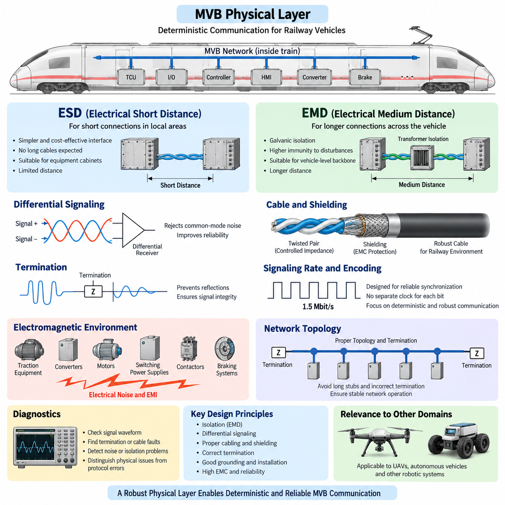
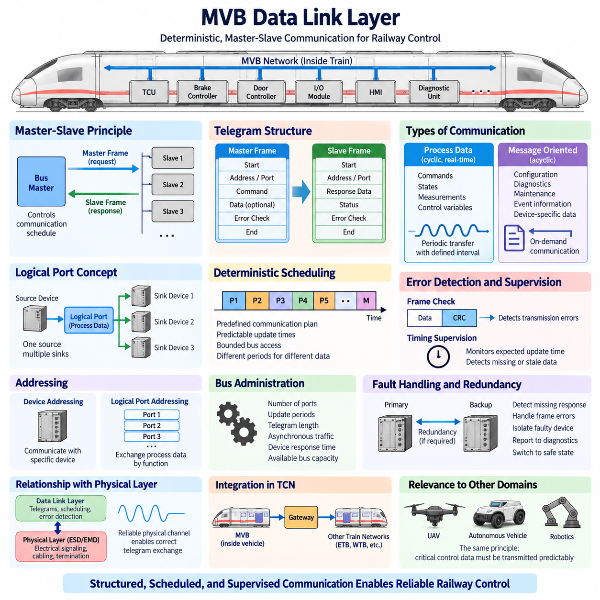
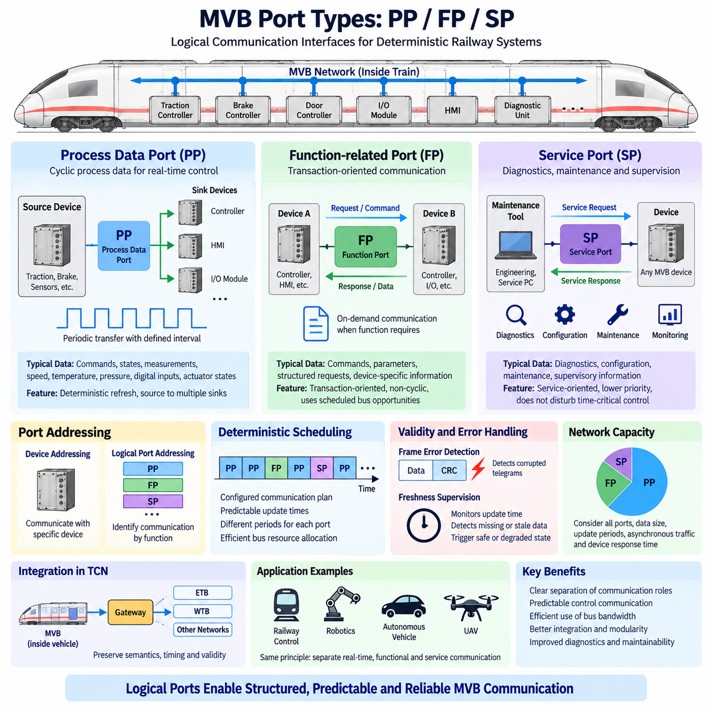
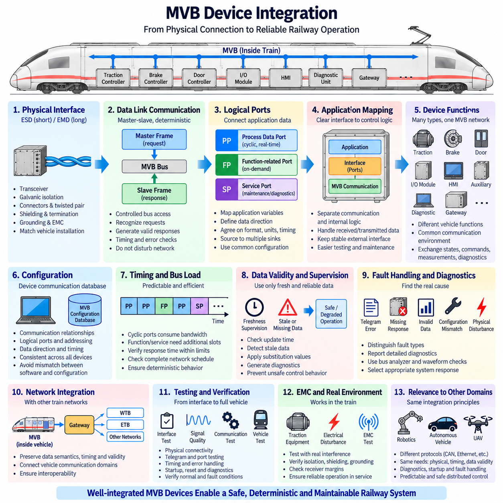
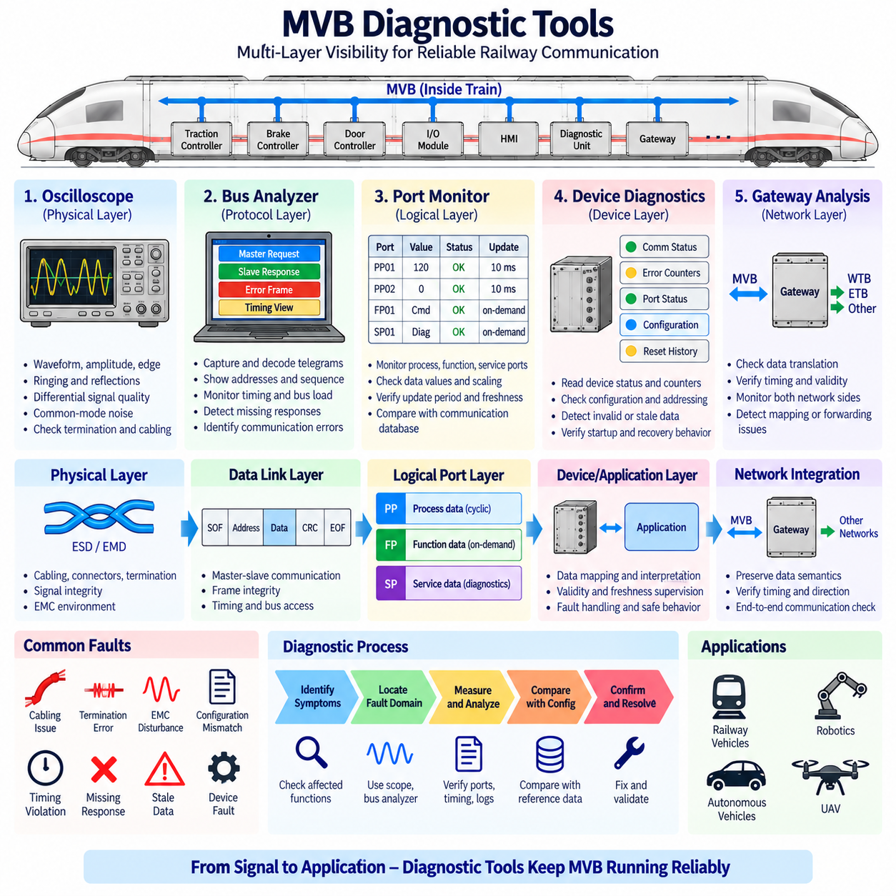

**Volume 08. Railway and Aerospace Protocols**

# Chapter 02. MVB

## 02.01. MVB Physical Layer (ESD/EMD)

{width="7.268055555555556in" height="7.268055555555556in"}

다기능 차량 버스(Multifunction Vehicle Bus, MVB)의 물리 계층(Physical Layer)은 철도 차량 또는 열차 편성(Consist) 내부에 설치된 장치 간의 결정론적 통신(Deterministic Communication)을 위한 전기적·전송적 기반을 제공한다. IEC 61375 열차 통신 네트워크(Train Communication Network, TCN) 아키텍처에서 MVB는 높은 통신 대역폭 자체보다 전기적 잡음, 진동, 긴 운용 수명, 예측 가능한 통신 타이밍이 중요한 가혹한 철도 환경을 위해 설계되었다.

MVB는 차량의 다양한 설치 요구사항에 맞게 통신 매체를 구성할 수 있도록 여러 물리적 전송 방식을 지원한다. 대표적인 전기적 구현 방식으로 전기적 단거리(Electrical Short Distance, ESD)와 전기적 중거리(Electrical Medium Distance, EMD)가 있다. 두 방식은 동일한 상위 수준의 MVB 통신 개념을 사용하지만 전기 인터페이스 설계, 전송 거리, 절연 전략, 케이블링 및 전자기적 견고성에서 상당한 차이를 가진다.

전기적 단거리(Electrical Short Distance, ESD)는 주로 비교적 제한된 전기적 환경 내에 배치된 장비 사이의 짧은 통신 경로를 대상으로 한다. 긴 케이블 배선이나 장치 사이의 큰 전위차가 예상되지 않는 환경에서 단순하고 경제적인 물리 인터페이스를 구현하는 데 중점을 둔다. 따라서 ESD는 국부적인 장비 그룹, 전자 제어 캐비닛 또는 제한된 거리에서 네트워크 노드를 연결할 수 있는 설치 환경에 적합하다.

ESD의 짧은 전송 거리는 장거리 차량 네트워크에서 발생할 수 있는 여러 전송 문제를 감소시킨다. 케이블 감쇠(Cable Attenuation), 전파 효과(Propagation Effect), 누적 공통 모드 외란(Common-Mode Disturbance), 국부 기준 전위 차이를 상대적으로 쉽게 관리할 수 있다. 그러나 철도 환경은 여전히 전기적으로 가혹하므로 적절한 접지(Grounding), 케이블 경로 설계, 종단(Termination), 커넥터 선정 및 고전류 회로와의 분리가 중요하다.

전기적 중거리(Electrical Medium Distance, EMD)는 철도 차량 내부의 보다 긴 거리에서 통신할 수 있도록 MVB 물리 인터페이스를 확장한 방식이다. 차량의 서로 다른 위치에 장비가 분산되어 있을 때 발생할 수 있는 전기적 절연과 외란에 대한 내성을 더욱 중요하게 고려한다. 따라서 EMD는 지리적으로 떨어져 있는 여러 제어 장치를 연결하는 차량 수준 통신 백본(Vehicle-Level Communication Backbone)에 더욱 적합하다.

EMD의 핵심 설계 요소 중 하나는 갈바닉 절연(Galvanic Isolation)이다. 철도 차량에는 견인 장비(Traction Equipment), 컨버터(Converter), 접촉기(Contactor), 모터(Motor), 제동 시스템(Braking System), 보조 전력 변환기(Auxiliary Power Converter) 등 상당한 전도성 및 방사성 간섭을 발생시킬 수 있는 고에너지 전기 시스템이 존재한다. 절연은 네트워크 노드 사이의 불필요한 전류 경로를 차단하고 접지 전위차가 통신 신호에 미치는 영향을 줄인다.

변압기 결합(Transformer Coupling)은 견고한 MVB EMD 구현과 밀접하게 관련된 방식이다. 결합 구조는 필요한 차동 신호(Differential Signal)를 전달하면서 통신 전자회로와 전송선 사이에 전기적 분리를 제공한다. 이러한 절연 장벽(Isolation Barrier)은 공통 모드 외란에 대한 내성을 향상시키고 통신 케이블이 차량의 서로 다른 위치에 존재하는 장비 접지를 연결하는 의도하지 않은 저임피던스 경로가 되는 것을 방지한다.

차동 신호 방식(Differential Signaling) 역시 견고한 MVB 전송을 가능하게 하는 중요한 원리이다. 신호를 공통 접지에 대한 단일 전압으로 해석하는 대신 수신기는 두 도체 사이의 전압 차이를 측정한다. 두 도체에 유사하게 결합되는 잡음은 공통 모드 간섭(Common-Mode Interference)으로 나타나므로 차동 수신기(Differential Receiver)에서 제거할 수 있으며, 전기적 잡음이 많은 철도 환경에서 통신 신뢰성이 향상된다.

케이블 구조는 MVB 물리 계층 성능에 직접적인 영향을 미친다. 특성이 제어된 연선(Twisted Pair)은 균형 잡힌 결합 특성을 유지하고 외부 전자기장에 대한 민감도를 줄이는 데 도움을 준다. 견인 케이블, 스위칭 전력전자 장치, 모터, 릴레이 또는 기타 잡음원 주변을 통과할 경우 차폐(Shielding)를 통해 추가적인 보호가 가능하다. 케이블 임피던스와 설치 특성도 네트워크 전체에서 의도된 파형을 유지할 수 있도록 관리되어야 한다.

MVB 케이블은 이상적인 도체가 아니라 전송선(Transmission Line)으로 동작하기 때문에 적절한 종단(Termination)이 필요하다. 전기적 임피던스가 급격하게 변화하면 전파 중인 신호의 일부가 송신기 방향으로 반사될 수 있다. 이러한 반사(Reflection)는 신호 에지를 왜곡하고 수신기의 잡음 여유도(Noise Margin)를 감소시킨다. 따라서 지정된 위치에 적절한 종단을 적용하면 반사를 억제하고 안정적인 신호 무결성과 결정론적 네트워크 동작을 확보할 수 있다.

따라서 네트워크 토폴로지(Network Topology)는 물리 계층 엔지니어링의 일부로 다루어져야 한다. 지나치게 긴 분기선, 적절하게 제어되지 않은 스텁(Stub), 잘못된 종단 위치, 부적합한 커넥터 또는 케이블 특성의 불연속적인 변화는 개별 장치가 전기적 요구조건을 만족하더라도 신호 반사를 발생시킬 수 있다. MVB의 신뢰성은 개별 송수신 회로뿐만 아니라 설치된 전체 네트워크의 완전성에 의해 결정된다.

MVB 물리 계층은 공칭 1.5 Mbit/s의 신호 전송률(Signaling Rate)로 동작한다. 이는 현대 이더넷(Ethernet) 기술과 비교하면 낮은 속도이지만 MVB가 설계된 목적, 즉 결정론적인 프로세스 및 제어 정보 교환에는 충분히 적합하다. 엔지니어링의 핵심 목표는 최대 처리량(Maximum Throughput)이 아니라 철도 환경과 전자기적 조건에서 제한된 타이밍과 높은 가용성을 갖는 반복 가능하고 예측 가능한 통신 동작을 확보하는 것이다.

신호 인코딩(Signal Encoding)은 전송되는 각 비트에 대해 독립적인 클록을 별도로 분배하지 않고도 안정적인 동기화와 수신기 해석이 가능하도록 설계된다. 따라서 전송 파형은 타이밍 허용오차(Timing Tolerance), 에지 품질(Edge Quality), 케이블 전파 특성, 수신기 임계값 및 신호 왜곡과 함께 고려해야 한다. 특히 케이블 길이와 연결 장치 수가 증가할수록 물리 계층의 신호 여유도 확보가 더욱 중요해진다.

따라서 ESD와 EMD를 단순히 두 종류의 커넥터 선택 방식으로 이해해서는 안 된다. 이들은 서로 다른 물리 계층 엔지니어링 영역을 의미한다. ESD는 장비가 전기적으로 가까운 환경에서 단거리 통신의 단순성을 중시하는 반면, EMD는 장비가 차량 전체에 분산된 환경에서 절연, 케이블 길이, 공통 모드 외란 및 전자기 적합성(Electromagnetic Compatibility, EMC)을 중심으로 보다 견고한 통신을 제공한다.

전자기 적합성(Electromagnetic Compatibility, EMC)은 MVB가 빠른 전압 및 전류 변화를 발생시키는 스위칭 컨버터와 견인 장비 주변에서 동작하기 때문에 특히 중요하다. 잡음은 용량성 결합(Capacitive Coupling), 유도성 결합(Inductive Coupling), 공통 임피던스(Common Impedance), 접지 경로 등을 통해 유입될 수 있다. 따라서 차동 전송, 적절한 차폐, 절연, 제어된 접지, 물리적 분리 및 올바른 종단을 종합적으로 적용해야 한다.

커넥터와 와이어 하니스(Wire Harness) 구성품 역시 열차의 전체 운용 수명 동안 이러한 전기적 특성을 유지해야 한다. 접점 열화(Contact Degradation), 차폐 연속성 손실, 부적절한 수리, 차동 도체의 과도한 풀림 또는 부적합한 케이블로의 교체는 즉각적인 네트워크 고장을 발생시키지 않으면서 통신 여유도를 감소시킬 수 있다. 따라서 유지보수 과정에서도 MVB 배선을 일반적인 저전압 배선이 아닌 엔지니어링된 통신 채널(Engineered Communication Channel)로 취급해야 한다.

물리 계층 진단(Physical-Layer Diagnostics)에서는 통신 프로토콜에서 나타나는 증상과 실제 전기적 원인을 구분해야 한다. 반복적인 프레임 오류(Frame Error), 간헐적인 장치 이탈 또는 견인 시스템 작동과 연계된 통신 장애는 종단 결함, 차폐 손상, 커넥터 저항 증가, 케이블 단선, 과도한 잡음 또는 절연 문제에서 발생할 수 있다. 오실로스코프(Oscilloscope)와 적절한 네트워크 진단 장비를 이용하면 상위 프로토콜에서는 단순한 통신 오류로 나타나는 파형 왜곡을 직접 확인할 수 있다.

시스템 아키텍처(System Architecture) 관점에서 MVB 물리 계층은 결정론적 네트워킹(Deterministic Networking)이 데이터 링크 계층(Data Link Layer)의 스케줄링이나 프레임 메커니즘보다 더 낮은 계층에서 시작된다는 점을 보여준다. 전기적 통신 채널이 불안정하다면 예측 가능한 매체 접근 방식만으로 신뢰성 있는 통신을 보장할 수 없다. 따라서 ESD와 EMD는 MVB 데이터 링크 제어, 프로세스 데이터 교환, 장치 통신, 감독 및 상위 TCN 기능이 안정적으로 동작하기 위한 물리적 기반을 제공한다.

레거시 철도 시스템과 현대 철도 시스템을 통합할 때에도 물리적 매체(Physical Medium)와 통신 기능(Communication Function)의 구분은 중요하다. MVB 세그먼트는 게이트웨이(Gateway)를 통해 WTB, 이더넷 열차 백본(Ethernet Train Backbone, ETB) 또는 다른 차량 네트워크와 연결될 수 있지만, ESD 또는 EMD 세그먼트 자체는 고유한 전기적 요구조건을 계속 만족해야 한다. 게이트웨이 기능만으로 잘못된 종단, 불충분한 절연, 과도한 케이블 외란 또는 물리적 설치 결함을 보상할 수는 없다.

로보틱스(Robotics)와 다른 피지컬 AI(Physical AI) 플랫폼에서도 MVB 프로토콜 자체를 사용하지 않더라도 중요한 엔지니어링 참고 사례가 될 수 있다. 분산형 이동 기계 역시 모터 인버터 잡음, 배터리 접지 전위차, 긴 와이어 하니스, 안전 중요 제어(Safety-Critical Control), 다수의 임베디드 제어기와 같은 문제를 가진다. MVB EMD의 설계 철학은 절연, 균형 신호 전송, 제어된 케이블링 및 결정론적 통신을 하나의 통합 전기 시스템으로 설계하는 방법을 보여준다.

화물 무인항공기(Cargo UAV)와 대형 자율주행 차량(Large Autonomous Vehicle) 아키텍처에서 가장 중요한 적용 교훈은 네트워크 선정과 물리적 설치를 서로 분리해서 생각할 수 없다는 점이다. 상위 프로토콜이 메시지와 타이밍을 정의하더라도 케이블 토폴로지, 절연 경계(Isolation Boundary), 전자기 간섭(Electromagnetic Interference, EMI), 접지, 종단 및 커넥터 신뢰성이 해당 메시지를 실제로 예측 가능하게 전달할 수 있는지를 결정한다. MVB의 ESD와 EMD는 이러한 원칙을 보여주는 성숙한 철도 통신 사례이다.

## 02.02. MVB Data Link Layer

{width="7.268055555555556in" height="7.268055555555556in"}

MVB 데이터 링크 계층(Data Link Layer)은 공유 다기능 차량 버스(Multifunction Vehicle Bus, MVB)에 대한 접근을 체계적으로 관리하는 결정론적 통신(Deterministic Communication) 메커니즘을 제공한다. 물리 계층(Physical Layer)이 철도 장치 사이에서 전기 신호가 어떻게 전달되는지를 정의한다면, 데이터 링크 계층은 장치가 언제 통신할 수 있는지, 텔레그램(Telegram)이 어떻게 구성되는지, 프로세스 정보가 어떻게 교환되는지, 통신 오류를 어떻게 검출하는지를 결정한다.

MVB는 네트워크 대역폭에 대한 기회주의적 접근보다 예측 가능한 타이밍이 중요한 분산형 철도 제어 시스템(Distributed Railway Control System)을 위해 개발되었다. 제어기, 제동 장비, 견인 시스템, 출입문, 입출력 모듈, 인간-기계 인터페이스(Human-Machine Interface, HMI), 진단 장치는 정해진 시간 범위 안에서 정보를 교환해야 한다. 따라서 데이터 링크 계층은 장치가 통신 매체의 사용 가능 여부만 확인하여 임의로 전송하는 대신 제어된 버스 접근(Controlled Bus Access)을 사용한다.

MVB의 기본적인 개념 중 하나는 마스터-슬레이브 통신(Master-Slave Communication) 원리이다. 버스 마스터(Bus Master)는 마스터 프레임(Master Frame)을 전송하여 통신 활동을 제어하고, 주소가 지정된 장치는 요청된 통신 동작에 따라 응답한다. 이러한 제어된 상호작용은 장치 간의 임의적인 전송 경쟁을 방지하며 다양한 운용 조건에서도 네트워크 동작을 쉽게 스케줄링하고 분석하며 검증하고 재현할 수 있도록 한다.

MVB 통신은 마스터 프레임(Master Frame)과 필요한 경우 그 뒤를 따르는 슬레이브 프레임(Slave Frame)으로 구성되는 텔레그램(Telegram)을 중심으로 구성된다. 마스터 프레임은 통신 요청을 식별하고 어떤 장치, 포트 또는 기능이 관련되는지를 결정한다. 이에 대응하는 슬레이브 응답은 요청된 정보를 전달하거나 트랜잭션(Transaction)을 완료한다. 이러한 요청-응답(Request-Response) 구조는 각 버스 사용 구간의 통신 주체가 명확하게 정의된 체계적인 통신 순서를 제공한다.

철도 네트워크에서는 반복되는 실시간 값과 상대적으로 빈도가 낮은 통신 요청을 모두 처리해야 하므로 데이터 링크 계층은 서로 다른 종류의 정보를 지원한다. 프로세스 데이터(Process Data)는 명령, 상태, 측정값 및 제어 변수와 같이 빠르게 변화하는 운용 정보를 나타낸다. 메시지 지향 통신(Message-Oriented Communication)은 구성(Configuration), 진단, 유지보수 정보 및 기타 장치별 트랜잭션과 같이 상대적으로 비주기적인 정보 교환을 지원한다.

프로세스 데이터(Process Data)는 결정론적 철도 제어에서 특히 중요하다. 각각의 전송을 독립적인 애플리케이션 메시지(Application Message)로 취급하는 대신 MVB는 프로세스 정보를 논리 포트(Logical Port)와 연계한다. 장치는 이러한 포트와 연결된 값을 생성하거나 소비할 수 있으며, 알려진 데이터 관계를 중심으로 통신 스케줄을 구성할 수 있다. 이러한 방식은 프로세스 변수의 논리적 의미를 개별 물리 장치의 연결 세부사항과 분리한다.

MVB의 프로세스 데이터 통신(Process Data Communication)은 일반적으로 소스 지향 분배(Source-Oriented Distribution) 원리를 따른다. 소스 장치(Source Device)는 할당된 포트를 통해 프로세스 변수를 제공하고 하나 이상의 싱크 장치(Sink Device)가 해당 정보를 사용할 수 있다. 동일한 상태 또는 명령 정보가 여러 제어기에 동시에 필요할 수 있는 철도 시스템에서는 각각의 수신 장치에 별도의 점대점(Point-to-Point) 트랜잭션을 구성할 필요를 줄일 수 있어 효과적이다.

주기적 프로세스 데이터 전송(Periodic Process Data Transfer)은 중요한 정보가 사전에 정의된 시간 간격 내에 갱신되도록 스케줄링된다. 빠른 제어 기능과 관련된 변수는 높은 빈도로 전송할 수 있고 느리게 변화하는 상태 정보는 더 긴 주기를 사용할 수 있다. 이렇게 구성된 통신 계획은 대역폭 사용량과 최악 조건에서의 갱신 시간(Worst-Case Update Time)을 열차가 실제 운행에 투입되기 전에 평가할 수 있는 결정론적 트래픽 패턴을 형성한다.

따라서 MVB 마스터(MVB Master)는 단순한 주소 지정 권한을 가진 장치 이상의 역할을 수행한다. 마스터는 통신 스케줄을 유지하는 데 참여하고 설정된 버스 동작에 따라 데이터 전송을 시작한다. 시스템은 마스터 프레임의 순서를 제어하여 애플리케이션 요구조건에 맞게 통신 기회를 할당할 수 있다. 이러한 중앙 집중식 조정(Centralized Coordination)은 순간적인 트래픽에 따라 전송 지연이 변할 수 있는 경쟁 기반 네트워크(Contention-Based Network)와 MVB의 결정론적 동작을 구분하는 특징이다.

장치 주소 지정(Device Addressing)은 개별 트랜잭션이 필요한 경우 마스터가 특정 네트워크 참여 장치와 통신할 수 있도록 한다. 반면 논리 포트 주소 지정(Logical Port Addressing)은 통신 기능을 기준으로 프로세스 정보 교환을 지원한다. 장치 식별과 프로세스 데이터 구성을 개념적으로 분리하면 차량 개발 과정에서 장비 구현 방식이나 제어기의 내부 아키텍처가 변경되더라도 철도 시스템의 구조화된 인터페이스를 유지하는 데 도움이 된다.

MVB 텔레그램 무결성(Telegram Integrity)은 정의된 프레임 필드(Frame Field)와 오류 검출 메커니즘(Error-Detection Mechanism)에 의해 확보된다. 수신기는 수신 정보가 예상된 구조를 가지고 있는지와 전송 과정에서 데이터 손상이 발생했는지를 판단해야 한다. 오류 검출 정보는 손상된 텔레그램이 유효한 제어 데이터로 잘못 받아들여지는 것을 방지한다. 물리 네트워크가 높은 전자기 적합성(EMC) 내성을 갖도록 설계되어도 전기적 간섭으로 비트 오류가 발생할 수 있기 때문에 이러한 기능은 중요하다.

타이밍 감시(Timing Supervision)는 프레임 수준의 오류 검출을 보완한다. 철도 제어기는 유효한 데이터와 통신 중단으로 인해 더 이상 최신 상태가 아닌 오래된 데이터(Stale Data)를 구분해야 하는 경우가 많다. 따라서 상위 통신 동작에서는 예상된 프로세스 정보가 요구된 시간 간격 내에 갱신되는지를 감시할 수 있다. 데이터 갱신이 누락되거나 지연되면 수신 애플리케이션은 정의된 성능 저하 상태(Degraded State) 또는 안전 상태(Safe State)로 전환할 수 있다.

MVB 데이터 링크의 결정론성(Determinism)은 제어된 마스터 개시(Master Initiation), 사전에 정의된 통신 관계, 제한된 텔레그램 트랜잭션(Bounded Telegram Transaction), 주기적 스케줄링(Cyclic Scheduling)의 조합을 통해 구현된다. 결정론적이라는 것은 모든 정보가 동일한 빈도로 전송된다는 의미가 아니다. 통신 기회와 갱신 요구조건을 체계적으로 설계하여 해당 철도 애플리케이션에서 중요한 최대 지연 시간을 제한하고 검증할 수 있다는 의미이다.

모든 철도 통신이 반복적인 프로세스 트래픽으로 예측될 수 있는 것은 아니므로 데이터 링크 계층은 비동기 요구사항(Asynchronous Requirement)도 처리해야 한다. 진단 요청, 구성 작업, 이벤트 관련 정보 및 유지보수 동작은 불규칙하게 발생할 수 있다. 따라서 MVB는 시간 중요도가 높은 주기적 프로세스 데이터에 필요한 자원을 보존하면서 이러한 트래픽을 처리하고, 백그라운드 통신이 필수적인 제어 정보 교환을 방해하지 않도록 하는 통신 메커니즘이 필요하다.

많은 장치가 하나의 MVB 세그먼트(MVB Segment)를 공유할 경우 버스 관리(Bus Administration)는 특히 중요해진다. 통신 구성에서는 프로세스 포트 수, 필요한 갱신 주기, 텔레그램 길이, 비동기 트래픽, 장치 응답 특성 및 사용 가능한 버스 용량을 고려해야 한다. 물리 네트워크에 전기적 오류가 없더라도 잘못된 스케줄링은 과도한 대역폭을 소비하거나 데이터 갱신 지연 시간을 증가시킬 수 있다.

철도 시스템의 가용성 요구조건에 따라 필요한 경우 MVB 통신을 중심으로 시스템 수준의 이중화(Redundancy)와 고장 처리(Fault Handling)를 구현할 수 있다. 통신 감시는 응답 누락, 반복적인 프레임 오류, 접근 불가능한 장치 또는 오래된 프로세스 값을 식별할 수 있다. 이후 애플리케이션과 차량 제어 아키텍처는 해당 고장을 일시적으로 허용할지, 격리할지, 진단 시스템에 보고할지 또는 정의된 성능 저하 상태나 안전 상태로 전환할지를 결정한다.

따라서 데이터 링크 계층의 진단(Diagnostics)은 통신의 정확성과 통신 타이밍을 모두 검사해야 한다. 물리적으로 정상적인 버스에서도 장치가 올바르게 응답하지 않거나 논리 포트가 잘못 설정되거나 통신 스케줄이 요구된 갱신 속도를 제공하지 못하면 애플리케이션 문제가 발생할 수 있다. 반대로 반복적인 텔레그램 오류는 스케줄링이나 프로토콜 문제가 아니라 하위 물리 계층의 문제를 의미할 수도 있다.

문제 해결 과정에서는 물리 계층과 데이터 링크 계층의 관계가 특히 중요하다. ESD 또는 EMD 케이블링, 종단(Termination), 차폐(Shielding), 절연(Isolation), 신호 품질은 비트가 안정적으로 전송될 수 있는지를 결정한다. 데이터 링크 계층은 이렇게 형성된 통신 채널을 제어된 텔레그램 교환으로 변환한다. 프레임 오류와 함께 신호 파형, 장치 응답 및 타이밍 동작을 관찰하면 엔지니어가 정확한 아키텍처 계층에서 고장의 원인을 찾을 수 있다.

보다 넓은 열차 통신 네트워크(Train Communication Network, TCN)에서 MVB는 일반적으로 차량 또는 차량 그룹 내부 장치 간 통신을 담당하며, 게이트웨이(Gateway)를 통해 다른 열차 수준 네트워크 기술과 연결될 수 있다. 데이터 링크 계층은 상위 백본 네트워크와 독립적으로 로컬 MVB 세그먼트에 결정론적 동작을 제공하므로 적절하게 설계된 게이트웨이를 통해 기존 철도 통신 기술과 현대적인 통신 기술이 함께 운용될 수 있다.

MVB는 결정론적 네트워킹(Deterministic Networking)이 전송 문제뿐만 아니라 근본적으로 자원 할당(Resource Allocation)의 문제라는 점을 보여준다. 안정적인 전기 신호 전송만으로는 예측 가능한 제어 통신을 보장할 수 없다. 누가 전송하는지, 언제 전송하는지, 통신 계획에서 어떤 정보가 우선되는지, 중요 변수를 얼마나 자주 갱신하는지, 그리고 고장이나 갱신 누락을 어떻게 인식하는지를 네트워크가 제어해야 한다.

이러한 원리는 로보틱스(Robotics), 자율주행 차량(Autonomous Vehicle), 피지컬 AI(Physical AI) 시스템에서도 유효하다. 로봇에서는 MVB 대신 CAN, CANopen, 산업용 이더넷(Industrial Ethernet) 또는 다른 네트워크를 사용할 수 있지만 모터 제어, 제동, 조향, 안전 입출력(Safety I/O), 상위 제어기에는 여전히 제한된 통신 지연 특성이 요구된다. 주기적 제어 트래픽과 비동기 진단 트래픽을 분리하고 통신 타이밍을 명시적으로 관리하면 전체 시스템의 예측 가능성을 향상시킬 수 있다.

화물 무인항공기(Cargo UAV)와 대형 자율 플랫폼(Large Autonomous Platform)의 경우에도 MVB 데이터 링크 계층은 분산형 안전 관련 제어(Distributed Safety-Related Control)를 위한 유용한 아키텍처 참고 사례를 제공한다. 비행 제어 컴퓨터, 추진 제어기, 전력 시스템, 액추에이터, 센서 및 임무 컴퓨터가 서로 다른 현대적 프로토콜을 사용하더라도 중요 상태와 명령 정보는 예측 가능한 시간 안에 전달되어야 하며 진단 및 유지보수 트래픽은 통제되고 관찰 가능해야 한다.

MVB 데이터 링크 계층에서 얻을 수 있는 핵심 엔지니어링 교훈은 결정론성(Determinism)이 신뢰성 있는 버스에서 자동으로 발생하는 특성이 아니라 의도적인 설계를 통해 만들어진다는 점이다. 마스터 제어 접근(Master-Controlled Access), 구조화된 텔레그램, 논리 프로세스 포트, 주기적 스케줄링, 오류 검출, 통신 감시 및 제어된 비동기 트랜잭션이 함께 작동하여 물리적 MVB 채널을 장기간 운용되는 철도 제어 시스템에 적합한 예측 가능한 통신 시스템으로 변환한다.

## 02.03. MVB Port Types (PP/FP/SP)

{width="7.268055555555556in" height="7.268055555555556in"}

MVB에서 포트 개념(Port Concept)은 애플리케이션 데이터(Application Data)와 결정론적 버스 통신(Deterministic Bus Communication) 사이의 논리적 인터페이스를 제공한다. 애플리케이션이 각각의 텔레그램(Telegram)을 개별 트랜잭션으로 직접 관리하도록 하는 대신, MVB는 정의된 포트를 통해 정보를 구성한다. 이러한 추상화는 애플리케이션 동작을 물리적 버스 구현 세부사항과 분리하면서 통신 기능에 따라 프로세스 변수를 교환할 수 있도록 한다.

MVB 포트 구성(Port Organization)은 일반적으로 세 가지 기능적 범주인 프로세스 데이터 포트(Process Data Port, PP), 메시지 데이터 포트 또는 기능 관련 통신 포트(Message Data Port or Function-Related Communication Port, FP), 서비스 또는 감시 통신 포트(Service or Supervisory Communication Port, SP)를 중심으로 설명할 수 있으며, 구체적인 명칭은 사용되는 용어와 구현 환경에 따라 달라질 수 있다. 이러한 범주는 반복적인 실시간 정보와 상대적으로 빈도가 낮은 기능적 정보 교환, 그리고 구성·진단·유지보수에 필요한 서비스 지향 통신을 구분한다.

프로세스 데이터 포트(Process Data Port, PP)는 주로 예측 가능한 시간 간격으로 반복해서 교환해야 하는 주기적 프로세스 데이터(Cyclic Process Data)와 관련된다. 대표적인 정보에는 견인 명령, 제동 상태, 출입문 상태, 속도 값, 온도, 압력, 디지털 입력, 액추에이터 상태 및 분산형 철도 제어 기능에서 지속적으로 사용하는 기타 변수들이 포함된다. 이러한 통신은 복잡한 트랜잭션 처리보다 결정론적 갱신(Deterministic Refresh)을 중요하게 고려한다.

PP는 정의된 프로세스 정보를 담는 논리적 컨테이너(Logical Container)로 이해할 수 있다. 소스 장치(Source Device)는 해당 포트와 연계된 데이터를 갱신하고, 하나 이상의 싱크 장치(Sink Device)가 그 정보를 사용한다. 통신 관계가 사전에 설정되기 때문에 MVB 마스터(MVB Master)는 각각의 필요한 프로세스 포트가 지정된 주기와 타이밍 요구조건에 따라 갱신되도록 데이터 전송을 스케줄링할 수 있다.

이러한 소스-다중 싱크(Source-to-Multiple-Sinks) 모델은 철도 시스템에서 특히 유용하다. 하나의 측정값이나 상태 정보가 여러 제어 장치, 디스플레이 및 감시 장치에 동시에 필요할 수 있다. 각 목적지마다 별도의 애플리케이션 수준 메시지를 생성하는 대신 소스 지향 프로세스 데이터(Source-Oriented Process Data) 메커니즘을 이용하여 하나의 논리 포트와 연결된 정보를 설정된 모든 소비자에게 효율적으로 분배할 수 있다.

프로세스 포트(Process Port)는 통신 스케줄링을 개별 장치의 내부 아키텍처와 분리하는 데에도 도움을 준다. 애플리케이션은 각각의 수신 제어기가 물리적으로 어디에 위치하는지에 직접 의존하지 않고 자체 변수를 정의된 논리 포트와 연계할 수 있다. 장비가 교체되거나 재구성되더라도 호환 가능한 포트 정의를 유지하면 전체 차량 통신 아키텍처에 미치는 영향을 줄이고 안정적인 기능 인터페이스를 유지할 수 있다.

FP 통신(FP Communication)은 지속적으로 갱신되는 PP 트래픽과는 다른 목적을 가진다. 이는 엄격하게 주기적인 프로세스 변수 분배보다는 기능 지향(Function-Oriented) 또는 트랜잭션 지향(Transaction-Oriented) 정보 교환에 적합하다. 이러한 통신에는 명령, 파라미터, 구조화된 요청, 장치별 정보 또는 지속적인 프로세스 갱신 대신 통신 주체 사이의 정의된 상호작용이 필요한 기타 정보 교환이 포함될 수 있다.

예측 가능한 주기적 갱신을 중심으로 설계되는 PP 통신과 달리 FP 관련 정보 교환은 특정 기능에서 필요할 때 발생할 수 있다. 따라서 통신 시스템은 중요 프로세스 데이터에 할당된 결정론적 스케줄을 방해하지 않으면서 이러한 트랜잭션을 수행할 수 있는 통신 기회를 제공해야 한다. 이러한 구분을 통해 MVB는 하나의 네트워크에서 엄격하게 제어되는 실시간 동작과 보다 유연한 기능 통신을 함께 지원할 수 있다.

PP와 FP의 분리는 결정론적 네트워크 설계(Deterministic Network Design)의 중요한 원리를 보여준다. 높은 빈도의 제어 정보가 구성 또는 트랜잭션 지향 트래픽과 예측 불가능하게 경쟁해서는 안 된다. 통신 종류를 서로 다르게 처리하면 타이밍 중요도에 따라 버스 자원을 할당할 수 있다. 중요 주기 데이터에는 예측 가능한 접근 기회를 제공하고, 다른 정보 교환에는 해당 기능 요구조건에 적합한 통신 기회를 제공할 수 있다.

SP 통신(SP Communication)은 감시(Supervision), 장치 관리(Device Management), 시운전(Commissioning), 유지보수(Maintenance), 진단(Diagnostics)과 같은 서비스 지향 활동과 관련된다. 이러한 정보 교환은 일반적으로 가장 빠른 주기적 제어 루프에 포함되지 않는다. 대신 네트워크 장비를 검사하고 구성하며 감시하거나 정비할 수 있는 메커니즘을 제공하면서 실제 운용 통신 시스템은 본래의 철도 제어 기능을 계속 수행하도록 한다.

서비스 지향 포트(Service-Oriented Port)는 차량 시운전 및 유지보수 과정에서 특히 유용하다. 엔지니어는 장치 상태를 검사하고, 진단 정보를 가져오고, 구성을 확인하고, 통신 문제를 식별하거나 기타 관리 작업을 수행해야 할 수 있다. 이러한 트래픽을 주기적 프로세스 통신과 개념적으로 분리하면 엔지니어링 및 유지보수 작업이 시간 중요도가 높은 제어 정보 교환을 의도하지 않게 방해하는 것을 방지할 수 있다.

따라서 PP, FP, SP는 단순한 물리적 커넥터 유형이 아니라 논리적 통신 역할(Logical Communication Role)로 이해할 수 있다. 이들은 전기적 ESD 또는 EMD 전송 메커니즘보다 상위 계층에 존재한다. 하나의 장치는 동일한 물리적 MVB 연결을 사용하면서 여러 통신 기능에 참여할 수 있다. 물리 계층은 비트를 전달하고, 포트 구성은 서로 다른 종류의 애플리케이션 정보가 네트워크에서 어떻게 표현되고 교환되는지를 결정한다.

포트 주소 지정(Port Addressing)은 이러한 논리적 통신 자원을 식별하는 메커니즘을 제공한다. 프로세스 통신에서는 각각의 소비자가 독립적인 장치 간 통신을 시작하도록 요구하는 대신 네트워크가 논리적 데이터 관계를 참조할 수 있다. 이는 MVB 프로세스 통신의 소스 지향 특성을 강화하며 알려진 통신 객체와 필요한 갱신 주기를 기반으로 결정론적 스케줄을 구성할 수 있도록 한다.

포트 구성(Port Configuration)은 전체 차량 네트워크에서 일관되게 조정되어야 한다. 데이터 생성 장치, 대상 소비자, 데이터 형식, 갱신 동작 및 타이밍 요구조건은 통신 데이터베이스 또는 시스템 구성과 일치해야 한다. 이러한 항목이 일치하지 않으면 물리적 MVB 채널과 텔레그램 전송이 전기적으로 정상이어도 값 누락, 잘못된 데이터 해석, 오래된 정보 또는 예상하지 못한 애플리케이션 동작이 발생할 수 있다.

프로세스 포트에 할당되는 갱신 주기(Refresh Period)는 관련 기능의 동특성(Dynamics)을 반영해야 한다. 빠르게 변화하는 제어 정보에는 짧은 갱신 간격이 필요할 수 있으며, 천천히 변화하는 상태 값에는 더 긴 주기를 적용할 수 있다. 모든 포트에 가장 빠른 주기를 할당하면 버스 대역폭이 낭비되고, 지나치게 긴 주기는 제어 성능을 저하시키거나 고장 검출을 지연시킬 수 있다. 따라서 포트 타이밍은 시스템 엔지니어링(System Engineering) 관점에서 결정해야 한다.

최신성 감시(Freshness Supervision)는 PP 동작과 밀접하게 관련된다. 수신 장비는 마지막으로 정상 수신된 값이 무기한 유효하다고 가정해서는 안 된다. 예상된 포트 갱신이 허용 가능한 시간 내에 도착하지 않으면 소비자는 해당 정보를 오래된 데이터(Stale Data) 또는 사용할 수 없는 데이터로 판단할 수 있다. 이후 애플리케이션은 정의된 기본값을 적용하거나 성능 저하 운전(Degraded Operation), 고장 보고 또는 안전 상태(Safe State)로의 전환을 수행할 수 있다.

텔레그램 수준의 오류 검출(Error Detection)과 포트 수준의 유효성 감시(Validity Supervision)는 서로 다른 고장 메커니즘을 처리한다. 손상된 텔레그램은 통신 오류 검사를 통해 거부할 수 있지만 형식적으로 정상임에도 누락되거나 오래된 프로세스 값은 타이밍 감시를 통해 검출해야 한다. 두 메커니즘을 함께 사용하면 철도 애플리케이션이 전기적 전송 무결성과 실제 사용되는 정보의 운용적 유효성 및 최신성을 혼동하는 것을 방지할 수 있다.

포트 엔지니어링(Port Engineering)은 네트워크 용량에도 영향을 미친다. 각각의 주기적 PP는 데이터 크기와 갱신 빈도에 따라 사용 가능한 통신 시간의 일부를 소비한다. FP 및 SP 트랜잭션에도 추가적인 통신 기회가 필요하다. 따라서 네트워크 설계자는 각각의 포트를 독립적으로 고려하기보다 전체 포트 수, 타이밍 요구조건, 비동기 트래픽, 장치 응답 시간 및 버스 사용률(Bus Utilization)을 종합적으로 평가해야 한다.

진단(Diagnostics)에서는 원시 텔레그램 활동뿐만 아니라 포트 동작도 검사해야 한다. 버스 분석기(Bus Analyzer)에서 전기적으로 정상적인 통신이 확인되더라도 잘못된 논리 포트가 설정되었거나 예상된 소스가 데이터를 생성하지 않으면 애플리케이션은 잘못된 정보를 받을 수 있다. 반대로 서로 관련되지 않은 여러 포트에서 광범위한 오류가 발생한다면 개별 애플리케이션보다 물리 계층, 마스터 스케줄링 또는 네트워크 수준의 문제일 가능성이 있다.

논리 포트(Logical Port) 방식은 분산형 철도 전자 시스템의 모듈성(Modularity)을 향상시킨다. 견인 제어기, 제동 제어기, 출입문 시스템, 인간-기계 인터페이스(HMI), 입출력 모듈 및 상위 감시 컴퓨터는 명확하게 정의된 통신 인터페이스를 통해 상호작용할 수 있다. 이는 내부 소프트웨어 구조에 대한 불필요한 의존성을 줄이고 요구되는 MVB 인터페이스 정의가 일관되게 구현될 경우 서로 다른 엔지니어링 팀이 공급하는 장비 간 통합을 지원한다.

보다 넓은 열차 통신 네트워크(Train Communication Network, TCN)에서 논리 포트 정보는 MVB를 다른 통신 영역과 연결하는 게이트웨이(Gateway) 기능과도 상호작용할 수 있다. 게이트웨이는 중요한 정보를 서로 다른 네트워크 기술 사이에서 전달할 때 의도된 의미(Semantics), 타이밍, 유효성 및 데이터 방향성을 유지해야 한다. 통신 특성을 고려하지 않고 원시 값만 전달하면 기존 제어 아키텍처가 전제로 하는 결정론적 특성이 훼손될 수 있다.

PP, FP, SP의 구분은 로보틱스(Robotics)와 피지컬 AI(Physical AI) 네트워크에도 유용한 참고 개념을 제공한다. 현대 로봇 역시 높은 주기의 액추에이터 및 안전 변수, 기능 수준 명령, 낮은 우선순위의 진단 또는 유지보수 트래픽을 포함한다. CANopen, EtherCAT, Ethernet, DDS 또는 다른 프로토콜을 사용하더라도 이러한 트래픽 역할을 분리하면 유지보수나 감시 통신이 시간에 민감한 기계 제어를 방해하는 것을 줄일 수 있다.

대형 자율주행 차량(Large Autonomous Vehicle)과 화물 무인항공기(Cargo UAV)에서도 동일한 아키텍처 원리를 적용할 수 있다. 추진, 조향, 제동, 비행 제어, 배터리 및 안전 정보는 엄격하게 감시되는 프로세스 통신으로 처리하고, 임무 명령과 기능적 트랜잭션은 별도의 통신 클래스로 구성하며, 진단은 독립적으로 관리할 수 있다. 실제 사용하는 프로토콜은 MVB와 다를 수 있지만 통신 책임을 분리한다는 원칙은 여전히 중요한 가치를 가진다.

따라서 MVB 포트 구성의 핵심 엔지니어링 가치는 추상화(Abstraction)와 결정론적 자원 제어(Deterministic Resource Control)의 결합에 있다. PP는 예측 가능한 프로세스 데이터 교환을 지원하고, FP는 기능 지향 트랜잭션을 지원하며, SP는 서비스 및 감시 활동을 지원한다. 이러한 논리 인터페이스를 함께 사용하면 공유 차량 네트워크에서 서로 다른 종류의 정보를 동일한 트래픽으로 취급하지 않고 전달할 수 있으며, 시스템의 예측 가능성, 통합성, 진단성 및 유지보수성을 향상시킬 수 있다.

## 02.04. MVB Device Integration

{width="7.268055555555556in" height="7.268055555555556in"}

MVB 장치 통합(Device Integration)은 철도 전자 장비를 다기능 차량 버스(Multifunction Vehicle Bus, MVB)에 연결하여 결정론적 열차 통신 네트워크(Deterministic Train Communication Network)의 기능적 참여 장치로 동작하도록 하는 과정이다. 통합은 단순히 트랜시버(Transceiver)를 케이블에 연결하는 것 이상을 의미한다. 각 장치는 규격에 적합한 물리 인터페이스, 데이터 링크 동작, 논리 포트 구성, 애플리케이션 데이터 매핑, 타이밍 감시, 진단 및 시스템 수준 구성을 함께 갖추어야 한다.

대표적인 MVB 장치에는 견인 제어기(Traction Controller), 제동 제어기(Brake Controller), 출입문 제어 장치(Door Control Unit), 분산 입출력 모듈(Distributed I/O Module), 인간-기계 인터페이스(Human-Machine Interface, HMI), 보조 제어기, 진단 장비 및 게이트웨이(Gateway)가 포함된다. 이러한 장치는 서로 다른 차량 기능을 수행하지만 MVB를 통해 운용 상태, 명령, 측정값, 구성 정보 및 진단 데이터를 예측 가능하게 교환할 수 있는 공통 통신 환경을 사용한다.

통합 과정은 물리 인터페이스(Physical Interface)에서 시작된다. 장치는 적절한 MVB 전기적 구현 방식을 사용해야 하며, 적합한 단거리 연결에는 ESD를 적용하고 더 긴 거리와 강한 전기적 절연이 필요한 경우에는 EMD를 사용할 수 있다. 트랜시버 특성, 갈바닉 절연(Galvanic Isolation), 커넥터, 연선(Twisted Pair) 케이블, 차폐(Shielding), 종단(Termination), 접지 및 전자기 적합성(EMC) 특성은 실제 차량 설치 조건과 일치해야 한다.

물리적 통합은 장치 커넥터만이 아니라 전체 네트워크의 일부로 평가해야 한다. 케이블 길이, 토폴로지(Topology), 스텁(Stub) 구성, 종단 위치, 차폐 연속성 및 견인 장비나 스위칭 장치 주변의 배선 경로가 신호 무결성(Signal Integrity)에 영향을 준다. 장치 인터페이스가 올바르게 설계되어도 설치된 하니스가 반사, 공통 모드 외란, 과도한 잡음 또는 접지 문제를 발생시키면 통신 장애가 발생할 수 있다.

물리 계층 위에서 장치는 요구되는 MVB 데이터 링크(Data Link) 동작을 구현해야 한다. 통신은 마스터 프레임(Master Frame)이 트랜잭션을 시작하고 참여 장치가 설정된 통신 관계에 따라 응답하는 제어된 버스 접근(Controlled Bus Access)을 따른다. 장치는 관련 요청을 정확하게 인식하고 유효한 응답을 생성하며 타이밍 요구조건을 준수하고 프레임 무결성을 검사하면서 결정론적 네트워크 동작을 방해하지 않아야 한다.

논리 포트 통합(Logical Port Integration)은 MVB 통신 메커니즘을 장치 애플리케이션과 연결한다. 프로세스 정보는 정의된 통신 포트에 매핑되어 데이터 생성자와 소비자가 각각의 변수에 대해 일관된 의미를 공유하도록 한다. 예를 들어 견인 제어기는 운전 상태를 생성하면서 명령과 차량 정보를 수신할 수 있다. 포트 구성은 이러한 애플리케이션 변수가 다른 MVB 참여 장치에 어떻게 노출되는지를 정의한다.

프로세스 데이터 포트(Process Data Port)는 예측 가능한 갱신 주기로 주기적 정보를 교환하기 때문에 실시간 장치 통합에서 특히 중요하다. 각각의 생성 장치는 소스 데이터를 정확하게 갱신해야 하며, 수신 장치는 소비되는 데이터를 일관된 방식으로 복사하고 해석해야 한다. 따라서 데이터 크기, 표현 방식, 스케일링(Scaling), 단위, 유효성, 바이트 구성 및 갱신 타이밍을 모든 참여 장치 사이에서 합의해야 한다.

기능 관련 통신(Function-Related Communication)과 서비스 지향 통신(Service-Oriented Communication)은 주기적 프로세스 데이터 교환을 보완한다. 장치별 명령, 파라미터 트랜잭션, 진단 요청, 구성 작업 및 유지보수 동작에는 상대적으로 낮은 빈도로 발생하는 통신이 필요할 수 있다. 이러한 정보 교환은 시간 중요도가 높은 프로세스 트래픽에 필요한 자원을 침해하지 않도록 통합되어 필수 차량 제어 기능의 결정론적 특성을 유지해야 한다.

따라서 장치 통신 데이터베이스(Device Communication Database) 또는 이에 상응하는 구성 정의는 통합에서 핵심적인 역할을 한다. 여기에는 통신 관계, 논리 포트, 데이터 방향, 예상 갱신 동작, 장치 주소 및 기타 네트워크 파라미터가 정의된다. 개별 장치와 물리적 버스를 독립적으로 시험했을 때 정상으로 보이더라도 소프트웨어 구현과 네트워크 구성이 서로 일치하지 않으면 통합 문제가 자주 발생할 수 있다.

애플리케이션 매핑(Application Mapping)은 통신 데이터와 내부 제어 로직 사이에 명확한 경계를 유지해야 한다. 수신된 MVB 정보는 애플리케이션에서 사용되기 전에 정의된 인터페이스 처리 과정을 거쳐야 하며, 송신 값 역시 동일하게 제어된 메커니즘을 통해 준비되어야 한다. 이러한 분리는 시험을 단순화하고 내부 소프트웨어 아키텍처 변경이 외부에 노출되는 네트워크 인터페이스를 불필요하게 변경하는 것을 방지한다.

데이터 유효성(Data Validity)은 데이터의 수치 자체만큼 중요하다. 수신기는 정보를 제어 기능에 사용하기 전에 해당 정보가 최신이며 신뢰할 수 있는지를 판단해야 한다. 예상된 주기적 정보가 더 이상 도착하지 않으면 최신성 감시(Freshness Supervision)를 통해 오래된 데이터(Stale Data)를 식별할 수 있다. 이후 애플리케이션은 정의된 대체 값을 적용하거나 해당 기능을 제한하고 성능 저하 운전, 진단 생성 또는 안전 상태(Safe State)로의 전환을 수행할 수 있다.

통신 고장 처리(Communication Fault Handling)는 서로 다른 고장 유형을 구분해야 한다. 손상된 텔레그램, 응답 누락, 오래된 프로세스 값, 접근할 수 없는 장치, 구성 불일치 및 물리 계층 외란은 동일한 문제가 아니다. 이러한 조건을 구분하면 진단 시스템이 발생 가능성이 높은 고장 영역을 식별할 수 있으며 차량 제어기는 모든 통신 이상을 동일하게 처리하지 않고 상황에 적합한 대응을 선택할 수 있다.

기동 동작(Startup Behavior) 역시 세심한 통합이 필요하다. 차량 전원이 인가되면 장치마다 초기화 속도가 다를 수 있으며 애플리케이션 데이터가 유효해지기 전에 통신 인터페이스가 먼저 활성화될 수도 있다. 초기 값, 유효성 상태, 통신 감시 및 기능 활성화 조건을 어떻게 처리할 것인지 정의하여 일시적인 기동 상태가 정상적인 운용 정보로 잘못 해석되지 않도록 해야 한다.

장치 리셋 및 복구(Device Reset and Recovery) 동작 역시 예측 가능해야 한다. 운용 중 재시작되는 제어기는 제어되지 않은 출력을 발생시키거나 오래된 데이터를 현재 정보로 전달하지 않으면서 네트워크에 복귀해야 한다. 다른 장치는 일시적인 통신 손실을 인식하고 재시작된 장치가 유효한 통신과 애플리케이션 상태를 복구할 때까지 설정된 고장 대응 동작을 적용해야 한다.

각각의 통합 장치는 전체 버스 사용률(Bus Utilization)에 영향을 미치므로 타이밍 분석(Timing Analysis)이 필요하다. 주기적 포트는 데이터 크기와 갱신 주기에 따라 대역폭을 소비하고 기능 관련 및 서비스 통신에는 추가적인 용량이 필요하다. 장치 응답 시간도 허용된 범위 안에 있어야 한다. 따라서 통합 과정에서는 정상 및 높은 트래픽 조건에서 전체 네트워크 스케줄이 요구되는 갱신 시간을 만족하는지 검증해야 한다.

MVB 장치 진단(Device Diagnostics)은 애플리케이션, 프로토콜 및 물리적 고장을 구분할 수 있는 충분한 정보를 제공해야 한다. 유용한 관찰 항목에는 통신 상태, 응답 누락, 텔레그램 오류, 포트 최신성, 유효하지 않은 데이터, 구성 상태 및 장치 가용성이 포함된다. 이러한 정보를 버스 분석기(Bus Analyzer)와 물리적 신호 파형 측정 결과와 함께 사용하면 애플리케이션에서 나타나는 증상으로부터 정확한 통신 계층까지 고장을 추적할 수 있다.

게이트웨이 장치(Gateway Device)는 MVB를 열차 통신 네트워크(Train Communication Network, TCN)의 다른 영역과 연결하기 때문에 추가적인 통합 관리가 필요하다. 게이트웨이는 MVB와 WTB, ETB 또는 다른 차량 통신 영역 사이에서 정보를 전달할 수 있다. 단순히 전기 인터페이스를 변환하거나 통신 문맥 없이 값을 전달하는 것이 아니라 관련 데이터의 의미, 방향, 타이밍, 유효성 및 고장 상태를 유지해야 한다.

상호운용성(Interoperability)은 체계적인 MVB 장치 통합의 주요 목표이다. 서로 다른 제조업체나 엔지니어링 팀이 공급한 장비는 독점 소프트웨어 내부에 숨겨진 가정이 아니라 합의된 인터페이스 정의에 따라 정보를 교환해야 한다. 일관된 주소 지정, 포트 정의, 데이터 형식, 타이밍 동작, 오류 처리 및 물리 계층 구현은 완성된 철도 차량을 구성할 때 통합 위험을 줄여준다.

따라서 통합 시험(Integration Testing)은 개별 인터페이스에서 시작하여 완전한 차량 동작으로 단계적으로 확대해야 한다. 먼저 물리적 연결성과 신호 품질을 검증한 다음 텔레그램 교환, 주소 지정, 포트 매핑, 주기적 타이밍, 비동기 통신, 오류 처리, 기동, 리셋 및 진단 동작을 확인한다. 이후 차량 수준 시험을 통해 정상 및 고장 조건에서 상호작용하는 장치들이 의도된 기능적 응답을 생성하는지 검증한다.

논리적 통신이 검증된 이후에도 전자기 적합성 시험(EMC Testing)은 중요하다. 장치는 실험실 벤치에서는 완벽하게 동작하더라도 견인 컨버터, 모터, 접촉기, 제동 장비 또는 긴 차량 하니스 주변에 설치되면 문제가 발생할 수 있다. 실제 환경을 대표하는 전기적 외란 조건에서 시험하면 절연, 차폐, 접지, 케이블링, 수신기 여유도 및 통신 감시가 실제 철도 환경에서 함께 정상적으로 동작하는지를 확인할 수 있다.

유지보수성(Maintainability) 역시 초기 통합 설계에 포함되어야 한다. 커넥터, 케이블링, 장치 교체, 구성 관리 및 진단 접근은 차량의 긴 운용 수명을 지원해야 한다. 교체용 제어기는 호환되지 않는 포트 정의나 네트워크 파라미터를 발생시키지 않고 설치할 수 있어야 하며, 유지보수 담당자는 장비 고장과 하니스, 구성 또는 통신 문제를 구분할 수 있어야 한다.

동일한 통합 원리는 로보틱스(Robotics)와 피지컬 AI(Physical AI) 플랫폼에도 적용된다. 자율 시스템은 MVB 대신 CANopen, EtherCAT, Ethernet, DDS 또는 다른 프로토콜을 사용할 수 있지만 성공적인 장치 통합에는 물리 인터페이스, 통신 스케줄, 데이터 정의, 최신성 감시, 진단, 기동 동작 및 고장 대응의 체계적인 조정이 여전히 필요하다. 단순한 프로토콜 연결만으로 신뢰할 수 있는 분산 제어 시스템이 만들어지는 것은 아니다.

화물 무인항공기(Cargo UAV)와 대형 자율주행 차량(Large Autonomous Vehicle)에서도 유사한 원리를 확인할 수 있다. 추진 제어기, 배터리 시스템, 비행 또는 모션 제어기, 안전 입출력(Safety I/O), 센서, 액추에이터 및 임무 컴퓨터는 서로 조정된 네트워크 참여 장치로 동작해야 한다. MVB는 개별 구성품의 내부 구현이 서로 다르더라도 명확한 통신 계약(Communication Contract)을 중심으로 장치 수준 인터페이스를 설계하여 분산 장비의 예측 가능성을 유지하는 방법을 보여준다.

MVB 장치 통합(Device Integration)의 핵심 교훈은 네트워크에 연결된 제어기를 독립적인 전자 장치가 아니라 전체 차량 아키텍처의 일부로 다루어야 한다는 것이다. 물리적 연결, 결정론적 통신, 논리 포트, 애플리케이션 매핑, 타이밍, 유효성, 고장 처리, 진단, 상호운용성 및 검증을 통합적으로 엔지니어링해야 철도 시스템의 전체 수명주기(System Life Cycle)에 걸쳐 신뢰할 수 있는 통신을 구현할 수 있다.

## 02.05. MVB Diagnostic Tools

{width="7.268055555555556in" height="7.268055555555556in"}

MVB 진단 도구(MVB Diagnostic Tools)는 다기능 차량 버스(Multifunction Vehicle Bus, MVB)가 물리 계층(Physical Layer), 데이터 링크 계층(Data Link Layer), 논리 포트(Logical Port), 장치 및 애플리케이션 인터페이스(Application Interface) 수준에서 올바르게 동작하는지를 판단하는 데 필요한 가시성을 제공한다. MVB 고장은 단순한 통신 장애처럼 보이면서도 실제로는 케이블링, 타이밍, 구성 또는 소프트웨어에서 발생할 수 있으므로 효과적인 진단은 하나의 오류 표시만 의존하지 않고 여러 계층을 함께 관찰해야 한다.

진단 전략(Diagnostic Strategy)은 일반적으로 고장 영역(Fault Domain)을 식별하는 것에서 시작한다. 엔지니어는 문제가 ESD 또는 EMD 물리 인터페이스, 텔레그램 전송, 마스터 스케줄링, 장치 주소 지정, 논리 포트 구성, 데이터 최신성, 게이트웨이 동작 또는 수신 정보를 사용하는 애플리케이션에서 발생하는지를 판단해야 한다. 이러한 계층 지향 문제 해결(Layer-Oriented Troubleshooting)은 전기적·기능적으로 정상인 장치를 불필요하게 교체하는 것을 방지한다.

물리 계층 진단 장비(Physical-Layer Diagnostic Equipment)는 신호 무결성(Signal Integrity)이 의심될 때 사용된다. 오실로스코프(Oscilloscope)는 파형 진폭, 에지 품질, 링잉(Ringing), 반사(Reflection), 공통 모드 외란(Common-Mode Disturbance) 및 비정상적인 잡음을 확인할 수 있다. MVB 세그먼트의 여러 위치에서 측정하면 특정 케이블 구간, 커넥터, 종단 지점, 장치 인터페이스 또는 전기적 잡음이 많은 설치 영역과 신호 열화의 연관성을 식별하는 데 도움이 된다.

MVB의 물리적 통신은 개별 도체와 접지 사이의 전압뿐만 아니라 차동 신호(Differential Signal)의 품질에 의존하므로 차동 측정(Differential Measurement)은 특히 중요하다. 엔지니어는 두 신호 경로를 비교하고 공통 모드 동작을 검사할 수 있다. 과도한 불균형은 손상된 케이블, 불량 차폐, 접지 문제, 커넥터 열화 또는 주변 전력 장비에서 결합된 외란을 의미할 수 있다.

종단 문제(Termination Problem)는 물리적 진단에서 자주 확인하는 대상이다. 잘못된 종단 저항, 종단 누락, 부적절한 종단 위치 또는 케이블 불연속은 수신 파형을 왜곡하는 반사를 발생시킬 수 있다. 이러한 문제는 완전한 통신 두절보다 간헐적인 텔레그램 오류로 나타날 수 있다. 따라서 시간 영역 파형 검사(Time-Domain Waveform Inspection)는 상위 프로토콜 진단에서는 간헐적으로만 나타나는 고장을 확인하는 데 유용하다.

문제 해결 과정에서는 철도의 전자기 적합성 환경(Electromagnetic Compatibility Environment, EMC)도 재현하거나 관찰해야 한다. 견인 컨버터, 모터, 접촉기, 제동 시스템, 보조 전력 컨버터 및 스위칭 전원장치는 전도성 또는 방사성 간섭을 발생시킬 수 있다. 통신 오류가 가속, 제동, 접촉기 동작 또는 전력 스위칭과 연관된다면 해당 운전 이벤트 전후와 발생 중의 MVB 신호 품질을 비교해야 한다.

버스 분석기(Bus Analyzer)는 전기적 파형보다 상위 수준에서 MVB 통신 활동을 캡처하고 해석할 수 있는 가시성을 제공한다. 단순히 전압 변화를 표시하는 대신 마스터 요청, 슬레이브 응답, 주소, 통신 순서, 타이밍 관계 및 오류 이벤트를 관찰할 수 있다. 이를 통해 비트가 정상적으로 전송되는지를 확인하는 단계에서 실제 네트워크 트랜잭션이 설정된 방식대로 이루어지는지를 분석하는 단계로 진단 범위를 확장할 수 있다.

텔레그램 분석(Telegram Analysis)은 응답 누락, 반복 오류, 예상하지 못한 통신 순서 또는 잘못된 장치나 논리 자원과 관련된 통신을 검출하는 데 유용하다. 정상적인 물리적 파형이 반드시 올바른 프로토콜 동작을 보장하는 것은 아니다. 제어기는 전기적으로 정상적인 프레임을 수신하더라도 요청 정보, 주소 지정, 응답 동작 또는 네트워크 구성이 의도된 차량 통신 설계와 다르면 기능적으로 정상 동작하지 않을 수 있다.

결정론적 네트워크(Deterministic Network)에서는 타이밍 분석(Timing Analysis)이 필수적이다. 진단 도구는 텔레그램이 언제 발생하는지와 예상된 프로세스 정보가 설정된 시간 간격 내에 갱신되는지를 엔지니어가 관찰할 수 있도록 해야 한다. 통신 순서에 손상된 프레임이 하나도 없더라도 중요한 변수가 지나치게 늦게 도착하면 애플리케이션 요구조건을 위반할 수 있다. 따라서 타이밍 동작은 텔레그램의 정확성과 함께 분석해야 한다.

프로세스 데이터 포트(Process Data Port) 진단은 통신과 애플리케이션 변수 사이의 관계에 초점을 맞춘다. 엔지니어는 의도된 소스가 각각의 프로세스 포트를 갱신하는지, 설정된 싱크 장치가 올바른 정보를 수신하는지, 데이터가 예상된 속도로 변경되는지를 확인해야 한다. 포트 값이 예상과 달리 계속 일정하다면 해당 포트를 전달하는 MVB 텔레그램이 정상적으로 전송되고 있더라도 애플리케이션 매핑 문제(Application Mapping Problem)가 존재할 수 있다.

데이터 해석(Data Interpretation)도 함께 검증해야 한다. 잘못된 스케일링, 단위, 바이트 구성, 필드 매핑 또는 변수 정의는 겉보기에는 정상적이지만 실제로는 잘못된 애플리케이션 값을 생성할 수 있다. 통신 채널 자체가 정상적으로 동작하기 때문에 이러한 고장은 전기적 측정만으로 발견하기 어렵다. 따라서 진단 소프트웨어는 디코딩된 포트 정보를 예상 통신 데이터베이스 및 알려진 장치 동작과 비교할 수 있어야 한다.

최신성 감시(Freshness Supervision)는 또 다른 중요한 진단 영역을 제공한다. 수신 장치는 프로세스 정보가 허용 가능한 시간 안에 갱신되었는지를 판단해야 한다. 진단 도구는 갱신 누락, 오래된 값(Stale Value), 유효하지 않은 상태 또는 이전 데이터의 반복 사용을 식별할 수 있다. 최신성 오류와 텔레그램 캡처를 연계하면 소스가 데이터 생성을 중단했는지, 통신이 중단되었는지 또는 수신 애플리케이션이 정상적인 갱신 정보를 처리하지 못했는지를 판단할 수 있다.

장치 수준 진단 정보(Device-Level Diagnostic Information)는 네트워크 캡처를 보완한다. 개별 제어기는 통신 오류, 요청 누락, 유효하지 않은 텔레그램, 구성 문제, 오래된 포트, 리셋 및 인터페이스 고장에 대한 카운터나 상태 정보를 유지할 수 있다. 이러한 내부 관찰 결과를 버스 분석기 추적 정보와 비교하면 네트워크 관점에서는 버스에서 실제 발생한 일을 확인하고, 장치 진단에서는 각각의 참여 장치가 해당 이벤트를 어떻게 해석했는지를 확인할 수 있다.

구성 비교(Configuration Comparison)는 통합 및 유지보수 과정에서 특히 중요하다. 교체된 제어기는 전기적으로 호환되더라도 주소 지정, 포트 정의, 타이밍 파라미터 또는 애플리케이션 매핑이 다를 수 있다. 진단 도구는 설치된 장치의 구성이 의도된 차량 통신 데이터베이스와 일치하는지를 확인할 수 있어야 한다. 예상하지 못한 통신 동작을 하드웨어 고장으로 판단하기 전에 구성 불일치(Configuration Mismatch)를 먼저 고려해야 한다.

기동 진단(Startup Diagnostics)은 전원 인가 후 장치가 정상 통신에 참여하는 과정을 검사한다. 제어기마다 초기화 시간이 다를 수 있으며 애플리케이션 데이터가 유효해지기 전에 통신이 활성화될 수도 있다. 기동 과정의 트래픽을 캡처하면 초기화 중 응답 누락이 정상적인 현상인지, 데이터 유효성이 올바르게 설정되는지, 필요한 모든 통신 장치가 정상 상태가 될 때까지 다른 장치가 적절하게 대응하는지를 판단할 수 있다.

리셋 및 복구 시험(Reset and Recovery Testing)은 이러한 접근 방식을 운용 중 발생하는 고장까지 확장한다. 엔지니어는 의도적으로 장치를 재시작하거나 격리하고 통신 감시 기능이 손실을 얼마나 빠르게 검출하는지, 수신 애플리케이션이 오래된 데이터를 어떻게 처리하는지, 장치가 복귀할 때 네트워크가 어떻게 동작하는지를 관찰할 수 있다. 이러한 시험은 통신 복구뿐만 아니라 일시적인 네트워크 참여 장치 고장에 대한 전체 차량의 대응을 검증한다.

따라서 고장 주입(Fault Injection)은 제어된 엔지니어링 환경에서 수행할 경우 강력한 진단 및 검증 기법이 된다. 장치 연결 해제, 통신 중단, 구성 오류 주입 또는 프로세스 데이터 갱신 누락을 모사함으로써 엔지니어는 감시 메커니즘과 성능 저하 동작(Degraded Behavior)을 검증할 수 있다. 목적은 고장이 관찰 가능하고 정확하게 분류되며 예측 가능한 시스템 대응으로 연결되는지를 확인하는 것이다.

게이트웨이 진단(Gateway Diagnostics)은 통신 경계의 양쪽을 모두 관찰해야 한다. MVB 정보가 WTB, ETB 또는 다른 네트워크로 전달될 경우 게이트웨이가 데이터 의미, 방향, 타이밍, 유효성 및 고장 상태를 유지하는지를 확인해야 한다. 원래 MVB 텔레그램이 정상이어도 게이트웨이 내부의 변환 또는 전달 과정에서 문제가 발생할 수 있기 때문에 MVB 측만 캡처하는 것으로는 충분하지 않을 수 있다.

진단 로깅(Diagnostic Logging)은 정비 환경에서 쉽게 재현되지 않는 고장을 분석하는 데 도움을 준다. 통신 오류, 장치 리셋, 데이터 누락, 유효성 변화, 운전 상태 및 차량 이벤트를 타임스탬프(Time Stamp)와 함께 기록하면 다른 방법으로는 발견하기 어려운 상관관계를 확인할 수 있다. 예를 들어 간헐적인 통신 장애가 특정 견인 또는 전력 스위칭 조건에서 반복적으로 발생한다는 사실을 로그를 통해 파악할 수 있다.

진단 정보 사이의 시간 상관관계(Time Correlation)는 특히 중요하다. 버스 추적 정보, 제어기 로그, 차량 이벤트 기록 및 물리적 측정 결과는 가능하면 공통 시간 기준(Common Time Base) 또는 충분히 정렬된 시간 기준을 사용해야 한다. 시간 상관관계가 없으면 여러 고장이 발생했다는 사실은 알 수 있어도 어떤 이벤트가 먼저 발생했는지 판단하기 어렵다. 정확한 타이밍은 인과관계를 재구성하고 1차 네트워크 고장과 2차 애플리케이션 반응을 구분하는 데 도움을 준다.

실용적인 진단 절차(Practical Diagnostic Workflow)는 즉시 하드웨어를 교체하는 방식이 아니라 증상에서 증거로 단계적으로 진행해야 한다. 엔지니어는 먼저 영향을 받는 기능과 장치를 식별하고 네트워크 및 장치 로그를 검사한 후 MVB 트래픽을 캡처하고 포트 동작과 타이밍을 검증하며 필요한 경우 물리적 파형을 검사할 수 있다. 많은 통신 고장이 통합 불일치에서 발생하므로 구성 기록과 최근 유지보수 변경 사항도 함께 확인해야 한다.

장기적인 유지보수(Long-Term Maintenance)에서는 정상 상태 기준 측정값(Known-Good Reference Measurement)을 구축하는 것이 유용하다. 정상 차량에서 기록한 파형, 버스 사용률, 예상 텔레그램 패턴, 포트 갱신 주기, 진단 카운터 및 기동 순서는 유용한 기준선(Baseline)이 된다. 이후 고장이 발생하면 현재 측정 결과를 이러한 기준과 비교하여 네트워크가 전기적, 논리적 또는 기능적으로 어떻게 변화했는지를 더욱 빠르게 판단할 수 있다.

MVB가 보여주는 진단 철학(Diagnostic Philosophy)은 로보틱스(Robotics)와 피지컬 AI(Physical AI) 시스템에도 동일하게 적용된다. CANopen, EtherCAT, Ethernet, DDS 및 기타 네트워크에서도 엔지니어는 물리적 신호 문제와 프로토콜, 타이밍, 구성 및 애플리케이션 고장을 구분해야 한다. 패킷 캡처(Packet Capture)만으로 모든 고장을 식별할 수 없는 것처럼 오실로스코프만으로 잘못된 논리 데이터 매핑이나 오래된 제어 정보를 설명할 수도 없다.

자율주행 차량(Autonomous Vehicle)과 화물 무인항공기(Cargo UAV)에서는 분산형 추진, 조향, 제동, 비행 제어, 배터리, 센서 및 임무 시스템이 서로 조정된 통신에 의존하므로 통합 진단(Integrated Diagnostics)이 더욱 중요해진다. 물리적 측정, 프로토콜 추적, 장치 로그, 타이밍 분석, 구성 검증 및 고장 주입을 결합하면 분산 제어 시스템이 관찰 가능하고 복구 가능한 상태를 유지하는지를 체계적으로 검증할 수 있다.

따라서 MVB 진단 도구(MVB Diagnostic Tools)의 핵심 목적은 단순히 네트워크 트래픽을 표시하는 것이 아니라 통신 장애를 추적 가능한 엔지니어링 증거(Traceable Engineering Evidence)로 변환하는 데 있다. 오실로스코프는 전기적 동작을 보여주고, 버스 분석기는 텔레그램과 타이밍 활동을 나타내며, 포트 모니터링은 논리 정보를 검증하고, 장치 진단은 로컬 해석을 설명하며, 시간 연계 로그는 시스템 이벤트를 재구성함으로써 철도 시스템의 전체 수명주기에 걸쳐 효율적인 고장 격리(Fault Isolation)를 가능하게 한다.
