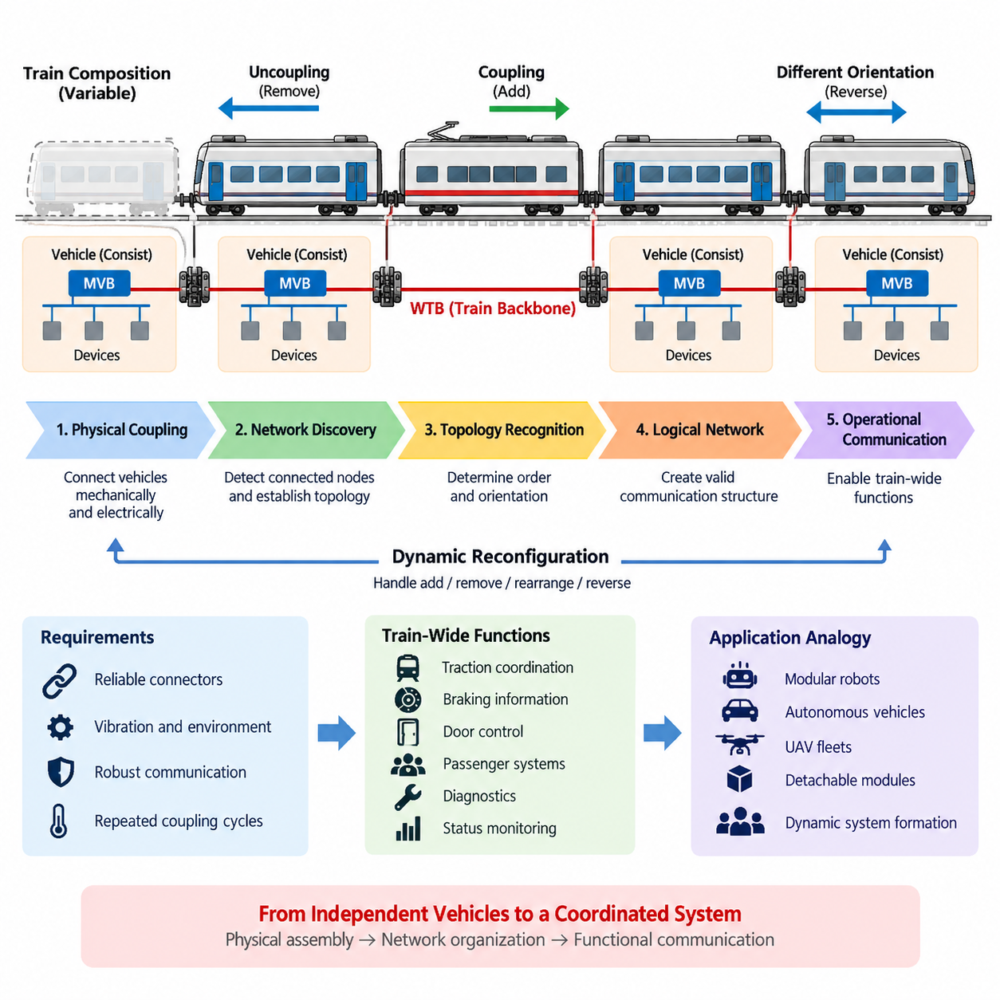
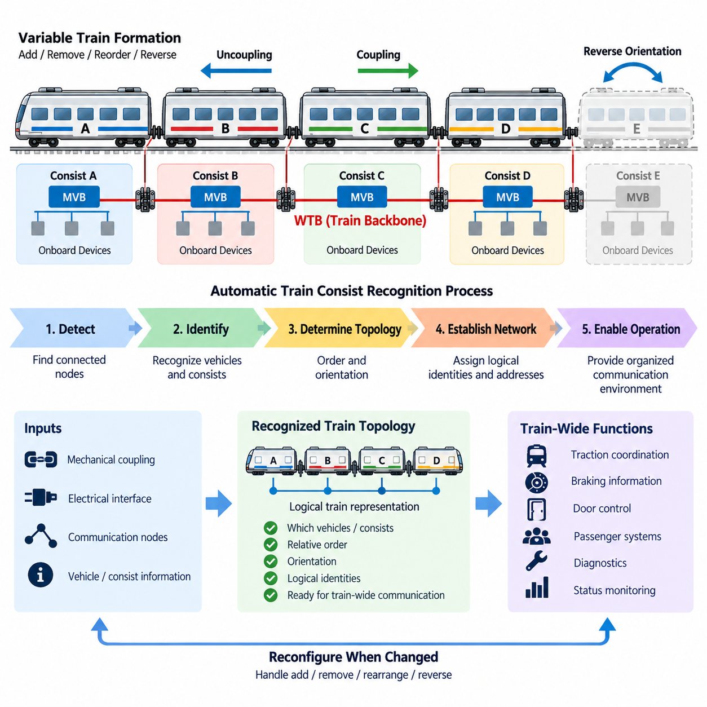
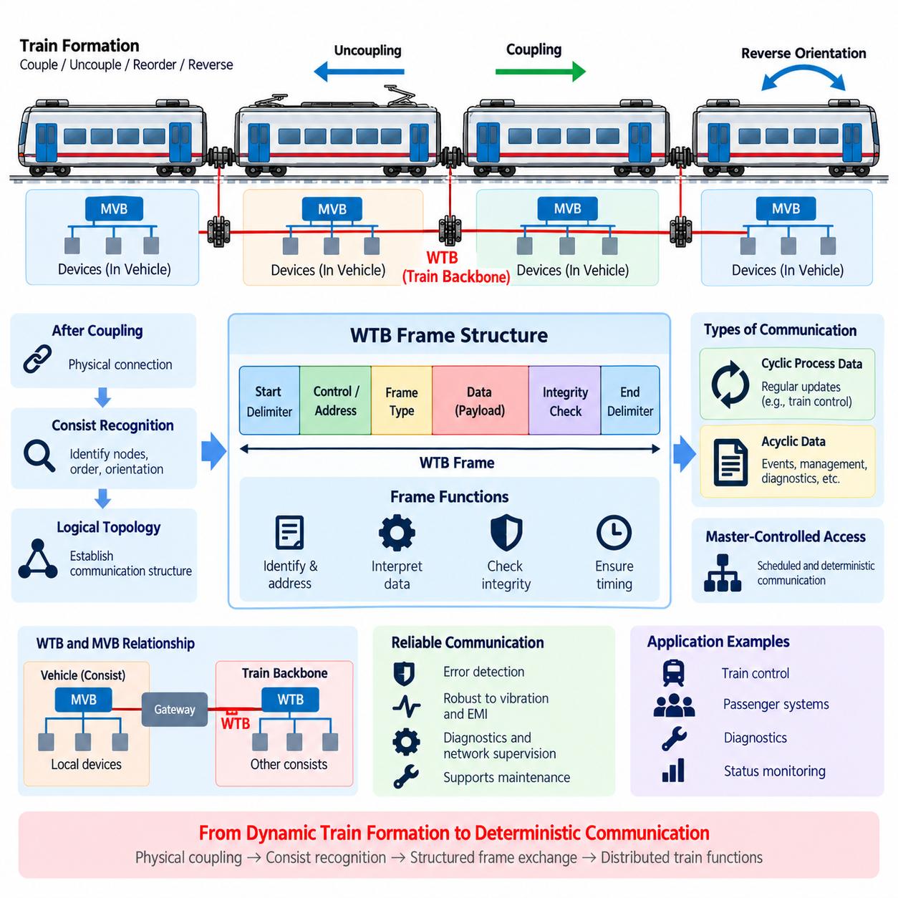
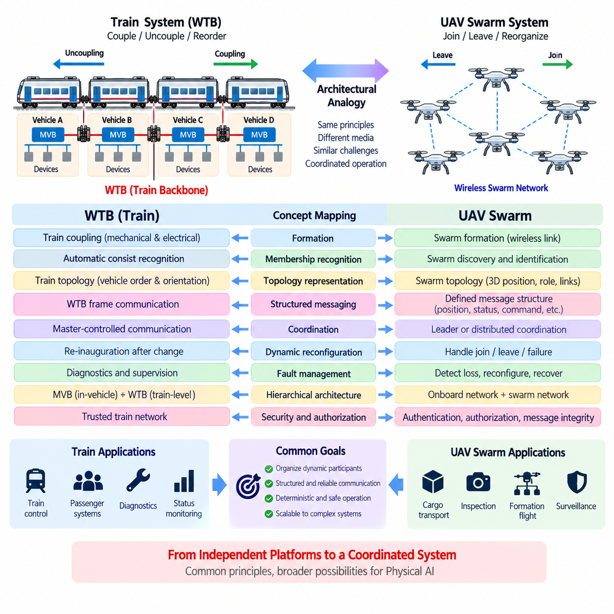

**Volume 08. Railway and Aerospace Protocols**

# Chapter 03. WTB

## 03.01. WTB Train Coupling

{width="7.268055555555556in" height="7.268055555555556in"}

The Wire Train Bus (WTB) is the train-level backbone communication system defined within the IEC 61375 Train Communication Network framework. Its fundamental purpose is to establish reliable communication between individual vehicle groups or consists that are mechanically coupled to form a complete train. Unlike communication networks confined to a single vehicle, WTB is designed for a topology whose physical composition can change whenever vehicles are coupled or uncoupled.

Train coupling creates a communication problem that is fundamentally different from networking inside a permanently configured machine. Railway vehicles may be added, removed, reversed, or rearranged according to operational requirements. The communication backbone must therefore recognize that the physical system has changed and establish a valid logical network corresponding to the new train configuration before normal distributed functions can depend on inter-vehicle communication.

WTB connects the communication domains of separate railway vehicles or consists across the train. Each consist can contain its own internal communication network, traditionally implemented using technologies such as the Multifunction Vehicle Bus (MVB). WTB operates above this local vehicle scope by providing the backbone that links these independently functioning units. This separation between local networks and a dynamically assembled backbone is a defining architectural principle of the Train Communication Network.

Mechanical coupling and electrical communication coupling are closely related but should not be treated as identical operations. Connecting two railway vehicles physically establishes the mechanical train, while communication interfaces establish the electrical path required by the backbone. The network must subsequently determine whether the connected nodes form a valid communication structure. Only after this logical organization is completed can train-wide information exchange proceed in a controlled and predictable manner.

A major characteristic of WTB is its ability to accommodate trains whose composition is not permanently known. Conventional fixed industrial networks can often be engineered around predefined node addresses and cable layouts. A train, however, can be assembled from different consists at different times. WTB therefore supports an inauguration process in which the network discovers its current configuration, establishes node relationships, and creates the communication organization required for the newly formed train.

This inauguration process transforms physical connectivity into a usable logical topology. Participating nodes must determine their relative positions and establish an ordered representation of the train. The resulting configuration allows applications to associate communication participants with their location within the assembled vehicle sequence. Train-wide functions can consequently operate on the current consist arrangement rather than relying on a configuration that may have been valid before coupling or uncoupling occurred.

Direction is particularly important because railway vehicles can be coupled in different orientations. A communication system cannot simply assume that every vehicle is installed permanently in the same forward-facing relationship. WTB mechanisms therefore support the establishment of an orientation-aware train topology. Knowledge of relative position and direction enables distributed systems to interpret commands, status information, and vehicle identities consistently across a train whose physical arrangement may change during service.

After successful inauguration, WTB provides the backbone over which train-wide process information can be exchanged. Such communication may support coordinated traction, braking-related information exchange, door functions, passenger systems, diagnostics, status monitoring, and other distributed railway functions depending on the vehicle architecture. The important principle is that independently equipped vehicles become participants in a common communication environment after the train has been assembled.

Coupling also introduces important requirements for network robustness. Connectors, wiring, termination conditions, and communication interfaces must tolerate repeated mechanical connection cycles as well as vibration, electrical disturbances, and the environmental conditions encountered in railway operation. A train backbone cannot depend only on logical protocol correctness; its physical communication path must remain sufficiently reliable across every inter-vehicle connection for the logical topology to remain meaningful.

The dynamic nature of train formation also means that topology changes must be managed deliberately. When a vehicle is removed or another consist is attached, the previous network representation may no longer correspond to the physical train. The communication system must recognize the changed condition and reorganize the backbone as required. This prevents distributed applications from continuing to operate under incorrect assumptions about vehicle identities, sequence, connectivity, or train length.

WTB train coupling illustrates an important distinction between network discovery and application communication. Before operational data can be exchanged meaningfully, the communication infrastructure must first establish who is connected, how participants are arranged, and how they should be addressed within the current train. Network management therefore becomes an essential enabling function rather than a secondary maintenance feature, particularly in systems assembled dynamically from autonomous subsystems.

This architecture also demonstrates why WTB and MVB occupy complementary roles within the broader TCN structure. MVB primarily serves communication among equipment inside a vehicle or consist, while WTB historically provides communication across the coupled train. A gateway can therefore bridge local vehicle information to the train backbone, allowing selected data to move between internal devices and train-level participants without requiring every internal subsystem to operate directly as a WTB node.

From a systems-engineering perspective, WTB coupling converts a collection of independently functional vehicle units into a coordinated distributed system. Mechanical assembly determines the physical train, inauguration determines the communication topology, and application protocols exploit that topology to coordinate train-level behavior. These stages form a useful conceptual hierarchy because they separate physical connectivity, network organization, and functional information exchange instead of treating train communication as a single undifferentiated process.

The same principle is valuable when examining other modular cyber-physical systems. Mobile robots, autonomous vehicles, UAV groups, or detachable mission modules can similarly form temporary systems whose membership changes during operation. Although their communication technologies may differ substantially from WTB, the architectural problem remains comparable: newly connected units must be discovered, identified, organized, and admitted into a common communication structure before coordinated behavior can safely rely on them.

For cargo UAV and Physical AI architectures, the most transferable WTB concept is therefore not the railway-specific electrical interface itself but dynamic system formation. A fleet may gain or lose vehicles, payload modules, charging interfaces, or mission participants. Applying a WTB-like architectural principle means separating physical joining or network reachability from logical membership, topology recognition, identity management, and operational authorization before allowing a newly connected participant to influence coordinated mission behavior.

WTB train coupling ultimately represents a mature example of communication architecture designed around changing physical composition. Instead of assuming a permanently wired system, it treats topology establishment as part of normal operation. This makes WTB an important foundation for understanding the subsequent topics of automatic train consist recognition, WTB frame organization, and the analogy between dynamically assembled railway networks and coordinated autonomous fleets presented in Chapter 03.

## 03.02. Automatic Train Consist Recognition

{width="7.268055555555556in" height="7.268055555555556in"}

Automatic Train Consist Recognition is a fundamental capability of the Wire Train Bus (WTB) architecture within the IEC 61375 Train Communication Network framework. It allows a train communication system to determine which vehicles or consists are currently connected and to establish a logical representation of the assembled train. This capability is essential because railway formations may change whenever vehicles are coupled, uncoupled, reordered, or reversed.

A train consist can be understood as a group of vehicles that normally operates as a functional unit and contains its own internal communication structure. Multiple consists may then be mechanically and electrically connected to form a complete train. Because the resulting train configuration is not necessarily permanent, the communication backbone cannot rely exclusively on a predefined topology. It must recognize the actual formation that exists after coupling.

Consist recognition begins from the distinction between physical connectivity and logical network membership. Mechanical couplers establish the physical relationship between railway vehicles, while electrical interfaces provide the communication path between them. However, the existence of a communication path alone does not describe the complete train. The network must determine which communication nodes are present and how those nodes relate to the physical arrangement.

Within WTB operation, this process is closely associated with network inauguration. Inauguration establishes the communication configuration required after a train has been assembled or its composition has changed. Participating nodes cooperate to identify the current network structure, organize themselves according to the detected train arrangement, and establish information that can subsequently be used for addressing and train-wide communication.

The recognition process must determine more than the number of connected communication nodes. The relative order of vehicles or consists is important because distributed railway applications may interpret data according to physical position within the train. A vehicle located near one end of the formation has a different physical relationship to other vehicles than a vehicle located in the middle, even when both contain similar communication equipment.

Orientation must also be considered because railway vehicles and consists may be connected in reversed configurations. A topology description that identifies only the participants without representing their relative direction would therefore be incomplete. Automatic recognition allows the communication system to establish an orientation-aware representation so that train-wide applications can interpret vehicle relationships consistently after different coupling arrangements.

Once the current consist arrangement has been recognized, the communication system can associate logical communication identities with the discovered topology. This creates a usable relationship between network-level addressing and physical train organization. Applications can then exchange information with an understanding of where participating nodes belong within the assembled train rather than treating the backbone as an unordered collection of communication devices.

Automatic recognition becomes especially important when the train composition changes during normal railway operations. If a consist is removed, added, or rearranged, information describing the previous train may become invalid. Continuing to use the old logical configuration could cause communication to reference incorrect positions or participants. A topology-related change therefore requires the network configuration to be established again according to the newly assembled physical system.

This dynamic configuration capability differentiates WTB from networks designed around permanently installed nodes. In a fixed industrial machine, device addresses and network positions can often be assigned during engineering and remain unchanged throughout operation. Railway systems must accommodate combinations that cannot always be predetermined. Automatic consist recognition therefore moves topology management from an offline engineering activity into the operational behavior of the communication system.

Recognition also establishes an important boundary between network management and application functionality. Train applications should not independently reconstruct the physical formation whenever communication begins. Instead, the network infrastructure provides an organized communication environment derived from the recognized topology. Higher-level functions can then use that environment for coordinated operation without implementing their own fundamental mechanism for discovering the complete backbone structure.

The relationship between WTB and the Multifunction Vehicle Bus (MVB) further illustrates this hierarchy. MVB can provide communication among devices inside a vehicle or consist, while WTB connects these vehicle-level domains across the train. Automatic consist recognition therefore operates at the train-backbone level, determining how the larger communication units are organized while internal device networks can retain their own local structures and responsibilities.

Gateways play an important role at the boundary between these communication scopes. Information generated by equipment on an internal vehicle network can be made available to other parts of the train through the train-level communication architecture. Because the train topology has already been established, gateways and applications can operate within a known backbone organization instead of assuming that the same neighboring consists or physical arrangement will always be present.

From a reliability perspective, automatic recognition also provides a structured response to configuration changes. A newly connected communication participant should not simply be assumed to belong to the operational train because an electrical signal is detected. The network must establish a coherent topology before normal train-wide communication depends on the changed formation. This reduces the risk of operating with inconsistent assumptions about network membership and physical organization.

Diagnostics can benefit from the recognized train structure because communication problems can be interpreted in relation to the current configuration. If a vehicle or communication segment expected within the established topology becomes unavailable, diagnostic functions can distinguish a communication failure from an intentional configuration change more systematically. Accurate topology information therefore supports both normal operation and maintenance-oriented interpretation of network conditions.

Automatic Train Consist Recognition also provides a useful architectural analogy for modular robotics and Physical AI systems. A group of autonomous mobile robots, UAVs, manipulators, or detachable mission modules may dynamically form a temporary operational system. Network reachability alone does not guarantee that every discovered participant should immediately become part of coordinated control. Identity, position, role, orientation, and membership may first need to be established.

For a cargo UAV fleet, a comparable mechanism could recognize which aircraft or mission modules are currently participating in a coordinated operation and establish their logical relationships before distributed mission execution begins. The underlying communication technology may be Ethernet, wireless networking, or another modern protocol rather than WTB, but the systems principle remains relevant: discover participants, establish topology, assign operational relationships, and then enable coordinated communication.

The broader lesson is that dynamic physical composition requires dynamic communication organization. Automatic Train Consist Recognition transforms a newly assembled set of railway vehicles from a collection of connected communication interfaces into a logically organized train network. Together with WTB train coupling, it establishes the foundation upon which WTB frame exchange and higher-level train-wide functions can operate, while providing a useful model for dynamically composed autonomous systems.

## 03.03. WTB Frame Structure

{width="7.268055555555556in" height="7.268055555555556in"}

The Wire Train Bus (WTB) frame structure provides the organized data-transfer mechanism used by the train-level backbone of the IEC 61375 Train Communication Network. After train coupling and automatic consist recognition establish which nodes participate in the current formation, WTB communication requires a defined framing method so information can be exchanged predictably between vehicles. The frame structure therefore connects dynamic train configuration with controlled operational communication.

WTB communication is designed for a distributed railway environment in which multiple vehicles or consists share a common train backbone. A frame provides the structured unit through which protocol information and application-related data are transported across this network. Rather than allowing devices to transmit arbitrary sequences of bits, the communication system organizes information according to defined fields and transmission rules that receiving nodes can interpret consistently.

The structure of a communication frame must support several functions simultaneously. A receiver needs enough protocol information to recognize the transmission, determine its relevance, interpret the transported information, and verify that the communication has been received correctly. Consequently, framing is not merely a packaging technique. It establishes the boundaries, interpretation rules, and integrity mechanisms required for deterministic communication among distributed train nodes.

WTB operates within a communication architecture where network behavior must remain predictable even though the physical train composition can change. Once inauguration has produced a valid logical topology, the frame exchange mechanism operates within that established configuration. This separation is important: inauguration determines who is present and how the train is organized, while frame communication provides the recurring mechanism by which those recognized participants exchange operational information.

A useful conceptual view of the WTB frame is to separate control-oriented protocol information from the payload being transported. Protocol-related fields allow the communication system to manage and interpret the transfer, while data fields carry information required by train functions. Integrity-related information enables receivers to detect communication errors. Together, these elements allow a physical bit stream on the backbone to become a meaningful and verifiable protocol transaction.

Addressing and communication relationships are closely connected with the recognized train topology. After nodes have been organized during inauguration, frame exchanges can reference participants according to the logical communication structure established for the current formation. This allows the same communication architecture to operate after different consists have been coupled, provided that the network has first completed the required recognition and configuration process.

WTB communication must also accommodate different categories of information exchange. Railway networks contain cyclic process information that must be refreshed regularly as well as less frequent information associated with events, management, diagnostics, or other communication needs. The protocol structure therefore has to support communication behavior appropriate to both repetitive operational data and information that is transferred when a specific transaction or condition requires it.

Cyclic process communication is particularly important for distributed train control because many operating states must be updated continuously. Information associated with coordinated vehicle functions becomes useful only when it is delivered with sufficiently predictable timing. WTB therefore belongs to a broader class of deterministic communication systems in which transmission scheduling, bounded communication behavior, and controlled access to the shared medium are more important than maximizing unrestricted network throughput.

A master-controlled communication principle is central to traditional WTB operation. Rather than allowing all nodes to contend freely for access to the train bus, communication is coordinated so that exchanges occur according to controlled protocol behavior. This reduces uncertainty in bus access and contributes to deterministic timing. The frame structure must consequently be understood together with the medium-access and scheduling mechanisms that determine when individual protocol transactions occur.

In such a controlled exchange, one transmission can initiate or request a communication action and another transmission can provide the corresponding response. The meaning of individual frames therefore depends not only on their internal fields but also on their position within the protocol transaction. This transaction-oriented interpretation is important because deterministic railway communication requires both correctly formatted data and correctly coordinated communication sequences.

Frame integrity is essential because railway communication operates in an electrically and mechanically demanding environment. Long vehicle formations, inter-vehicle connectors, repeated coupling cycles, electromagnetic disturbances, and vibration can affect the physical communication path. Error-detection information associated with frame transmission allows receiving nodes to determine whether transferred information satisfies the protocol\'s integrity checks rather than automatically accepting every observed bit sequence as valid data.

Detection of an invalid frame does not by itself guarantee that the original information can be reconstructed. Instead, integrity mechanisms provide a basis for rejecting corrupted communication and allowing higher protocol behavior, repeated cyclic updates, diagnostics, or system-level fault handling to respond appropriately. This distinction is important in safety-related engineering because error detection, error correction, redundancy, and functional safety mechanisms represent different layers of protection.

Timing also influences how WTB frames should be interpreted at the system level. A frame may be structurally correct but still be unsuitable for an application if information arrives too late or is no longer sufficiently fresh. Deterministic communication therefore combines data integrity with temporal behavior. Railway applications must consider not only whether a message was received correctly but whether it was received within the timing assumptions of the distributed function.

The relationship between WTB and the Multifunction Vehicle Bus (MVB) provides another important architectural perspective. MVB can organize communication among devices within a vehicle or consist, while WTB transports selected information across the train-level backbone. Gateways between these domains may therefore receive information from one communication environment, map or process it as required, and make appropriate data available within the other network domain.

This layered architecture prevents every local device from needing direct participation in the train backbone protocol. Sensors, controllers, actuators, and diagnostic devices may communicate through the internal vehicle network, while gateway functions expose only the information required at train level. WTB frames can consequently be viewed as part of an information hierarchy connecting distributed vehicle domains rather than as isolated packets traveling between individual electronic devices.

Diagnostics and network supervision also depend on structured communication behavior. Because valid frames follow defined protocol rules, communication equipment can detect missing exchanges, malformed information, integrity failures, or unexpected network behavior. Combined with the topology established during train inauguration, these observations help maintenance systems associate communication abnormalities with particular nodes, vehicle relationships, or sections of the train backbone.

The WTB framing concept also provides useful lessons for modular robots, autonomous vehicles, and UAV fleets. Modern Physical AI systems may use Ethernet, DDS, TSN, CAN, wireless links, or other technologies instead of WTB, but they face the same architectural need to transform raw connectivity into structured communication. Identity, message type, payload interpretation, integrity, timing, and communication authority must all be defined before distributed machines can coordinate reliably.

For cargo UAV fleets, the transferable principle is that coordinated operation requires more than network connectivity. After fleet members are discovered and their operational relationships are established, communication should use explicitly defined message structures and timing rules for mission state, navigation coordination, health monitoring, payload status, and fault information. WTB demonstrates how topology management and deterministic data exchange can be separated while remaining tightly integrated at the system level.

WTB frame structure therefore forms the operational communication layer between recognized train topology and distributed railway functions. Train coupling establishes physical connectivity, automatic consist recognition establishes logical organization, and structured frame exchange carries controlled information across that organization. This progression provides the foundation for understanding the complete TCN architecture and for comparing railway deterministic networking principles with communication architectures used in coordinated autonomous systems.

## 03.04. WTB UAV Swarm Analogy

{width="7.268055555555556in" height="7.268055555555556in"}

The Wire Train Bus (WTB) provides a useful architectural analogy for understanding communication in dynamically formed UAV swarms. Within the IEC 61375 Train Communication Network, WTB connects vehicle consists whose membership and arrangement can change through coupling and uncoupling. A UAV swarm faces a comparable systems problem when aircraft dynamically join, leave, reorganize, or assume new roles while coordinated operation must continue.

The analogy is primarily architectural rather than physical. Railway vehicles communicate through a wired train backbone, whereas UAVs normally depend on wireless datalinks and may communicate through direct links, mesh networks, infrastructure, or combinations of these mechanisms. Nevertheless, both systems must transform a collection of independently operating platforms into an organized communication domain whose participants and relationships are known.

WTB train coupling corresponds conceptually to swarm formation. When railway consists are mechanically and electrically coupled, physical connectivity is established before the communication network determines the resulting train organization. Similarly, detecting a wireless link to another UAV does not automatically establish operational swarm membership. Discovery must be followed by identification, authentication, role assignment, and configuration before coordinated mission functions should depend on the new participant.

Automatic Train Consist Recognition provides an especially strong analogy. WTB must recognize which consists participate in the current train and establish their relative organization. A UAV swarm requires comparable membership awareness to determine which aircraft are currently active, which have departed or failed, and which have newly joined. The resulting swarm representation becomes the logical foundation for distributed coordination rather than relying only on raw radio connectivity.

The railway concept of topology recognition can be extended to spatial relationships within a UAV swarm. A train topology is largely constrained by the ordered physical sequence of coupled vehicles, whereas a UAV swarm occupies a dynamic two-dimensional or three-dimensional space. Swarm topology may therefore include communication neighbors, relative position, formation location, mission role, connectivity quality, and routing relationships instead of a simple linear vehicle order.

Orientation illustrates another important difference. WTB recognizes vehicle relationships in a system where consists can be connected in different orientations. UAVs require a richer representation because heading, altitude, velocity, attitude, and relative geometry may continuously change. The transferable principle is not the specific railway representation but the requirement that communication organization reflect the physical relationships necessary for coordinated system behavior.

WTB inauguration demonstrates how a dynamically assembled system can establish a valid logical network before normal operation proceeds. A UAV swarm can apply an analogous initialization or admission process. Newly discovered aircraft can announce or exchange identity and capability information, establish communication relationships, synchronize essential state, receive mission roles, and become authorized participants before entering coordinated mission execution.

The distinction between network membership and operational authorization becomes even more important for wireless autonomous systems. A radio-reachable UAV may belong to another mission, may not possess the required capabilities, or may not be trusted to participate in coordinated control. A WTB-inspired architecture therefore suggests explicit stages separating connectivity, discovery, identity, membership, role assignment, and permission to exchange mission-critical information.

WTB frame communication provides another transferable concept. After the train topology has been established, structured protocol exchanges carry operational information between recognized participants. UAV swarms likewise require clearly defined message structures for position, velocity, mission state, health status, payload information, formation commands, collision avoidance, and fault reporting. Connectivity alone cannot provide predictable interoperability between distributed autonomous platforms.

Deterministic behavior is particularly important when communication affects coordinated motion. Railway networks emphasize controlled and predictable communication because distributed train functions depend on bounded information exchange. UAV swarm networks operate under different physical constraints, especially variable wireless latency and packet loss, but still benefit from bounded timing requirements, message priorities, freshness monitoring, synchronization, and explicit handling of delayed or missing information.

The WTB master-controlled communication concept can be compared with centralized or leader-coordinated swarm architectures. A designated swarm leader or mission coordinator may schedule activities, distribute commands, or maintain shared mission state. However, UAV systems can also use decentralized or distributed coordination in which no permanent master exists. The analogy therefore identifies a coordination function without requiring the railway master mechanism to be reproduced directly.

Dynamic reconfiguration is one of the strongest similarities between WTB and UAV swarm communication. When railway consists are added or removed, the network must update its understanding of the train. Likewise, a swarm must respond when an aircraft joins, leaves intentionally, loses communication, suffers a fault, or becomes unable to maintain formation. The logical swarm structure must be updated without allowing obsolete membership assumptions to persist.

Fault isolation can also benefit from topology awareness. If communication with one train vehicle disappears, WTB-related supervision can interpret the event in relation to the established train configuration. In a UAV swarm, loss of a participant can similarly trigger membership updates, route changes, formation adjustment, mission redistribution, or degraded operating modes. Communication monitoring therefore becomes directly connected with autonomous system resilience.

The MVB-to-WTB hierarchy also offers an analogy for UAV internal and external networks. A UAV contains local avionics, sensors, flight controllers, payload controllers, and computing devices connected through onboard communication networks. A separate fleet or swarm communication layer exchanges selected information between aircraft. Gateways therefore separate high-rate internal control traffic from information that must be distributed across the swarm.

This separation is particularly valuable for scalable Physical AI systems. Raw camera streams, LiDAR measurements, motor-control loops, and high-frequency actuator data generally do not need to be broadcast continuously across an entire fleet. Instead, onboard processing can transform local observations into compact state, intent, trajectory, health, or semantic information. The swarm network then transports information whose value extends beyond the individual vehicle.

Cargo UAV systems provide a practical example because individual aircraft may carry different payloads, possess different energy reserves, or perform different mission roles. Swarm membership information can therefore include capability descriptors in addition to identity and position. A mission coordinator can use this information to assign transport, relay, inspection, escort, or contingency functions according to the current composition and operational state of the fleet.

The analogy becomes even more relevant when UAV groups are treated as temporary cyber-physical organizations rather than permanently configured networks. Aircraft may be dispatched from different locations, converge for a mission, divide into subgroups, return for charging, and later join different formations. The communication architecture must therefore support repeated formation and dissolution without assuming a single static network configuration throughout the system lifetime.

Security introduces requirements that are less visible in the basic railway analogy but are essential for UAV swarms. Wireless connectivity expands the possibility of unauthorized participants, spoofed identities, manipulated messages, or disrupted communication. Consequently, swarm admission should combine topology discovery with authentication, authorization, message integrity, and secure identity management. Dynamic recognition must establish not merely who appears to be present, but who is permitted to participate.

The WTB analogy should therefore not be interpreted as a proposal to apply the railway protocol directly to UAV communication. WTB was engineered for the characteristics of coupled railway vehicles and a wired train backbone, while UAV swarms operate through highly dynamic wireless environments. Its value lies in the systems principles of dynamic membership recognition, logical topology establishment, structured communication, deterministic coordination, supervision, and reconfiguration.

For Physical AI, these principles can be generalized beyond UAVs to AMR fleets, quadruped teams, autonomous vehicles, mobile manipulators, and heterogeneous robot groups. Each individual platform can maintain its own local sensing, control, and intelligence while participating in a dynamically constructed collective communication structure. The resulting system can coordinate distributed actions without eliminating the operational autonomy of individual members.

WTB therefore provides a mature railway example of how independently functioning machines can become a coordinated system after their composition changes. In the UAV swarm analogy, coupling becomes dynamic membership, consist recognition becomes swarm discovery, train topology becomes fleet organization, WTB frame exchange becomes structured inter-agent messaging, and network re-inauguration becomes swarm reconfiguration. These mappings provide a conceptual bridge from railway communication architecture toward scalable Physical AI coordination.
