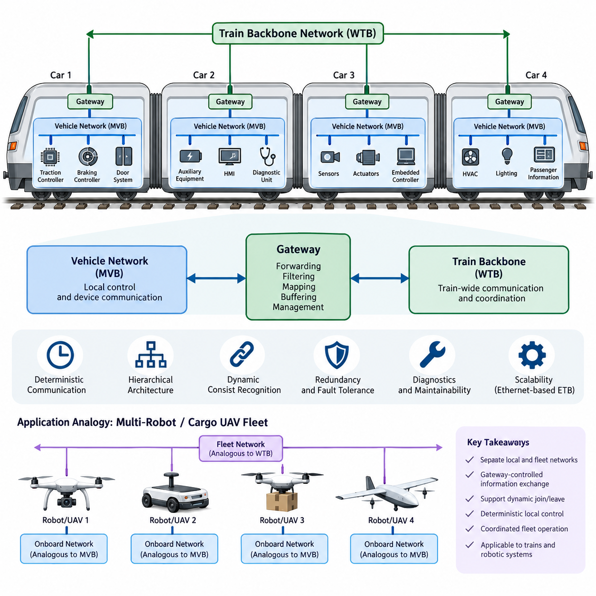
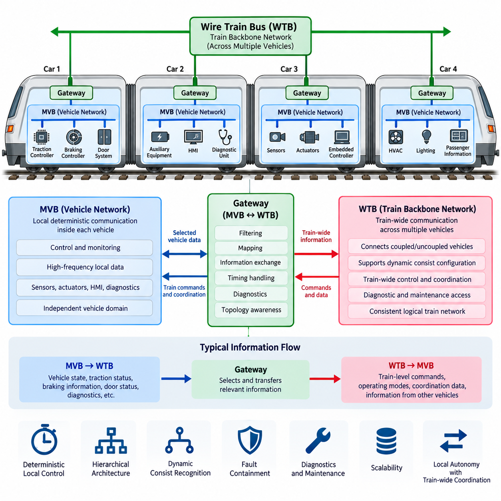
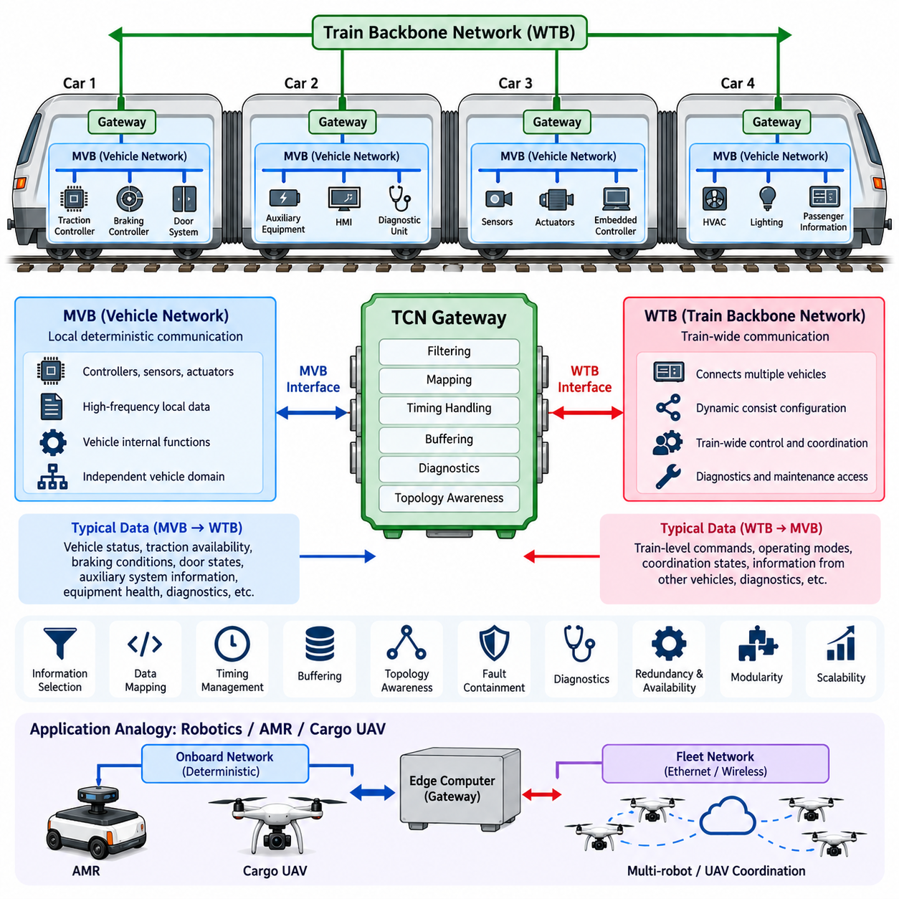
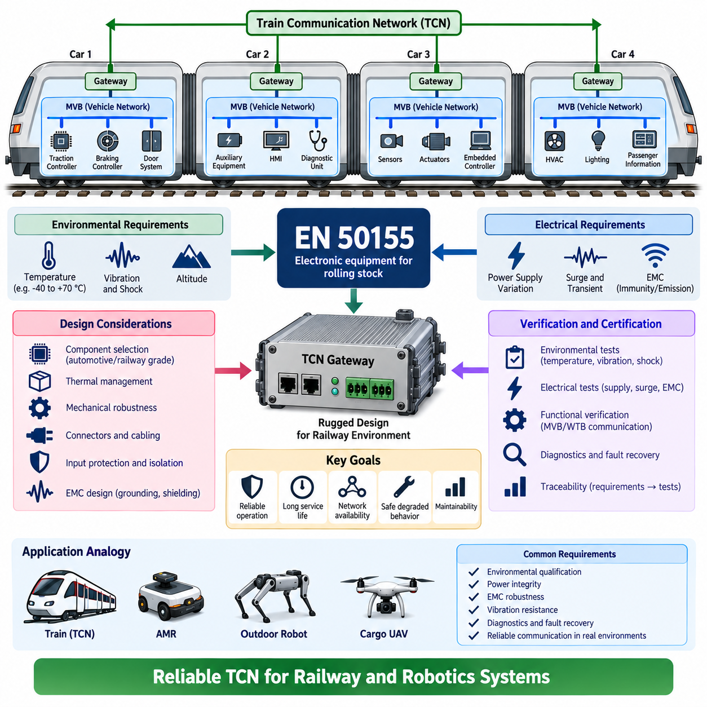

**Volume 08. Railway and Aerospace Protocols**


# Chapter 04. TCN Architecture

##  

## 04.01. TCN Full Architecture

{width="7.268055555555556in" height="7.268055555555556in"}

The Train Communication Network (TCN) is a hierarchical communication architecture standardized within the IEC 61375 family for exchanging operational, control, diagnostic, and passenger-related information throughout a railway vehicle or complete train. Its fundamental architectural principle is to divide communication into a train-level backbone and vehicle-level networks. This separation allows individual vehicles to maintain their own internal communication while participating in a dynamically configured train-wide network.

At the highest level, the TCN architecture connects multiple railway vehicles through a train backbone network. In the classical architecture, the Wire Train Bus (WTB) performs this function by extending communication across vehicles that may be mechanically coupled or uncoupled during operation. Each vehicle or consist can therefore become a network participant, while the backbone provides the communication path required for train-wide control, supervision, status distribution, and coordinated operation.

Inside each vehicle, the Multifunction Vehicle Bus (MVB) provides communication among distributed electronic devices. Typical participants include traction controllers, braking controllers, door systems, auxiliary equipment, diagnostic units, human-machine interfaces, and other embedded control devices. MVB is designed for predictable communication behavior and supports cyclic process data together with other information required by distributed railway control systems.

The complete TCN architecture can therefore be understood as a network of networks. Vehicle-level MVB segments organize local devices, while WTB connects those vehicle networks into a train-wide communication domain. Gateways form the architectural boundary between these domains. Rather than treating every device as a direct participant on the train backbone, the gateway transfers selected information between local vehicle communication and train-level communication according to defined routing and application requirements.

This hierarchical organization provides an important form of functional containment. High-frequency information required only inside one vehicle can remain on its local MVB instead of consuming train-backbone communication capacity. Conversely, information that affects coordinated train behavior can be transferred through the gateway and distributed across the WTB. The architecture consequently separates local control traffic from train-wide information while preserving controlled communication between both domains.

WTB has an additional architectural responsibility because railway consists can change when vehicles are coupled or uncoupled. The train network must recognize its current composition and establish communication relationships that correspond to the actual physical formation. Train inauguration and consist recognition mechanisms therefore allow the communication architecture to adapt to a changing topology, giving the classical TCN a dynamic structural characteristic that differs from many permanently wired industrial networks.

Communication behavior within TCN is closely associated with deterministic operation. Railway control systems require important process information to be transferred within bounded and predictable timing conditions rather than merely achieving high average throughput. Cyclic process-data exchange supports this objective by providing repeated transmission of operational variables. Network scheduling, controlled access, and defined communication behavior allow distributed controllers to operate with a known temporal relationship.

The architecture also accommodates information whose timing characteristics differ from continuously exchanged control variables. Process data may represent states such as speed, braking demand, door status, traction commands, or equipment conditions, whereas diagnostic and configuration information may be exchanged less frequently. Separating communication services according to their operational purpose prevents the network from being viewed simply as a generic data pipe and reinforces its role as part of the distributed control architecture.

A TCN gateway is consequently more than a physical interface between two communication media. It represents a system boundary at which information from one network domain is made available to another. Gateway functions can include forwarding, filtering, mapping, buffering, and management of communication relationships. Because failures or incorrect data propagation at this boundary can influence multiple vehicles, gateway design must consider deterministic behavior, fault handling, diagnostics, and system-level availability.

The hierarchical structure also improves maintainability and fault localization. A communication problem inside one vehicle can initially be investigated within its local network, while failures involving several vehicles can be examined at the backbone or gateway level. Diagnostic information can be propagated through the architecture without requiring every diagnostic tool to connect directly to every device. This layered organization therefore supports both operational communication and systematic maintenance of complex rolling stock.

Redundancy and fault tolerance can be incorporated according to the reliability requirements of the railway application. Critical communication paths may employ redundant interfaces, duplicated network paths, or equipment-level redundancy so that a single communication fault does not immediately eliminate essential functions. The precise implementation depends on vehicle architecture and safety requirements, but the TCN concept provides a structured framework in which communication availability can be engineered at several architectural levels.

Modern railway networking extends the original TCN concept beyond the classical WTB and MVB combination. Ethernet-based technologies such as the Ethernet Train Backbone (ETB) provide substantially greater bandwidth for modern applications, while preserving the architectural distinction between train-level and consist- or vehicle-level communication. This evolution enables video, advanced diagnostics, passenger information, condition monitoring, and software-intensive functions to coexist with operational communication requirements.

Within such modern implementations, the essential TCN idea remains hierarchical integration rather than dependence on one particular physical bus. A train contains distributed devices, those devices belong to local communication domains, local domains are connected through gateways, and a backbone integrates the complete train. Technologies may evolve from MVB and WTB toward Ethernet-based networks, but deterministic behavior, topology management, interoperability, diagnostics, and controlled information exchange remain central architectural concerns.

TCN can also be interpreted as a useful reference architecture for distributed robotic systems. An autonomous mobile robot or cargo UAV contains sensors, actuators, controllers, power-management devices, and embedded computers that require local deterministic communication, while multiple platforms may need a higher-level coordination network. The railway distinction between local vehicle networks and a train backbone therefore resembles the separation between platform-internal control networks and fleet-level communication.

For cargo UAV or multi-robot architectures, the analogy is particularly useful when platforms can dynamically join or leave an operational group. The TCN concepts of consist recognition, hierarchical networking, gateway-controlled information exchange, deterministic local control, and coordinated backbone communication provide design principles for such systems. The technologies themselves need not be copied directly; rather, the architectural lessons can guide robust separation of local control, platform integration, and fleet coordination.

열차 통신 네트워크(TCN, Train Communication Network)는 철도 차량 또는 전체 열차에 걸쳐 운행, 제어, 진단 및 승객 관련 정보를 교환하기 위해 IEC 61375 표준군에서 표준화된 계층형 통신 아키텍처(Hierarchical Communication Architecture)이다. 기본적인 아키텍처 원리는 통신 체계를 열차 수준 백본(Train-Level Backbone)과 차량 수준 네트워크(Vehicle-Level Network)로 구분하는 것이다. 이러한 분리를 통해 개별 차량은 자체적인 내부 통신을 유지하면서 동적으로 구성되는 열차 전체 네트워크에 참여할 수 있다.

가장 상위 수준에서 TCN 아키텍처는 열차 백본 네트워크(Train Backbone Network)를 통해 여러 철도 차량을 연결한다. 전통적인 아키텍처에서는 와이어드 트레인 버스(WTB, Wire Train Bus)가 이러한 기능을 수행하며, 운행 과정에서 기계적으로 연결되거나 분리될 수 있는 차량 사이로 통신을 확장한다. 따라서 각 차량 또는 편성(Consist)은 네트워크 참여자가 될 수 있으며, 백본은 열차 전체의 제어, 감독, 상태 정보 분배 및 협조 운전에 필요한 통신 경로를 제공한다.

각 차량 내부에서는 다기능 차량 버스(MVB, Multifunction Vehicle Bus)가 분산된 전자 장치 사이의 통신을 제공한다. 대표적인 참여 장치에는 견인 제어기(Traction Controller), 제동 제어기(Braking Controller), 도어 시스템(Door System), 보조 장비(Auxiliary Equipment), 진단 장치(Diagnostic Unit), 인간-기계 인터페이스(HMI, Human-Machine Interface) 및 기타 임베디드 제어 장치(Embedded Control Device)가 포함된다. MVB는 예측 가능한 통신 동작을 위해 설계되며, 주기적 프로세스 데이터(Cyclic Process Data)와 분산 철도 제어 시스템에 필요한 기타 정보를 지원한다.

따라서 전체 TCN 아키텍처는 네트워크의 네트워크(Network of Networks)로 이해할 수 있다. 차량 수준의 MVB 세그먼트(MVB Segment)는 로컬 장치를 구성하고, WTB는 이러한 차량 네트워크를 열차 전체 통신 도메인(Train-Wide Communication Domain)으로 연결한다. 게이트웨이(Gateway)는 이러한 도메인 사이의 아키텍처 경계를 형성한다. 모든 장치를 열차 백본에 직접 참여시키는 대신, 게이트웨이는 정의된 라우팅(Routing) 및 애플리케이션 요구사항에 따라 로컬 차량 통신과 열차 수준 통신 사이에서 선택된 정보를 전달한다.

이러한 계층형 구성(Hierarchical Organization)은 중요한 기능적 격리(Functional Containment)를 제공한다. 하나의 차량 내부에서만 필요한 고주파 정보(High-Frequency Information)는 열차 백본의 통신 용량을 소비하지 않고 로컬 MVB에 유지될 수 있다. 반대로 열차의 협조 동작에 영향을 주는 정보는 게이트웨이를 통해 전달되어 WTB 전체로 분배될 수 있다. 결과적으로 이 아키텍처는 로컬 제어 트래픽(Local Control Traffic)과 열차 전체 정보(Train-Wide Information)를 분리하면서 두 도메인 사이의 제어된 통신을 유지한다.

WTB는 철도 편성이 차량의 연결 또는 분리에 따라 변경될 수 있기 때문에 추가적인 아키텍처 책임을 가진다. 열차 네트워크는 현재의 편성을 인식하고 실제 물리적 구성에 대응하는 통신 관계를 설정해야 한다. 따라서 열차 초기화(Train Inauguration) 및 편성 인식(Consist Recognition) 메커니즘을 통해 통신 아키텍처가 변화하는 토폴로지(Topology)에 적응할 수 있으며, 이러한 특성은 전통적인 TCN에 영구적으로 배선된 많은 산업용 네트워크와 구별되는 동적 구조 특성을 제공한다.

TCN 내부의 통신 동작은 결정론적 운용(Deterministic Operation)과 밀접하게 연관된다. 철도 제어 시스템에서는 단순히 높은 평균 처리량을 확보하는 것보다 중요한 프로세스 정보가 제한되고 예측 가능한 시간 조건 내에서 전달되는 것이 필요하다. 주기적 프로세스 데이터 교환(Cyclic Process-Data Exchange)은 운용 변수를 반복적으로 전송함으로써 이러한 목적을 지원한다. 네트워크 스케줄링(Network Scheduling), 제어된 접근(Controlled Access), 정의된 통신 동작을 통해 분산 제어기는 알려진 시간적 관계를 기반으로 동작할 수 있다.

또한 이 아키텍처는 지속적으로 교환되는 제어 변수와 서로 다른 시간적 특성을 가진 정보도 수용한다. 프로세스 데이터(Process Data)는 속도, 제동 요구, 도어 상태, 견인 명령 또는 장비 상태와 같은 정보를 나타낼 수 있으며, 진단 및 구성 정보(Diagnostic and Configuration Information)는 상대적으로 낮은 빈도로 교환될 수 있다. 운용 목적에 따라 통신 서비스를 분리함으로써 네트워크가 단순한 범용 데이터 통로(Generic Data Pipe)로 취급되는 것을 방지하고 분산 제어 아키텍처의 일부로서 그 역할을 강화한다.

따라서 TCN 게이트웨이(TCN Gateway)는 두 통신 매체 사이를 연결하는 단순한 물리적 인터페이스 이상의 역할을 수행한다. 게이트웨이는 한 네트워크 도메인의 정보를 다른 도메인에서 사용할 수 있도록 하는 시스템 경계(System Boundary)를 의미한다. 게이트웨이 기능에는 전달(Forwarding), 필터링(Filtering), 매핑(Mapping), 버퍼링(Buffering) 및 통신 관계 관리가 포함될 수 있다. 이 경계에서 발생한 고장이나 잘못된 데이터 전파가 여러 차량에 영향을 미칠 수 있기 때문에 게이트웨이 설계에서는 결정론적 동작, 고장 처리(Fault Handling), 진단 및 시스템 수준 가용성(System-Level Availability)을 고려해야 한다.

계층형 구조는 유지보수성(Maintainability)과 고장 위치 식별(Fault Localization)도 향상시킨다. 하나의 차량 내부에서 발생한 통신 문제는 우선 해당 로컬 네트워크에서 조사할 수 있으며, 여러 차량에 영향을 미치는 고장은 백본 또는 게이트웨이 수준에서 분석할 수 있다. 모든 진단 도구가 각 장치에 직접 연결될 필요 없이 진단 정보를 아키텍처 전체로 전달할 수 있다. 따라서 이러한 계층적 구성은 운용 통신뿐 아니라 복잡한 철도 차량의 체계적인 유지보수도 지원한다.

철도 애플리케이션의 신뢰성 요구사항에 따라 중복성(Redundancy)과 고장 허용성(Fault Tolerance)을 아키텍처에 통합할 수 있다. 중요 통신 경로에는 단일 통신 고장이 필수 기능을 즉시 상실시키지 않도록 중복 인터페이스(Redundant Interface), 이중화된 네트워크 경로(Duplicated Network Path) 또는 장비 수준 중복성(Equipment-Level Redundancy)을 적용할 수 있다. 구체적인 구현은 차량 아키텍처와 안전 요구사항에 따라 달라지지만, TCN 개념은 여러 아키텍처 수준에서 통신 가용성을 설계할 수 있는 구조화된 프레임워크를 제공한다.

현대 철도 네트워킹(Modern Railway Networking)은 전통적인 WTB와 MVB 조합을 넘어 기존 TCN 개념을 확장하고 있다. 이더넷 열차 백본(ETB, Ethernet Train Backbone)과 같은 이더넷 기반 기술(Ethernet-Based Technology)은 현대적인 애플리케이션에 필요한 훨씬 높은 대역폭을 제공하면서 열차 수준 통신과 편성 또는 차량 수준 통신 사이의 아키텍처적 구분을 유지한다. 이러한 발전을 통해 영상, 고급 진단, 승객 정보, 상태 모니터링 및 소프트웨어 중심 기능이 운용 통신 요구사항과 함께 존재할 수 있다.

이러한 현대적인 구현에서도 TCN의 핵심 개념은 특정 물리적 버스에 의존하는 것이 아니라 계층적 통합(Hierarchical Integration)에 있다. 열차에는 분산된 장치가 존재하고, 이러한 장치는 로컬 통신 도메인에 속하며, 로컬 도메인은 게이트웨이를 통해 연결되고, 백본은 전체 열차를 통합한다. 기술은 MVB와 WTB에서 이더넷 기반 네트워크로 발전할 수 있지만, 결정론적 동작, 토폴로지 관리(Topology Management), 상호운용성(Interoperability), 진단 및 제어된 정보 교환은 여전히 핵심적인 아키텍처 고려사항으로 남는다.

TCN은 또한 분산 로봇 시스템(Distributed Robotic System)을 위한 유용한 참조 아키텍처(Reference Architecture)로 해석할 수 있다. 자율이동로봇(AMR, Autonomous Mobile Robot)이나 화물 무인항공기(Cargo UAV)는 로컬의 결정론적 통신이 필요한 센서, 액추에이터(Actuator), 제어기, 전력 관리 장치 및 임베디드 컴퓨터를 포함하며, 여러 플랫폼 사이에는 상위 수준의 협조 네트워크가 필요할 수 있다. 따라서 로컬 차량 네트워크와 열차 백본을 구분하는 철도 아키텍처는 플랫폼 내부 제어 네트워크(Platform-Internal Control Network)와 플릿 수준 통신(Fleet-Level Communication)을 분리하는 구조와 유사하다.

화물 무인항공기(Cargo UAV) 또는 다중 로봇 아키텍처(Multi-Robot Architecture)에서는 플랫폼이 운용 그룹에 동적으로 참여하거나 이탈할 수 있다는 점에서 이러한 유사성이 특히 유용하다. TCN의 편성 인식, 계층형 네트워킹, 게이트웨이를 통한 제어된 정보 교환, 결정론적 로컬 제어 및 협조된 백본 통신 개념은 이러한 시스템을 설계하기 위한 원칙을 제공한다. 기술 자체를 직접 복제할 필요는 없으며, 대신 이러한 아키텍처적 교훈을 활용하여 로컬 제어(Local Control), 플랫폼 통합(Platform Integration), 플릿 협조(Fleet Coordination)를 견고하게 분리하고 구성할 수 있다.

##  

## 04.02. MVB/WTB Integration

{width="7.268055555555556in" height="7.268055555555556in"}

The integration of the Multifunction Vehicle Bus (MVB) and Wire Train Bus (WTB) forms the classical hierarchical structure of the Train Communication Network (TCN). MVB provides communication among distributed devices inside a railway vehicle, while WTB extends communication across multiple coupled vehicles. Their integration allows locally controlled equipment to participate in coordinated train-wide functions without requiring every device to communicate directly on the train backbone.

Within each vehicle, MVB establishes a deterministic communication domain for controllers, sensors, actuators, diagnostic equipment, and other electronic subsystems. Traction control, braking, doors, auxiliary systems, and human-machine interfaces can exchange process and supervisory information through this local network. The vehicle therefore operates as a structured communication domain whose internal traffic can remain largely independent from backbone communication.

WTB operates at the higher architectural level and connects individual vehicles or consists into a complete train communication system. Unlike the relatively stable network configuration inside a vehicle, the train-level topology can change whenever vehicles are coupled, uncoupled, or rearranged. WTB must consequently support communication across these changing physical formations while maintaining a consistent logical representation of the train network.

The connection between MVB and WTB is normally established through a gateway that participates in both communication domains. On one side, the gateway exchanges information with devices or functions available through the local MVB. On the other side, it communicates with other train-level nodes through WTB. This dual relationship enables the gateway to act as the controlled information boundary between vehicle-level and train-level communication.

Gateway integration does not mean that all MVB traffic is automatically forwarded to WTB. Most high-frequency local control information may remain within the vehicle because it has no relevance to other vehicles. Only information required for train-wide operation is transferred across the architectural boundary. This filtering principle reduces unnecessary backbone traffic and prevents local implementation details from being exposed throughout the entire train.

Typical information transferred from MVB toward WTB includes vehicle operating states, traction availability, braking information, door conditions, diagnostic status, and other data required by distributed train functions. Information traveling in the opposite direction may include train-level commands, operating modes, coordination information, and data originating from other vehicles. The gateway therefore supports controlled bidirectional information exchange rather than simple electrical interconnection.

The MVB-WTB integration also separates communication according to temporal scope. Fast control loops that depend primarily on equipment located inside one vehicle can remain on the local MVB, while information requiring coordination among several vehicles is propagated through WTB. This hierarchical traffic organization allows the communication architecture to preserve deterministic local behavior while supporting synchronized train-level operation across physically separated vehicles.

Process data is particularly important within this integrated architecture because distributed controllers require regularly updated operating variables. Cyclic exchange can provide predictable availability of selected information, allowing receiving functions to determine when updated values should be available. When process information crosses the MVB-WTB boundary, gateway behavior must preserve the timing assumptions required by the train-level application as far as the architecture requires.

The integration becomes more complex because WTB must accommodate changes in train composition. When vehicles are coupled or separated, the train network must identify the resulting formation before reliable train-wide communication relationships can be established. Train inauguration and consist recognition therefore interact directly with gateway operation. A gateway must understand its position and communication relationships within the currently recognized train configuration.

This dynamic configuration capability distinguishes MVB-WTB integration from many fixed industrial network installations. An MVB segment can represent a relatively persistent vehicle-level system, while its relationship with other vehicle networks may change during train formation. WTB provides the mechanism for creating the train-wide communication structure, and gateways connect otherwise independent vehicle domains according to the currently established consist topology.

Fault containment is another major benefit of the hierarchical arrangement. A malfunctioning local device or communication problem does not necessarily need to propagate beyond its MVB domain. Gateways can limit which information crosses into WTB, while diagnostic mechanisms help identify whether a fault belongs to a local vehicle network, gateway interface, or train backbone. This separation simplifies systematic troubleshooting of large distributed railway systems.

At the same time, gateway failures require careful consideration because the gateway represents a critical connection between communication levels. If the gateway becomes unavailable, local MVB functions may continue operating while train-level access to those functions can be degraded or lost. System architecture must therefore consider communication availability, fault detection, recovery behavior, redundancy, and the consequences of losing communication between a vehicle and the train backbone.

Diagnostics benefit significantly from MVB-WTB integration. Equipment-level status can be collected within a vehicle, aggregated or mapped by the gateway, and made available to train-level diagnostic functions. Maintenance personnel can consequently observe distributed subsystem conditions without independently accessing every electronic device. The same architecture supports identification of communication failures by distinguishing local network conditions from backbone and inter-vehicle communication problems.

From a system-engineering perspective, the gateway also provides an abstraction boundary. Train-level applications do not necessarily need detailed knowledge of every local device or internal MVB communication relationship. Instead, selected vehicle functions can be represented through defined train-level information. This abstraction reduces coupling between local implementation and train-wide operation, making vehicle integration and subsystem evolution easier to manage.

The MVB-WTB architecture demonstrates how heterogeneous communication layers can cooperate without collapsing into one unrestricted network. MVB specializes in deterministic vehicle-level communication, WTB provides dynamically configurable train-level connectivity, and gateways control interaction between them. Together they create a scalable architecture in which local autonomy, train-wide coordination, diagnostics, topology management, and communication containment can coexist within the same TCN framework.

The same architectural principle can provide useful guidance for distributed robotic and cargo UAV systems represented elsewhere in the broader robotics electrical architecture. A robot or UAV may maintain deterministic onboard communication among controllers and actuators while a higher-level fleet network coordinates multiple platforms. A gateway or edge computer can then control which local states and commands cross between platform-level and fleet-level communication domains.

다기능 차량 버스(MVB, Multifunction Vehicle Bus)와 와이어드 트레인 버스(WTB, Wire Train Bus)의 통합은 열차 통신 네트워크(TCN, Train Communication Network)의 전통적인 계층형 구조(Hierarchical Structure)를 형성한다. MVB는 철도 차량 내부에 분산된 장치 간 통신을 제공하고, WTB는 연결된 여러 차량에 걸쳐 통신을 확장한다. 이러한 통합을 통해 모든 장치가 열차 백본(Train Backbone)과 직접 통신하지 않고도 로컬에서 제어되는 장비가 열차 전체의 협조 기능에 참여할 수 있다.

각 차량 내부에서 MVB는 제어기(Controller), 센서(Sensor), 액추에이터(Actuator), 진단 장비(Diagnostic Equipment) 및 기타 전자 서브시스템(Electronic Subsystem)을 위한 결정론적 통신 도메인(Deterministic Communication Domain)을 구축한다. 견인 제어(Traction Control), 제동(Braking), 도어(Door), 보조 시스템(Auxiliary System), 인간-기계 인터페이스(HMI, Human-Machine Interface)는 이 로컬 네트워크를 통해 프로세스 및 감독 정보를 교환할 수 있다. 따라서 차량은 내부 트래픽을 백본 통신으로부터 상당 부분 독립적으로 유지할 수 있는 구조화된 통신 도메인으로 동작한다.

WTB는 보다 상위의 아키텍처 수준에서 동작하며 개별 차량 또는 편성(Consist)을 하나의 완전한 열차 통신 시스템으로 연결한다. 차량 내부의 비교적 안정적인 네트워크 구성과 달리 열차 수준 토폴로지(Train-Level Topology)는 차량이 연결, 분리 또는 재배치될 때마다 변경될 수 있다. 따라서 WTB는 변화하는 물리적 편성에서도 통신을 지원하는 동시에 열차 네트워크에 대한 일관된 논리적 표현(Logical Representation)을 유지해야 한다.

MVB와 WTB 사이의 연결은 일반적으로 두 통신 도메인에 모두 참여하는 게이트웨이(Gateway)를 통해 이루어진다. 한쪽에서 게이트웨이는 로컬 MVB를 통해 사용할 수 있는 장치 또는 기능과 정보를 교환한다. 다른 쪽에서는 WTB를 통해 다른 열차 수준 노드(Train-Level Node)와 통신한다. 이러한 이중 관계를 통해 게이트웨이는 차량 수준 통신과 열차 수준 통신 사이에서 제어된 정보 경계(Controlled Information Boundary)의 역할을 수행할 수 있다.

게이트웨이 통합(Gateway Integration)이 모든 MVB 트래픽을 WTB로 자동 전달한다는 의미는 아니다. 대부분의 고주파 로컬 제어 정보(High-Frequency Local Control Information)는 다른 차량과 관련이 없기 때문에 차량 내부에 유지될 수 있다. 열차 전체 운행에 필요한 정보만 아키텍처 경계를 넘어 전달된다. 이러한 필터링 원칙(Filtering Principle)은 불필요한 백본 트래픽을 감소시키고 로컬 구현 세부사항이 전체 열차에 노출되는 것을 방지한다.

MVB에서 WTB 방향으로 전달되는 대표적인 정보에는 차량 운행 상태(Vehicle Operating State), 견인 가용성(Traction Availability), 제동 정보(Braking Information), 도어 상태(Door Condition), 진단 상태(Diagnostic Status) 및 분산 열차 기능에 필요한 기타 데이터가 포함된다. 반대 방향으로 전달되는 정보에는 열차 수준 명령(Train-Level Command), 운행 모드(Operating Mode), 협조 정보(Coordination Information), 다른 차량에서 생성된 데이터 등이 포함될 수 있다. 따라서 게이트웨이는 단순한 전기적 연결이 아니라 제어된 양방향 정보 교환(Controlled Bidirectional Information Exchange)을 지원한다.

MVB-WTB 통합은 또한 시간적 범위(Temporal Scope)에 따라 통신을 분리한다. 주로 하나의 차량 내부에 위치한 장비에 의존하는 고속 제어 루프(Fast Control Loop)는 로컬 MVB에 유지할 수 있으며, 여러 차량 사이의 협조가 필요한 정보는 WTB를 통해 전달된다. 이러한 계층형 트래픽 구성(Hierarchical Traffic Organization)을 통해 통신 아키텍처는 결정론적인 로컬 동작을 유지하면서 물리적으로 분리된 차량 사이의 동기화된 열차 수준 운용을 지원할 수 있다.

프로세스 데이터(Process Data)는 분산 제어기가 정기적으로 갱신되는 운용 변수를 필요로 하기 때문에 이러한 통합 아키텍처에서 특히 중요하다. 주기적 교환(Cyclic Exchange)은 선택된 정보를 예측 가능한 방식으로 제공하여 수신 기능이 갱신된 값의 이용 가능 시점을 판단할 수 있도록 한다. 프로세스 정보가 MVB-WTB 경계를 통과하는 경우 게이트웨이의 동작은 아키텍처가 요구하는 범위에서 열차 수준 애플리케이션에 필요한 타이밍 가정(Timing Assumption)을 유지해야 한다.

WTB는 열차 편성의 변화를 수용해야 하기 때문에 통합 과정은 더욱 복잡해진다. 차량이 연결되거나 분리되면 신뢰할 수 있는 열차 전체 통신 관계를 설정하기 전에 열차 네트워크가 변경된 편성을 식별해야 한다. 따라서 열차 초기화(Train Inauguration)와 편성 인식(Consist Recognition)은 게이트웨이 동작과 직접적으로 상호작용한다. 게이트웨이는 현재 인식된 열차 구성에서 자신의 위치와 통신 관계를 이해해야 한다.

이러한 동적 구성 기능(Dynamic Configuration Capability)은 MVB-WTB 통합을 많은 고정형 산업 네트워크 설비와 구별하는 특징이다. MVB 세그먼트(MVB Segment)는 비교적 지속적으로 유지되는 차량 수준 시스템을 나타낼 수 있지만, 다른 차량 네트워크와의 관계는 열차 편성 과정에서 변경될 수 있다. WTB는 열차 전체 통신 구조를 생성하기 위한 메커니즘을 제공하고, 게이트웨이는 현재 설정된 편성 토폴로지(Consist Topology)에 따라 서로 독립적인 차량 도메인을 연결한다.

고장 격리(Fault Containment)는 이러한 계층형 구성의 또 다른 주요 장점이다. 오작동하는 로컬 장치 또는 통신 문제가 반드시 해당 MVB 도메인 외부로 전파될 필요는 없다. 게이트웨이는 WTB로 전달되는 정보를 제한할 수 있으며, 진단 메커니즘(Diagnostic Mechanism)은 고장이 로컬 차량 네트워크, 게이트웨이 인터페이스 또는 열차 백본 중 어디에서 발생했는지를 식별하는 데 도움을 준다. 이러한 분리는 대규모 분산 철도 시스템의 체계적인 문제 해결을 단순화한다.

동시에 게이트웨이는 통신 계층 사이의 핵심 연결부를 형성하기 때문에 게이트웨이 고장(Gateway Failure)에 대한 신중한 고려가 필요하다. 게이트웨이를 사용할 수 없게 되더라도 로컬 MVB 기능은 계속 동작할 수 있지만, 해당 기능에 대한 열차 수준 접근은 저하되거나 상실될 수 있다. 따라서 시스템 아키텍처에서는 통신 가용성(Communication Availability), 고장 감지(Fault Detection), 복구 동작(Recovery Behavior), 중복성(Redundancy), 차량과 열차 백본 사이의 통신 상실에 따른 영향을 고려해야 한다.

진단(Diagnostics)은 MVB-WTB 통합을 통해 상당한 이점을 얻는다. 장비 수준 상태(Equipment-Level Status)는 차량 내부에서 수집되고 게이트웨이에 의해 집계(Aggregation) 또는 매핑(Mapping)되어 열차 수준 진단 기능에서 사용할 수 있다. 따라서 유지보수 담당자는 모든 전자 장치에 개별적으로 접근하지 않고도 분산된 서브시스템의 상태를 확인할 수 있다. 동일한 아키텍처는 로컬 네트워크 상태와 백본 및 차량 간 통신 문제를 구분함으로써 통신 고장의 식별도 지원한다.

시스템 엔지니어링(System Engineering) 관점에서 게이트웨이는 추상화 경계(Abstraction Boundary)도 제공한다. 열차 수준 애플리케이션이 모든 로컬 장치나 내부 MVB 통신 관계의 세부사항을 반드시 알아야 하는 것은 아니다. 대신 선택된 차량 기능을 정의된 열차 수준 정보로 표현할 수 있다. 이러한 추상화는 로컬 구현과 열차 전체 운용 사이의 결합도(Coupling)를 감소시켜 차량 통합과 서브시스템의 발전을 보다 쉽게 관리할 수 있도록 한다.

MVB-WTB 아키텍처는 서로 다른 통신 계층이 하나의 제한 없는 네트워크로 통합되지 않으면서 어떻게 협력할 수 있는지를 보여준다. MVB는 결정론적인 차량 수준 통신에 특화되고, WTB는 동적으로 구성 가능한 열차 수준 연결성을 제공하며, 게이트웨이는 이들 사이의 상호작용을 제어한다. 이들은 함께 로컬 자율성(Local Autonomy), 열차 전체 협조(Train-Wide Coordination), 진단, 토폴로지 관리 및 통신 격리(Communication Containment)가 동일한 TCN 프레임워크 안에서 공존할 수 있는 확장 가능한 아키텍처를 형성한다.

동일한 아키텍처 원리는 보다 광범위한 로봇 전기 아키텍처(Robotics Electrical Architecture)에서 다루는 분산 로봇 시스템과 화물 무인항공기(Cargo UAV) 시스템에도 유용한 설계 지침을 제공할 수 있다. 로봇 또는 UAV는 제어기와 액추에이터 사이에서 결정론적인 온보드 통신(Onboard Communication)을 유지하면서, 상위 수준의 플릿 네트워크(Fleet Network)를 통해 여러 플랫폼을 협조시킬 수 있다. 이 경우 게이트웨이 또는 엣지 컴퓨터(Edge Computer)는 플랫폼 수준 통신 도메인과 플릿 수준 통신 도메인 사이에서 어떤 로컬 상태와 명령을 전달할 것인지 제어할 수 있다.

##  

## 04.03. TCN Gateway Design

{width="7.268055555555556in" height="7.268055555555556in"}

A Train Communication Network gateway is the architectural element that interconnects communication domains within the hierarchical TCN structure. In the classical architecture, it commonly provides the controlled interface between a vehicle-level Multifunction Vehicle Bus (MVB) and the train-level Wire Train Bus (WTB). Its purpose is not simply to repeat traffic between networks, but to determine how selected operational information is exchanged across communication boundaries.

The gateway typically contains interfaces for both network domains and communication-processing functions between them. The MVB-facing side communicates with controllers, sensors, actuators, diagnostic equipment, and other vehicle devices, while the WTB-facing side participates in train-wide communication. Internal processing connects these interfaces through controlled data-transfer mechanisms so that each network can retain its own communication characteristics.

A fundamental gateway design principle is information selection. Most vehicle-level traffic does not need to leave the local MVB because high-frequency signals associated with internal control may only be relevant to equipment within that vehicle. The gateway therefore identifies information required by train-level functions and transfers only appropriate data to WTB, reducing unnecessary backbone traffic and maintaining separation between local and global communication domains.

Data mapping is required because information used within a vehicle may need a different representation when exposed to train-wide applications. The gateway can associate local variables with defined train-level information objects, ensuring that receiving systems interpret the transferred values consistently. This mapping establishes an abstraction boundary between internal vehicle implementation and the logical information expected by other vehicles or train-level control functions.

Traffic traveling from MVB toward WTB can include vehicle status, traction availability, braking conditions, door states, auxiliary-system information, equipment health, and diagnostic indicators. In the opposite direction, the gateway can distribute train-level operating commands, coordination states, mode information, and selected data originating from other vehicles. Bidirectional transfer must remain controlled so that inappropriate information does not cross domain boundaries.

Timing behavior is an important aspect of gateway design because TCN supports distributed functions that depend on predictable communication. Local MVB process data may be updated cyclically, while WTB communication follows train-level communication behavior. The gateway must therefore manage the temporal relationship between incoming and outgoing data, including acquisition, buffering, transfer, and availability of updated information to receiving applications.

Buffering provides temporary separation between communication domains whose transmission opportunities and update cycles may not occur at exactly the same instant. However, buffering must be carefully controlled because excessive delay can make process information stale. Gateway implementation should therefore distinguish between information requiring timely propagation and less time-sensitive diagnostic, configuration, or maintenance data when managing communication resources.

Topology awareness is particularly important on the WTB side because the physical train formation can change. Vehicles may be coupled, uncoupled, or rearranged, creating a train configuration that differs from the previous operating state. Train inauguration and consist recognition establish the current network structure, and the gateway must participate in communication according to the valid topology rather than assuming permanently fixed relationships between vehicles.

This topology-dependent behavior means that gateway design must consider both physical connectivity and logical communication relationships. A vehicle may retain essentially the same internal MVB configuration while its position and neighbors within the train change. The gateway provides the architectural mechanism that allows the stable local vehicle domain to participate in a dynamically assembled train-wide network without requiring extensive reconfiguration of individual local devices.

Fault containment is another essential gateway responsibility. A malfunctioning device, invalid local message, or communication disturbance should not automatically propagate throughout the train backbone. Filtering and controlled forwarding can help isolate local problems, while gateway diagnostics can distinguish failures associated with the MVB interface, internal gateway processing, WTB interface, or external train network. This supports structured fault localization and maintenance.

The gateway itself can become a critical communication point because failure may isolate a vehicle-level network from train-wide functions. Local control functions may continue operating when they depend only on MVB, but information required by other vehicles may become unavailable. Gateway design must consequently consider failure detection, degraded operating modes, communication recovery, availability requirements, and redundancy where required by the overall railway system architecture.

Diagnostic capability should therefore be integrated into gateway operation rather than treated as an external feature. The gateway can monitor communication status, interface conditions, data validity, and internal processing states. Diagnostic information can then be made available to maintenance or supervisory functions, helping engineers determine whether a communication problem originates from a vehicle device, local bus, gateway, backbone interface, or another train-level component.

Gateway design must also preserve architectural independence between network domains. Train-level applications should not require detailed knowledge of every local MVB device, and local devices should not need to understand the complete train topology. The gateway hides unnecessary implementation details and exposes only the information needed across the boundary. This reduces coupling and allows vehicle subsystems to evolve without forcing corresponding changes throughout the entire train network.

Modern TCN implementations can extend the same gateway principle to Ethernet-based communication. As railway networks evolve toward Ethernet Train Backbone (ETB) and higher-bandwidth services, gateways may connect legacy or specialized vehicle networks with Ethernet-based train communication. The physical technologies and protocols can change, but filtering, mapping, timing management, diagnostics, topology awareness, and fault containment remain fundamental gateway functions.

From a broader system perspective, the TCN gateway demonstrates how heterogeneous networks can be integrated without converting the complete system into one unrestricted communication domain. Local deterministic communication remains close to controllers and devices, while backbone communication distributes information required for coordinated operation. The gateway provides the controlled transition between these levels and becomes a key architectural component for scalability and modularity.

The same design concept is relevant to distributed robotics, AMRs, and cargo UAV systems included in the broader robotics electrical architecture. An onboard gateway or edge computer can separate deterministic device networks from Ethernet or fleet communication, forwarding only required states, commands, diagnostics, and coordination information. TCN gateway principles therefore provide a useful reference for designing modular Physical AI systems with local autonomy and coordinated multi-platform operation.

열차 통신 네트워크 게이트웨이(TCN Gateway, Train Communication Network Gateway)는 계층형 TCN 구조 내에서 서로 다른 통신 도메인을 상호 연결하는 아키텍처 요소이다. 전통적인 아키텍처에서는 일반적으로 차량 수준의 다기능 차량 버스(MVB, Multifunction Vehicle Bus)와 열차 수준의 와이어드 트레인 버스(WTB, Wire Train Bus) 사이에 제어된 인터페이스를 제공한다. 그 목적은 단순히 네트워크 사이의 트래픽을 반복 전달하는 것이 아니라, 선택된 운용 정보가 통신 경계를 넘어 어떻게 교환될지를 결정하는 것이다.

게이트웨이는 일반적으로 두 네트워크 도메인을 위한 인터페이스와 그 사이의 통신 처리 기능(Communication-Processing Function)을 포함한다. MVB 측 인터페이스는 제어기, 센서, 액추에이터, 진단 장비 및 기타 차량 장치와 통신하며, WTB 측 인터페이스는 열차 전체 통신에 참여한다. 내부 처리 기능은 제어된 데이터 전달 메커니즘(Controlled Data-Transfer Mechanism)을 통해 이들 인터페이스를 연결하여 각 네트워크가 고유한 통신 특성을 유지할 수 있도록 한다.

게이트웨이 설계의 기본 원칙은 정보 선택(Information Selection)이다. 차량 내부 제어와 관련된 고주파 신호는 해당 차량 내부 장비에만 필요한 경우가 많기 때문에 대부분의 차량 수준 트래픽은 로컬 MVB 외부로 전달할 필요가 없다. 따라서 게이트웨이는 열차 수준 기능에 필요한 정보를 식별하고 적절한 데이터만 WTB로 전달함으로써 불필요한 백본 트래픽을 줄이고 로컬 통신 도메인과 전역 통신 도메인 사이의 분리를 유지한다.

차량 내부에서 사용되는 정보가 열차 전체 애플리케이션에 제공될 때 다른 표현이 필요할 수 있기 때문에 데이터 매핑(Data Mapping)이 요구된다. 게이트웨이는 로컬 변수를 정의된 열차 수준 정보 객체(Train-Level Information Object)와 연계하여 수신 시스템이 전달된 값을 일관되게 해석하도록 할 수 있다. 이러한 매핑은 차량 내부 구현과 다른 차량 또는 열차 수준 제어 기능이 요구하는 논리적 정보 사이에 추상화 경계(Abstraction Boundary)를 형성한다.

MVB에서 WTB 방향으로 이동하는 트래픽에는 차량 상태, 견인 가용성(Traction Availability), 제동 상태, 도어 상태, 보조 시스템 정보, 장비 건전성(Equipment Health), 진단 표시 정보 등이 포함될 수 있다. 반대 방향에서는 게이트웨이가 열차 수준 운행 명령, 협조 상태(Coordination State), 모드 정보 및 다른 차량에서 생성된 선택적 데이터를 전달할 수 있다. 부적절한 정보가 도메인 경계를 넘어 전달되지 않도록 양방향 데이터 전송(Bidirectional Transfer)은 제어된 방식으로 유지되어야 한다.

TCN은 예측 가능한 통신에 의존하는 분산 기능을 지원하기 때문에 타이밍 동작(Timing Behavior)은 게이트웨이 설계에서 중요한 요소이다. 로컬 MVB 프로세스 데이터는 주기적으로 갱신될 수 있으며, WTB 통신은 열차 수준의 통신 동작을 따른다. 따라서 게이트웨이는 수신 데이터의 획득, 버퍼링(Buffering), 전달 및 갱신된 정보가 수신 애플리케이션에서 사용 가능해지는 시점을 포함하여 입력 데이터와 출력 데이터 사이의 시간적 관계를 관리해야 한다.

버퍼링은 전송 기회와 갱신 주기가 정확히 동일한 시점에 발생하지 않을 수 있는 통신 도메인 사이에서 일시적인 분리를 제공한다. 그러나 과도한 지연은 프로세스 정보를 오래된 정보(Stale Information)로 만들 수 있기 때문에 버퍼링은 신중하게 제어해야 한다. 따라서 게이트웨이 구현에서는 통신 자원을 관리할 때 적시에 전달되어야 하는 정보와 시간 민감도가 상대적으로 낮은 진단, 구성 또는 유지보수 데이터를 구분해야 한다.

WTB 측에서는 물리적인 열차 편성이 변경될 수 있기 때문에 토폴로지 인식(Topology Awareness)이 특히 중요하다. 차량이 연결, 분리 또는 재배치되면 이전 운행 상태와 다른 열차 구성이 만들어질 수 있다. 열차 초기화(Train Inauguration)와 편성 인식(Consist Recognition)은 현재 네트워크 구조를 설정하며, 게이트웨이는 차량 간 관계가 영구적으로 고정되어 있다고 가정하지 않고 유효한 토폴로지에 따라 통신에 참여해야 한다.

이러한 토폴로지 의존 동작(Topology-Dependent Behavior)은 게이트웨이 설계에서 물리적 연결성과 논리적 통신 관계를 모두 고려해야 함을 의미한다. 차량은 내부 MVB 구성을 거의 동일하게 유지하면서도 열차 내 위치와 인접 차량이 변경될 수 있다. 게이트웨이는 안정적인 로컬 차량 도메인이 개별 로컬 장치를 대규모로 재구성하지 않고도 동적으로 구성되는 열차 전체 네트워크에 참여할 수 있도록 하는 아키텍처 메커니즘을 제공한다.

고장 격리(Fault Containment)는 게이트웨이의 또 다른 핵심 책임이다. 오작동하는 장치, 유효하지 않은 로컬 메시지 또는 통신 장애가 열차 백본 전체로 자동 전파되어서는 안 된다. 필터링과 제어된 전달(Controlled Forwarding)은 로컬 문제를 격리하는 데 도움을 줄 수 있으며, 게이트웨이 진단 기능은 MVB 인터페이스, 게이트웨이 내부 처리, WTB 인터페이스 또는 외부 열차 네트워크와 관련된 고장을 구분할 수 있다. 이를 통해 체계적인 고장 위치 식별과 유지보수를 지원한다.

게이트웨이 자체가 고장 나면 차량 수준 네트워크가 열차 전체 기능으로부터 격리될 수 있기 때문에 게이트웨이는 핵심적인 통신 지점이 될 수 있다. MVB에만 의존하는 로컬 제어 기능은 계속 동작할 수 있지만, 다른 차량에서 필요로 하는 정보는 사용할 수 없게 될 수 있다. 따라서 게이트웨이 설계에서는 고장 감지(Failure Detection), 성능 저하 운전 모드(Degraded Operating Mode), 통신 복구(Communication Recovery), 가용성 요구사항(Availability Requirement), 그리고 전체 철도 시스템 아키텍처에서 요구되는 경우 중복성(Redundancy)을 고려해야 한다.

따라서 진단 기능(Diagnostic Capability)은 외부 기능으로 취급하기보다 게이트웨이 동작에 통합되어야 한다. 게이트웨이는 통신 상태, 인터페이스 상태, 데이터 유효성(Data Validity) 및 내부 처리 상태를 모니터링할 수 있다. 이후 진단 정보를 유지보수 또는 감독 기능(Supervisory Function)에 제공함으로써 엔지니어가 통신 문제가 차량 장치, 로컬 버스, 게이트웨이, 백본 인터페이스 또는 다른 열차 수준 구성요소 중 어디에서 발생했는지 판단하도록 지원할 수 있다.

게이트웨이 설계에서는 네트워크 도메인 사이의 아키텍처 독립성(Architectural Independence)도 유지해야 한다. 열차 수준 애플리케이션은 모든 로컬 MVB 장치의 세부사항을 알 필요가 없으며, 로컬 장치 역시 전체 열차 토폴로지를 이해할 필요가 없다. 게이트웨이는 불필요한 구현 세부사항을 숨기고 경계를 넘어 필요한 정보만 제공한다. 이를 통해 결합도(Coupling)를 낮추고 차량 서브시스템이 전체 열차 네트워크에 연쇄적인 변경을 요구하지 않으면서 발전할 수 있도록 한다.

현대적인 TCN 구현에서는 동일한 게이트웨이 원리를 이더넷 기반 통신(Ethernet-Based Communication)으로 확장할 수 있다. 철도 네트워크가 이더넷 열차 백본(ETB, Ethernet Train Backbone)과 고대역폭 서비스로 발전함에 따라 게이트웨이는 기존 또는 특수 목적의 차량 네트워크를 이더넷 기반 열차 통신과 연결할 수 있다. 물리적 기술과 프로토콜은 변경될 수 있지만 필터링, 매핑, 타이밍 관리(Timing Management), 진단, 토폴로지 인식 및 고장 격리는 여전히 기본적인 게이트웨이 기능으로 유지된다.

보다 광범위한 시스템 관점에서 TCN 게이트웨이는 전체 시스템을 하나의 제한 없는 통신 도메인으로 변환하지 않고도 이기종 네트워크(Heterogeneous Network)를 통합할 수 있는 방법을 보여준다. 로컬 결정론적 통신(Local Deterministic Communication)은 제어기와 장치 가까이에 유지되고, 백본 통신은 협조 운용에 필요한 정보를 분배한다. 게이트웨이는 이러한 계층 사이의 제어된 전환을 제공하며 확장성(Scalability)과 모듈성(Modularity)을 위한 핵심 아키텍처 구성요소가 된다.

동일한 설계 개념은 보다 광범위한 로봇 전기 아키텍처(Robotics Electrical Architecture)에 포함되는 분산 로봇(Distributed Robotics), 자율이동로봇(AMR, Autonomous Mobile Robot), 화물 무인항공기(Cargo UAV) 시스템에도 적용할 수 있다. 온보드 게이트웨이(Onboard Gateway) 또는 엣지 컴퓨터(Edge Computer)는 결정론적 장치 네트워크를 이더넷 또는 플릿 통신(Fleet Communication)과 분리하고 필요한 상태, 명령, 진단 및 협조 정보만 전달할 수 있다. 따라서 TCN 게이트웨이 원리는 로컬 자율성(Local Autonomy)과 협조된 다중 플랫폼 운용(Coordinated Multi-Platform Operation)을 갖는 모듈형 피지컬 AI 시스템(Modular Physical AI System)을 설계하기 위한 유용한 참조 모델을 제공한다.

##  

## 04.04. TCN Certification (EN 50155)

{width="7.268055555555556in" height="7.268055555555556in"}

EN 50155 defines environmental, electrical, and operational requirements for electronic equipment installed on railway rolling stock. For Train Communication Network equipment, the standard provides an important qualification framework because gateways, MVB devices, WTB interfaces, network controllers, and associated electronics operate in an environment exposed to temperature variation, vibration, electrical disturbances, and long service periods.

TCN certification should be understood as more than verifying that communication frames are transmitted correctly. A network device can implement MVB, WTB, or gateway functions correctly at the protocol level while still being unsuitable for installation on rolling stock. Railway qualification therefore considers both communication functionality and the ability of the electronic equipment to maintain intended operation under environmental and electrical conditions representative of railway service.

Temperature is one of the fundamental environmental considerations for onboard communication equipment. Electronic modules may be installed in passenger compartments, cabinets, equipment rooms, or other locations with different thermal conditions. Components, printed circuit boards, connectors, power converters, and communication transceivers must therefore be selected and designed so that network functions remain reliable throughout the temperature conditions specified for the intended installation environment.

Thermal design is closely related to equipment packaging and power dissipation. A TCN gateway may contain processors, communication controllers, isolation devices, memory, and multiple network interfaces that continuously generate heat. Enclosure design, component placement, conductive heat paths, ventilation strategy, and thermal margins must prevent excessive component temperatures. Qualification testing verifies that communication and processing functions remain stable under relevant thermal conditions.

Railway electronics are also exposed to mechanical vibration and shock generated by vehicle motion, track irregularities, coupling events, and equipment mounting conditions. TCN hardware must maintain electrical continuity and communication integrity despite these mechanical stresses. Printed circuit assemblies, connectors, terminal interfaces, mounting structures, and heavier components require mechanical design practices that prevent intermittent contacts, fatigue failures, or structural damage during service.

Power-supply behavior is particularly important because onboard railway electrical systems cannot be treated as ideal laboratory power sources. Communication equipment must tolerate the supply characteristics applicable to its installation while continuing to perform its intended functions or entering defined safe operating states. Input protection, filtering, isolation, conversion stages, transient protection, and supervisory circuits consequently become part of the practical design of a certifiable TCN device.

Electromagnetic compatibility is another essential aspect of railway communication equipment qualification. Traction equipment, converters, motors, switching devices, contactors, and high-current power distribution can generate electromagnetic disturbances near communication electronics. TCN interfaces must therefore be designed with appropriate grounding, shielding, filtering, isolation, cable routing, and connector practices to prevent disturbances from corrupting communication or destabilizing electronic equipment.

Immunity and emissions must be considered together. A gateway or communication controller should resist disturbances originating from surrounding railway equipment while avoiding unacceptable electromagnetic interference with neighboring systems. Interface circuitry, enclosure construction, PCB layout, cable shields, grounding architecture, and power filtering therefore influence certification performance. Communication reliability cannot be separated from the physical electrical design surrounding the protocol implementation.

Functional verification remains necessary in addition to environmental qualification. MVB, WTB, and TCN gateway equipment must demonstrate that required communication functions operate correctly before, during, and after applicable tests. Engineers should observe network initialization, process-data exchange, gateway forwarding, diagnostic behavior, interface status, and fault recovery where relevant. Environmental survival alone is insufficient if communication behavior becomes unreliable under stress.

Gateway equipment deserves particular attention because it connects vehicle-level and train-level communication domains. A gateway failure can isolate an otherwise functional MVB network from WTB communication. Qualification should therefore examine not only hardware survival but also startup behavior, communication recovery, interface initialization, watchdog operation, error handling, and restoration after disturbances. Defined degraded behavior is preferable to unpredictable communication when abnormal conditions occur.

Certification-oriented development requires traceability between requirements, design decisions, verification procedures, and test evidence. Hardware requirements should identify environmental and electrical constraints, while communication requirements define intended TCN behavior. Test specifications then demonstrate that the implemented equipment satisfies those requirements. Maintaining this relationship allows failures discovered during qualification to be traced back to the relevant design assumption or implementation decision.

Component selection also affects long-term railway qualification. Devices used in communication controllers should have suitable operating margins, predictable availability, and characteristics appropriate for the intended service environment. Designers must consider not only processor and transceiver performance but also capacitors, isolation components, connectors, oscillators, memory, power devices, and protection components whose degradation could eventually influence network reliability.

Connectors and cabling form part of the communication system even when certification attention is focused on electronic modules. Poor termination, insufficient shielding, mechanical loosening, contamination, or inadequate strain relief can degrade otherwise correct network electronics. TCN equipment design should therefore treat external interfaces as engineered system boundaries, with connector retention, shielding continuity, grounding, mechanical robustness, and serviceability considered from the beginning.

Verification planning is most effective when certification requirements are incorporated early in development rather than addressed after prototype completion. PCB architecture, enclosure design, connector selection, thermal management, grounding, filtering, and diagnostic provisions become expensive to change late in the project. Designing for qualification from the beginning reduces the risk that a functionally successful TCN prototype will require major redesign before railway deployment.

EN 50155 should also be considered together with the broader railway engineering and certification environment rather than as an isolated communication protocol specification. TCN communication requirements originate from the IEC 61375 family, while rolling-stock electronics must satisfy applicable equipment-level environmental and electrical expectations. The resulting product therefore requires coordinated protocol, hardware, EMC, mechanical, software, and system verification activities.

The broader lesson is directly relevant to communication equipment for AMRs, outdoor robots, and cargo UAVs included in the surrounding robotics electrical architecture. A communication gateway is not deployment-ready merely because Ethernet, CAN, or another protocol operates correctly on a laboratory bench. Reliable Physical AI platforms similarly require environmental qualification, power integrity, EMC robustness, vibration resistance, diagnostics, fault recovery, and traceable verification.

EN 50155는 철도 차량(Railway Rolling Stock)에 설치되는 전자 장비(Electronic Equipment)에 대한 환경적, 전기적 및 운용상의 요구사항을 정의한다. 열차 통신 네트워크(TCN, Train Communication Network) 장비의 경우 게이트웨이(Gateway), MVB 장치, WTB 인터페이스, 네트워크 제어기(Network Controller) 및 관련 전자장치가 온도 변화, 진동, 전기적 외란 및 장기간 운용에 노출되는 환경에서 동작하기 때문에 이 표준은 중요한 적격성 평가 프레임워크(Qualification Framework)를 제공한다.

TCN 인증(TCN Certification)은 단순히 통신 프레임(Communication Frame)이 올바르게 전송되는지를 검증하는 것 이상으로 이해해야 한다. 네트워크 장치는 프로토콜 수준에서 MVB, WTB 또는 게이트웨이 기능을 올바르게 구현하더라도 철도 차량에 설치하기에는 적합하지 않을 수 있다. 따라서 철도 적격성 평가(Railway Qualification)는 통신 기능뿐만 아니라 철도 운용을 대표하는 환경 및 전기적 조건에서 전자 장비가 의도된 동작을 유지할 수 있는 능력도 함께 고려한다.

온도(Temperature)는 차량 탑재 통신 장비(Onboard Communication Equipment)에 대한 기본적인 환경 고려사항 중 하나이다. 전자 모듈은 객실, 캐비닛, 장비실 또는 서로 다른 열적 조건을 가진 기타 위치에 설치될 수 있다. 따라서 부품, 인쇄회로기판(PCB, Printed Circuit Board), 커넥터, 전력 변환기(Power Converter), 통신 트랜시버(Communication Transceiver)는 의도된 설치 환경에 규정된 온도 조건 전반에서 네트워크 기능이 신뢰성 있게 유지되도록 선정하고 설계해야 한다.

열 설계(Thermal Design)는 장비 패키징(Equipment Packaging) 및 전력 소모에 따른 발열(Power Dissipation)과 밀접하게 관련된다. TCN 게이트웨이는 지속적으로 열을 발생시키는 프로세서, 통신 제어기, 절연 장치(Isolation Device), 메모리 및 여러 네트워크 인터페이스를 포함할 수 있다. 인클로저 설계(Enclosure Design), 부품 배치, 전도성 방열 경로, 환기 전략 및 열적 마진(Thermal Margin)을 통해 부품 온도가 과도하게 상승하는 것을 방지해야 한다. 적격성 시험(Qualification Testing)은 관련 열적 조건에서 통신 및 처리 기능이 안정적으로 유지되는지를 검증한다.

철도 전자장비는 차량 움직임, 선로 불규칙성, 차량 연결 과정 및 장비 장착 조건에서 발생하는 기계적 진동(Mechanical Vibration)과 충격(Shock)에도 노출된다. TCN 하드웨어는 이러한 기계적 스트레스에도 불구하고 전기적 연속성(Electrical Continuity)과 통신 무결성(Communication Integrity)을 유지해야 한다. 인쇄회로 어셈블리(Printed Circuit Assembly), 커넥터, 단자 인터페이스, 장착 구조 및 무거운 부품에는 운용 중 간헐적인 접촉 불량, 피로 파손 또는 구조적 손상을 방지하는 기계 설계가 필요하다.

차량 탑재 철도 전기 시스템은 이상적인 실험실 전원으로 간주할 수 없기 때문에 전원 공급 동작(Power-Supply Behavior)이 특히 중요하다. 통신 장비는 해당 설치 환경에 적용되는 전원 특성을 견디면서 의도된 기능을 계속 수행하거나 정의된 안전 운용 상태(Safe Operating State)로 전환할 수 있어야 한다. 따라서 입력 보호(Input Protection), 필터링, 절연, 전력 변환 단계, 과도현상 보호(Transient Protection), 감시 회로(Supervisory Circuit)는 인증 가능한 TCN 장치의 실질적인 설계 요소가 된다.

전자기 적합성(EMC, Electromagnetic Compatibility)은 철도 통신 장비 적격성 평가의 또 다른 핵심 요소이다. 견인 장비, 변환기, 모터, 스위칭 장치, 접촉기(Contactor), 고전류 전력 분배 시스템은 통신 전자장치 주변에서 전자기적 외란(Electromagnetic Disturbance)을 발생시킬 수 있다. 따라서 TCN 인터페이스는 외란으로 인한 통신 오류 또는 전자장비의 불안정화를 방지하기 위해 적절한 접지, 차폐, 필터링, 절연, 케이블 라우팅 및 커넥터 설계 방법을 적용해야 한다.

내성(Immunity)과 방출(Emissions)은 함께 고려해야 한다. 게이트웨이나 통신 제어기는 주변 철도 장비에서 발생하는 외란에 견디는 동시에 인접 시스템에 허용할 수 없는 전자기 간섭(Electromagnetic Interference)을 발생시키지 않아야 한다. 따라서 인터페이스 회로, 인클로저 구조, PCB 레이아웃, 케이블 차폐, 접지 아키텍처 및 전원 필터링은 인증 성능에 영향을 미친다. 통신 신뢰성은 프로토콜 구현을 둘러싼 물리적 전기 설계와 분리해서 생각할 수 없다.

환경 적격성 평가(Environmental Qualification)와 함께 기능 검증(Functional Verification)도 필요하다. MVB, WTB 및 TCN 게이트웨이 장비는 적용되는 시험 이전, 시험 중, 시험 이후에 요구되는 통신 기능이 올바르게 동작함을 입증해야 한다. 엔지니어는 필요한 경우 네트워크 초기화(Network Initialization), 프로세스 데이터 교환, 게이트웨이 전달, 진단 동작, 인터페이스 상태 및 고장 복구(Fault Recovery)를 관찰해야 한다. 환경 시험을 견뎌냈더라도 스트레스 조건에서 통신 동작이 불안정하다면 충분하지 않다.

게이트웨이 장비는 차량 수준 통신 도메인과 열차 수준 통신 도메인을 연결하기 때문에 특별한 주의가 필요하다. 게이트웨이 고장은 정상적으로 동작하는 MVB 네트워크를 WTB 통신으로부터 격리할 수 있다. 따라서 적격성 평가에서는 단순한 하드웨어 생존뿐만 아니라 기동 동작(Startup Behavior), 통신 복구, 인터페이스 초기화, 감시 타이머(Watchdog) 동작, 오류 처리(Error Handling), 외란 이후의 복원도 검토해야 한다. 비정상 조건에서는 예측할 수 없는 통신보다 정의된 성능 저하 동작(Defined Degraded Behavior)이 바람직하다.

인증 지향 개발(Certification-Oriented Development)에서는 요구사항, 설계 결정, 검증 절차 및 시험 증거(Test Evidence) 사이의 추적성(Traceability)이 필요하다. 하드웨어 요구사항에는 환경적 및 전기적 제약조건이 명시되어야 하며, 통신 요구사항에는 의도된 TCN 동작이 정의되어야 한다. 이후 시험 사양(Test Specification)을 통해 구현된 장비가 이러한 요구사항을 충족하는지를 입증한다. 이러한 관계를 유지하면 적격성 평가 과정에서 발견된 고장을 관련 설계 가정이나 구현 결정까지 추적할 수 있다.

부품 선정(Component Selection) 역시 장기적인 철도 적격성에 영향을 미친다. 통신 제어기에 사용되는 장치는 적절한 운용 마진(Operating Margin), 예측 가능한 공급 가능성 및 의도된 운용 환경에 적합한 특성을 갖추어야 한다. 설계자는 프로세서와 트랜시버의 성능뿐만 아니라 시간이 지나면서 네트워크 신뢰성에 영향을 줄 수 있는 커패시터, 절연 부품, 커넥터, 발진기(Oscillator), 메모리, 전력 장치 및 보호 부품도 고려해야 한다.

인증의 초점이 전자 모듈에 맞춰져 있더라도 커넥터와 케이블은 통신 시스템의 일부를 구성한다. 불량한 단자 처리, 불충분한 차폐, 기계적 풀림, 오염 또는 부적절한 변형 방지(Strain Relief)는 정상적으로 설계된 네트워크 전자장치의 성능도 저하시킬 수 있다. 따라서 TCN 장비 설계에서는 외부 인터페이스를 공학적으로 설계된 시스템 경계(System Boundary)로 취급하고 초기 단계부터 커넥터 고정, 차폐 연속성, 접지, 기계적 견고성 및 정비성(Serviceability)을 고려해야 한다.

검증 계획(Verification Planning)은 시제품 제작이 완료된 이후 인증 요구사항을 검토하는 것보다 개발 초기부터 이를 반영할 때 가장 효과적이다. PCB 아키텍처, 인클로저 설계, 커넥터 선정, 열 관리, 접지, 필터링 및 진단 기능은 프로젝트 후반에 변경할 경우 높은 비용이 발생한다. 처음부터 적격성 평가를 고려한 설계(Design for Qualification)를 수행하면 기능적으로 성공한 TCN 시제품이 철도 적용 전에 대규모 재설계를 필요로 할 위험을 줄일 수 있다.

EN 50155는 독립적인 통신 프로토콜 규격으로 다루기보다 보다 광범위한 철도 엔지니어링 및 인증 환경(Railway Engineering and Certification Environment)과 함께 고려해야 한다. TCN 통신 요구사항은 IEC 61375 표준군(IEC 61375 Family)에서 비롯되며, 철도 차량 전자장비는 적용 가능한 장비 수준의 환경적 및 전기적 요구사항을 충족해야 한다. 따라서 최종 제품에는 프로토콜, 하드웨어, EMC, 기계, 소프트웨어 및 시스템 검증 활동의 조정이 필요하다.

이러한 개념은 주변의 로봇 전기 아키텍처(Robotics Electrical Architecture)에서 다루는 자율이동로봇(AMR, Autonomous Mobile Robot), 실외 로봇(Outdoor Robot), 화물 무인항공기(Cargo UAV)의 통신 장비에도 직접 적용할 수 있다. 통신 게이트웨이는 실험실 환경에서 이더넷(Ethernet), CAN 또는 다른 프로토콜이 정상적으로 동작한다는 이유만으로 실제 배치가 가능한 상태가 되는 것은 아니다. 신뢰성 높은 피지컬 AI(Physical AI) 플랫폼 역시 환경 적격성, 전원 무결성(Power Integrity), EMC 견고성, 진동 내성, 진단, 고장 복구 및 추적 가능한 검증(Traceable Verification)을 필요로 한다.
