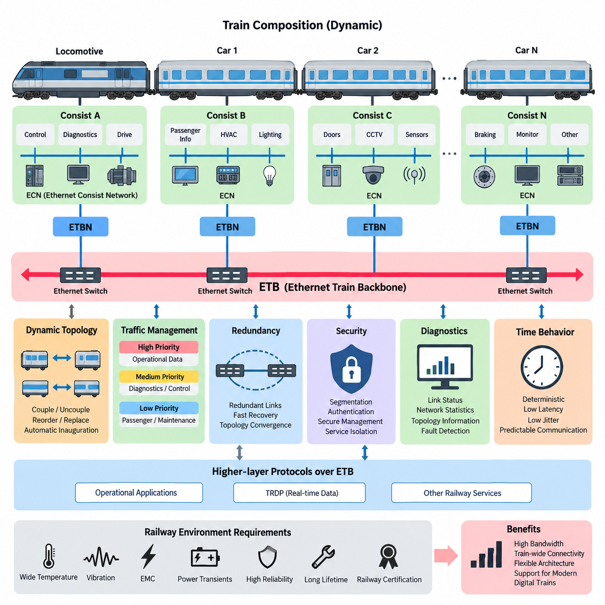
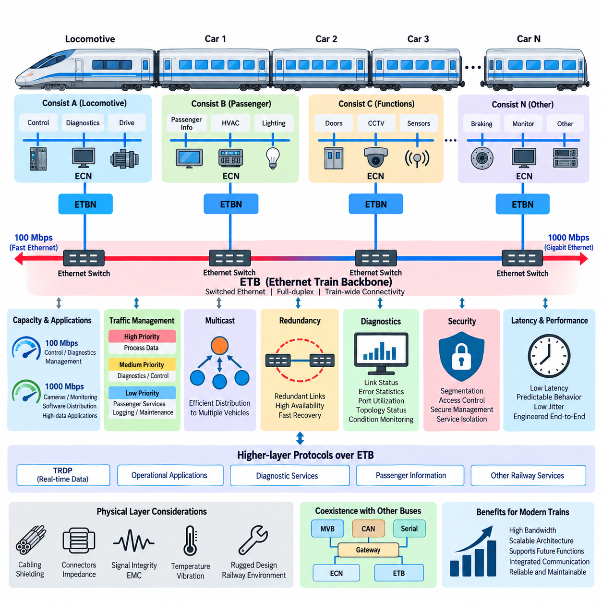
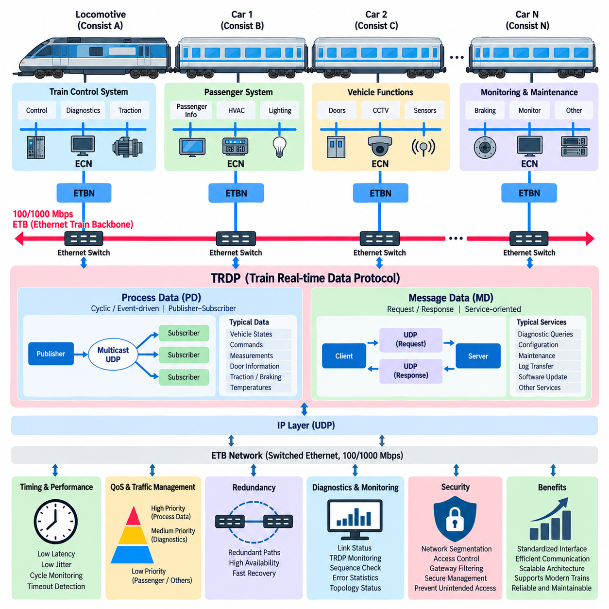
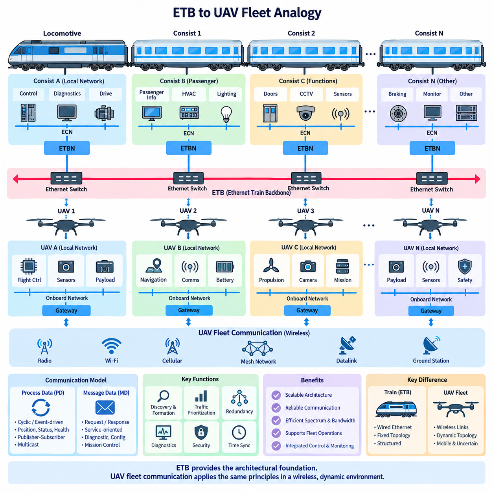
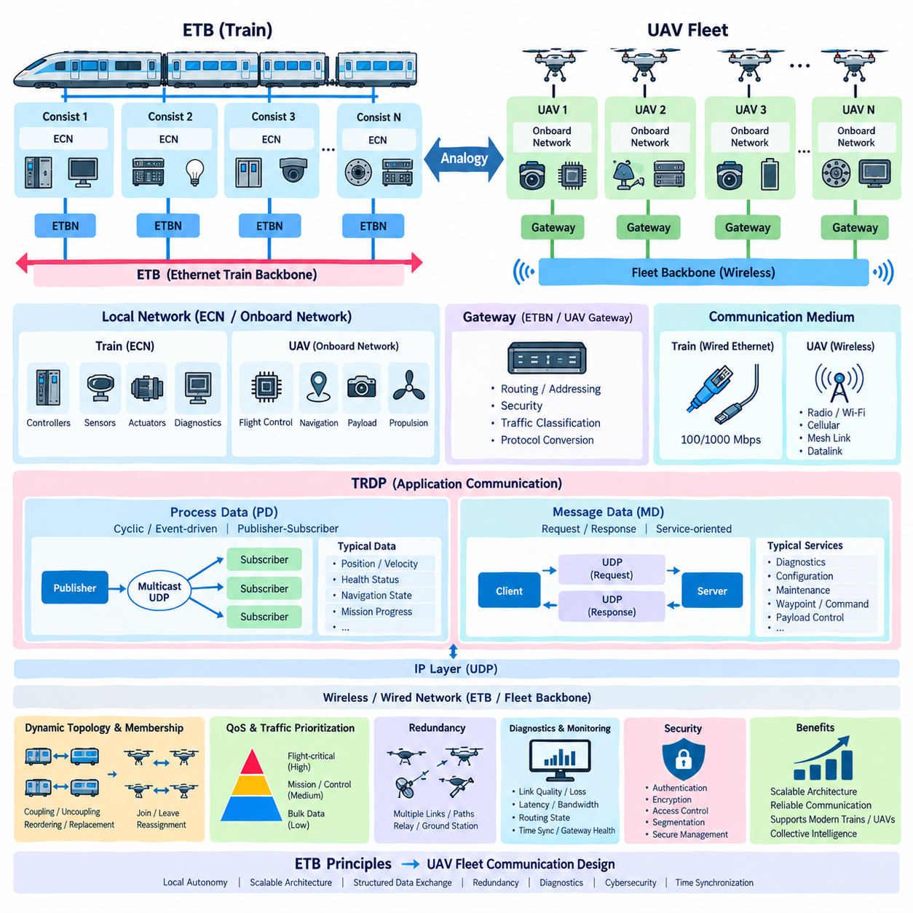

**Volume 08. Railway and Aerospace Protocols**

# Chapter 05. ETB

## 05.01. IEC 61375-2-5 (ETB) Standard

{width="7.268055555555556in" height="7.268055555555556in"}

IEC 61375-2-5는 열차 통신 네트워크(Train Communication Network, TCN) 계열에서 사용되는 이더넷 기반 백본 통신 기술인 이더넷 열차 백본(Ethernet Train Backbone, ETB)을 정의한다. ETB는 철도 통신에서 요구되는 운용 특성을 유지하면서 더 높은 대역폭을 제공하도록 철도 네트워크를 확장한다. 열차 전체의 편성 네트워크(Consist Network)를 상호 연결하고 운용, 진단, 제어 및 승객 관련 정보를 교환하기 위한 표준화된 백본을 제공하는 것이 주요 목적이다.

ETB 아키텍처(Architecture)는 열차의 물리적 구성을 반영한다. 하나의 열차는 기관차, 객차 또는 동력분산식 차량 구간과 같이 독립적으로 구성되는 여러 편성(Consist)으로 이루어질 수 있다. 각 편성은 내부적으로 이더넷 편성 네트워크(Ethernet Consist Network, ECN)를 운용할 수 있으며, ETB는 이러한 편성 사이의 통신을 제공한다. 이러한 분리는 각 로컬 네트워크(Local Network)를 효율적으로 관리하면서 열차 전체 애플리케이션(Application)이 공통 백본을 통해 정보를 교환할 수 있도록 한다.

ETB의 기본적인 특징은 철도 환경에 맞게 적용된 스위치드 이더넷(Switched Ethernet) 기술을 사용한다는 것이다. 일반적인 이더넷(Ethernet)은 높은 처리량과 성숙한 네트워킹 메커니즘(Networking Mechanism)을 제공하지만, 철도 운용에서는 결정론적 동작(Deterministic Behavior), 토폴로지 변경(Topology Change), 환경적 견고성(Environmental Robustness), 예측 가능한 통신이 요구된다. 따라서 IEC 61375-2-5는 범용 이더넷을 철도 운용 통신을 지원할 수 있는 열차 지향 백본으로 변환하기 위한 메커니즘을 규정한다.

열차 구성(Train Composition)은 항상 고정되어 있지 않다. 운용 및 유지보수 과정에서 차량이나 편성이 연결 또는 분리되거나, 순서가 변경되거나, 다른 차량으로 교체될 수 있다. 따라서 ETB는 영구적으로 설정된 이더넷 설치를 전제로 하지 않고 동적 열차 토폴로지(Dynamic Train Topology)를 지원해야 한다. 물리적인 열차 구성이 변경되면 통신 시스템은 새로운 네트워크 구조를 탐색하고 참여 편성 사이의 연결을 설정하며 애플리케이션에 일관된 열차 구성 정보를 제공해야 한다.

중요한 아키텍처 요소 중 하나는 일반적으로 ETBN이라고 하는 이더넷 열차 백본 노드(Ethernet Train Backbone Node, ETBN)이다. ETBN은 편성 수준 네트워크를 열차 백본에 연결하고 열차 전체 연결성을 구성하는 과정에 참여한다. 아키텍처 관점에서는 개별 편성 내부의 통신과 전체 열차에 걸친 통신 사이의 경계를 형성한다. 이러한 게이트웨이형 분리(Gateway-like Separation)는 로컬 네트워크의 동작 범위를 제한하고 열차 수준 통신 요구사항에 따라 트래픽을 체계적으로 관리하는 데도 도움이 된다.

ETB의 토폴로지 관리(Topology Management)는 열차 개통 절차(Train Inauguration)와 밀접하게 관련된다. 개통 절차는 통신 시스템이 현재 연결된 열차 구성을 파악하고 통신에 필요한 논리적 관계를 설정하는 과정이다. 철도 차량에서는 수동으로 설정된 주소나 고정된 물리적 위치에 항상 의존할 수 없으므로 이러한 과정이 중요하다. 네트워크는 운용 과정에서 발생하는 구성 변경을 수용하면서 열차 전체의 노드(Node)와 서비스(Service)에 대해 일관된 정보를 유지해야 한다.

방향(Direction)의 개념 역시 철도 네트워킹(Railway Networking)에서 특히 중요하다. 애플리케이션은 단순한 이더넷 주소뿐만 아니라 열차 내 차량의 위치와 방향에 따라 차량을 구분해야 할 수 있다. 따라서 ETB는 토폴로지 정보(Topology Information)가 운용상의 의미를 갖는 열차 통신 아키텍처 내에서 동작한다. 이에 따라 통신을 열차 구조와 연계할 수 있으며, 상대적인 차량 위치, 편성 식별 정보 또는 현재 열차 구성에 의존하는 기능을 지원할 수 있다.

ETB는 하나의 공유 이더넷 인프라(Shared Ethernet Infrastructure)를 통해 다양한 종류의 철도 데이터를 전달한다. 운용 프로세스 정보(Operational Process Information)는 진단, 유지보수 정보, 상태 감시, 승객 정보 및 기타 서비스와 함께 전달될 수 있다. 이더넷의 높은 대역폭은 기존 필드버스(Fieldbus) 기술보다 이러한 통합을 훨씬 현실적으로 만든다. 그러나 높은 통신 용량이 트래픽 엔지니어링(Traffic Engineering)의 필요성을 제거하는 것은 아니며, 다른 애플리케이션이 많은 네트워크 부하를 발생시키더라도 중요한 주기적 트래픽(Cyclic Traffic)은 예측 가능한 특성을 유지해야 한다.

따라서 실제 ETB 구현에서는 서비스 품질(Quality of Service, QoS) 메커니즘이 중요하다. 트래픽 분류(Traffic Classification)와 우선순위 지정(Prioritization)을 통해 시간 민감형 운용 정보를 긴급성이 낮은 데이터 전송과 구분할 수 있다. 스위치 큐(Switch Queue), 우선순위 처리(Priority Handling), 멀티캐스트 관리(Multicast Management), 대역폭 계획(Bandwidth Planning)은 전체 통신 시스템의 일부로 설계되어야 한다. 목표는 단순히 최대 처리량을 확보하는 것이 아니라 정상 상태와 높은 트래픽 부하 상태 모두에서 제어된 데이터 전달 특성을 확보하는 것이다.

열차 백본은 여러 분산 시스템이 공유하는 통신 인프라이기 때문에 이중화(Redundancy) 역시 중요한 고려사항이다. 철도 이더넷 설계에서는 단일 통신 장애로 열차의 넓은 영역이 불필요하게 격리되는 것을 방지하기 위해 이중화 경로(Redundant Path), 포트(Port), 링크(Link) 또는 네트워크 요소(Network Element)를 적용할 수 있다. 그러나 단순히 추가적인 물리적 링크를 제공하는 것보다 빠른 복구와 예측 가능한 토폴로지 수렴(Topology Convergence)이 중요하므로 이중화는 제어된 복구 동작과 함께 설계되어야 한다.

ETB는 상위 계층 철도 통신 프로토콜(Higher-layer Railway Communication Protocol)을 위한 중요한 기반도 제공한다. 본 권의 구조에서는 100/1000 Mbps 열차 네트워킹의 물리적 특성과 백본 특성을 ETB 위에서 동작하는 열차 실시간 데이터 프로토콜(Train Real-time Data Protocol, TRDP) 통신과 구분하여 다룬다. 이러한 계층적 접근(Layered Approach)은 중요하다. ETB가 열차 전체의 이더넷 연결성을 구축한다면, 상위 통신 계층은 프로세스 데이터(Process Data)와 메시지 지향 정보(Message-oriented Information)가 철도 애플리케이션 사이에서 교환되는 방법을 정의한다.

기존 와이어 열차 버스(Wire Train Bus, WTB) 개념과 비교하면 ETB는 사용 가능한 통신 용량과 아키텍처 유연성(Architectural Flexibility)을 크게 향상시킨다. WTB는 훨씬 제한된 대역폭 조건에서 열차 전체 통신을 제공하도록 설계된 반면, 이더넷은 보다 풍부한 센서 정보, 광범위한 진단, 소프트웨어 서비스, 상태 감시 및 점차 데이터 집약적으로 변화하는 열차 기능을 지원한다. 따라서 ETB로의 전환은 단순한 통신 속도의 향상이 아니라 철도 차량이 분산 디지털 시스템(Distributed Digital System)으로 발전하는 과정을 반영한다.

ETB는 이더넷을 기반으로 하지만 열차 내부에 설치된 일반 사무용 또는 기업용 이더넷(Enterprise Ethernet)으로 이해해서는 안 된다. 철도 통신 장비는 진동, 온도 변화, 전자기 간섭(Electromagnetic Disturbance), 전원 과도현상(Power Transient), 긴 제품 수명 및 높은 가용성 요구조건에서 동작해야 한다. 따라서 네트워크 설계는 프로토콜 동작뿐만 아니라 견고한 하드웨어(Rugged Hardware), 커넥터 엔지니어링(Connector Engineering), 전자파 적합성 설계(EMC Design), 전원 아키텍처(Power Architecture), 진단 및 철도 장비 인증 요구사항과 함께 고려되어야 한다.

이더넷이 열차 서브시스템(Subsystem) 사이의 연결성을 확대하면서 사이버보안(Cybersecurity)의 중요성도 증가하고 있다. 네트워크 분할(Segmentation), 제어된 전달(Controlled Forwarding), 서비스 격리(Service Isolation), 인증된 관리(Authenticated Management), 안전한 설정(Secure Configuration), 네트워크 감시를 통해 손상되거나 오동작하는 서브시스템이 전체 열차 네트워크에 영향을 미칠 가능성을 줄일 수 있다. 따라서 백본 아키텍처는 보안 경계(Security Boundary), 게이트웨이(Gateway), 유지보수 인터페이스 및 차량 외부 통신 경로와 함께 고려해야 한다.

ETB에서는 백본 자체가 관찰 가능한 분산 시스템(Observable Distributed System)이 되기 때문에 진단(Diagnostics)이 특히 중요하다. 링크 상태(Link Status), 스위치 통계(Switch Statistics), 토폴로지 정보, 패킷 손실(Packet Loss), 인터페이스 오류, 대역폭 사용률, 이중화 상태 및 노드 가용성을 감시하여 열차 수준의 장애로 발전하기 전에 성능 저하를 파악할 수 있다. 효과적인 진단 설계는 이러한 네트워크 지표를 차량 식별 정보와 열차 토폴로지에 연결하여 유지보수 담당자가 장애 위치를 효율적으로 파악할 수 있도록 해야 한다.

시간 관련 동작(Time-related Behavior) 역시 시스템 수준에서 고려해야 한다. 이더넷 전송 자체는 빠르지만 종단 간 애플리케이션 지연(End-to-end Application Latency)에는 송신 측 처리, 큐잉(Queueing), 스위칭(Switching), 프로토콜 처리, 수신 측 처리 및 스케줄링 효과가 포함된다. 따라서 높은 링크 속도만으로 결정론적 제어 통신(Deterministic Control Communication)이 보장되는 것은 아니다. 철도 엔지니어는 각 분산 기능의 요구사항에 따라 지연(Latency), 지터(Jitter), 업데이트 주기, 네트워크 부하, 장애 복구 및 최악 조건에서의 동작을 평가해야 한다.

결과적으로 IEC 61375-2-5는 일반적인 이더넷 기술과 철도 열차의 특수한 운용 구조를 연결하는 아키텍처적 가교(Architectural Bridge)로 이해하는 것이 적절하다. ETB는 고대역폭 스위치드 네트워킹(High-bandwidth Switched Networking)에 열차 토폴로지 인식(Train Topology Awareness), 편성 간 연결, 개통 절차, 이중화, 트래픽 관리 및 철도 지향 운용 기능을 결합한다. 더 넓은 열차 통신 네트워크(TCN) 아키텍처에서 ETB는 분산 철도 시스템에 요구되는 엄격한 통신 원칙을 유지하면서 현대 철도 차량이 이더넷 기술을 활용할 수 있도록 하는 핵심 기반을 제공한다.

## 05.02. 100/1000Mbps Train Backbone

{width="7.268055555555556in" height="7.268055555555556in"}

100/1000 Mbps 열차 백본(Train Backbone)은 IEC 61375 철도 네트워킹 아키텍처(Railway Networking Architecture)에서 이더넷 열차 백본(Ethernet Train Backbone, ETB)을 구성하는 고속 물리 통신 기반이다. 기존 열차 버스(Train Bus)보다 훨씬 높은 대역폭을 제공하며, 현대 철도 차량이 여러 편성(Consist)에 걸쳐 운용 데이터, 진단 정보, 승객 정보, 모니터링 스트림 및 점차 데이터 집약적으로 변화하는 다양한 정보를 교환할 수 있도록 한다.

일반적으로 고려되는 두 가지 이더넷 속도인 100 Mbps와 1000 Mbps는 철도 통신 아키텍처에서 서로 다른 통신 용량 요구사항에 대응한다. 100 Mbps 백본은 기존의 다양한 제어, 진단 및 관리 기능을 지원할 수 있으며, 1000 Mbps 또는 기가비트 이더넷(Gigabit Ethernet) 백본은 카메라, 광범위한 상태 감시, 소프트웨어 배포, 로깅(Logging) 및 기타 대용량 애플리케이션을 위한 추가적인 통신 용량을 제공한다.

100 Mbps와 1000 Mbps 중 하나를 선택하는 것은 단순히 사용 가능한 가장 빠른 인터페이스(Interface)를 선택하는 것으로 이해해서는 안 된다. 철도 네트워크 엔지니어링(Railway Network Engineering)에서는 전체 트래픽, 최대 이용률, 주기적 통신 주기, 이중화 오버헤드(Redundancy Overhead), 멀티캐스트 트래픽(Multicast Traffic), 향후 확장성 및 필요한 지연 여유를 고려한다. 적절히 설계된 100 Mbps 네트워크는 특정 시스템에 충분한 성능을 제공할 수 있으며, 기가비트 이더넷은 증가하는 열차 기능을 위해 더 큰 성능 여유를 제공한다.

열차 백본은 일반적으로 여러 개의 편성(Consist)을 상호 연결하며, 각 편성은 자체적인 이더넷 편성 네트워크(Ethernet Consist Network, ECN)를 포함할 수 있다. 이더넷 열차 백본 노드(Ethernet Train Backbone Node, ETBN)는 이러한 편성 수준 네트워크와 열차 전체 ETB 사이의 인터페이스를 제공한다. 따라서 한 편성 내부에서 생성된 트래픽은 필요한 경우 로컬 영역에 유지되고, 다른 편성에서 필요한 정보만 통신 아키텍처와 설정된 네트워크 정책에 따라 백본을 통해 전달될 수 있다.

스위치드 이더넷(Switched Ethernet)은 100 Mbps와 1000 Mbps 모두에서 효과적인 성능을 확보하기 위한 핵심 기술이다. 모든 장치가 하나의 공유 전송 매체를 놓고 경쟁하는 대신 이더넷 스위치(Ethernet Switch)가 개별 링크를 구성하고 프레임(Frame)을 목적지 방향으로 전달한다. 이러한 아키텍처는 전체 가용 대역폭을 증가시키고 불필요한 트래픽 전파를 제한하며, 복잡한 철도 시스템에서 요구되는 트래픽 우선순위 지정, 네트워크 분할, 이중화 및 네트워크 모니터링 메커니즘을 지원한다.

전이중 통신(Full-duplex Communication)은 현대적인 이더넷 백본을 기존의 많은 공유형 버스(Shared Bus)와 구별하는 또 하나의 특징이다. 전이중 링크는 과거의 공유형 이더넷에서 발생하던 충돌(Collision) 없이 송신과 수신을 동시에 수행할 수 있다. 이를 통해 공칭 링크 용량(Nominal Link Capacity)을 보다 효율적으로 활용하고 통신 동작을 더욱 예측 가능하게 만들 수 있다. 제어, 진단 및 서비스 트래픽을 동시에 처리하는 열차 네트워크에서는 이러한 특성이 특히 중요하다.

물리적 전송 성능(Physical Transmission Performance)은 공칭 비트 전송률뿐만 아니라 선택된 전송 매체, 커넥터, 케이블 라우팅(Cable Routing), 차폐(Shielding), 링크 길이, 전자기 환경 및 설치 품질에 의해서도 결정된다. 철도 차량에는 견인 장치, 컨버터(Converter), 모터, 스위칭 전력전자 장치 및 긴 하니스 경로가 존재하여 강한 전자기 교란을 발생시킬 수 있다. 따라서 신뢰성 높은 100/1000 Mbps 통신을 위해서는 철도 환경에 적합하게 설계된 통신 하드웨어와 케이블링(Cabling)이 필요하다.

기가비트 동작(Gigabit Operation)은 저속 통신보다 신호 무결성(Signal Integrity)에 더 높은 요구조건을 부여한다. 통신 속도가 증가할수록 케이블 특성, 커넥터 품질, 임피던스 제어(Impedance Control), 종단 처리(Termination), 차폐 및 접지, 설치 방법이 더욱 중요해진다. 논리적 이더넷 관점에서는 정상적인 네트워크라도 물리적 구현이 진동, 온도 변화 및 전자기 간섭 환경에서 충분한 전기적 성능을 유지하지 못하면 패킷 오류(Packet Error)나 간헐적인 링크 장애가 발생할 수 있다.

대역폭 계획(Bandwidth Planning)에서는 공칭 링크 속도와 실제 애플리케이션에서 사용할 수 있는 처리량(Application Throughput)을 구분해야 한다. 이더넷 프레이밍(Ethernet Framing), 상위 계층 프로토콜, 멀티캐스트 분배, 관리 트래픽, 재전송 동작 및 처리 오버헤드가 전체 통신 용량의 일부를 사용한다. 또한 트래픽은 일정한 속도가 아니라 순간적으로 집중될 수 있다. 따라서 엔지니어는 100 Mbps 또는 1000 Mbps 인터페이스의 전체 공칭 속도를 항상 애플리케이션에서 사용할 수 있다고 가정하지 않고 최악 조건의 네트워크 이용률과 트래픽 패턴을 평가해야 한다.

운용 애플리케이션과 비운용 애플리케이션이 하나의 백본을 공유하는 경우 트래픽 우선순위 지정(Traffic Prioritization)이 필수적이다. 시간에 민감한 프로세스 데이터(Process Data)가 대용량 진단 데이터 전송, 승객 서비스, 로그 수집 또는 소프트웨어 배포 때문에 예측할 수 없게 지연되어서는 안 된다. 서비스 품질(Quality of Service, QoS) 메커니즘은 트래픽을 서로 다른 우선순위 클래스로 분류하여 네트워크 이용률이 높은 상황에서도 중요한 철도 정보가 적절한 전달 우선순위를 확보하도록 할 수 있다.

멀티캐스트 통신(Multicast Communication)은 동일한 정보를 여러 차량에 분산된 복수의 시스템으로 전달해야 할 수 있기 때문에 열차 네트워크에서 특히 중요하다. 효율적인 멀티캐스트 전달은 개별적인 점대점 통신(Point-to-point Communication)을 반복하여 발생시키는 불필요한 데이터 복제를 줄일 수 있다. 그러나 제어되지 않은 멀티캐스트 트래픽은 백본 대역폭과 처리 자원을 소비할 수 있으므로 적절한 멀티캐스트 관리는 예측 가능한 네트워크 이용률과 확장 가능한 열차 전체 통신을 구현하는 데 직접적으로 기여한다.

이중화 네트워크 경로(Redundant Network Path)는 링크, 커넥터, 스위치 또는 개별 네트워크 인터페이스에 장애가 발생했을 때 백본 가용성(Backbone Availability)을 향상시킬 수 있다. 이중화 메커니즘의 성능은 링크 속도와 함께 고려해야 하는데, 복구 동작이 원시 대역폭(Raw Bandwidth)과 별개로 통신 연속성에 영향을 미치기 때문이다. 장애 발생 후 허용할 수 없는 시간 동안 연결성이 상실되는 아키텍처에서는 기가비트 링크 자체가 이러한 문제를 보상할 수 없다.

지연(Latency)과 지터(Jitter)는 대역폭과도 구분해야 한다. 링크 속도를 100 Mbps에서 1000 Mbps로 높이면 직렬화 시간(Serialization Time)을 감소시키고 추가적인 통신 용량을 확보할 수 있지만, 종단 간 지연에는 여전히 스위칭, 큐잉(Queueing), 프로토콜 처리, 애플리케이션 스케줄링(Application Scheduling) 및 종단 장치 처리 시간이 포함된다. 따라서 결정론적 철도 통신(Deterministic Railway Communication)을 구현하려면 단순히 높은 이더넷 전송 속도에 의존하지 않고 전체 통신 경로를 제어해야 한다.

고속 백본은 또한 ETB가 열차 전체의 이더넷 연결성을 제공하고 열차 실시간 데이터 프로토콜(Train Real-time Data Protocol, TRDP)과 같은 프로토콜이 애플리케이션 지향 통신 서비스를 제공하는 계층형 열차 통신 네트워크(TCN) 아키텍처를 지원한다. 첨부된 권의 구조에서도 100/1000 Mbps 백본 다음에 ETB 기반 TRDP(TRDP over ETB)가 배치되어 있으며, 이는 네트워크 전송 용량과 철도 프로세스 및 메시지 데이터를 교환하는 상위 수준 메커니즘의 차이를 강조한다.

진단(Diagnostics)은 백본 설계 초기 단계부터 포함되어야 한다. 유용한 지표에는 링크 상태, 협상된 링크 속도(Negotiated Link Speed), 패킷 및 바이트 카운터, 오류 통계, 폐기된 프레임(Dropped Frame), 포트 이용률, 토폴로지 상태, 이중화 상태 및 통신 가용성이 포함된다. 이러한 매개변수를 모니터링하면 유지보수 시스템이 애플리케이션 장애를 물리적 링크 성능 저하, 네트워크 혼잡, 스위치 장애 또는 설정 문제와 구분할 수 있으며 상태 기반 유지보수(Condition-based Maintenance)를 지원할 수 있다.

기존 철도 버스(Legacy Railway Bus)에서 고속 이더넷으로 전환한다고 해서 기존 통신 기술이 모두 사라지는 것은 아니다. 현대 철도 차량에는 다기능 차량 버스(Multifunction Vehicle Bus, MVB), CAN, 직렬 네트워크(Serial Network), 독자적인 버스, ECN 및 ETB가 동시에 존재할 수 있다. 게이트웨이(Gateway)는 이러한 통신 영역을 연결하면서 영역 사이의 데이터 교환을 제어한다. 따라서 100/1000 Mbps 백본은 이종 차량 통신 아키텍처(Heterogeneous Vehicle Communication Architecture) 내부의 고용량 통합 계층으로 기능한다.

열차에 더 많은 카메라, 지능형 센서, 예지 정비(Predictive Maintenance), 중앙 집중식 로깅(Centralized Logging), 사이버보안 모니터링(Cybersecurity Monitoring), 원격 진단 및 소프트웨어 정의 기능(Software-defined Function)이 적용됨에 따라 기가비트 통신 능력의 중요성은 계속 증가할 것이다. 그러나 단순한 통신 속도보다 체계적인 엔지니어링이 더 중요하다. 높은 대역폭이 실제 시스템 능력 향상으로 이어지려면 용량 여유, 결정론적 동작, 이중화, 전자파 적합성 견고성(EMC Robustness), 진단, 사이버보안 및 유지보수성을 함께 설계해야 한다.

따라서 100/1000 Mbps 열차 백본(Train Backbone)은 현대적인 이더넷 기반 열차에서 확장 가능한 데이터 고속도로(Scalable Data Highway)로 이해할 수 있다. 그 목적은 단순히 느린 버스를 빠른 케이블로 교체하는 것이 아니라 변화하는 열차 구성에서도 예측 가능한 통신 특성을 유지하면서 분산 철도 시스템에 충분한 통신 용량과 아키텍처 유연성을 제공하는 것이다. 적절하게 설계된 백본은 편성 네트워크, ETBN, 상위 계층 프로토콜 및 현대적인 디지털 철도 애플리케이션을 연결하는 핵심 통신 기반을 형성한다.

## 05.03. TRDP over ETB

{width="7.268055555555556in" height="7.268055555555556in"}

열차 실시간 데이터 프로토콜(Train Real-time Data Protocol, TRDP)은 이더넷 열차 백본(Ethernet Train Backbone, ETB)과 같은 이더넷 기반 네트워크에서 철도 데이터를 교환하기 위한 애플리케이션 지향 통신 계층(Application-oriented Communication Layer)을 제공한다. 열차 통신 네트워크(Train Communication Network, TCN) 구조에서 ETB가 열차 전체의 이더넷 연결성을 제공한다면, TRDP는 분산 애플리케이션이 해당 네트워크를 통해 운용 프로세스 데이터와 메시지 지향 정보를 교환하는 방법을 정의한다.

네트워크 인프라(Network Infrastructure)와 애플리케이션 통신(Application Communication)을 분리하는 것은 기본적인 설계 원칙이다. ETB는 이더넷 열차 백본 노드(Ethernet Train Backbone Node, ETBN), 스위치 및 백본 링크를 통해 편성(Consist) 사이의 물리적·논리적 연결을 구축한다. TRDP는 IP 전송 메커니즘(IP Transport Mechanism)의 상위에서 동작하며 철도 애플리케이션에 표준화된 통신 인터페이스를 제공하여, 소프트웨어 기능이 하위 이더넷 토폴로지를 직접 관리하지 않고 정보를 교환할 수 있도록 한다.

TRDP 통신은 일반적으로 프로세스 데이터(Process Data, PD)와 메시지 데이터(Message Data, MD)로 구분된다. 프로세스 데이터는 주로 비교적 작은 크기의 운용 정보를 주기적 또는 이벤트 기반으로 교환하는 데 사용된다. 대표적인 예로 차량 상태, 명령, 측정값, 도어 정보, 견인 상태, 제동 정보, 온도 및 분산된 열차 기능이 운행 중 반복적으로 갱신해야 하는 다양한 데이터가 있다.

프로세스 데이터(Process Data) 통신은 주로 발행-구독 모델(Publisher-Subscriber Model)을 기반으로 한다. 발행자(Publisher)는 정의된 데이터세트(Dataset)를 생성하고 요구되는 통신 주기 또는 이벤트 조건에 따라 이를 전송한다. 하나 이상의 구독자(Subscriber)는 각 애플리케이션 사이에 전용 연결을 구성하지 않고도 해당 정보를 수신한다. 동일한 운용 상태를 여러 시스템에 동시에 전달해야 하는 경우가 많은 열차에서는 이러한 모델이 특히 효과적이다.

멀티캐스트 IP 통신(Multicast IP Communication)은 하나의 프로세스 데이터 패킷(Process Data Packet)을 여러 구독자에게 전달할 수 있도록 하여 발행-구독 아키텍처를 보완한다. 이는 모든 목적지마다 개별적인 전송을 구성하는 방식과 비교하여 불필요한 데이터 복제를 감소시킨다. 따라서 다수의 분산 제어기, 게이트웨이, 진단 시스템 및 모니터링 기능을 포함하는 열차에서는 제어된 멀티캐스트(Controlled Multicast)를 통해 통신 효율과 네트워크 확장성을 향상시킬 수 있다.

일반적으로 MD로 약칭되는 메시지 데이터(Message Data)는 지속적인 주기형 프로세스 데이터 교환과는 다른 통신 패턴을 지원한다. 애플리케이션이 특정 정보를 요청하고 응답을 받거나 특정 서비스와 관련된 데이터를 전송해야 하는 메시지 지향 상호작용(Message-oriented Interaction)에 사용된다. 진단 질의(Diagnostic Query), 설정 작업(Configuration Operation), 유지보수 기능 및 기타 트랜잭션형 데이터 교환이 이러한 통신의 대표적인 적용 사례이다.

PD와 MD를 구분함으로써 네트워크 아키텍처는 통신 동작을 애플리케이션 요구사항에 맞게 구성할 수 있다. 빠르게 변화하는 운용 값은 주기적 프로세스 데이터(Cyclic Process Data)로 효율적으로 배포할 수 있으며, 간헐적으로 발생하는 진단 요청은 지속적으로 주기적 대역폭을 소비할 필요가 없다. 이러한 분리는 100/1000 Mbps ETB 인프라를 효율적으로 활용하고 분산 철도 소프트웨어(Distributed Railway Software)의 설계를 단순화하는 데 기여한다.

TRDP는 시간 민감형 프로세스 데이터(Time-sensitive Process Data)에 일반적으로 UDP를 사용한다. UDP는 비교적 낮은 프로토콜 오버헤드(Protocol Overhead)를 가지며 모든 전송마다 연결 설정이나 확인 응답을 요구하지 않기 때문이다. 주기적으로 갱신되는 정보에서는 새로운 데이터세트가 이전 패킷을 대체할 수 있으므로 이러한 방식이 적합하다. 신뢰성은 애플리케이션 수준의 감시, 시퀀스 모니터링(Sequence Monitoring), 타임아웃 검출(Timeout Detection), 유효성 검사 및 적절한 시스템 대응을 통해 확보한다.

주기적 프로세스 데이터에서 전송 계층 재전송(Transport-level Retransmission)을 사용하지 않는다는 점은 중요한 설계 고려사항이다. 많은 실시간 시스템(Real-time System)에서는 오래된 제어 값을 재전송하는 것보다 예상된 다음 주기에 최신 값을 수신하는 것이 더 유용할 수 있다. 따라서 애플리케이션은 정보가 허용된 시간 범위 내에 도착하는지를 감시하며, 누락되거나 오래된 데이터(Stale Data)를 검출하여 정의된 성능 저하 상태 또는 안전 상태로 전환할 수 있다.

TRDP 데이터세트(Dataset)는 애플리케이션 사이에서 교환되는 정보를 구조화된 형태로 표현한다. 통신하는 양쪽 종단 장치는 데이터세트의 레이아웃, 데이터 형식, 식별자 및 의미에 대해 일관된 정의를 공유해야 한다. 따라서 인터페이스 엔지니어링(Interface Engineering)은 네트워크 설정만큼 중요하다. 스위치, 링크, IP 주소 및 전송 프로토콜이 정상적으로 동작하더라도 정상적인 이더넷 패킷의 내용을 잘못 해석하면 기능적 오류(Functional Error)가 발생할 수 있다.

통신 식별자(Communication Identifier)를 사용하면 애플리케이션이 수신된 트래픽을 특정 정보 흐름과 연계할 수 있다. 이러한 추상화는 애플리케이션이 물리적 포트 위치나 개별 네트워크 장치에만 의존하지 않고 통신 데이터가 의미하는 정보를 식별할 수 있기 때문에 분산 열차 시스템에서 유용하다. 따라서 일관된 통신 정의는 시스템 인터페이스 사양(System Interface Specification)과 형상 관리(Configuration Management) 프로세스의 일부가 된다.

ETB 위에서 TRDP를 운용할 때는 열차 토폴로지(Train Topology)도 고려해야 한다. ETB는 차량의 연결, 분리, 교체 또는 순서 변경에 따라 물리적 구성이 변화할 수 있는 여러 편성을 연결할 수 있다. 하위 열차 통신 네트워크(TCN) 아키텍처는 열차 전체 연결성과 토폴로지 정보를 관리하며, TRDP 애플리케이션은 그 결과 형성된 논리적 네트워크를 통해 데이터를 교환한다. 따라서 애플리케이션 설계에서는 열차 구성이 영구적으로 고정되어 있다는 불필요한 가정을 피해야 한다.

TRDP 트래픽은 진단, 승객 서비스, 모니터링, 로깅, 소프트웨어 배포 및 기타 이더넷 애플리케이션과 ETB 용량을 공유하기 때문에 서비스 품질(Quality of Service, QoS)이 중요하다. 중요한 주기적 프로세스 데이터에는 적절한 전달 우선순위를 부여하여 대용량 백그라운드 전송이 허용할 수 없는 지연이나 지터를 발생시키지 않도록 해야 한다. 따라서 TRDP 성능은 이더넷 스위칭, 큐 설정(Queue Configuration), 트래픽 분류 및 백본 이용률과 함께 평가해야 한다.

종단 간 타이밍(End-to-end Timing)은 TRDP 프로토콜 자체만으로 결정되지 않는다. 전체 지연에는 발행자 스케줄링(Publisher Scheduling), 데이터세트 준비, 프로토콜 처리, 이더넷 전송, 스위치 전달, 큐잉(Queueing), 구독자 수신 및 애플리케이션 스케줄링이 포함된다. 따라서 엔지니어는 단순히 공칭 이더넷 속도에 의존하지 않고 분산 철도 기능의 요구사항에 따라 통신 주기, 타임아웃 값, 지연 한계, 지터 여유 및 감시 동작을 정의해야 한다.

ETB 수준의 네트워크 이중화(Network Redundancy)는 TRDP 통신 가용성(Communication Availability)을 보완한다. 물리적 링크나 스위칭 경로에 장애가 발생하면 백본은 대체 통신 경로를 제공할 수 있으며, 애플리케이션은 TRDP 정보의 도착 여부와 유효성을 계속 감시한다. 이는 철도 통신 신뢰성의 계층적 특성을 보여준다. 물리적 이중화, 네트워크 복구, 프로토콜 감시 및 애플리케이션 수준 장애 처리가 함께 전체 시스템의 가용성에 기여한다.

진단(Diagnostics)은 이더넷 인프라와 TRDP 통신 계층 모두를 관찰해야 한다. 링크 상태와 스위치 카운터는 물리적 또는 네트워크 문제를 나타낼 수 있으며, TRDP 수준의 모니터링은 발행자 누락, 유효하지 않은 데이터세트, 시퀀스 이상(Sequence Anomaly), 타임아웃 상태, 예상하지 못한 통신 식별자 또는 비정상적인 갱신 주기를 식별할 수 있다. 이러한 정보를 결합하면 엔지니어는 장애 원인이 하드웨어, 네트워크, 설정 또는 애플리케이션 소프트웨어 중 어디에 있는지를 보다 정확하게 판단할 수 있다.

TRDP는 점차 복잡해지는 차량 내 시스템과 연결될 수 있는 표준 이더넷 및 IP 기술을 기반으로 동작하기 때문에 사이버보안(Cybersecurity) 역시 고려해야 한다. 네트워크 분할(Network Segmentation), 제어된 멀티캐스트 전달, 접근 제한, 안전한 관리(Secure Management), 게이트웨이 필터링(Gateway Filtering) 및 모니터링을 통해 의도하지 않은 통신 경로를 제한할 수 있다. 보안 메커니즘이 시간 민감형 운용 트래픽에 예측할 수 없는 지연을 발생시키지 않도록 신중하게 설계해야 한다.

따라서 ETB 기반 TRDP(TRDP over ETB)는 고대역폭 이더넷 인프라와 분산 철도 애플리케이션을 연결하는 실용적인 가교 역할을 한다. ETB는 확장 가능한 100/1000 Mbps 열차 전체 연결성을 제공하고, TRDP는 주기적 프로세스 데이터와 서비스 지향 메시지 데이터(Service-oriented Message Data)의 교환을 체계화한다. 두 기술을 결합함으로써 현대 열차는 철도 운용에 필요한 예측 가능성을 유지하면서 제어, 진단, 모니터링 및 디지털 서비스를 구조화된 이더넷 기반 열차 통신 네트워크에 통합할 수 있다.

## 05.04. ETB to UAV Fleet Analogy

{width="7.268055555555556in" height="7.268055555555556in"}

{width="7.268055555555556in" height="7.268055555555556in"}

이더넷 열차 백본(Ethernet Train Backbone, ETB)은 협력형 무인항공기 군집(Coordinated UAV Fleet)의 통신 구조를 이해하는 데 유용한 아키텍처적 유사성(Architectural Analogy)을 제공한다. 열차에서 ETB는 각 편성 내부의 로컬 통신(Local Communication)을 유지하면서 여러 편성(Consist)을 공통 고속 백본으로 연결한다. UAV 군집도 이와 유사하게 각 항공기가 자율적인 로컬 시스템으로 동작하면서 전체 군집을 조정하는 더 큰 통신 구조에 참여하는 형태로 이해할 수 있다.

이러한 유사성에서 개별 UAV는 철도 편성(Railway Consist)에 대응한다. 하나의 편성에는 제어기, 센서, 액추에이터, 진단 기능 및 로컬 통신 네트워크가 포함되며, UAV에는 비행 제어기(Flight Controller), 항법 센서, 페이로드 컴퓨터(Payload Computer), 추진 제어기, 카메라 및 임무 시스템이 포함된다. 두 시스템 모두 전체 열차 또는 군집과의 통신이 일시적으로 저하되거나 사용할 수 없는 상황에서도 필수적인 로컬 기능을 계속 수행할 수 있어야 한다.

따라서 이더넷 편성 네트워크(Ethernet Consist Network, ECN)는 UAV의 기체 내부 네트워크(Onboard Network)와 비교할 수 있다. 항공기 내부에서는 이더넷, CAN, 직렬 버스(Serial Bus) 또는 기타 인터페이스가 항공전자 장비(Avionics)와 페이로드 장비를 연결한다. 이러한 로컬 네트워크는 군집 통신에 지속적으로 의존해서는 안 되는 고속 센서 데이터 교환과 결정론적 제어 기능(Deterministic Control Function)을 처리한다. 군집 네트워크는 항공기 간 또는 상위 감독 시스템과 공유해야 하는 정보만 전달하는 것이 적절하다.

이더넷 열차 백본 노드(Ethernet Train Backbone Node, ETBN)는 개념적으로 UAV 군집 통신 게이트웨이(Fleet Communication Gateway)에 대응한다. ETB에서 ETBN은 로컬 편성 네트워크를 열차 전체 백본에 연결한다. 이와 유사하게 UAV에는 기체 내부 통신과 군집 통신을 분리하고 로컬 항공전자 네트워크와 외부 무선 통신 링크 사이에서 라우팅(Routing), 주소 지정(Addressing), 보안, 트래픽 분류 및 프로토콜 변환을 관리하는 게이트웨이를 구성할 수 있다.

물리적 통신 매체(Physical Communication Medium)는 두 시스템 사이의 가장 큰 차이점 중 하나이다. ETB는 일반적으로 물리적으로 연결된 철도 편성 사이에서 유선 이더넷 링크를 사용하는 반면, UAV는 무선 통신(Radio), Wi-Fi, 셀룰러 네트워크(Cellular Network), 메시 링크(Mesh Link) 또는 특수 항공 데이터링크(Aviation Datalink)를 통해 통신한다. 따라서 이러한 유사성은 물리적 전송 계층 자체보다는 논리적 아키텍처, 토폴로지 관리, 트래픽 구성 및 분산 협력에 주로 적용된다.

동적 열차 구성(Dynamic Train Composition)은 군집 운용과 특히 유용한 대응 관계를 갖는다. 철도 편성은 연결, 분리, 순서 변경 또는 교체될 수 있으므로 열차 네트워크는 현재의 토폴로지를 인식해야 한다. UAV 역시 임무에 새롭게 참여하거나 배터리 부족 또는 고장으로 이탈하고, 복구 후 다시 참여하거나 다른 편대로 재할당될 수 있다. 따라서 군집 통신 시스템은 참여 기체와 기체 사이의 운용 관계를 지속적으로 갱신하여 표현해야 한다.

이에 따라 열차 개통 절차(Train Inauguration)는 UAV 군집 탐색 및 편대 구성(Fleet Discovery and Formation Establishment)의 유사 개념으로 해석할 수 있다. 열차 구성이 변경되면 통신 아키텍처는 어떤 편성이 존재하며 논리적으로 어떻게 구성되어 있는지를 파악한다. UAV 군집에서도 이에 대응하는 절차를 통해 사용 가능한 항공기를 탐색하고, 기체의 식별 정보와 능력을 검증하며, 군집 내 역할을 할당하고, 통신 경로를 설정한 후 협력 운용 전에 임무 설정을 배포할 수 있다.

ETB 기반 철도 프로토콜에서 사용되는 발행-구독 통신 모델(Publisher-Subscriber Communication Model) 역시 군집 정보 교환에 자연스럽게 대응한다. UAV는 위치, 속도, 방향, 배터리 상태, 건전성 상태(Health State), 탐지 객체 또는 임무 상태를 발행(Publish)할 수 있으며, 다른 항공기와 상위 감독 노드는 자신의 임무와 관련된 정보를 구독(Subscribe)할 수 있다. 이를 통해 모든 기체가 다른 모든 기체와 전용 애플리케이션 수준 연결을 유지해야 하는 부담을 줄일 수 있다.

프로세스 데이터(Process Data) 개념은 자주 갱신되는 군집 상태 정보에 특히 적합하다. 위치, 속도, 편대 오차(Formation Error), 건전성 상태, 항법 상태 및 임무 진행 상황은 주기적으로 또는 중요한 변화가 발생할 때 전송할 수 있다. 일반적으로 오래된 상태를 재전송하는 것보다 최신 정보가 더 중요하다. 이는 주기적 운용 데이터가 지속적으로 갱신되고 갱신 주기와 타임아웃 메커니즘(Timeout Mechanism)을 통해 감시되는 실시간 철도 통신과 유사하다.

메시지 지향 통신(Message-oriented Communication)은 발생 빈도가 낮은 군집 상호작용을 위한 보완적인 메커니즘을 제공한다. 임무 제어기(Mission Controller)는 상세한 진단 정보를 요청하거나 새로운 웨이포인트(Waypoint)를 할당하고, 페이로드 설정을 변경하거나 특정 기체에 복귀 명령을 내리고 저장된 임무 데이터를 가져올 수 있다. 이러한 트랜잭션을 지속적으로 배포되는 상태 정보와 분리하면 각 정보 흐름의 시간적 특성과 중요도에 따라 통신 자원을 할당할 수 있다.

무선 군집에서는 사용 가능한 대역폭이 거리, 간섭, 지형, 안테나 방향 및 네트워크 혼잡에 따라 달라질 수 있으므로 트래픽 우선순위 지정(Traffic Prioritization)이 더욱 중요해진다. 비행 중요 협력 정보(Flight-critical Coordination), 충돌 회피, 비상 상태 및 명령 정보는 대용량 센서 업로드나 유지보수 로그보다 높은 우선순위를 가져야 한다. 따라서 운용 트래픽을 낮은 우선순위 서비스와 구분하는 ETB의 원칙은 UAV 군집 통신 설계에서도 유용한 기준을 제공한다.

이중화(Redundancy) 역시 강한 개념적 대응 관계를 갖는다. 철도 백본은 통신 장애 이후에도 연결성을 유지하기 위해 이중화 링크 또는 네트워크 경로를 사용할 수 있다. UAV 군집은 복수의 무선 장치, 대체 주파수 대역, 셀룰러 및 직접 통신 링크, 메시 라우팅(Mesh Routing), 중계 항공기(Relay Aircraft) 또는 지상국 경로를 통해 이중화를 확보할 수 있다. 구현 방법은 다르지만 하나의 통신 장애로 분산 시스템의 핵심 부분이 고립되지 않도록 한다는 아키텍처적 목표는 동일하다.

메시 연결 UAV 군집(Mesh-connected UAV Fleet)은 이러한 개념을 열차의 상대적으로 구조화된 토폴로지보다 더욱 동적인 형태로 확장한다. 항공기는 다른 항공기를 위한 정보를 중계하고 상대적인 위치 변화에 따라 대체 경로를 동적으로 구성할 수 있다. 따라서 군집 통신 그래프(Fleet Communication Graph)는 ETB 토폴로지보다 훨씬 빠르게 변화할 수 있다. 라우팅, 링크 품질 평가(Link-quality Estimation), 구성원 관리 및 통신 복구는 철도 편성보다 훨씬 높은 이동성을 갖는 환경에서 동작해야 한다.

진단(Diagnostics) 역시 철도 이더넷에서 사용되는 계층적 접근 방식(Layered Philosophy)을 적용할 수 있다. 각 UAV는 기체 내부 인터페이스, 외부 링크 품질, 패킷 손실, 지연, 가용 대역폭, 라우팅 상태, 시간 동기화 및 게이트웨이 건전성을 감시할 수 있다. 군집 감독 시스템(Fleet Supervisor)은 이러한 정보를 통합하여 통신 성능 저하의 원인이 개별 항공기, 무선 링크, 중계 경로, 네트워크 혼잡 또는 지상 인프라 중 어디에 있는지를 판단할 수 있다.

UAV 군집 백본은 유선 열차 네트워크보다 훨씬 통제하기 어려운 물리적 환경에 노출되므로 사이버보안(Cybersecurity)이 매우 중요하다. 기체 인증(Vehicle Authentication), 암호화 통신, 안전한 키 관리(Secure Key Management), 접근 제어, 메시지 무결성(Message Integrity), 네트워크 분할 및 비인가 명령에 대한 보호가 필수적이다. ETB의 게이트웨이 개념은 여전히 유용하지만 UAV 군집 게이트웨이는 신뢰할 수 없거나 적대적일 가능성이 있는 통신 채널까지 고려해야 한다.

시간 동기화(Time Synchronization)는 철도와 군집 아키텍처 사이의 또 다른 중요한 연결점이다. 분산 애플리케이션은 측정값을 연계하고 동작을 조정하기 위해 일관된 타임스탬프(Timestamp)를 필요로 한다. UAV 군집에서는 항법, 센서 융합(Sensor Fusion), 편대 제어, 협력 인지(Cooperative Perception) 및 이벤트 재구성을 위해 정확한 시간 정보가 더욱 중요하다. 따라서 통신 아키텍처는 변화하는 무선 지연과 일시적인 연결 손실을 고려하면서 충분히 일관된 시간 기준을 배포하거나 유지해야 한다.

이러한 유사성은 로컬 자율성(Local Autonomy)의 중요성도 강조한다. 철도 편성은 백본 통신이 중단되었다는 이유만으로 모든 필수 기능을 상실해서는 안 되며, UAV 역시 군집 연결에 지속적으로 의존해야만 비행을 유지할 수 있는 구조가 되어서는 안 된다. 비행 안정화, 기본 항법, 안전 감시 및 비상 동작은 기체 내부에서 유지되어야 한다. 군집 통신은 불필요한 단일 운용 의존점(Single Point of Operational Dependence)이 아니라 협력과 집단 지능(Collective Intelligence)을 향상시키는 역할을 해야 한다.

보다 상위의 아키텍처 수준에서 ETB는 로컬 지능(Local Intelligence)과 집단 통신(Collective Communication)을 분리하기 위한 확장 가능한 방식을 제시한다. 각 UAV는 자체적인 센싱, 제어, 항법 및 안전 루프를 유지하면서 선택된 상태 정보와 임무 정보를 군집 백본을 통해 교환할 수 있다. 지상국(Ground Station), 엣지 컴퓨터(Edge Computer) 또는 군집 조정기(Fleet Coordinator)는 모든 저수준 센서 및 액추에이터 트래픽을 공유 통신망으로 전달하지 않고도 상위 감독 노드로 동작할 수 있다.

따라서 ETB와 UAV 군집의 유사성(ETB-to-UAV Fleet Analogy)은 직접적인 프로토콜 대체 관계가 아니라 아키텍처적 참조 모델(Architectural Reference Model)로 활용해야 한다. IEC 61375 ETB는 물리적으로 연결된 철도 편성을 위해 개발된 반면 UAV 군집은 이동성과 불확실성을 가진 무선 채널에서 동작한다. 그럼에도 로컬 네트워크 분리, 백본 게이트웨이, 동적 구성원 관리, 구조화된 데이터 교환, 트래픽 우선순위, 이중화, 진단 및 분산 감독이라는 ETB의 원칙은 확장 가능한 다중 UAV 통신 시스템(Multi-UAV Communication System)을 설계하는 데 유용한 프레임워크를 제공한다.
