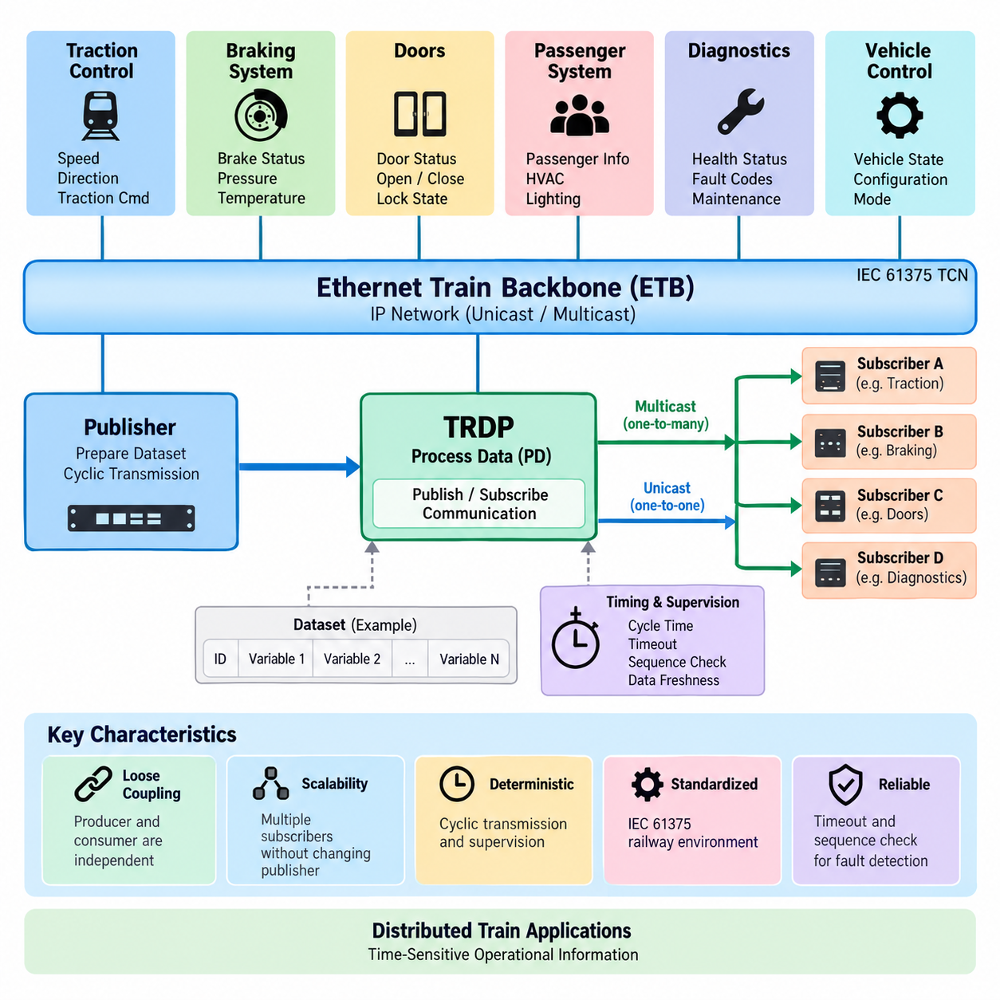
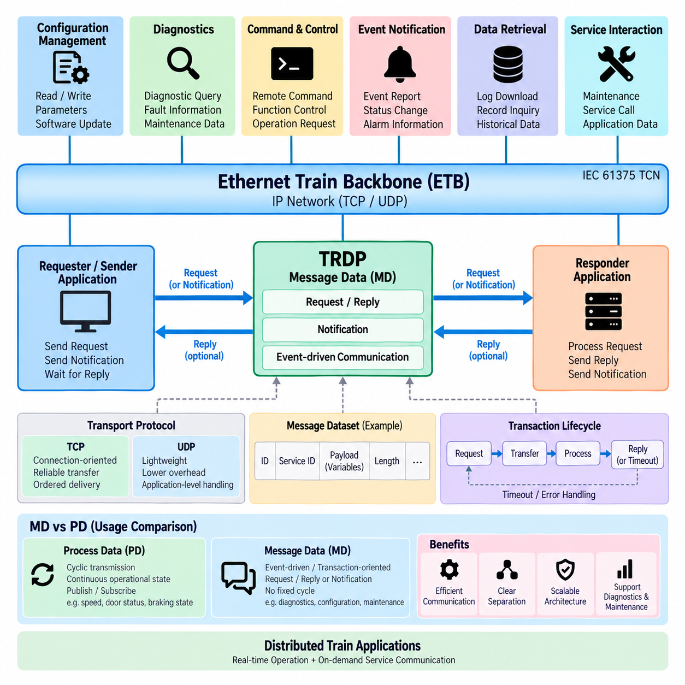
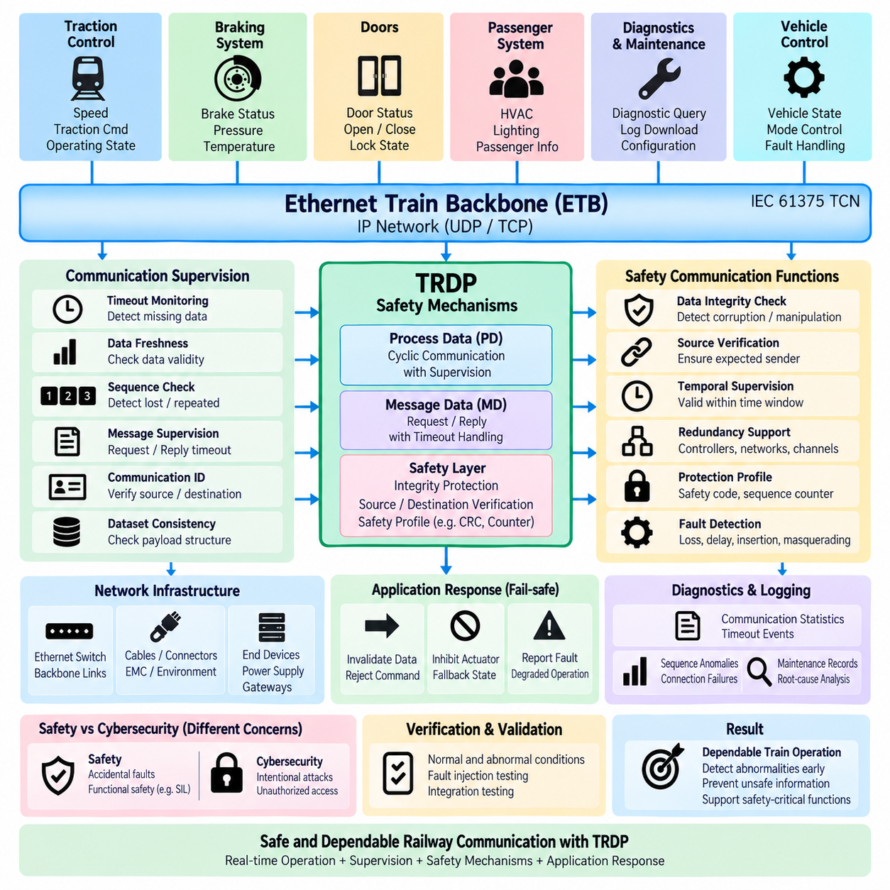
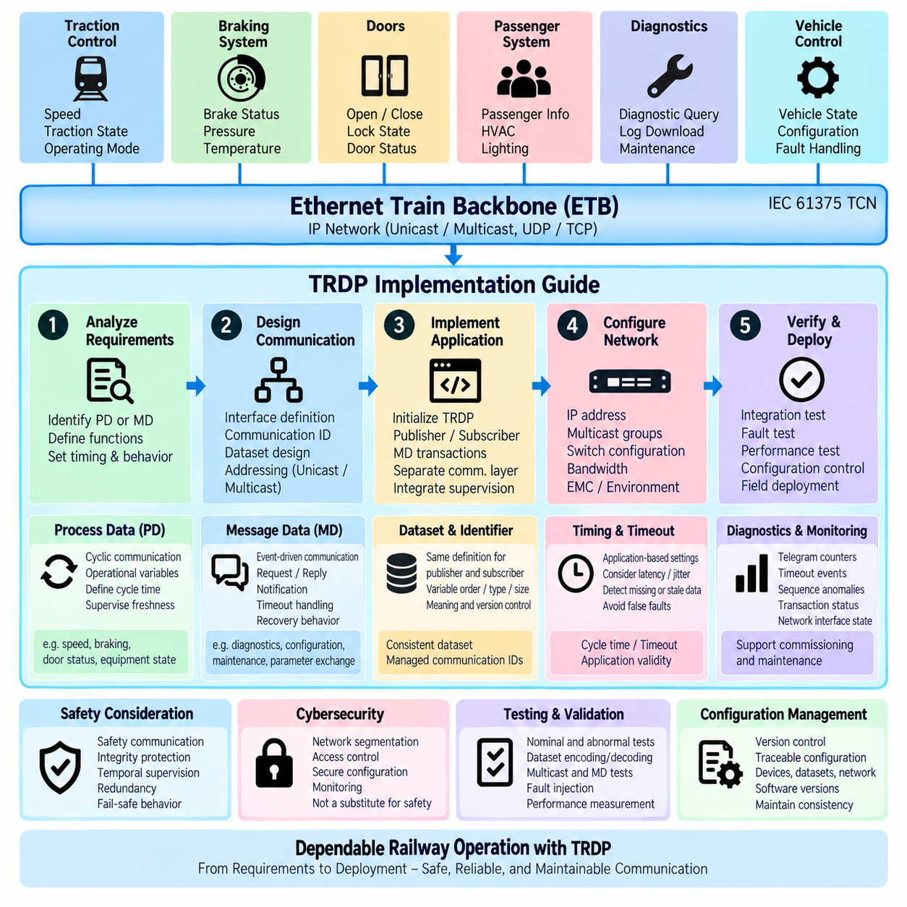

**Volume 08. Railway and Aerospace Protocols**


# Chapter 06. TRDP

##  

## 06.01. TRDP Pub/Sub Architecture

{width="7.268055555555556in" height="7.268055555555556in"}

Train Real-time Data Protocol (TRDP) is an Ethernet-based communication protocol used within the IEC 61375 Train Communication Network framework. In the attached structure, TRDP follows the Ethernet Train Backbone and precedes message-data and safety topics, positioning it as the application-oriented communication mechanism operating over an IP-based railway network.

The Publish/Subscribe architecture of TRDP is primarily associated with Process Data communication. Instead of requiring every receiving device to establish a dedicated request-response transaction, a publisher periodically produces a defined dataset and distributes it through the network. Subscribers interested in that dataset receive and process the corresponding information according to their configured communication relationships.

This architecture separates the producer of information from its consumers. A publisher does not need detailed knowledge of every application that uses its data, while subscribers can obtain required information without directly controlling the publisher. This loose coupling is particularly useful in distributed railway systems containing traction controllers, braking systems, doors, passenger systems, diagnostic units, and vehicle control equipment.

TRDP Process Data is typically transmitted cyclically because many train-control variables represent continuously changing operational states. Examples include speed, direction, braking status, door conditions, traction commands, temperatures, and equipment states. Cyclic transmission allows receivers to maintain an updated representation of the train without repeatedly initiating explicit communication transactions.

Each Process Data communication relationship is identified logically rather than being defined only by physical wiring. TRDP therefore allows application information to be mapped onto an Ethernet network through communication identifiers, source and destination addressing, datasets, and timing parameters. This logical abstraction is important because modern train networks may contain many devices whose relationships cannot efficiently be represented by dedicated point-to-point connections.

A publisher prepares application variables as a predefined dataset and passes them to the TRDP communication stack. The stack constructs the corresponding Process Data telegram and transfers it using the underlying IP and Ethernet communication infrastructure. At the receiving side, TRDP identifies the telegram, verifies relevant protocol information, and makes the received dataset available to applications registered as subscribers.

Multicast communication is especially compatible with the Publish/Subscribe model. When the same operational information is required by several devices, the publisher can transmit one multicast data stream rather than generating separate copies for every receiver. Ethernet switches and IP multicast mechanisms can then distribute the information toward the required network participants, reducing unnecessary transmission and simplifying one-to-many communication.

Unicast transmission can also be used when information is intended for a specific destination. Consequently, Publish/Subscribe should not be interpreted as being identical to multicast. Publish/Subscribe describes the logical relationship between information producers and consumers, whereas unicast or multicast describes how packets are addressed and transported across the network. TRDP can combine these concepts according to system requirements.

Communication identifiers provide an important abstraction between application semantics and network addressing. An application can associate a particular identifier with a defined type of Process Data, allowing subscribers to distinguish operational information independently of the physical location of the publishing equipment. This mechanism supports modular train architectures in which devices or consists may be reorganized while preserving logical communication relationships.

Dataset definitions are equally important because publisher and subscriber must interpret the transmitted payload consistently. A dataset specifies the sequence and representation of application variables carried within the telegram. Correct configuration therefore requires agreement on identifiers, data types, sizes, byte representation, update behavior, and semantic meaning. Network connectivity alone cannot guarantee interoperability when dataset definitions differ.

Timing is a fundamental characteristic of TRDP Process Data. A publisher normally sends information according to a configured cycle time, while a subscriber supervises whether expected telegrams continue to arrive. The communication design must therefore consider publication periods, network delay, processing latency, timeout limits, and application reaction times as parts of a coordinated timing model rather than as independent parameters.

Timeout supervision transforms cyclic communication into a useful mechanism for detecting missing information. If a subscriber expects updates within a specified interval and the publisher or communication path fails, the absence of new telegrams can be recognized. The receiving application can then invalidate the affected data, substitute a defined fallback value, report a communication fault, or initiate another system-level response.

Sequence-related information can help receivers distinguish successive telegrams and recognize abnormal communication behavior. Combined with timeout monitoring and protocol validation, this supports supervision of Process Data freshness. Such mechanisms are important because receiving an Ethernet packet is not sufficient by itself; the application must determine whether the information is current, expected, correctly associated, and suitable for further processing.

TRDP Publish/Subscribe communication also supports architectural scalability. A train may contain many subsystems producing operational states at different rates, yet subscribers need only register for information relevant to their functions. This reduces direct dependencies between applications and allows communication relationships to be configured systematically. New consumers can often be integrated without redesigning the publishing application\'s fundamental behavior.

The architecture becomes especially valuable when TRDP operates over an Ethernet Train Backbone. The attached volume places "TRDP over ETB" immediately before the TRDP chapter, reflecting the relationship between the Ethernet transport infrastructure and the protocol-level data exchange above it. ETB provides backbone connectivity, while TRDP organizes how railway applications publish, distribute, receive, and supervise operational information.

TRDP should therefore be understood as more than a simple Ethernet packet format. Its Publish/Subscribe model creates an information-oriented communication layer in which distributed railway applications exchange predefined datasets through controlled cyclic relationships. Ethernet provides bandwidth and connectivity, while TRDP supplies railway-specific communication semantics, identification, timing, supervision, and application-facing data distribution.

From a system-engineering perspective, the most important design task is defining communication relationships before implementing individual network endpoints. Engineers must determine which subsystem owns each item of information, which applications consume it, how frequently it changes, how quickly stale data must be detected, and what behavior is required when communication disappears. These decisions establish the functional communication contract.

This approach also creates a useful conceptual bridge toward modern distributed robotic and Physical AI systems. A mobile robot fleet similarly contains many producers of state information and many consumers requiring selected portions of that state. Localization, battery condition, velocity, mission state, actuator status, and health information can conceptually be organized as published datasets consumed by navigation, supervision, diagnostics, or fleet-management functions.

However, TRDP remains a railway-oriented protocol within the broader IEC 61375 communication environment rather than a generic robotics middleware. The attached hierarchy intentionally places TRDP in the railway and aerospace protocol volume, while DDS, ROS 2 middleware, MQTT, fleet communication, and Physical AI networks are treated separately in the robotics communication volume. This separation clarifies both the similarities and the application-domain boundaries.

The Publish/Subscribe architecture ultimately provides TRDP with a scalable way to distribute time-sensitive operational information among networked train devices. Publishers define authoritative streams of Process Data, subscribers select the information they require, datasets establish shared interpretation, communication identifiers establish logical relationships, and cyclic transmission with supervision maintains continuously updated distributed state across the train.

This foundation is also important for understanding the subsequent TRDP topics in the attached structure. Publish/Subscribe primarily explains the recurring Process Data communication model, while Message Data addresses transaction-oriented exchanges, and later sections can examine communication supervision, safety-related mechanisms, and implementation practices. Together these elements form a structured progression from communication architecture toward dependable railway integration.

열 실시간 데이터 프로토콜(Train Real-time Data Protocol, TRDP)은 IEC 61375 열차 통신 네트워크(Train Communication Network, TCN) 프레임워크에서 사용되는 이더넷 기반 통신 프로토콜이다. 첨부된 구조에서 TRDP는 이더넷 열차 백본(Ethernet Train Backbone, ETB) 다음에 배치되며, 메시지 데이터(Message Data)와 안전(Safety) 관련 주제에 앞서 다루어진다. 이는 TRDP가 IP 기반 철도 네트워크에서 동작하는 응용 지향 통신 메커니즘임을 보여준다.

TRDP의 발행/구독(Publish/Subscribe) 아키텍처는 주로 프로세스 데이터(Process Data, PD) 통신과 관련된다. 모든 수신 장치가 전용 요청-응답(Request-Response) 트랜잭션을 설정하는 대신, 발행자(Publisher)가 정의된 데이터셋(Dataset)을 주기적으로 생성하여 네트워크를 통해 배포한다. 해당 데이터셋에 관심이 있는 구독자(Subscriber)는 구성된 통신 관계에 따라 정보를 수신하고 처리한다.

이 아키텍처는 정보 생산자(Producer)와 소비자(Consumer)를 분리한다. 발행자는 자신의 데이터를 사용하는 모든 응용 프로그램을 상세하게 알 필요가 없으며, 구독자 역시 발행자를 직접 제어하지 않고 필요한 정보를 얻을 수 있다. 이러한 느슨한 결합(Loose Coupling)은 견인 제어기, 제동 시스템, 출입문, 승객 시스템, 진단 장치 및 차량 제어 장비가 분산된 철도 시스템에서 특히 유용하다.

TRDP 프로세스 데이터(Process Data)는 많은 열차 제어 변수가 지속적으로 변화하는 운행 상태를 나타내기 때문에 일반적으로 주기적으로 전송된다. 대표적인 정보에는 속도, 진행 방향, 제동 상태, 출입문 상태, 견인 명령, 온도 및 장비 상태 등이 있다. 주기 전송(Cyclic Transmission)을 사용하면 수신 장치가 명시적인 통신 요청을 반복하지 않고도 열차의 최신 상태를 지속적으로 유지할 수 있다.

각 프로세스 데이터(Process Data) 통신 관계는 물리적인 배선만으로 정의되지 않고 논리적으로 식별된다. 따라서 TRDP에서는 통신 식별자(Communication Identifier), 송신원 및 목적지 주소, 데이터셋(Dataset), 타이밍 파라미터(Timing Parameter)를 통해 응용 정보를 이더넷 네트워크에 매핑할 수 있다. 이러한 논리적 추상화(Logical Abstraction)는 전용 점대점(Point-to-Point) 연결만으로 표현하기 어려운 다수 장치 간 관계를 효율적으로 구성하는 데 중요하다.

발행자(Publisher)는 응용 변수를 사전에 정의된 데이터셋(Dataset)으로 구성하고 이를 TRDP 통신 스택(Communication Stack)에 전달한다. 통신 스택은 해당 프로세스 데이터 텔레그램(Process Data Telegram)을 구성하여 IP 및 이더넷 통신 인프라를 통해 전송한다. 수신 측 TRDP는 텔레그램을 식별하고 관련 프로토콜 정보를 검증한 후 등록된 구독자(Subscriber) 응용 프로그램이 수신 데이터셋을 사용할 수 있도록 한다.

멀티캐스트 통신(Multicast Communication)은 발행/구독(Publish/Subscribe) 모델과 특히 잘 결합된다. 동일한 운행 정보를 여러 장치가 필요로 하는 경우 발행자는 각 수신 장치에 별도의 데이터 복사본을 생성하는 대신 하나의 멀티캐스트 데이터 스트림(Multicast Data Stream)을 전송할 수 있다. 이후 이더넷 스위치와 IP 멀티캐스트(IP Multicast) 메커니즘이 필요한 네트워크 참여자에게 정보를 배포함으로써 불필요한 전송을 줄이고 일대다(One-to-Many) 통신을 단순화한다.

정보가 특정 목적지에만 전달되어야 하는 경우 유니캐스트 전송(Unicast Transmission)도 사용할 수 있다. 따라서 발행/구독(Publish/Subscribe)을 멀티캐스트(Multicast)와 동일한 개념으로 이해해서는 안 된다. 발행/구독은 정보 생산자와 소비자 사이의 논리적 관계를 의미하는 반면, 유니캐스트 또는 멀티캐스트는 패킷이 네트워크에서 어떻게 주소 지정되고 전송되는지를 의미한다. TRDP는 시스템 요구사항에 따라 이러한 개념을 조합할 수 있다.

통신 식별자(Communication Identifier)는 응용 의미론(Application Semantics)과 네트워크 주소 지정(Network Addressing) 사이에서 중요한 추상화 기능을 제공한다. 응용 프로그램은 특정 식별자를 정의된 프로세스 데이터 유형과 연결할 수 있으며, 구독자는 발행 장비의 물리적 위치와 독립적으로 운행 정보를 구분할 수 있다. 이러한 메커니즘은 장치나 편성(Consist)이 재구성되더라도 논리적인 통신 관계를 유지해야 하는 모듈형 열차 아키텍처에 적합하다.

데이터셋 정의(Dataset Definition) 역시 발행자와 구독자가 전송된 페이로드(Payload)를 동일하게 해석하기 위해 중요하다. 데이터셋은 텔레그램에 포함되는 응용 변수의 순서와 표현 방식을 정의한다. 따라서 올바른 구성에는 식별자, 데이터 형식, 크기, 바이트 표현(Byte Representation), 갱신 동작 및 의미적 정의에 대한 일치가 필요하다. 데이터셋 정의가 서로 다르면 단순히 네트워크가 연결되어 있다는 사실만으로 상호운용성(Interoperability)을 보장할 수 없다.

타이밍(Timing)은 TRDP 프로세스 데이터의 핵심 특성이다. 발행자는 일반적으로 설정된 주기 시간(Cycle Time)에 따라 정보를 전송하고, 구독자는 예상된 텔레그램이 계속 도착하는지를 감시한다. 따라서 통신 설계에서는 발행 주기, 네트워크 지연(Network Delay), 처리 지연(Processing Latency), 타임아웃 제한(Timeout Limit), 응용 반응 시간(Application Reaction Time)을 독립적인 값이 아니라 하나의 조정된 타이밍 모델(Timing Model)로 고려해야 한다.

타임아웃 감시(Timeout Supervision)는 주기 통신을 누락 정보 검출에 활용할 수 있도록 한다. 구독자가 지정된 시간 간격 내에 데이터 갱신을 기대하는 상황에서 발행자 또는 통신 경로에 장애가 발생하면 새로운 텔레그램이 도착하지 않는 상태를 감지할 수 있다. 수신 응용 프로그램은 해당 데이터를 무효화하거나 정의된 대체값(Fallback Value)을 적용하고, 통신 장애를 보고하거나 다른 시스템 수준의 대응을 시작할 수 있다.

시퀀스 관련 정보(Sequence-related Information)는 수신자가 연속적인 텔레그램을 구별하고 비정상적인 통신 동작을 식별하는 데 도움을 줄 수 있다. 타임아웃 감시와 프로토콜 검증(Protocol Validation)을 함께 사용하면 프로세스 데이터의 최신성(Data Freshness)을 감시할 수 있다. 단순히 이더넷 패킷을 수신하는 것만으로는 충분하지 않으며, 응용 프로그램은 해당 정보가 최신인지, 예상된 것인지, 올바르게 연결된 것인지, 후속 처리에 사용할 수 있는지를 판단해야 한다.

TRDP 발행/구독(Publish/Subscribe) 통신은 아키텍처의 확장성(Scalability)도 지원한다. 열차에는 서로 다른 주기로 운행 상태를 생성하는 많은 하위 시스템이 존재할 수 있지만, 구독자는 자신의 기능에 필요한 정보만 등록하여 수신하면 된다. 이를 통해 응용 프로그램 사이의 직접적인 의존성을 줄이고 통신 관계를 체계적으로 구성할 수 있으며, 새로운 소비자를 추가하더라도 발행 응용 프로그램의 기본 동작을 크게 변경할 필요가 없다.

이 아키텍처는 TRDP가 이더넷 열차 백본(Ethernet Train Backbone, ETB) 위에서 동작할 때 특히 중요한 의미를 갖는다. 첨부된 볼륨 구조에서 "ETB 상의 TRDP(TRDP over ETB)"가 TRDP 장 바로 앞에 배치되어 있으며, 이는 이더넷 전송 인프라와 그 상위에서 이루어지는 프로토콜 수준 데이터 교환 사이의 관계를 나타낸다. ETB가 백본 연결성을 제공한다면 TRDP는 철도 응용 프로그램이 운행 정보를 어떻게 발행, 배포, 수신 및 감시할 것인지를 구성한다.

따라서 TRDP는 단순한 이더넷 패킷 형식(Ethernet Packet Format) 이상의 개념으로 이해해야 한다. TRDP의 발행/구독 모델은 분산된 철도 응용 프로그램이 제어된 주기적 관계를 통해 사전에 정의된 데이터셋을 교환하는 정보 지향 통신 계층(Information-oriented Communication Layer)을 구성한다. 이더넷이 대역폭과 연결성을 제공한다면 TRDP는 철도 특화 통신 의미론, 식별, 타이밍, 감시 및 응용 지향 데이터 배포 기능을 제공한다.

시스템 엔지니어링(System Engineering) 관점에서 가장 중요한 설계 작업은 개별 네트워크 종단점(Network Endpoint)을 구현하기 전에 통신 관계를 정의하는 것이다. 엔지니어는 각 정보 항목을 어느 하위 시스템이 소유하는지, 어떤 응용 프로그램이 이를 사용하는지, 정보가 얼마나 자주 변경되는지, 오래된 데이터를 얼마나 빠르게 검출해야 하는지, 통신이 중단되었을 때 어떤 동작이 필요한지를 결정해야 한다. 이러한 결정이 기능적 통신 계약(Functional Communication Contract)을 형성한다.

이러한 접근 방식은 현대의 분산 로봇 시스템(Distributed Robotic System)과 피지컬 AI(Physical AI) 시스템을 이해하는 데도 유용한 개념적 연결고리를 제공한다. 이동 로봇 플릿(Mobile Robot Fleet) 역시 다수의 상태 정보 생산자와 그중 필요한 정보를 사용하는 다수의 소비자로 구성된다. 위치추정(Localization), 배터리 상태, 속도, 임무 상태, 액추에이터 상태 및 건전성 정보(Health Information)는 개념적으로 발행된 데이터셋으로 구성되어 내비게이션, 감독, 진단 또는 플릿 관리(Fleet Management) 기능에서 소비될 수 있다.

그러나 TRDP는 범용 로봇 미들웨어(Generic Robotics Middleware)가 아니라 광범위한 IEC 61375 통신 환경에 포함되는 철도 지향 프로토콜(Railway-oriented Protocol)이다. 첨부된 계층 구조에서도 TRDP는 철도 및 항공우주 프로토콜(Railway and Aerospace Protocols) 볼륨에 배치되어 있으며, 데이터 분배 서비스(Data Distribution Service, DDS), ROS 2 미들웨어(ROS 2 Middleware), MQTT, 플릿 통신(Fleet Communication), 피지컬 AI 네트워크(Physical AI Networks)는 별도의 로보틱스 통신(Robotics Communication) 볼륨에서 다루어진다. 이러한 구분은 개념적 유사성과 응용 영역의 경계를 동시에 명확하게 한다.

결과적으로 발행/구독(Publish/Subscribe) 아키텍처는 TRDP가 네트워크로 연결된 열차 장치 사이에서 시간 민감형 운행 정보(Time-sensitive Operational Information)를 확장성 있게 배포할 수 있도록 한다. 발행자는 권위 있는 프로세스 데이터 스트림을 정의하고, 구독자는 필요한 정보를 선택하며, 데이터셋은 공통된 데이터 해석을 확립하고, 통신 식별자는 논리적 관계를 정의한다. 여기에 주기 전송과 감시 기능이 결합되어 열차 전체에서 지속적으로 갱신되는 분산 상태(Distributed State)를 유지한다.

이러한 기반은 첨부된 구조에서 이어지는 TRDP 주제를 이해하는 데도 중요하다. 발행/구독(Publish/Subscribe)은 주로 반복적인 프로세스 데이터(Process Data) 통신 모델을 설명하며, 메시지 데이터(Message Data)는 트랜잭션 지향 교환(Transaction-oriented Exchange)을 다룬다. 이후의 절에서는 통신 감시, 안전 관련 메커니즘(Safety-related Mechanism), 구현 방법을 살펴볼 수 있다. 이러한 요소들은 통신 아키텍처에서 신뢰성 높은 철도 시스템 통합(Dependable Railway Integration)으로 이어지는 체계적인 흐름을 형성한다.

##  

## 06.02. TRDP MD (Message Data)

{width="7.268055555555556in" height="7.268055555555556in"}

Train Real-time Data Protocol (TRDP) provides two complementary communication models for distributed railway applications: Process Data (PD) and Message Data (MD). While Process Data is optimized for cyclic Publish/Subscribe exchange of continuously changing operational states, Message Data supports event-driven and transaction-oriented communication when applications need explicit exchanges rather than continuously repeated updates.

Message Data is suitable for information that does not require fixed cyclic transmission. Instead of repeatedly publishing the same type of state information, an application generates an MD transaction when a specific event, request, command, diagnostic operation, or information exchange occurs. This approach avoids consuming network resources with unnecessary periodic traffic when information is needed only occasionally.

The fundamental distinction between PD and MD therefore concerns communication behavior rather than simply the size or importance of the transmitted information. PD represents continuously refreshed distributed state, whereas MD represents discrete communication transactions. A train-control system may use PD for speed and door status while using MD for configuration retrieval, diagnostic queries, maintenance information, or application-specific commands.

TRDP Message Data uses an application-to-application communication relationship in which a requesting or sending application exchanges a defined message with another application. Depending on the required interaction, communication can follow request/reply behavior or notification-oriented behavior. This enables applications to initiate explicit transactions while remaining within the same TRDP-based railway communication environment used for real-time operational information.

In a request/reply transaction, one application sends a request containing the information necessary for a remote function to perform an operation or provide information. The receiving application processes the request and returns a corresponding reply. This communication pattern is appropriate when the initiating application must know whether the requested operation was processed or needs information that only the destination application can provide.

A notification-style exchange is useful when an application needs to communicate an event or information without requiring the same conversational sequence as a request/reply transaction. Such behavior can support event reporting, status changes, maintenance notifications, or other asynchronous application interactions. The communication architecture can therefore represent both interactive transactions and one-directional event-oriented exchanges.

Message Data communication is generally associated with TCP or UDP transport depending on the TRDP communication mode and implementation requirements. The transport choice influences connection behavior, reliability characteristics, latency, and resource consumption. Engineers must therefore consider the semantics of the application transaction rather than selecting transport mechanisms solely from conventional Ethernet networking practices.

TCP-based communication can provide connection-oriented transport and mechanisms such as ordered delivery and retransmission. These characteristics are useful when successful transfer of complete application information is more important than minimizing communication overhead. Configuration transfer, maintenance information, or diagnostic transactions may benefit from transport behavior in which lost information can be recovered rather than simply replaced by the next cyclic update.

UDP-oriented communication offers a lighter transport mechanism without establishing the same connection-oriented session behavior. It can be appropriate where application-level communication semantics, timing requirements, or system architecture make lower overhead desirable. However, the application and TRDP configuration must account for the different delivery characteristics because UDP itself does not provide the same reliability mechanisms as TCP.

An MD transaction must be logically associated with the intended application service. Communication identifiers and addressing information allow TRDP participants to determine the purpose and destination of exchanged messages. As with Process Data, the physical Ethernet connection alone does not define application meaning. Logical identifiers, dataset definitions, addressing, and application configuration establish the actual communication relationship.

Message payloads are interpreted according to agreed dataset definitions. Both communicating applications must therefore share consistent knowledge of the structure, ordering, representation, and meaning of the transmitted variables. A correctly delivered Ethernet message is not useful if the sender and receiver interpret its payload differently. Dataset management is consequently an important part of TRDP interoperability for both PD and MD communication.

TRDP MD communication also introduces the concept of a transaction lifecycle. A transaction may begin when an application generates a request, continue while the message is transferred and processed, and terminate when the expected response is received or when a timeout condition occurs. The application can then determine whether the transaction completed successfully, failed, or requires another system-level recovery action.

Timeout management is particularly important because distributed railway applications cannot wait indefinitely for a response. When an expected reply does not arrive within the configured interval, the requesting application must recognize the abnormal condition. Depending on system requirements, it may retry the transaction, report a communication fault, enter a degraded operating mode, or transfer responsibility to another diagnostic or supervisory function.

Message Data should not be regarded as a replacement for Process Data. Using request/reply transactions for rapidly changing variables such as vehicle speed or braking state would create unnecessary communication overhead and tightly couple consumers to producers. Conversely, cyclically broadcasting large diagnostic or configuration information that changes infrequently would waste bandwidth. TRDP separates these communication patterns so each can be applied appropriately.

A practical railway system therefore commonly combines PD and MD within the same network architecture. Process Data maintains the continuously updated operational state required by distributed control functions, while Message Data handles explicit transactions that occur according to events or application needs. This combination allows real-time state distribution and asynchronous service communication to coexist over the Ethernet-based Train Communication Network.

For example, a traction controller may continuously publish operating state through PD while accepting diagnostic requests through MD. A door controller may publish open, closed, locked, and fault states cyclically but use Message Data when maintenance equipment requests detailed diagnostic records or configuration parameters. The same physical device can therefore participate simultaneously in different TRDP communication relationships.

This separation also improves network engineering because traffic can be classified according to its functional behavior. Cyclic PD traffic can be designed around update periods, latency, jitter, multicast distribution, and freshness supervision. MD traffic can instead be analyzed according to transaction frequency, message size, response time, timeout behavior, connection resources, and expected concurrency between communicating applications.

From a system integration perspective, engineers must define which information belongs to PD and which belongs to MD before implementing interfaces. The decision should be based on whether information represents continuously changing state or a discrete transaction, whether multiple consumers require it, how quickly stale information becomes unacceptable, whether a response is required, and how communication failure should affect the application.

This PD/MD distinction provides a useful architectural analogy for distributed robotics and Physical AI systems. A robot may continuously publish localization, velocity, battery condition, and actuator status while using transaction-oriented communication for map requests, configuration changes, diagnostic retrieval, software management, or mission-related service calls. The underlying protocols may differ, but the separation between state streams and explicit transactions remains valuable.

Within the attached book structure, TRDP Message Data follows the Publish/Subscribe architecture and precedes TRDP safety mechanisms and implementation guidance. This sequence establishes a logical progression: first understanding cyclic Process Data distribution, then transaction-oriented Message Data, followed by mechanisms required for dependable communication and practical integration. TRDP can therefore be studied as a coordinated communication architecture rather than as a single message format.

Together, Process Data and Message Data allow TRDP to support the different communication behaviors required by modern railway systems. PD efficiently maintains distributed real-time operational state, while MD provides controlled event-driven and request/reply exchanges. Their coordinated use enables train subsystems to combine continuous monitoring and control with diagnostics, configuration, maintenance, and higher-level application interactions over a common Ethernet infrastructure.

열 실시간 데이터 프로토콜(Train Real-time Data Protocol, TRDP)은 분산 철도 응용 프로그램(Distributed Railway Application)을 위해 프로세스 데이터(Process Data, PD)와 메시지 데이터(Message Data, MD)라는 두 가지 상호보완적인 통신 모델을 제공한다. 프로세스 데이터가 지속적으로 변화하는 운행 상태를 주기적인 발행/구독(Publish/Subscribe) 방식으로 교환하는 데 최적화되어 있다면, 메시지 데이터는 지속적인 반복 갱신보다 명시적인 정보 교환이 필요한 경우 이벤트 기반(Event-driven) 및 트랜잭션 지향(Transaction-oriented) 통신을 지원한다.

메시지 데이터(Message Data)는 고정된 주기 전송이 필요하지 않은 정보에 적합하다. 동일한 종류의 상태 정보를 반복적으로 발행하는 대신 특정 이벤트, 요청, 명령, 진단 작업 또는 정보 교환이 발생할 때 응용 프로그램이 MD 트랜잭션(MD Transaction)을 생성한다. 이러한 방식은 정보가 가끔 필요할 뿐인 상황에서 불필요한 주기적 트래픽으로 네트워크 자원을 소비하는 것을 방지한다.

따라서 PD와 MD의 근본적인 차이는 단순히 전송되는 정보의 크기나 중요성이 아니라 통신 동작(Communication Behavior)에 있다. PD는 지속적으로 갱신되는 분산 상태(Distributed State)를 나타내는 반면, MD는 개별적인 통신 트랜잭션을 나타낸다. 열차 제어 시스템은 속도와 출입문 상태에는 PD를 사용하고, 구성 정보 조회, 진단 질의, 유지보수 정보 또는 응용 프로그램별 명령에는 MD를 사용할 수 있다.

TRDP 메시지 데이터(Message Data)는 요청 또는 송신 응용 프로그램이 다른 응용 프로그램과 정의된 메시지를 교환하는 응용 프로그램 간(Application-to-Application) 통신 관계를 사용한다. 필요한 상호작용에 따라 통신은 요청/응답(Request/Reply) 방식 또는 알림 지향(Notification-oriented) 방식으로 이루어질 수 있다. 이를 통해 응용 프로그램은 실시간 운행 정보에 사용되는 동일한 TRDP 기반 철도 통신 환경에서 명시적인 트랜잭션을 시작할 수 있다.

요청/응답(Request/Reply) 트랜잭션에서 하나의 응용 프로그램은 원격 기능이 특정 작업을 수행하거나 정보를 제공하는 데 필요한 내용을 포함한 요청을 전송한다. 수신 응용 프로그램은 해당 요청을 처리하고 이에 대응하는 응답을 반환한다. 이러한 통신 패턴은 요청을 시작한 응용 프로그램이 해당 작업의 처리 여부를 확인해야 하거나 목적지 응용 프로그램만 제공할 수 있는 정보가 필요한 경우에 적합하다.

알림 방식 교환(Notification-style Exchange)은 응용 프로그램이 요청/응답 트랜잭션과 같은 대화형 순서를 요구하지 않으면서 이벤트나 정보를 전달해야 할 때 유용하다. 이러한 방식은 이벤트 보고, 상태 변경, 유지보수 알림 또는 기타 비동기 응용 프로그램 상호작용(Asynchronous Application Interaction)을 지원할 수 있다. 따라서 통신 아키텍처는 상호작용형 트랜잭션과 단방향 이벤트 지향 교환을 모두 표현할 수 있다.

TRDP 메시지 데이터 통신은 일반적으로 TRDP 통신 모드와 구현 요구사항에 따라 TCP 또는 UDP 전송(Transport)과 연관된다. 전송 방식의 선택은 연결 동작, 신뢰성 특성, 지연 시간(Latency), 자원 소비에 영향을 미친다. 따라서 엔지니어는 일반적인 이더넷 네트워킹 관행만으로 전송 메커니즘을 선택하기보다는 응용 트랜잭션의 의미론(Application Transaction Semantics)을 고려해야 한다.

TCP 기반 통신(TCP-based Communication)은 연결 지향 전송(Connection-oriented Transport)과 순차적 전달 및 재전송과 같은 메커니즘을 제공할 수 있다. 이러한 특성은 통신 오버헤드를 최소화하는 것보다 완전한 응용 정보의 성공적인 전달이 더 중요한 경우에 유용하다. 구성 정보 전송, 유지보수 정보 또는 진단 트랜잭션에서는 손실된 정보를 다음 주기 갱신으로 대체하는 대신 복구할 수 있는 전송 동작이 유용할 수 있다.

UDP 지향 통신(UDP-oriented Communication)은 동일한 연결 지향 세션(Connection-oriented Session)을 설정하지 않고 보다 가벼운 전송 메커니즘을 제공한다. 응용 계층 통신 의미론, 타이밍 요구사항 또는 시스템 아키텍처에서 낮은 오버헤드가 요구되는 경우 적합할 수 있다. 그러나 UDP 자체는 TCP와 동일한 신뢰성 메커니즘을 제공하지 않으므로 응용 프로그램과 TRDP 구성에서 서로 다른 전달 특성을 고려해야 한다.

MD 트랜잭션은 의도된 응용 서비스(Application Service)와 논리적으로 연결되어야 한다. 통신 식별자(Communication Identifier)와 주소 정보(Addressing Information)를 통해 TRDP 참여자는 교환되는 메시지의 목적과 목적지를 결정할 수 있다. 프로세스 데이터와 마찬가지로 물리적인 이더넷 연결만으로 응용 의미가 정의되지는 않는다. 논리적 식별자, 데이터셋 정의, 주소 지정 및 응용 구성이 실제 통신 관계를 형성한다.

메시지 페이로드(Message Payload)는 합의된 데이터셋 정의(Dataset Definition)에 따라 해석된다. 따라서 통신하는 양쪽 응용 프로그램은 전송 변수의 구조, 순서, 표현 방식 및 의미에 대해 일관된 정보를 공유해야 한다. 이더넷 메시지가 정상적으로 전달되더라도 송신자와 수신자가 페이로드를 서로 다르게 해석한다면 유용하지 않다. 따라서 데이터셋 관리(Dataset Management)는 PD와 MD 통신 모두에서 TRDP 상호운용성(Interoperability)의 중요한 요소이다.

TRDP MD 통신에서는 트랜잭션 생명주기(Transaction Lifecycle)라는 개념도 중요하다. 트랜잭션은 응용 프로그램이 요청을 생성할 때 시작되고, 메시지가 전송되고 처리되는 동안 계속되며, 예상된 응답이 수신되거나 타임아웃(Timeout)이 발생하면 종료될 수 있다. 이후 응용 프로그램은 해당 트랜잭션이 성공적으로 완료되었는지, 실패했는지 또는 추가적인 시스템 수준 복구 조치(System-level Recovery Action)가 필요한지를 판단할 수 있다.

분산 철도 응용 프로그램은 응답을 무한정 기다릴 수 없으므로 타임아웃 관리(Timeout Management)는 특히 중요하다. 예상된 응답이 설정된 시간 내에 도착하지 않으면 요청 응용 프로그램은 비정상 상태를 인식해야 한다. 시스템 요구사항에 따라 트랜잭션을 재시도하거나, 통신 장애를 보고하거나, 성능 저하 운전 모드(Degraded Operating Mode)로 전환하거나, 다른 진단 또는 감독 기능에 대응 책임을 전달할 수 있다.

메시지 데이터(Message Data)를 프로세스 데이터(Process Data)의 대체 수단으로 이해해서는 안 된다. 차량 속도나 제동 상태처럼 빠르게 변화하는 변수에 요청/응답 트랜잭션을 사용하면 불필요한 통신 오버헤드가 발생하고 소비자와 생산자가 강하게 결합된다. 반대로 거의 변경되지 않는 대용량 진단 또는 구성 정보를 주기적으로 브로드캐스트하면 대역폭을 낭비하게 된다. TRDP는 이러한 통신 패턴을 분리하여 각각을 적절한 용도에 적용할 수 있도록 한다.

따라서 실제 철도 시스템에서는 동일한 네트워크 아키텍처 내에서 PD와 MD를 함께 사용하는 경우가 일반적이다. 프로세스 데이터는 분산 제어 기능에 필요한 지속적으로 갱신되는 운행 상태를 유지하고, 메시지 데이터는 이벤트 또는 응용 프로그램의 필요에 따라 발생하는 명시적인 트랜잭션을 처리한다. 이러한 조합을 통해 실시간 상태 배포(Real-time State Distribution)와 비동기 서비스 통신(Asynchronous Service Communication)이 이더넷 기반 열차 통신 네트워크에서 함께 동작할 수 있다.

예를 들어 견인 제어기(Traction Controller)는 PD를 통해 운전 상태를 지속적으로 발행하면서 MD를 통해 진단 요청을 받을 수 있다. 출입문 제어기(Door Controller)는 열림, 닫힘, 잠금 및 고장 상태를 주기적으로 발행하지만, 유지보수 장비가 상세 진단 기록이나 구성 파라미터(Configuration Parameter)를 요청할 때는 메시지 데이터를 사용할 수 있다. 따라서 하나의 물리적 장치가 서로 다른 TRDP 통신 관계에 동시에 참여할 수 있다.

이러한 분리는 트래픽을 기능적 동작에 따라 분류할 수 있기 때문에 네트워크 엔지니어링(Network Engineering)도 개선한다. 주기적인 PD 트래픽은 갱신 주기, 지연 시간, 지터(Jitter), 멀티캐스트 배포(Multicast Distribution), 최신성 감시(Freshness Supervision)를 중심으로 설계할 수 있다. 반면 MD 트래픽은 트랜잭션 빈도, 메시지 크기, 응답 시간, 타임아웃 동작, 연결 자원 및 통신 응용 프로그램 간 예상 동시성(Concurrency)을 기준으로 분석할 수 있다.

시스템 통합(System Integration) 관점에서 엔지니어는 인터페이스를 구현하기 전에 어떤 정보가 PD에 속하고 어떤 정보가 MD에 속하는지를 정의해야 한다. 이 결정은 정보가 지속적으로 변화하는 상태인지 개별적인 트랜잭션인지, 여러 소비자가 해당 정보를 필요로 하는지, 오래된 정보가 어느 정도의 시간 이후 허용될 수 없는지, 응답이 필요한지, 통신 장애가 응용 프로그램에 어떤 영향을 주어야 하는지를 기준으로 이루어져야 한다.

이러한 PD/MD 구분은 분산 로보틱스(Distributed Robotics)와 피지컬 AI(Physical AI) 시스템에도 유용한 아키텍처적 유사성을 제공한다. 로봇은 위치추정(Localization), 속도, 배터리 상태 및 액추에이터 상태를 지속적으로 발행하면서 지도 요청, 구성 변경, 진단 정보 조회, 소프트웨어 관리 또는 임무 관련 서비스 호출에는 트랜잭션 지향 통신을 사용할 수 있다. 기반 프로토콜은 다를 수 있지만 상태 스트림(State Stream)과 명시적 트랜잭션(Explicit Transaction)의 분리는 여전히 중요한 설계 원칙이다.

첨부된 책의 구조에서 TRDP 메시지 데이터(Message Data)는 발행/구독 아키텍처(Publish/Subscribe Architecture) 다음에 위치하며, TRDP 안전 메커니즘(Safety Mechanisms)과 구현 가이드(Implementation Guide)에 앞서 배치되어 있다. 이러한 순서는 먼저 주기적인 프로세스 데이터 배포를 이해하고, 이어서 트랜잭션 지향 메시지 데이터를 학습한 다음, 신뢰성 있는 통신과 실제 시스템 통합에 필요한 메커니즘으로 발전하는 논리적인 흐름을 형성한다.

프로세스 데이터(Process Data)와 메시지 데이터(Message Data)를 함께 사용함으로써 TRDP는 현대 철도 시스템에서 요구되는 서로 다른 통신 동작을 지원할 수 있다. PD는 분산된 실시간 운행 상태를 효율적으로 유지하고, MD는 제어된 이벤트 기반 및 요청/응답 교환을 제공한다. 이 두 방식의 조합을 통해 열차 하위 시스템은 공통 이더넷 인프라에서 지속적인 감시 및 제어와 함께 진단, 구성, 유지보수 및 상위 수준 응용 프로그램 간 상호작용을 수행할 수 있다.

##  

## 06.03. TRDP Safety Mechanisms

{width="7.268055555555556in" height="7.268055555555556in"}

Train Real-time Data Protocol (TRDP) operates within railway communication systems where dependable exchange of operational information is essential. Safety-related communication cannot rely only on successful Ethernet packet delivery; applications must also determine whether received information is correct, current, expected, and associated with the proper communication relationship. TRDP therefore provides communication supervision mechanisms that can support dependable system behavior.

A fundamental mechanism is timeout supervision. Process Data is normally transmitted cyclically, allowing a subscriber to know when the next telegram should approximately arrive. If no valid telegram is received within the configured timeout interval, the subscriber can identify the information as unavailable or stale. The application can then reject the affected data and initiate a predefined fault-handling or degraded-operation strategy.

Data freshness is closely related to timeout monitoring. A telegram that was once valid cannot necessarily remain valid indefinitely because train operating conditions continuously change. Speed, braking state, traction status, door conditions, and other variables may become unsafe to use when they are outdated. TRDP communication design must therefore associate operational information with suitable update periods and validity expectations.

Sequence information can be used to supervise the progression of received telegrams. Successive messages should follow the expected communication sequence, enabling receivers to detect repeated, missing, or unexpectedly ordered information. Sequence supervision does not independently guarantee functional safety, but it provides an important communication-level indication that the received data stream behaves differently from the expected cyclic relationship.

Message Data requires a different form of supervision because communication is transaction-oriented rather than continuously cyclic. A requesting application may expect a corresponding reply within a defined period. If the reply is not received, the transaction can terminate through timeout handling rather than waiting indefinitely. This allows the application to identify unsuccessful communication and determine whether retry, fault reporting, fallback behavior, or another recovery action is required.

Communication identifiers and addressing also contribute to dependable data handling. A receiver must determine that incoming information belongs to the expected logical communication relationship before using its payload. Correct Ethernet delivery alone is insufficient if data is associated with the wrong application function. TRDP therefore relies on consistent configuration of communication identifiers, source and destination relationships, and dataset definitions across participating devices.

Dataset consistency is another essential integration requirement. Publishers and subscribers must share the same interpretation of payload structure, variable ordering, data types, lengths, and application semantics. A telegram can be technically delivered without network errors while still being incorrectly interpreted by the receiving application. Configuration management and interface verification are therefore necessary parts of building dependable TRDP-based systems.

TRDP communication supervision must be distinguished from complete functional safety. Detecting a missing telegram, timeout, unexpected sequence, or communication inconsistency does not by itself prove that a railway function satisfies a required Safety Integrity Level. Functional safety depends on the complete system architecture, including hazard analysis, application logic, redundancy, failure reactions, hardware behavior, software development processes, verification, and validation.

For safety-related data communication, railway systems may therefore apply additional safety mechanisms above the ordinary transport service. The purpose is to protect safety information against communication failure modes that cannot be sufficiently controlled merely by Ethernet, IP, UDP, TCP, or standard TRDP communication behavior. Such protection is commonly implemented through a safety layer or safety-related communication profile associated with the application data.

Typical safety communication principles include mechanisms for detecting data corruption, repetition, loss, incorrect sequence, excessive delay, insertion, or masquerading of information. Depending on the applicable safety architecture, additional safety information may be associated with the application payload so that the receiving safety function can verify that the data belongs to the expected source, sequence, communication context, and validity interval before accepting it.

A safety code or safety-oriented integrity check can provide stronger protection against accidental data corruption than relying exclusively on ordinary lower-layer error detection. The receiver calculates or verifies the corresponding protection information and rejects the safety telegram when the expected relationship is not satisfied. The exact safety mechanism must follow the selected railway safety profile and system requirements rather than being improvised at application level.

Source and destination identification are also important in safety communication because correctly formatted information received from an unintended communication participant can still create a hazardous condition. Safety-related communication therefore needs a means of confirming the logical relationship between sender and receiver. This protection complements ordinary IP addressing because network addresses alone do not represent the complete safety context of an application function.

Temporal supervision is equally significant. Safety information must arrive not only without corruption but also within the period in which it remains operationally meaningful. Cycle counters, sequence supervision, timeout monitoring, and age-related validity checks can help identify delayed or repeated information. Once the permitted temporal relationship is violated, the receiving application should treat the information according to its predefined safe or degraded behavior.

Redundancy can further increase system dependability when required by the railway architecture. Redundant controllers, network paths, interfaces, or communication channels may reduce the probability that a single failure causes loss of a critical function. TRDP can participate in such architectures, but redundancy management must be designed at system level, including failure detection, channel selection, synchronization, switchover behavior, and prevention of common-cause failures.

Network infrastructure also influences communication dependability. Ethernet switches, backbone links, end devices, power supplies, connectors, and gateways can become failure points even when the TRDP software operates correctly. Railway network design therefore considers communication supervision together with physical redundancy, environmental qualification, electromagnetic compatibility, equipment reliability, diagnostics, and maintainability rather than treating the protocol as an isolated safety component.

Fail-safe behavior must ultimately be defined by the receiving application. When communication supervision identifies invalid or missing information, TRDP can report the communication condition, but the application determines the operational reaction. Depending on the function, this may mean invalidating a command, inhibiting an actuator action, maintaining a controlled fallback state, generating a diagnostic event, or requesting intervention from another supervisory function.

Diagnostics provide another important layer of dependability. Communication statistics, timeout events, sequence anomalies, connection failures, invalid telegrams, and configuration mismatches can be recorded and exposed to maintenance systems. These records help engineers distinguish transient network disturbances from persistent equipment faults and support root-cause analysis during commissioning, operation, and maintenance of complex distributed train systems.

Safety and cybersecurity must also be treated as distinct engineering concerns. Safety mechanisms primarily address accidental faults and their potential hazardous consequences, whereas cybersecurity addresses intentional manipulation, unauthorized access, spoofing, malicious traffic, and other hostile actions. A dependable railway Ethernet architecture therefore requires appropriate safety engineering and cybersecurity controls rather than assuming that one discipline automatically provides the other.

Verification of TRDP safety-related communication should include abnormal conditions as well as nominal data exchange. Engineers need to evaluate missing telegrams, delayed communication, repeated information, corrupted data, incorrect configuration, unavailable destinations, interrupted links, restart behavior, and recovery after communication failures. Fault-injection and integration testing can demonstrate whether supervision mechanisms and application reactions operate according to the defined requirements.

The attached book structure places TRDP safety mechanisms after Publish/Subscribe architecture and Message Data, followed by an implementation guide. This progression is appropriate because safety-related behavior can be understood only after the underlying PD and MD communication models are established. It also connects naturally with the broader volume structure covering deterministic railway communication, TCN architecture, ETB, and railway certification topics.

For distributed robotics and Physical AI systems, the same engineering principle remains valuable even when TRDP itself is not used. Communication carrying motion commands, localization state, actuator status, or safety information should be evaluated for freshness, sequence, integrity, timeout, source validity, and failure response. The protocol technology may change, but dependable distributed control still requires explicit assumptions about when received information can be trusted.

TRDP safety mechanisms should therefore be viewed as part of a layered dependability strategy rather than as a single feature that makes Ethernet communication intrinsically safe. Communication identification, sequence and timeout supervision, data integrity protection, safety-layer mechanisms, redundancy, diagnostics, and application-level fail-safe reactions must work together. Their coordinated design allows railway systems to detect communication abnormalities and respond predictably before invalid information can propagate into critical control functions.

열 실시간 데이터 프로토콜(Train Real-time Data Protocol, TRDP)은 운행 정보의 신뢰성 있는 교환이 필수적인 철도 통신 시스템에서 동작한다. 안전 관련 통신(Safety-related Communication)은 단순히 이더넷 패킷이 성공적으로 전달되는 것에만 의존할 수 없으며, 응용 프로그램은 수신 정보가 정확하고 최신이며 예상된 정보인지, 그리고 올바른 통신 관계에 연결되어 있는지를 판단해야 한다. 따라서 TRDP는 신뢰성 있는 시스템 동작을 지원할 수 있는 통신 감시(Communication Supervision) 메커니즘을 제공한다.

가장 기본적인 메커니즘 중 하나는 타임아웃 감시(Timeout Supervision)이다. 프로세스 데이터(Process Data, PD)는 일반적으로 주기적으로 전송되므로 구독자(Subscriber)는 다음 텔레그램이 대략 언제 도착해야 하는지를 알 수 있다. 설정된 타임아웃 시간 내에 유효한 텔레그램이 수신되지 않으면 구독자는 해당 정보를 사용할 수 없거나 오래된 정보로 판단할 수 있다. 이후 응용 프로그램은 해당 데이터를 거부하고 사전에 정의된 고장 처리(Fault Handling) 또는 성능 저하 운전(Degraded Operation) 전략을 실행할 수 있다.

데이터 최신성(Data Freshness)은 타임아웃 감시와 밀접하게 관련된다. 한 번 유효했던 텔레그램이라도 열차의 운행 상태가 지속적으로 변화하기 때문에 무기한 유효한 상태로 유지될 수는 없다. 속도, 제동 상태, 견인 상태, 출입문 상태 및 기타 변수는 오래된 정보가 되면 사용하는 것이 안전하지 않을 수 있다. 따라서 TRDP 통신 설계에서는 운행 정보에 적절한 갱신 주기(Update Period)와 유효성 요구사항(Validity Expectation)을 연결해야 한다.

시퀀스 정보(Sequence Information)는 수신되는 텔레그램의 진행 상태를 감시하는 데 사용할 수 있다. 연속되는 메시지는 예상된 통신 순서를 따라야 하며, 이를 통해 수신자는 반복되거나 누락되거나 예상하지 않은 순서로 전달된 정보를 검출할 수 있다. 시퀀스 감시(Sequence Supervision) 자체가 기능 안전(Functional Safety)을 보장하지는 않지만, 수신 데이터 스트림이 예상된 주기적 통신 관계와 다르게 동작하고 있음을 나타내는 중요한 통신 수준의 정보를 제공한다.

메시지 데이터(Message Data, MD)는 지속적인 주기 통신이 아니라 트랜잭션 지향(Transaction-oriented) 방식이므로 다른 형태의 감시가 필요하다. 요청 응용 프로그램(Requesting Application)은 정의된 시간 내에 해당 응답을 기대할 수 있다. 응답이 수신되지 않으면 무한정 기다리는 대신 타임아웃 처리를 통해 트랜잭션을 종료할 수 있다. 이를 통해 응용 프로그램은 통신 실패를 식별하고 재시도, 고장 보고, 대체 동작(Fallback Behavior) 또는 다른 복구 조치가 필요한지를 판단할 수 있다.

통신 식별자(Communication Identifier)와 주소 지정(Addressing) 역시 신뢰성 있는 데이터 처리에 기여한다. 수신자는 들어오는 정보의 페이로드를 사용하기 전에 해당 정보가 예상된 논리적 통신 관계에 속하는지를 판단해야 한다. 데이터가 잘못된 응용 기능과 연결되어 있다면 정상적인 이더넷 전달만으로는 충분하지 않다. 따라서 TRDP는 참여 장치 전체에서 통신 식별자, 송신원과 목적지 관계, 데이터셋 정의(Dataset Definition)를 일관되게 구성하는 것을 중요하게 다룬다.

데이터셋 일관성(Dataset Consistency)은 또 다른 핵심적인 시스템 통합 요구사항이다. 발행자(Publisher)와 구독자는 페이로드 구조, 변수 순서, 데이터 형식, 길이 및 응용 의미론(Application Semantics)을 동일하게 해석해야 한다. 텔레그램이 네트워크 오류 없이 정상적으로 전달되더라도 수신 응용 프로그램이 이를 잘못 해석할 수 있다. 따라서 구성 관리(Configuration Management)와 인터페이스 검증(Interface Verification)은 신뢰성 있는 TRDP 기반 시스템을 구축하는 데 필요한 요소이다.

TRDP 통신 감시(Communication Supervision)는 완전한 기능 안전(Functional Safety)과 구별해야 한다. 누락된 텔레그램, 타임아웃, 비정상적인 시퀀스 또는 통신 불일치를 검출하는 것만으로 철도 기능이 요구되는 안전 무결성 수준(Safety Integrity Level, SIL)을 충족한다고 입증할 수는 없다. 기능 안전은 위험 분석(Hazard Analysis), 응용 로직, 이중화(Redundancy), 고장 대응, 하드웨어 동작, 소프트웨어 개발 프로세스, 검증(Verification) 및 확인(Validation)을 포함한 전체 시스템 아키텍처에 의해 결정된다.

따라서 안전 관련 데이터 통신(Safety-related Data Communication)을 위해 철도 시스템은 일반적인 전송 서비스 위에 추가적인 안전 메커니즘을 적용할 수 있다. 그 목적은 단순한 이더넷, IP, UDP, TCP 또는 표준 TRDP 통신 동작만으로 충분히 제어하기 어려운 통신 고장 모드로부터 안전 정보를 보호하는 것이다. 이러한 보호 기능은 일반적으로 응용 데이터와 연계된 안전 계층(Safety Layer) 또는 안전 관련 통신 프로파일(Safety-related Communication Profile)을 통해 구현된다.

일반적인 안전 통신 원칙(Safety Communication Principle)에는 데이터 손상(Data Corruption), 반복(Repetition), 손실(Loss), 잘못된 순서(Incorrect Sequence), 과도한 지연(Excessive Delay), 삽입(Insertion), 정보 위장(Masquerading)을 검출하기 위한 메커니즘이 포함된다. 적용되는 안전 아키텍처에 따라 응용 페이로드에 추가적인 안전 정보를 연결하여 수신 안전 기능이 데이터를 사용하기 전에 예상된 송신원, 시퀀스, 통신 컨텍스트(Communication Context), 유효 시간에 해당하는 정보인지를 검증할 수 있다.

안전 코드(Safety Code) 또는 안전 지향 무결성 검사(Safety-oriented Integrity Check)는 일반적인 하위 계층 오류 검출에만 의존하는 것보다 우발적인 데이터 손상에 대해 더욱 강력한 보호 기능을 제공할 수 있다. 수신자는 해당 보호 정보를 계산하거나 검증하고 예상된 관계가 충족되지 않으면 안전 텔레그램(Safety Telegram)을 거부한다. 정확한 안전 메커니즘은 응용 수준에서 임의로 설계하는 것이 아니라 선택된 철도 안전 프로파일과 시스템 요구사항을 따라야 한다.

송신원 및 목적지 식별(Source and Destination Identification) 역시 안전 통신에서 중요하다. 의도하지 않은 통신 참여자로부터 올바른 형식의 정보가 수신되더라도 위험한 상황이 발생할 수 있기 때문이다. 따라서 안전 관련 통신에서는 송신자와 수신자 사이의 논리적 관계를 확인할 수 있는 수단이 필요하다. 이러한 보호 기능은 네트워크 주소만으로는 응용 기능의 전체 안전 컨텍스트(Safety Context)를 표현할 수 없기 때문에 일반적인 IP 주소 지정을 보완한다.

시간적 감시(Temporal Supervision) 역시 중요하다. 안전 정보는 손상 없이 도착해야 할 뿐만 아니라 운행상 의미가 유지되는 시간 범위 내에 도착해야 한다. 사이클 카운터(Cycle Counter), 시퀀스 감시, 타임아웃 감시 및 데이터 수명 기반 유효성 검사(Age-related Validity Check)를 통해 지연되거나 반복된 정보를 식별할 수 있다. 허용된 시간적 관계가 위반되면 수신 응용 프로그램은 사전에 정의된 안전 동작 또는 성능 저하 동작에 따라 해당 정보를 처리해야 한다.

철도 아키텍처에서 요구되는 경우 이중화(Redundancy)는 시스템 신뢰성(Dependability)을 더욱 향상시킬 수 있다. 이중화된 제어기, 네트워크 경로, 인터페이스 또는 통신 채널은 하나의 고장으로 인해 핵심 기능이 상실될 가능성을 낮출 수 있다. TRDP도 이러한 아키텍처에 참여할 수 있지만, 고장 검출, 채널 선택, 동기화, 전환 동작(Switchover Behavior), 공통 원인 고장(Common-cause Failure) 방지를 포함하는 이중화 관리는 시스템 수준에서 설계해야 한다.

네트워크 인프라(Network Infrastructure)도 통신 신뢰성에 영향을 미친다. TRDP 소프트웨어가 정상적으로 동작하더라도 이더넷 스위치, 백본 링크, 종단 장치, 전원 공급 장치, 커넥터 및 게이트웨이는 고장 지점이 될 수 있다. 따라서 철도 네트워크 설계에서는 프로토콜을 독립적인 안전 구성요소로 취급하기보다 통신 감시와 함께 물리적 이중화, 환경 적합성(Environmental Qualification), 전자기 적합성(Electromagnetic Compatibility, EMC), 장비 신뢰성, 진단 및 유지보수성을 함께 고려한다.

페일세이프 동작(Fail-safe Behavior)은 최종적으로 수신 응용 프로그램에서 정의되어야 한다. 통신 감시가 유효하지 않거나 누락된 정보를 식별하면 TRDP는 해당 통신 상태를 보고할 수 있지만, 실제 운행상의 대응은 응용 프로그램이 결정한다. 기능에 따라 명령을 무효화하거나, 액추에이터 동작을 금지하거나, 제어된 대체 상태를 유지하거나, 진단 이벤트를 생성하거나, 다른 감독 기능에 개입을 요청하는 방식이 사용될 수 있다.

진단(Diagnostics)은 신뢰성을 높이는 또 하나의 중요한 계층을 제공한다. 통신 통계, 타임아웃 이벤트, 시퀀스 이상, 연결 실패, 유효하지 않은 텔레그램 및 구성 불일치 등을 기록하고 유지보수 시스템에 제공할 수 있다. 이러한 기록을 통해 엔지니어는 일시적인 네트워크 장애와 지속적인 장비 고장을 구별하고, 복잡한 분산 열차 시스템의 시운전, 운행 및 유지보수 과정에서 근본 원인 분석(Root-cause Analysis)을 수행할 수 있다.

안전(Safety)과 사이버보안(Cybersecurity)은 서로 다른 엔지니어링 영역으로 구분하여 다루어야 한다. 안전 메커니즘은 주로 우발적인 고장과 그로 인해 발생할 수 있는 위험한 결과를 다루는 반면, 사이버보안은 의도적인 조작, 비인가 접근, 스푸핑(Spoofing), 악성 트래픽 및 기타 적대적 행위를 다룬다. 따라서 신뢰성 있는 철도 이더넷 아키텍처는 하나의 영역이 다른 영역까지 자동으로 보장한다고 가정하지 않고 적절한 안전 엔지니어링과 사이버보안 통제를 함께 적용해야 한다.

TRDP 안전 관련 통신의 검증(Verification)은 정상적인 데이터 교환뿐만 아니라 비정상 조건도 포함해야 한다. 엔지니어는 텔레그램 누락, 통신 지연, 반복 정보, 손상된 데이터, 잘못된 구성, 목적지 사용 불가, 링크 단절, 재시작 동작 및 통신 장애 이후의 복구 등을 평가해야 한다. 고장 주입 시험(Fault-injection Testing)과 통합 시험(Integration Testing)을 통해 감시 메커니즘과 응용 프로그램의 대응이 정의된 요구사항에 따라 동작하는지를 입증할 수 있다.

첨부된 책 구조에서는 TRDP 안전 메커니즘(TRDP Safety Mechanisms)이 발행/구독 아키텍처(Publish/Subscribe Architecture)와 메시지 데이터(Message Data) 다음에 배치되고, 그 이후에 구현 가이드(Implementation Guide)가 이어진다. 이러한 구성은 기본적인 PD 및 MD 통신 모델을 먼저 이해한 이후에 안전 관련 동작을 학습할 수 있도록 하는 적절한 흐름이다. 또한 결정론적 철도 통신(Deterministic Railway Communication), TCN 아키텍처, ETB 및 철도 인증과 관련된 전체 볼륨의 구성과도 자연스럽게 연결된다.

분산 로보틱스(Distributed Robotics)와 피지컬 AI(Physical AI) 시스템에서도 TRDP 자체를 사용하지 않더라도 동일한 엔지니어링 원칙을 적용할 수 있다. 모션 명령(Motion Command), 위치추정 상태(Localization State), 액추에이터 상태 또는 안전 정보를 전달하는 통신은 최신성, 시퀀스, 무결성, 타임아웃, 송신원 유효성 및 고장 대응 측면에서 평가되어야 한다. 사용되는 프로토콜 기술이 달라지더라도 신뢰성 있는 분산 제어에는 수신 정보를 언제 신뢰할 수 있는지에 대한 명확한 기준이 필요하다.

따라서 TRDP 안전 메커니즘은 이더넷 통신 자체를 본질적으로 안전하게 만드는 하나의 기능이 아니라 계층화된 신뢰성 전략(Layered Dependability Strategy)의 일부로 이해해야 한다. 통신 식별, 시퀀스 및 타임아웃 감시, 데이터 무결성 보호(Data Integrity Protection), 안전 계층 메커니즘, 이중화, 진단 및 응용 수준의 페일세이프 대응이 함께 동작해야 한다. 이러한 요소를 통합적으로 설계함으로써 철도 시스템은 통신 이상을 검출하고 유효하지 않은 정보가 핵심 제어 기능으로 전달되기 전에 예측 가능한 방식으로 대응할 수 있다.

##  

## 06.04. TRDP Implementation Guide

{width="7.268055555555556in" height="7.268055555555556in"}

TRDP implementation should begin with a clear communication model rather than directly configuring Ethernet sockets. The system designer first identifies which application information belongs to cyclic Process Data (PD) and which requires transaction-oriented Message Data (MD). This distinction establishes the foundation for communication timing, addressing, dataset design, supervision, and application interfaces throughout the implementation.

Process Data should be selected for operational variables that must remain continuously available to distributed applications. Typical examples include speed, traction state, braking information, door status, equipment state, and other frequently updated signals. Engineers define a publication cycle for each communication relationship and configure subscribers to receive the corresponding information while supervising its freshness and availability.

Message Data should be assigned to communication that occurs according to events or explicit application requests. Diagnostic queries, configuration operations, maintenance information, parameter exchange, and service-oriented interactions are representative candidates. The implementation must define whether the communication requires request/reply behavior, notification behavior, timeout handling, and application-level recovery when a transaction cannot be completed.

After PD and MD relationships are classified, engineers should create an interface definition describing the information exchanged between applications. Each interface should identify the data owner, consumers, communication identifier, dataset, transmission behavior, expected timing, and failure reaction. Treating this definition as a communication contract reduces ambiguity between software teams and prevents network configuration from becoming disconnected from functional requirements.

Dataset engineering is one of the most important implementation activities. Publisher and subscriber applications must use identical definitions for the variables contained in each payload, including their order, type, size, representation, and semantic meaning. Dataset definitions should be controlled as configuration items because even a small mismatch can cause correctly transmitted Ethernet data to be interpreted incorrectly by the receiving application.

Communication identifiers should be allocated systematically and documented centrally. They provide the logical relationship between application information and TRDP communication, allowing applications to identify data independently of physical Ethernet wiring. Duplicate, inconsistent, or undocumented identifiers can produce integration problems that are difficult to diagnose, so identifier allocation should follow a controlled project-level naming and configuration strategy.

Network addressing must then be designed according to the required communication relationship. Unicast is appropriate when information has a specific destination, while multicast is useful when the same Process Data must be distributed efficiently to several subscribers. Engineers should coordinate IP addressing, multicast groups, subnet configuration, routing requirements, and Ethernet switch behavior with the logical TRDP communication design.

Multicast implementation requires particular attention to network infrastructure. A publisher may transmit one multicast stream for several subscribers, but switches and network interfaces must handle multicast traffic correctly. Poor multicast configuration can distribute unnecessary traffic throughout the network or prevent intended subscribers from receiving information. TRDP configuration and Ethernet switch configuration should therefore be validated as parts of the same system integration activity.

Timing parameters should originate from application requirements rather than arbitrary default values. PD cycle times determine how frequently distributed state is refreshed, while subscriber timeouts determine when missing information becomes invalid. Engineers must consider application response time, network latency, jitter, processing delay, expected packet loss behavior, and available bandwidth when selecting publication periods and supervision limits.

Timeout values should provide sufficient tolerance for normal communication variation while still detecting failures before stale information becomes operationally unacceptable. A timeout that is too short can generate false communication faults, whereas an excessively long timeout allows invalid information to remain usable for too long. The relationship between cycle time, timeout, application validity, and fail-safe reaction should therefore be explicitly documented.

Application software should separate communication handling from functional processing whenever practical. A TRDP interface layer can receive, validate, and expose datasets while application functions operate on defined data objects rather than raw Ethernet packets. This separation improves maintainability and allows communication configuration, diagnostics, and supervision to evolve without unnecessarily modifying traction, braking, door, diagnostic, or supervisory algorithms.

Initialization is another important implementation phase. Before normal communication begins, the software must establish the required TRDP environment, configure network interfaces, create communication sessions, register publishers and subscribers, prepare datasets, and activate the required PD or MD relationships. Initialization failures should be detected explicitly so that the application does not enter normal operation with partially configured communication resources.

Runtime processing must execute communication functions with predictable timing. Cyclic PD publication and reception should be integrated with the application\'s scheduling architecture so that communication timing remains consistent with control and monitoring tasks. The software design should avoid unnecessary blocking operations in time-sensitive execution paths and should monitor processing delays that could interfere with expected publication or reception behavior.

MD implementation requires careful management of transaction resources. Applications should track outstanding requests, expected replies, transaction identifiers, timeout conditions, and completion states. Multiple simultaneous transactions may require controlled resource allocation so that one delayed or failed request does not prevent unrelated communication. Retry behavior should also be bounded to prevent persistent communication failures from creating uncontrolled network traffic.

Communication supervision should be integrated from the beginning rather than added after basic communication is functioning. Subscribers should monitor missing or stale PD, while MD clients should detect unanswered transactions. Sequence behavior, communication identifiers, dataset validity, and other available protocol information should be checked before received information is passed to application functions that depend on it.

Failure handling must be defined at application level. TRDP can identify communication conditions, but the receiving function determines the operational consequence. Invalid data may be rejected, commands may be inhibited, fallback values may be applied, diagnostic events may be generated, or a subsystem may enter a degraded state. These reactions should be specified together with communication requirements rather than discovered during integration testing.

Diagnostics should expose enough information to determine why communication failed. Useful observations include received and transmitted telegram counts, timeout events, sequence anomalies, invalid identifiers, transaction failures, connection state, and network interface conditions. Diagnostic information should distinguish communication-layer problems from application faults so that commissioning and maintenance personnel can locate failures efficiently.

Safety-related applications require additional engineering beyond ordinary TRDP communication. Standard communication supervision should not be interpreted as proof of functional safety. Where safety requirements apply, appropriate safety communication mechanisms, integrity protection, temporal supervision, source verification, redundancy, fail-safe reactions, and railway safety lifecycle activities must be incorporated according to the applicable system architecture and safety requirements.

Cybersecurity should likewise be considered separately from communication reliability. Network segmentation, access control, device configuration protection, secure maintenance procedures, and monitoring may be required to protect the railway Ethernet environment from unauthorized or malicious activity. Reliable delivery and timeout detection do not by themselves provide authentication, authorization, confidentiality, or comprehensive protection against deliberate attacks.

Integration testing should progress from individual communication relationships toward complete train-network operation. Engineers can first verify dataset encoding and decoding, then publisher/subscriber communication, multicast behavior, MD transactions, timing, and timeout supervision. Testing should subsequently include multiple devices and realistic traffic so that interactions involving bandwidth, switch behavior, processing load, and concurrent communication become visible.

Fault testing is essential before deployment. Tests should intentionally introduce missing telegrams, delayed packets, interrupted links, unavailable subscribers, incorrect configurations, application restarts, and failed MD transactions. The objective is not merely to demonstrate that communication works under nominal conditions, but to confirm that abnormal conditions are detected and that each application enters the intended recovery, degraded, or fail-safe state.

Performance validation should measure actual behavior rather than assuming that configured values guarantee timing. Engineers should observe PD cycle accuracy, end-to-end latency, jitter, network utilization, packet loss, CPU loading, and MD response times under representative operating conditions. Measurements should include high-load situations because a communication architecture that performs correctly during laboratory idle conditions may behave differently when the complete train system is active.

Configuration management becomes increasingly important as the number of devices and communication relationships grows. Dataset definitions, communication identifiers, IP addresses, multicast groups, cycle times, timeout values, software versions, and network configurations should be version controlled and traceable. Consistent configuration across publishers, subscribers, switches, gateways, and maintenance tools is essential for reproducible integration and field service.

The attached structure places this implementation guide after TRDP Publish/Subscribe Architecture, TRDP MD Message Data, and TRDP Safety Mechanisms. The sequence reflects a practical engineering progression from understanding PD communication, through transaction-oriented MD communication and dependable communication principles, toward implementation and validation. It also completes the TRDP chapter before the volume transitions to aerospace protocols such as ARINC 429.

A successful TRDP implementation therefore results from coordinated application, communication, network, safety, and validation engineering rather than from protocol configuration alone. PD and MD classification, controlled datasets, identifiers, addressing, timing, supervision, diagnostics, failure reactions, testing, and configuration management must remain consistent throughout development. This disciplined approach allows TRDP to serve as a dependable communication foundation for distributed Ethernet-based railway systems.

TRDP 구현은 이더넷 소켓(Ethernet Socket)을 직접 구성하는 것보다 명확한 통신 모델(Communication Model)을 정의하는 것에서 시작해야 한다. 시스템 설계자는 먼저 어떤 응용 정보가 주기적인 프로세스 데이터(Process Data, PD)에 속하고 어떤 정보가 트랜잭션 지향 메시지 데이터(Transaction-oriented Message Data, MD)를 필요로 하는지 식별한다. 이러한 구분은 전체 구현 과정에서 통신 타이밍, 주소 지정, 데이터셋 설계, 감시 및 응용 인터페이스를 결정하는 기반이 된다.

프로세스 데이터(Process Data)는 분산 응용 프로그램에서 지속적으로 사용할 수 있어야 하는 운행 변수에 적용해야 한다. 대표적인 예로 속도, 견인 상태, 제동 정보, 출입문 상태, 장비 상태 및 기타 자주 갱신되는 신호가 있다. 엔지니어는 각 통신 관계에 대한 발행 주기(Publication Cycle)를 정의하고 구독자(Subscriber)가 해당 정보를 수신하면서 데이터의 최신성과 가용성을 감시하도록 구성한다.

메시지 데이터(Message Data)는 이벤트 또는 명시적인 응용 요청에 따라 발생하는 통신에 할당해야 한다. 진단 질의, 구성 작업, 유지보수 정보, 파라미터 교환 및 서비스 지향 상호작용(Service-oriented Interaction)이 대표적인 적용 대상이다. 구현 과정에서는 요청/응답(Request/Reply) 동작, 알림(Notification) 동작, 타임아웃 처리(Timeout Handling), 트랜잭션을 완료할 수 없는 경우의 응용 수준 복구 동작을 정의해야 한다.

PD와 MD의 통신 관계를 분류한 이후 엔지니어는 응용 프로그램 사이에서 교환되는 정보를 설명하는 인터페이스 정의(Interface Definition)를 작성해야 한다. 각 인터페이스에는 데이터 소유자(Data Owner), 소비자(Consumer), 통신 식별자(Communication Identifier), 데이터셋(Dataset), 전송 동작, 예상 타이밍 및 고장 대응이 정의되어야 한다. 이를 통신 계약(Communication Contract)으로 관리하면 소프트웨어 팀 사이의 모호성을 줄이고 네트워크 구성이 기능 요구사항과 분리되는 것을 방지할 수 있다.

데이터셋 엔지니어링(Dataset Engineering)은 가장 중요한 구현 활동 중 하나이다. 발행자(Publisher)와 구독자(Subscriber)는 각 페이로드(Payload)에 포함된 변수의 순서, 데이터 형식, 크기, 표현 방식 및 의미를 동일하게 정의해야 한다. 작은 불일치만으로도 정상적으로 전송된 이더넷 데이터가 수신 응용 프로그램에서 잘못 해석될 수 있으므로 데이터셋 정의는 구성 항목(Configuration Item)으로 통제해야 한다.

통신 식별자(Communication Identifier)는 체계적으로 할당하고 중앙에서 문서화해야 한다. 통신 식별자는 응용 정보와 TRDP 통신 사이의 논리적 관계를 제공하여 응용 프로그램이 물리적인 이더넷 배선과 독립적으로 데이터를 식별할 수 있도록 한다. 중복되거나 일관성이 없거나 문서화되지 않은 식별자는 진단하기 어려운 통합 문제를 발생시킬 수 있으므로 프로젝트 수준의 통제된 명명 및 구성 전략을 따라야 한다.

이후 필요한 통신 관계에 따라 네트워크 주소 지정(Network Addressing)을 설계해야 한다. 특정 목적지에 정보를 전달하는 경우 유니캐스트(Unicast)가 적합하며, 동일한 프로세스 데이터를 여러 구독자에게 효율적으로 배포해야 하는 경우 멀티캐스트(Multicast)가 유용하다. 엔지니어는 IP 주소, 멀티캐스트 그룹(Multicast Group), 서브넷 구성, 라우팅 요구사항 및 이더넷 스위치 동작을 논리적인 TRDP 통신 설계와 조정해야 한다.

멀티캐스트 구현(Multicast Implementation)에서는 네트워크 인프라(Network Infrastructure)에 특별한 주의가 필요하다. 발행자는 여러 구독자를 대상으로 하나의 멀티캐스트 스트림을 전송할 수 있지만, 스위치와 네트워크 인터페이스가 멀티캐스트 트래픽을 올바르게 처리해야 한다. 잘못된 멀티캐스트 구성은 불필요한 트래픽을 네트워크 전체에 전달하거나 필요한 구독자가 정보를 수신하지 못하게 할 수 있으므로 TRDP 구성과 이더넷 스위치 구성을 하나의 시스템 통합 활동으로 검증해야 한다.

타이밍 파라미터(Timing Parameter)는 임의의 기본값이 아니라 응용 요구사항에서 도출해야 한다. PD 사이클 시간(Cycle Time)은 분산 상태가 얼마나 자주 갱신되는지를 결정하고, 구독자 타임아웃(Subscriber Timeout)은 누락된 정보가 언제 유효하지 않은 것으로 판단되는지를 결정한다. 발행 주기와 감시 제한을 선정할 때 응용 반응 시간, 네트워크 지연, 지터(Jitter), 처리 지연, 예상 패킷 손실 동작 및 사용 가능한 대역폭을 고려해야 한다.

타임아웃 값(Timeout Value)은 정상적인 통신 변동을 충분히 허용하면서 오래된 정보가 운행상 허용할 수 없는 상태가 되기 전에 장애를 검출할 수 있어야 한다. 타임아웃이 지나치게 짧으면 잘못된 통신 장애(False Communication Fault)를 발생시킬 수 있고, 지나치게 길면 유효하지 않은 정보가 너무 오랫동안 사용될 수 있다. 따라서 사이클 시간, 타임아웃, 응용 데이터 유효성 및 페일세이프 대응(Fail-safe Reaction) 사이의 관계를 명확하게 문서화해야 한다.

가능한 경우 응용 소프트웨어(Application Software)는 통신 처리와 기능 처리를 분리해야 한다. TRDP 인터페이스 계층(Interface Layer)이 데이터셋을 수신하고 검증하여 제공하도록 하고, 응용 기능은 원시 이더넷 패킷(Raw Ethernet Packet)이 아니라 정의된 데이터 객체(Data Object)를 사용하도록 구성할 수 있다. 이러한 분리는 견인, 제동, 출입문, 진단 또는 감독 알고리즘을 불필요하게 수정하지 않고도 통신 구성, 진단 및 감시 기능을 발전시킬 수 있도록 한다.

초기화(Initialization) 역시 중요한 구현 단계이다. 정상 통신을 시작하기 전에 소프트웨어는 필요한 TRDP 환경을 설정하고 네트워크 인터페이스를 구성하며, 통신 세션을 생성하고 발행자와 구독자를 등록하고 데이터셋을 준비한 후 필요한 PD 또는 MD 통신 관계를 활성화해야 한다. 초기화 실패는 명시적으로 검출되어야 하며, 응용 프로그램이 일부 통신 자원만 구성된 상태에서 정상 운전으로 진입해서는 안 된다.

런타임 처리(Runtime Processing)는 예측 가능한 타이밍으로 통신 기능을 수행해야 한다. 주기적인 PD 발행과 수신은 통신 타이밍이 제어 및 감시 작업과 일관되게 유지되도록 응용 프로그램의 스케줄링 아키텍처(Scheduling Architecture)와 통합해야 한다. 소프트웨어 설계에서는 시간에 민감한 실행 경로에서 불필요한 블로킹 동작(Blocking Operation)을 피하고 예상된 발행 또는 수신 동작을 방해할 수 있는 처리 지연을 감시해야 한다.

MD 구현에서는 트랜잭션 자원(Transaction Resource)을 신중하게 관리해야 한다. 응용 프로그램은 처리 중인 요청, 예상 응답, 트랜잭션 식별자(Transaction Identifier), 타임아웃 조건 및 완료 상태를 추적해야 한다. 여러 트랜잭션이 동시에 발생하는 경우 하나의 지연되거나 실패한 요청이 다른 통신을 방해하지 않도록 자원을 통제하여 할당해야 한다. 또한 지속적인 통신 장애가 제어되지 않은 네트워크 트래픽을 발생시키지 않도록 재시도 동작(Retry Behavior)을 제한해야 한다.

통신 감시(Communication Supervision)는 기본적인 통신 기능이 완성된 이후에 추가하는 것이 아니라 처음부터 통합해야 한다. 구독자는 누락되거나 오래된 PD를 감시해야 하며, MD 클라이언트는 응답이 없는 트랜잭션을 검출해야 한다. 시퀀스 동작, 통신 식별자, 데이터셋 유효성 및 기타 사용 가능한 프로토콜 정보를 검사한 이후에만 수신 정보를 해당 정보에 의존하는 응용 기능으로 전달해야 한다.

고장 처리(Failure Handling)는 응용 수준에서 정의해야 한다. TRDP는 통신 상태를 식별할 수 있지만 실제 운행상의 결과는 수신 기능에서 결정한다. 유효하지 않은 데이터를 거부하거나, 명령을 금지하거나, 대체값(Fallback Value)을 적용하거나, 진단 이벤트를 생성하거나, 하위 시스템을 성능 저하 상태(Degraded State)로 전환할 수 있다. 이러한 대응은 통합 시험 과정에서 임의로 결정하는 것이 아니라 통신 요구사항과 함께 사전에 정의해야 한다.

진단(Diagnostics)은 통신 장애의 원인을 판단할 수 있을 정도로 충분한 정보를 제공해야 한다. 유용한 관찰 정보에는 송수신 텔레그램 수, 타임아웃 이벤트, 시퀀스 이상, 유효하지 않은 식별자, 트랜잭션 실패, 연결 상태 및 네트워크 인터페이스 상태 등이 포함된다. 시운전 및 유지보수 담당자가 장애 위치를 효율적으로 파악할 수 있도록 진단 정보는 통신 계층 문제와 응용 프로그램 고장을 구분할 수 있어야 한다.

안전 관련 응용 프로그램(Safety-related Application)은 일반적인 TRDP 통신을 넘어서는 추가적인 엔지니어링을 필요로 한다. 표준 통신 감시를 기능 안전(Functional Safety)의 입증으로 해석해서는 안 된다. 안전 요구사항이 적용되는 경우 해당 시스템 아키텍처와 안전 요구사항에 따라 적절한 안전 통신 메커니즘, 무결성 보호(Integrity Protection), 시간적 감시(Temporal Supervision), 송신원 검증(Source Verification), 이중화(Redundancy), 페일세이프 대응 및 철도 안전 생명주기(Railway Safety Lifecycle) 활동을 적용해야 한다.

사이버보안(Cybersecurity) 역시 통신 신뢰성(Communication Reliability)과 별도로 고려해야 한다. 비인가 또는 악의적인 활동으로부터 철도 이더넷 환경을 보호하기 위해 네트워크 분할(Network Segmentation), 접근 제어(Access Control), 장치 구성 보호, 안전한 유지보수 절차 및 모니터링이 필요할 수 있다. 신뢰성 있는 데이터 전달과 타임아웃 검출만으로 인증(Authentication), 권한 부여(Authorization), 기밀성(Confidentiality) 또는 의도적인 공격에 대한 종합적인 보호를 제공할 수는 없다.

통합 시험(Integration Testing)은 개별 통신 관계에서 시작하여 전체 열차 네트워크 운용으로 점진적으로 확대해야 한다. 먼저 데이터셋 인코딩과 디코딩을 검증하고, 이후 발행자/구독자 통신, 멀티캐스트 동작, MD 트랜잭션, 타이밍 및 타임아웃 감시를 확인할 수 있다. 이후 여러 장치와 실제에 가까운 트래픽을 포함하여 대역폭, 스위치 동작, 처리 부하 및 동시 통신과 관련된 상호작용을 확인해야 한다.

고장 시험(Fault Testing)은 실제 배치 전에 반드시 수행해야 한다. 시험에서는 의도적으로 텔레그램 누락, 패킷 지연, 링크 단절, 구독자 사용 불가, 잘못된 구성, 응용 프로그램 재시작 및 MD 트랜잭션 실패를 발생시켜야 한다. 목적은 정상 상태에서 통신이 동작하는지만 확인하는 것이 아니라 비정상 조건이 검출되고 각 응용 프로그램이 의도된 복구, 성능 저하 또는 페일세이프 상태로 진입하는지를 확인하는 것이다.

성능 검증(Performance Validation)은 구성된 값이 타이밍을 보장한다고 가정하지 않고 실제 동작을 측정해야 한다. 엔지니어는 대표적인 운행 조건에서 PD 사이클 정확도, 종단 간 지연(End-to-End Latency), 지터, 네트워크 사용률, 패킷 손실, CPU 부하 및 MD 응답 시간을 관찰해야 한다. 실험실의 낮은 부하 상태에서 정상적으로 동작하는 통신 아키텍처도 전체 열차 시스템이 활성화되면 다르게 동작할 수 있으므로 높은 부하 조건도 측정에 포함해야 한다.

장치와 통신 관계의 수가 증가할수록 구성 관리(Configuration Management)는 더욱 중요해진다. 데이터셋 정의, 통신 식별자, IP 주소, 멀티캐스트 그룹, 사이클 시간, 타임아웃 값, 소프트웨어 버전 및 네트워크 구성은 버전 관리되고 추적 가능해야 한다. 발행자, 구독자, 스위치, 게이트웨이 및 유지보수 도구 전반에서 일관된 구성을 유지하는 것은 재현 가능한 시스템 통합과 현장 서비스를 위해 필수적이다.

첨부된 구조에서는 이 구현 가이드(Implementation Guide)가 TRDP 발행/구독 아키텍처(Publish/Subscribe Architecture), TRDP MD 메시지 데이터(Message Data), TRDP 안전 메커니즘(Safety Mechanisms) 이후에 배치되어 있다. 이러한 순서는 PD 통신의 이해에서 시작하여 트랜잭션 지향 MD 통신과 신뢰성 있는 통신 원칙을 거쳐 실제 구현 및 검증으로 이어지는 실용적인 엔지니어링 흐름을 나타낸다. 또한 이 절을 통해 TRDP 장을 마무리한 이후 ARINC 429와 같은 항공우주 프로토콜(Aerospace Protocol)로 전환된다.

성공적인 TRDP 구현은 단순한 프로토콜 설정이 아니라 응용, 통신, 네트워크, 안전 및 검증 엔지니어링(Application, Communication, Network, Safety, and Validation Engineering)의 조정을 통해 이루어진다. PD와 MD의 분류, 통제된 데이터셋, 식별자, 주소 지정, 타이밍, 감시, 진단, 고장 대응, 시험 및 구성 관리가 개발 전 과정에서 일관성을 유지해야 한다. 이러한 체계적인 접근을 통해 TRDP는 분산 이더넷 기반 철도 시스템을 위한 신뢰성 있는 통신 기반(Dependable Communication Foundation)으로 활용될 수 있다.
