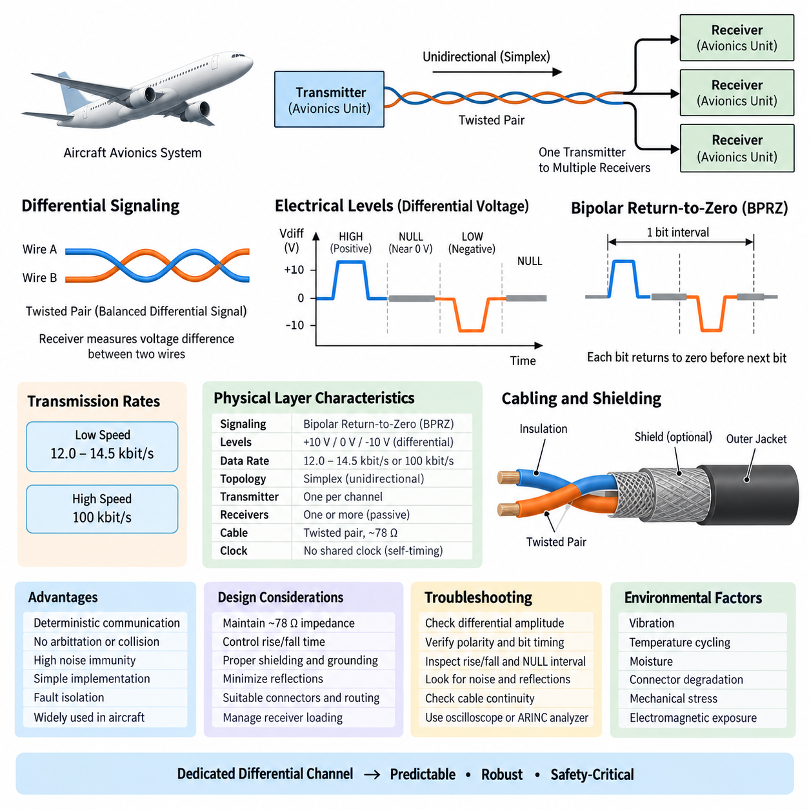
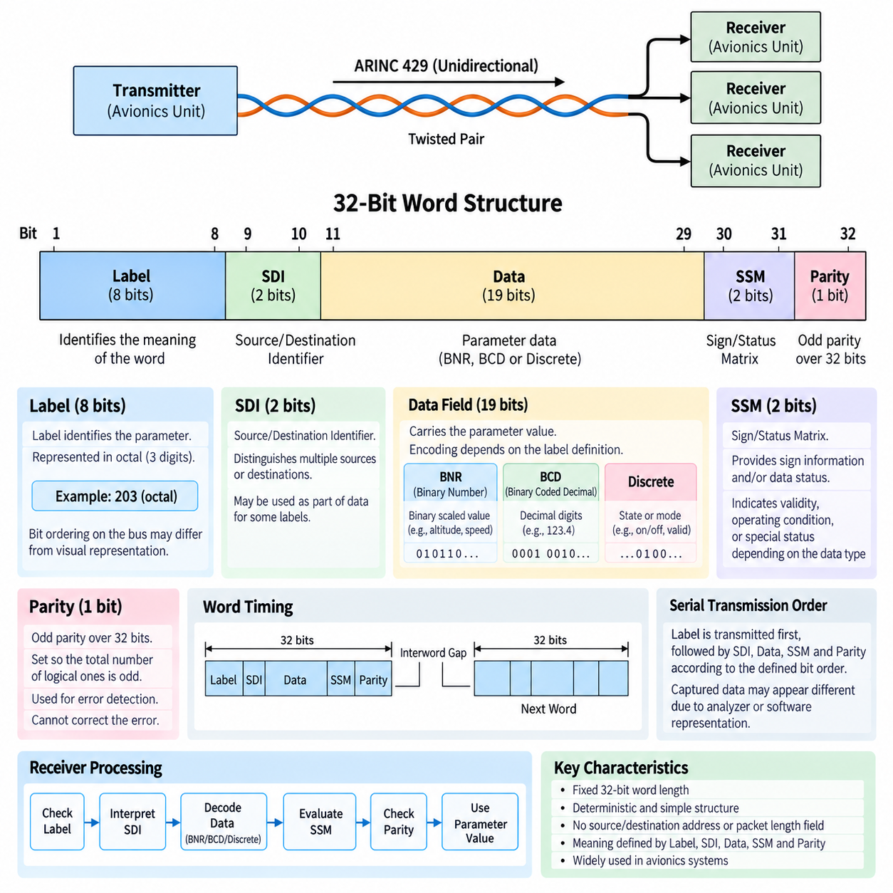
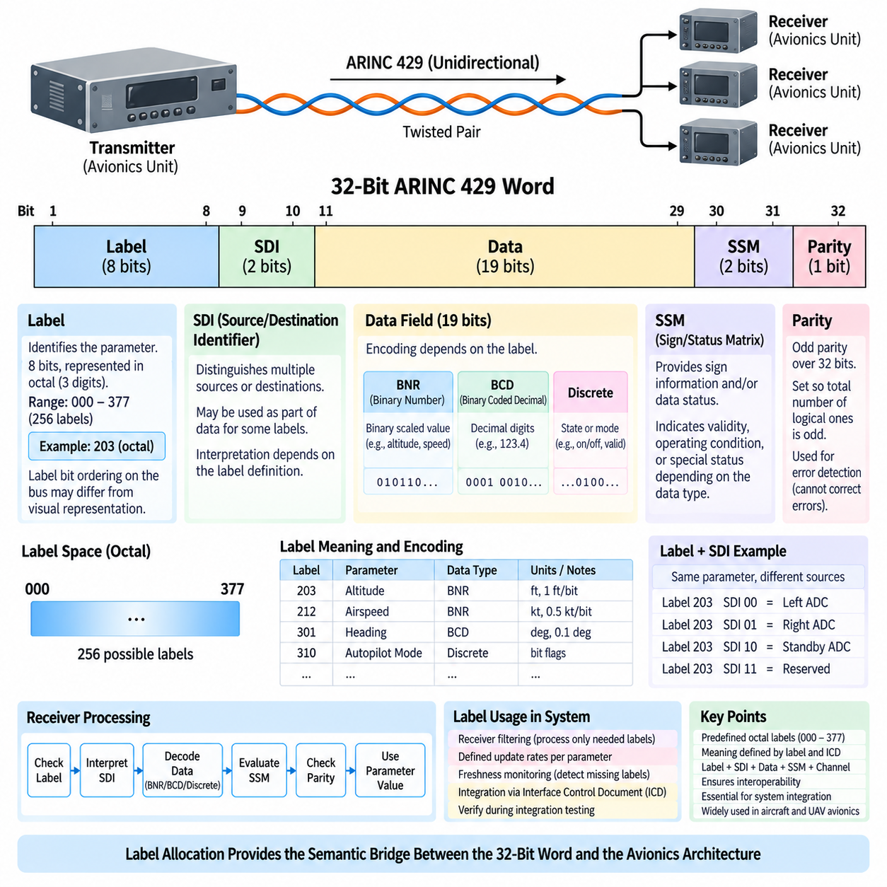
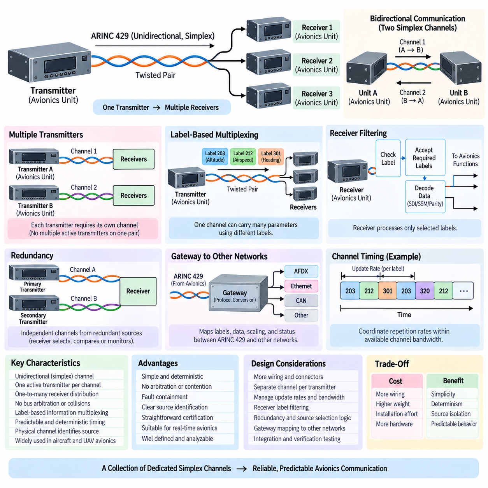
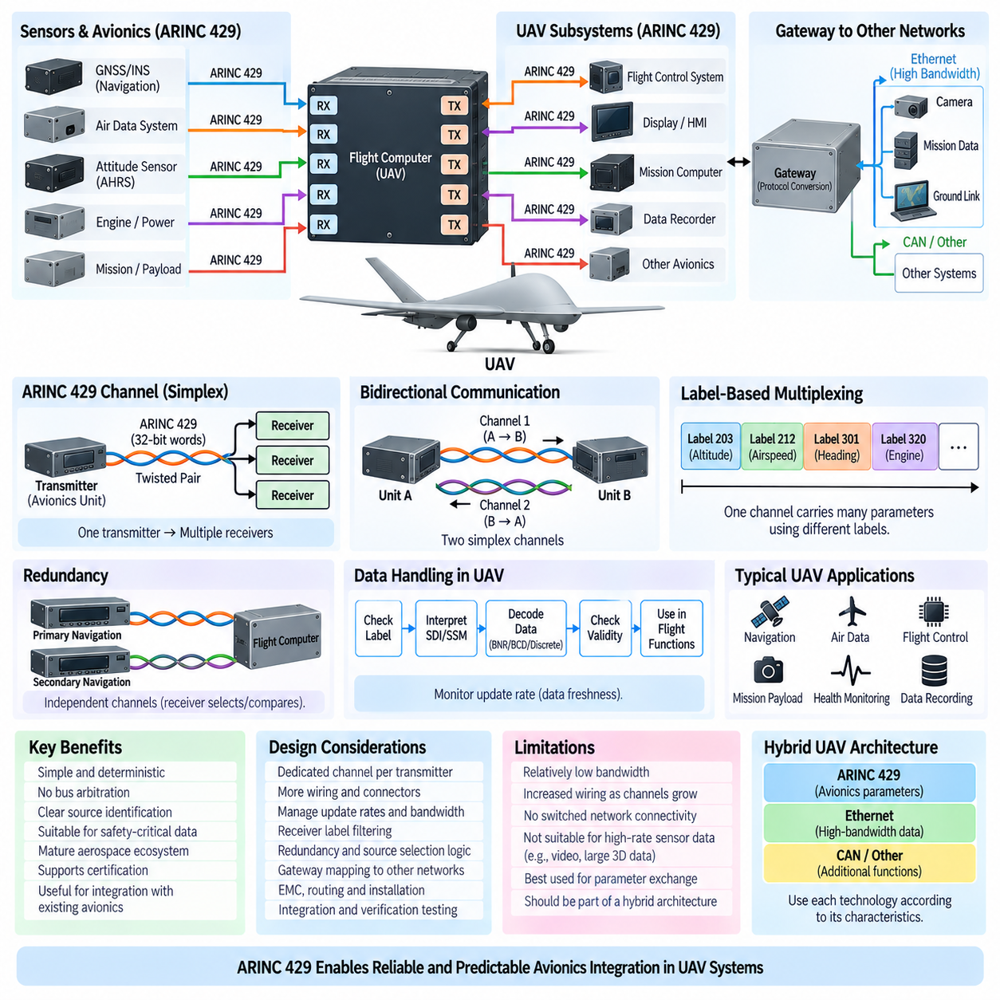

**Volume 08. Railway and Aerospace Protocols**

# Chapter 07. ARINC 429

## 07.01. ARINC 429 Physical Layer

{width="7.268055555555556in" height="7.268055555555556in"}

ARINC 429 defines a simple, deterministic physical communication layer widely used in commercial and transport aircraft avionics. Its physical layer is based on unidirectional point-to-point transmission, where one transmitter sends information to one or more receivers. This architecture minimizes contention and eliminates the need for arbitration, providing predictable communication behavior suitable for safety-critical avionics systems.

The electrical interface uses a balanced differential signal carried over a twisted pair of wires. Instead of interpreting the voltage on either conductor independently, the receiver measures the voltage difference between the two conductors. Differential signaling improves resistance to electromagnetic interference because noise coupled similarly onto both wires tends to appear as common-mode disturbance and can therefore be rejected by the receiver.

ARINC 429 signaling uses three electrical states commonly described as HIGH, NULL, and LOW. A HIGH state represents one polarity of differential voltage, while a LOW state represents the opposite polarity. The NULL state places the differential voltage near zero and separates transmitted pulses. This three-level return-to-zero behavior provides clear transitions that help receivers distinguish individual bits without requiring a separate clock line.

The nominal differential output magnitude for the HIGH and LOW states is approximately 10 V, with opposite polarity determining the logical state. The NULL condition is centered near 0 V differential. Practical transmitters and receivers operate within specified voltage tolerances rather than at ideal values, allowing the network to remain reliable despite cable losses, component variation, temperature changes, and electrical disturbances within the aircraft.

ARINC 429 uses bipolar return-to-zero modulation, often abbreviated as BPRZ. During each bit interval, the transmitter first drives the differential pair toward the positive or negative signaling level and then returns toward the NULL region before the next bit begins. This deliberate return to zero produces regular electrical transitions and supports receiver timing recovery while maintaining a relatively straightforward transmitter and receiver implementation.

Two standard transmission rates are commonly associated with ARINC 429: low speed operation in the range of approximately 12.0 to 14.5 kbit/s and high speed operation at 100 kbit/s. Equipment connected to a particular bus must use a compatible data rate. The relatively modest bandwidth reflects the protocol\'s original avionics environment, where deterministic delivery, electrical robustness, and certification simplicity were more important than high data throughput.

The physical topology is fundamentally simplex. A transmitter communicates outward along its dedicated pair, but receivers do not respond on the same wires. If two avionics units must exchange information in both directions, separate ARINC 429 channels are normally required, with each unit acting as a transmitter on one channel and a receiver on another. This separation avoids collisions and makes communication direction physically explicit.

A single transmitter can normally distribute the same information to multiple receiving devices connected to its output. This allows sensor or avionics data to be shared without introducing a multidrop arbitration mechanism. The transmitter remains the only active source on the pair, while attached receivers behave as listeners. Consequently, adding receivers changes the electrical loading but does not introduce message collisions or competing transmitters.

Twisted-pair cabling is essential to the physical-layer design because it helps maintain electromagnetic compatibility in electrically noisy aircraft environments. The conductors are arranged so that external electromagnetic fields tend to induce similar disturbances in both wires. Combined with differential reception, this substantially reduces sensitivity to common-mode interference generated by motors, power converters, radios, switching circuits, and other onboard equipment.

Cable shielding may additionally be employed to reduce electromagnetic coupling between the ARINC 429 channel and neighboring aircraft wiring. Shield termination, grounding practice, connector design, harness routing, and separation from high-energy conductors therefore become important implementation considerations. The protocol may be electrically robust, but installation engineering still determines whether that robustness is preserved throughout the complete avionics wiring system.

Characteristic impedance is another important physical-layer consideration. ARINC 429 installations are generally designed around twisted-pair cable with an impedance near the range specified for the interface, commonly associated with approximately 78 Ω nominal cable characteristics. Maintaining suitable impedance and controlling discontinuities at connectors, splices, and branches helps limit reflections and preserves waveform quality, particularly on high-speed channels.

The transmitter output characteristics are deliberately controlled so that voltage amplitude and transition behavior remain compatible with the receiver requirements. Excessively fast edges can increase electromagnetic emissions and ringing, while excessively slow transitions can reduce timing margin. ARINC 429 therefore treats rise and fall behavior as part of the electrical interface rather than assuming that any waveform reaching the correct voltage level is automatically acceptable.

Receiver circuitry must reliably distinguish HIGH, LOW, and NULL regions while tolerating attenuation and electrical noise. Differential threshold detection allows the receiver to determine signal polarity without reacting excessively to small disturbances around zero. Because receivers are passive participants in bus access, their main physical-layer responsibilities are signal detection, electrical loading control, noise rejection, and faithful conversion of the incoming waveform into digital bit information.

The absence of a shared clock is significant. Timing information is derived from the known bit rate and the transitions produced by the return-to-zero waveform. Each receiver uses its local timing circuitry to sample the incoming signal within the expected bit intervals. Reliable communication therefore depends on controlled transmitter timing, receiver tolerance, waveform shape, and oscillator accuracy rather than on distribution of an additional clock signal through the harness.

From an avionics architecture perspective, the physical layer favors isolation over network efficiency. Dedicated transmitter channels require more wiring than modern switched networks, but they also create easily understood communication boundaries. A failure or abnormal transmission on one ARINC 429 pair does not inherently create contention across unrelated channels. This property contributes to fault containment and simplifies analysis of communication dependencies between avionics equipment.

Physical-layer troubleshooting consequently begins with electrical measurements rather than interpretation of higher-level information. Engineers can examine differential amplitude, polarity, bit timing, rise and fall characteristics, NULL intervals, noise, reflections, and continuity of the twisted pair. An oscilloscope or dedicated ARINC interface analyzer can reveal whether communication problems originate in the transmitter, harness, connector, receiver loading, grounding, or signal integrity.

Harness design must also account for the aerospace environment over the complete service life of the aircraft. Vibration, temperature cycling, moisture, connector degradation, mechanical stress, maintenance activity, and electromagnetic exposure can gradually alter electrical performance. Appropriate aerospace-grade wiring, connectors, shielding, strain relief, routing, and inspection practices therefore complement the protocol specification and preserve communication integrity under operational conditions.

ARINC 429 demonstrates how deterministic behavior can emerge partly from physical architecture rather than from sophisticated network scheduling. Since only one transmitter is permitted on a channel, there is no collision detection, token passing, or dynamic arbitration at the physical interface. Predictability is obtained by restricting connectivity and communication direction, trading wiring efficiency and bandwidth for simplicity, isolation, and highly analyzable behavior.

This design philosophy provides an important foundation for the later ARINC 429 topics of word structure, label allocation, bus architecture, and UAV avionics integration defined in the surrounding chapter structure. The physical layer establishes the electrical channel on which those mechanisms depend: a dedicated differential twisted pair, controlled bipolar signaling, defined transmission rates, simplex communication, and predictable transmitter-to-receiver connectivity.

## 07.02. ARINC 429 Word Structure

{width="7.268055555555556in" height="7.268055555555556in"}

ARINC 429 organizes transmitted information into fixed-length 32-bit words, creating a compact and highly predictable data format for avionics communication. Every word occupies the same number of bit positions regardless of the parameter being transmitted. This fixed structure simplifies transmitter and receiver implementation and supports deterministic processing in flight-control, navigation, sensor, display, and aircraft management equipment.

The 32-bit word is divided into functional fields that describe the identity, source or destination interpretation, data content, status, and integrity of the transmitted information. In conventional notation, bits 1 through 8 form the Label, bits 9 and 10 form the Source/Destination Identifier, bits 11 through 29 normally carry data, bits 30 and 31 provide the Sign/Status Matrix, and bit 32 provides parity.

The Label is an 8-bit field used to identify the meaning of the information contained in the word. Rather than transmitting a long textual parameter name, ARINC 429 assigns labels to particular categories of avionics data. A receiver examines the label to determine whether the word contains information that it requires and how the remaining data field should be interpreted.

ARINC 429 labels are traditionally represented using octal notation, allowing the eight label bits to be written compactly as a three-digit value. One implementation detail that frequently causes confusion is the transmission and display ordering of label bits. Engineers must distinguish between the logical representation of a label and the actual serial bit sequence observed on the communication channel when analyzing captured bus traffic.

Bits 9 and 10 contain the Source/Destination Identifier, commonly abbreviated SDI. Depending on the definition of a particular label, these bits may distinguish between multiple sources producing similar information or identify the intended interpretation for different destinations. In other applications, the SDI positions may be incorporated into the data representation when separate source or destination identification is unnecessary.

The principal information field normally occupies bits 11 through 29, providing nineteen bit positions for the encoded parameter. The exact interpretation depends on the label and associated data format. ARINC 429 therefore separates transport structure from parameter meaning: the physical word always contains 32 bits, while the semantic interpretation of its data field depends on predefined conventions shared by transmitting and receiving equipment.

Binary Number Representation, commonly called BNR, is frequently used for continuously varying numerical quantities. In BNR encoding, selected data bits represent a binary-scaled numerical value associated with an engineering parameter such as altitude, position, velocity, angle, or another measured quantity. Resolution and range are determined by the parameter definition rather than by assuming that every BNR word uses an identical numerical scale.

Binary Coded Decimal, or BCD, provides another important ARINC 429 representation. BCD organizes numerical information as decimal digits encoded using groups of binary bits. Although this representation is less bit-efficient than pure binary encoding, it can be convenient for parameters naturally expressed as decimal values and for avionics equipment that must preserve a direct relationship between transmitted values and displayed decimal information.

Some ARINC 429 words use discrete data rather than BNR or BCD numerical values. Individual bits or groups of bits can indicate states such as enabled or disabled, valid or invalid, selected modes, equipment conditions, warnings, or control states. Consequently, understanding the 32-bit layout alone is insufficient; the receiver must know the specific label definition and encoding assigned to the data bits.

Bits 30 and 31 form the Sign/Status Matrix, usually abbreviated SSM. Their interpretation depends on the type of information carried by the word. For numerical data, these bits may convey sign information together with status semantics, while other formats may use them primarily to indicate operating or validity conditions. The SSM therefore adds contextual information that helps a receiver evaluate the transmitted data.

Status information is particularly important in avionics because receiving a correctly formatted electrical word does not necessarily mean that its parameter should be trusted. Equipment may be unable to produce valid information because of initialization, detected faults, unavailable sensor inputs, or abnormal operating conditions. Appropriate SSM interpretation enables receiving systems to distinguish usable information from data associated with an invalid or degraded source condition.

Bit 32 is the parity bit and provides a basic mechanism for detecting transmission errors. ARINC 429 conventionally uses odd parity across the complete 32-bit word. The transmitter sets bit 32 so that the total number of logical ones in the word is odd. The receiver independently evaluates parity and can reject or flag a word when the received bit pattern does not satisfy the expected parity condition.

Parity provides simple error detection but does not constitute a comprehensive error-correction mechanism. It can identify many single-bit corruption events but cannot determine which bit is incorrect or repair the damaged word. It also cannot detect every possible multi-bit error pattern. Its value lies in providing a low-complexity integrity check consistent with ARINC 429\'s philosophy of simple, deterministic avionics communication.

Serial transmission order is an important implementation consideration because ARINC 429 fields are not necessarily perceived in the same visual order in which engineers write a 32-bit word on paper. The label is transmitted first, followed by the remaining portions of the word according to the defined bit ordering. Bus analyzers and software drivers therefore often perform transformations that can make captured data appear different from the raw serial sequence.

The fixed word length also contributes to predictable timing. At a known ARINC 429 transmission rate, the duration required to place 32 bits on the channel can be determined directly, while an interword gap separates successive words. This allows avionics designers to reason about update periods, bus utilization, transmitter scheduling, and receiver processing without requiring variable-length packet parsing or complex frame negotiation.

Unlike modern packet networks, an ARINC 429 word does not contain conventional source and destination addresses, packet-length fields, protocol identifiers, or large error-checking sequences. Much of the communication meaning is established through the combination of the physical channel, transmitter identity, Label, SDI, predefined data encoding, and SSM. The resulting word remains compact while depending strongly on controlled system integration.

Receiver software normally begins processing by identifying the Label and determining whether the associated parameter is relevant. It then applies the appropriate interpretation to SDI, extracts the data field using the expected BNR, BCD, or discrete representation, evaluates the SSM, and checks parity. The resulting engineering value can then be supplied to navigation, flight-control, display, monitoring, or other avionics functions.

Correct decoding therefore requires agreement between interface specifications and actual implementation. Two devices may both support ARINC 429 electrically yet still fail to exchange meaningful information if they disagree about labels, scaling, SDI usage, bit assignments, update rates, or status interpretation. Integration testing must consequently verify semantic compatibility in addition to confirming that valid 32-bit electrical words appear on the bus.

From a system-design perspective, the ARINC 429 word structure illustrates a central principle of traditional avionics networking: keep the transmitted unit small, fixed, and deterministic while defining parameter semantics through controlled interface specifications. Label, SDI, Data, SSM, and Parity collectively transform a simple serial bit stream into information that can be identified, interpreted, qualified, and checked by receiving avionics equipment.

This word organization forms the logical foundation for the following topics of ARINC 429 label allocation, bus architecture, and UAV avionics integration in the chapter structure. The physical layer determines how electrical bits travel across the dedicated differential channel, while the 32-bit word structure determines how those bits become meaningful avionics information before higher-level system integration is considered.

## 07.03. ARINC 429 Label Allocation

{width="7.268055555555556in" height="7.268055555555556in"}

ARINC 429 label allocation provides the identification mechanism that allows receiving avionics equipment to determine the meaning of each transmitted 32-bit word. The Label occupies bits 1 through 8 and acts as the primary parameter identifier. Instead of carrying descriptive names within every transmission, avionics systems use predefined numeric labels that associate compact binary patterns with specific categories of aircraft information.

Labels are conventionally represented as three-digit octal numbers because an 8-bit field can be expressed conveniently using octal notation. The available label space extends from octal 000 through 377, corresponding to 256 possible 8-bit combinations. Engineers therefore commonly refer to an ARINC 429 parameter by its octal label rather than by writing the complete binary representation used internally by the transmitter and receiver.

A label does more than identify a generic data type. Its interpretation is established within the context of the avionics equipment and associated interface specification. A receiving unit uses the label to decide whether a word is relevant and then applies the appropriate decoding rules. Those rules determine how the Data field, SDI bits, SSM bits, scaling, resolution, and validity information must be interpreted.

Label allocation consequently creates a logical interface between independently developed avionics units. A navigation computer, air-data system, flight-control computer, display unit, or other subsystem can exchange information reliably only when both sides agree on the semantic definition associated with each label. Electrical compatibility alone cannot guarantee interoperability because an electrically valid ARINC 429 word may still be interpreted incorrectly when label definitions differ.

The Source/Destination Identifier, or SDI, in bits 9 and 10 can extend the identification provided by the Label. When several sources generate the same category of information, SDI may distinguish between them. In other applications it may indicate a destination or installation-specific interpretation. The effective identity of transmitted information can therefore depend on the combination of Label, SDI, physical channel, and transmitting equipment.

This relationship is especially useful when similar sensors or redundant avionics channels exist within the same aircraft. Multiple navigation sources, air-data sources, inertial systems, or other redundant units may provide related parameters. The receiving system must know not only what the parameter represents but also which source produced it. Label and SDI interpretation can support this distinction while retaining the compact 32-bit word structure.

Label allocation is closely connected to data encoding. After recognizing a label, the receiver determines whether the associated information uses Binary Number Representation, Binary Coded Decimal, discrete states, or another defined interpretation. The label therefore acts as an entry point into a decoding definition rather than merely serving as a numerical name attached to a word.

For BNR parameters, the label definition must be associated with information such as numerical range, scaling, resolution, and engineering units. The same binary pattern in the Data field could represent very different physical quantities if interpreted under different definitions. Correct label allocation ensures that a receiver converts the transmitted binary value into the intended altitude, velocity, angle, position, or other engineering parameter.

BCD-oriented labels similarly require an agreed interpretation of decimal digits and their positions. Discrete labels require definitions for individual status or control bits. A particular bit might indicate availability, selection, engagement, warning, or another equipment state. Consequently, interface documentation must define not only which label is transmitted but also the detailed meaning of the bits associated with that label.

The Sign/Status Matrix, or SSM, must also be interpreted according to the data type associated with the label. Bits 30 and 31 can convey sign or operating-status information, but their exact semantics depend on the applicable word definition. Label allocation therefore indirectly determines how the receiver interprets the SSM and whether the received parameter represents normal, invalid, degraded, or otherwise qualified information.

One implementation detail requiring particular care is ARINC 429 label bit ordering. Although labels are normally written as octal numbers for engineering convenience, the label bits have a defined serial transmission behavior that can appear reversed when compared with conventional binary notation. Bus analyzers and interface devices may display labels in decoded octal form, while low-level captures can expose the actual transmitted bit sequence.

This difference can create integration errors when software developers manually construct or decode ARINC 429 words. A label that appears correct in an interface control document may produce an unexpected value if its bits are inserted into a transmit register using the wrong ordering convention. Driver documentation and hardware behavior must therefore be checked carefully whenever software operates directly on raw ARINC 429 words.

Label allocation also affects receiver filtering. An avionics unit normally requires only a subset of all words appearing on an input channel. Hardware or software can inspect incoming labels and retain only parameters relevant to the receiving function. This filtering reduces unnecessary processing and provides a straightforward mapping between incoming communication and internal application variables used by navigation, control, monitoring, or display functions.

Transmitters commonly send different labels at different repetition rates according to how rapidly the associated information changes and how quickly receivers require updates. Although the label itself does not encode the update period, the interface definition associates each parameter with expected transmission behavior. Label management therefore becomes connected to bus scheduling, bandwidth utilization, latency requirements, and freshness monitoring within the receiving equipment.

A receiver may use expected label repetition to detect communication abnormalities. If a required label stops arriving within its specified update interval, the receiver can treat the associated parameter as stale or unavailable even if the last received word contained valid data. Thus, reliable avionics integration depends on both the semantic meaning of a label and the temporal behavior assigned to that labeled information.

Aircraft integration requires disciplined control of label definitions because different avionics suppliers may implement equipment independently. Interface Control Documents, commonly called ICDs, are therefore essential for specifying which labels are transmitted and received, how SDI is used, how data bits are encoded, what engineering units and scaling apply, how SSM is interpreted, and what update rates are expected.

During integration testing, engineers verify that the transmitted labels match these interface definitions. Bus monitoring equipment can capture ARINC 429 traffic and display labels together with data, SDI, SSM, parity, and timing information. Comparing observed traffic with the intended interface specification helps identify incorrect label assignments, bit ordering problems, scaling mismatches, missing parameters, unexpected repetition rates, and invalid status conditions.

Label allocation also supports architectural separation in complex avionics systems. Because each dedicated ARINC 429 channel has a known transmitter and the words on that channel have controlled labels, the combination of physical connectivity and logical identification creates a highly explicit information flow. Engineers can trace a parameter from its originating avionics unit through a defined channel and label to each receiving function that consumes it.

This approach differs substantially from modern self-describing network protocols. An ARINC 429 word does not carry a textual parameter description or a rich schema that allows a receiver to discover its meaning dynamically. Meaning is established before operation through controlled engineering definitions. The resulting communication format remains small and deterministic, but configuration management and interface documentation become critical parts of system correctness.

In UAV and other modern avionics architectures, the same principle remains valuable when ARINC 429 is used to integrate legacy or certified subsystems with newer computing platforms. A gateway or flight computer must preserve label meaning while converting information between ARINC 429 and internal software interfaces or newer networks. Incorrect mapping can preserve the electrical data while corrupting its system-level meaning.

ARINC 429 label allocation therefore provides the semantic bridge between the fixed 32-bit word structure and the larger avionics architecture. The Label identifies the parameter family, while SDI, Data, SSM, physical channel identity, encoding rules, and timing complete its interpretation. Together these controlled definitions allow simple serial words to represent dependable aircraft information across independently implemented avionics equipment.

Within the attached volume structure, this topic follows the ARINC 429 physical layer and word structure and precedes bus architecture and UAV avionics integration. This sequence reflects the natural progression from transmitting electrical signals, to organizing them into 32-bit words, to assigning meaning through labels, and finally to connecting multiple avionics functions into a complete communication architecture.

## 07.04. ARINC 429 Bus Architecture

{width="7.268055555555556in" height="7.268055555555556in"}

ARINC 429 bus architecture is built around a simple unidirectional communication model in which one avionics transmitter sends data to one or more receivers over a dedicated channel. Unlike shared multidrop buses with multiple competing transmitters, an ARINC 429 channel permits only one active transmitter. This fundamental restriction eliminates bus arbitration and makes communication behavior highly predictable for avionics applications.

Each ARINC 429 communication channel uses a dedicated twisted pair carrying the differential electrical signaling defined by the physical layer. The transmitter continuously or periodically places 32-bit ARINC words onto this pair according to the required update rates. Connected receivers monitor the same transmitted information without attempting to transmit responses on the channel, preserving the simplex nature of the architecture.

A transmitter can normally distribute its information to multiple receivers, creating a one-to-many communication relationship. This capability is useful when several avionics functions require the same sensor or subsystem data. For example, information generated by a navigation or air-data system may be consumed simultaneously by flight-control, display, monitoring, and recording equipment without requiring each receiver to establish an independent communication session.

Although multiple receivers may listen to one transmitter, multiple transmitters cannot share the same ARINC 429 pair as active sources. If several avionics units need to transmit information, each transmitting source generally requires its own output channel. Consequently, a complex aircraft may contain many separate ARINC 429 links. Wiring increases, but communication ownership and the origin of information remain physically explicit.

Bidirectional communication between two avionics units requires two independent simplex channels. One twisted pair carries data from unit A to unit B, while another pair carries information from unit B to unit A. This differs from a conventional full-duplex network interface because each ARINC 429 direction remains an independently defined transmitter channel with its own electrical connection, word scheduling, labels, and receiver behavior.

The absence of arbitration is one of the most important architectural characteristics of ARINC 429. Since only one transmitter controls each channel, devices never compete for access to the communication medium. There are no collisions, contention windows, token mechanisms, or dynamic priorities. The timing behavior of a channel therefore depends primarily on the transmitter\'s configured word sequence, repetition rates, data rate, and interword spacing.

Information multiplexing occurs through ARINC 429 labels rather than through multiple transmitters sharing the physical medium. A single transmitter can repeatedly send many different parameters on one output pair by transmitting words with different labels. Receivers examine the label of each incoming 32-bit word and process only the parameters relevant to their functions, allowing one physical channel to carry multiple logical information flows.

The transmission schedule must account for the update requirements of these different labels. Rapidly changing or control-relevant parameters may require frequent transmission, while slowly changing information can be sent less often. Because the available channel bandwidth is finite, avionics designers must coordinate word repetition rates so that required parameters remain sufficiently fresh without overloading the transmitter\'s available communication capacity.

Receiver filtering is therefore an important part of bus integration. A receiving avionics unit may physically observe every word transmitted on a connected channel but only accept a defined subset of labels. Hardware interfaces, device drivers, or application software can perform this filtering. The selected words are then decoded according to their Label, SDI, Data, SSM, and Parity definitions before being delivered to the consuming function.

The physical channel itself also contributes to source identification. Because a particular ARINC 429 input is wired to a known transmitter output, the receiving system already has architectural knowledge about the origin of the arriving information. Label and SDI provide additional logical identification. This combination of fixed wiring and controlled word definitions makes data provenance relatively straightforward to analyze during design, verification, and fault investigation.

Redundancy can be implemented by providing independent channels from redundant avionics sources. For example, two functionally similar sensors or computers may each have separate ARINC 429 outputs connected to a receiving system. The receiver can then select, compare, or monitor those sources according to system requirements. Physical channel separation helps prevent a communication failure in one source path from directly corrupting another independent path.

This redundancy does not automatically determine how source selection should occur. The receiving application must use system-level logic together with channel identity, SDI, SSM, data validity, freshness, and equipment health information. ARINC 429 provides the communication paths and status mechanisms, while the avionics architecture defines how redundant information is compared and which source is accepted under normal or degraded operating conditions.

Gateways become important when ARINC 429 equipment must exchange information with systems using other communication technologies. A gateway receives ARINC 429 words, interprets their labels and data definitions, and maps them into another network or software representation. In the reverse direction, it can obtain information from another system and construct correctly formatted ARINC 429 words for transmission through dedicated output channels.

Gateway design must preserve semantics rather than merely copy raw bits. Label definitions, SDI usage, numerical scaling, engineering units, SSM interpretation, update rates, parity, and source identity all need appropriate mapping. A conversion can be electrically correct while still being functionally incorrect if the meaning or timing of a parameter changes during translation between ARINC 429 and another avionics communication architecture.

Fault containment is a major benefit of the dedicated-channel architecture. A malfunctioning receiver normally cannot seize the channel because it is not an authorized transmitter on that pair. Likewise, a transmitter fault is primarily associated with the channels driven by that transmitter rather than with a shared multi-master communication medium. This physical separation makes communication failure propagation comparatively easy to reason about.

However, dedicated wiring also creates architectural costs. As the number of avionics units and exchanged signals increases, the number of transmitter outputs, receiver inputs, twisted pairs, connector contacts, and harness routes can grow substantially. Aircraft weight, installation complexity, maintenance effort, and interface hardware requirements therefore increase, which is one reason newer aircraft architectures employ higher-bandwidth switched networking technologies for large-scale data exchange.

ARINC 429 nevertheless remains useful where moderate bandwidth, predictable communication, straightforward certification evidence, and compatibility with established avionics equipment are more important than network efficiency. Its architecture is especially appropriate for relatively compact parameter exchanges between known endpoints. The physical topology itself documents much of the communication relationship, reducing dependence on dynamic network discovery or complex runtime configuration.

Integration engineering typically begins by constructing a channel-level interface definition. Engineers identify each transmitter, its physical ARINC 429 output, connected receivers, transmitted labels, expected repetition rates, data encoding, SDI usage, SSM behavior, and electrical speed. This information is commonly controlled through interface documentation so that wiring design, software configuration, verification, and equipment integration share the same communication definition.

Bus testing then verifies both physical connectivity and logical behavior. Engineers can monitor individual channels with ARINC 429 analyzers to confirm expected labels, word values, parity, status, repetition intervals, and signal quality. Missing labels may indicate transmitter configuration or wiring problems, while unexpected values can result from incorrect scaling, source selection, SDI interpretation, or interface mapping rather than from an electrical failure.

From a system perspective, ARINC 429 can therefore be viewed as a collection of controlled simplex information channels rather than one shared aircraft-wide bus. Each transmitter establishes one or more dedicated data paths, and each path distributes predefined labeled information to selected receivers. Larger avionics architectures emerge by interconnecting many of these individually simple communication relationships through equipment and gateways.

For UAV avionics, this architecture can provide a practical interface to certified sensors, navigation equipment, air-data systems, mission equipment, or other aerospace subsystems that expose ARINC 429 interfaces. A modern flight computer may contain several ARINC 429 transmit and receive channels while internally using faster computing and networking technologies, allowing established aerospace interfaces to coexist with newer avionics processing architectures.

The principal design trade-off is therefore clear: ARINC 429 exchanges wiring and bandwidth efficiency for simplicity, determinism, source isolation, and analyzable information flow. Dedicated transmitters, simplex channels, receiver fan-out, label-based multiplexing, controlled update rates, and independent redundant paths collectively produce an architecture whose behavior can be understood from both its physical wiring and its predefined interface definitions.

Within the attached chapter structure, ARINC 429 bus architecture follows the physical layer, 32-bit word structure, and label allocation, and it precedes ARINC 429 integration in UAV avionics. This progression connects electrical signaling, data organization, semantic identification, and system topology before examining how these elements can be incorporated into a complete UAV avionics system.

## 07.05. ARINC 429 in UAV Avionics

sㄴㄴ{width="7.268055555555556in" height="7.268055555555556in"}

ARINC 429 can serve as a practical avionics interface in unmanned aerial vehicles when flight-critical or aerospace-qualified equipment must exchange relatively low-bandwidth, deterministic parameter data. Within a UAV, it may connect flight computers, navigation equipment, air-data systems, sensors, mission computers, or specialized payload equipment while preserving the simple communication principles established in conventional aircraft avionics.

The basic UAV implementation retains the ARINC 429 simplex architecture. One transmitter sends 32-bit words through a dedicated differential twisted pair to one or more receivers. A UAV flight computer may therefore contain several independent transmit and receive channels, with each physical channel assigned to a specific equipment relationship. Bidirectional exchange requires separate channels for the two communication directions.

Navigation is a natural application area because UAV guidance depends on continuously available position, velocity, altitude, heading, and related state information. Aerospace navigation equipment exposing ARINC 429 outputs can provide these parameters to the flight-control computer through predefined labels. The receiving computer decodes each word according to its Label, SDI, Data, SSM, and Parity definitions before incorporating the information into navigation functions.

Air-data information can be integrated in a similar manner. Measurements or computed parameters associated with altitude, airspeed, pressure, temperature, and other flight conditions can be transmitted from suitable avionics equipment to the flight-control system. The deterministic label-based interface allows the receiving software to associate each incoming parameter with a defined engineering quantity, scaling convention, validity state, and expected update behavior.

ARINC 429 can also connect mission and payload subsystems when those devices provide compatible aerospace interfaces. A cargo UAV, for example, may contain mission equipment whose status or commands must be exchanged with a central avionics computer. The relatively simple word structure is suitable for discrete states, numerical measurements, equipment conditions, operating modes, and other compact information that does not require high-bandwidth streaming.

The protocol is less appropriate for bandwidth-intensive UAV sensors such as high-resolution cameras, imaging radar, or large three-dimensional sensing streams. Such information generally requires faster network technologies. ARINC 429 is therefore best understood as one component of a heterogeneous UAV communication architecture rather than as the sole onboard network, particularly when modern perception, autonomy, and mission-computing systems are involved.

A practical UAV may consequently combine ARINC 429 with Ethernet-based networks and other embedded communication interfaces. ARINC 429 can remain responsible for established avionics parameter exchange, while higher-bandwidth networks carry images, maps, perception results, mission databases, diagnostics, or autonomy-related data. This division allows each communication technology to be used according to its electrical, timing, bandwidth, and integration characteristics.

Gateways provide the bridge between these communication domains. A gateway or flight computer equipped with ARINC 429 interfaces receives labeled words and converts their contents into internal software messages or another network representation. In the opposite direction, internal UAV information can be converted into correctly formatted ARINC 429 words and transmitted to equipment that expects the traditional aerospace interface.

Correct gateway operation requires semantic mapping rather than simple bit forwarding. The gateway must preserve the meaning of labels, SDI interpretation, BNR or BCD scaling, discrete bit definitions, SSM status, parity behavior, source identity, and update timing. If a parameter is translated to another communication system, its engineering meaning and validity conditions must remain consistent across both sides of the interface.

Redundant UAV avionics can benefit from ARINC 429\'s physically separated channels. Two navigation units, sensors, or computers can provide independent outputs to the flight-control system. The receiver can compare or select these sources according to system-level redundancy logic. A fault affecting one transmitter channel does not inherently create contention on another channel because each ARINC 429 link has a dedicated transmitting source.

Source selection must nevertheless be implemented above the physical communication mechanism. The flight-control system may consider physical channel identity, SDI, SSM, parameter plausibility, update freshness, and equipment health before accepting information. ARINC 429 supplies predictable communication and status information, but the UAV architecture must define how conflicting or degraded redundant sources are managed during abnormal operating conditions.

The Sign/Status Matrix is particularly relevant when UAV control functions depend on externally supplied avionics data. Receiving a correctly formatted word does not guarantee that the underlying measurement is valid. Equipment may be initializing, unavailable, degraded, or reporting a fault. The flight software should therefore interpret status information together with the actual data value rather than treating every received parameter as immediately usable.

Data freshness is equally important. Each required label is normally associated with an expected repetition behavior even though the update period is not encoded directly within the label. UAV software can monitor the arrival time of important words and declare a parameter stale when updates stop or exceed an allowed interval. This protects flight functions from continuing to use indefinitely an old value whose last transmitted word was electrically valid.

The fixed 32-bit word and controlled repetition behavior make ARINC 429 communication comparatively easy to analyze. Designers can estimate channel utilization from the selected transmission speed, number of transmitted labels, repetition rates, and interword spacing. This predictability is valuable when defining interfaces for flight-related equipment because timing requirements can be evaluated without dynamic medium access or variable-length network traffic.

Harness engineering remains an important UAV consideration. Each ARINC 429 channel requires its own differential twisted pair, and complex bidirectional or redundant architectures can therefore increase wiring, connector contacts, mass, and installation complexity. These effects become increasingly important for aircraft where weight directly influences payload capacity, endurance, propulsion requirements, and overall mission performance.

Electromagnetic compatibility must also be considered because UAV platforms may contain propulsion motors, inverters, DC/DC converters, radios, high-power payloads, and switching electronics. Appropriate twisted-pair routing, shielding where required, grounding, connector selection, separation from noisy power conductors, and controlled impedance help preserve ARINC 429 signal integrity. The robustness of the protocol still depends on disciplined physical installation.

A cargo UAV can present a particularly heterogeneous avionics environment. Flight-control and navigation functions may coexist with cargo management, health monitoring, mission computing, communications, power management, and autonomous functions. ARINC 429 can provide deterministic interfaces for selected aerospace subsystems, while newer network technologies handle high-volume data and broader system integration. This supports gradual integration of established and modern avionics technologies.

Interface Control Documents are essential when implementing such mixed architectures. For each ARINC 429 channel, the UAV integration definition should identify the transmitter, receivers, labels, SDI usage, data encoding, engineering units, scaling, SSM interpretation, transmission rate, expected repetition interval, and failure behavior. These definitions connect electrical design, software implementation, harness engineering, testing, and system safety analysis.

Verification should confirm both electrical and semantic behavior. Engineers can use ARINC 429 analysis equipment to inspect signal quality, labels, word contents, parity, status, and timing. System-level tests must additionally verify that the UAV software converts received data into the correct engineering quantities, detects missing or invalid information, selects redundant sources correctly, and produces appropriate behavior when communication faults are introduced.

ARINC 429 also offers clear information-flow boundaries that can simplify system reasoning. A dedicated transmitter channel has a known origin and a defined set of labels, making it straightforward to identify which equipment produces a parameter and which functions consume it. Such explicit connectivity can support integration, troubleshooting, configuration management, and safety-oriented analysis in UAV avionics architectures.

Its limitations remain equally important. ARINC 429 provides modest bandwidth, requires additional wiring as the number of channels grows, and lacks the flexible switched connectivity of modern Ethernet-based avionics networks. It should therefore be assigned to interfaces where its deterministic simplex behavior, installed aerospace ecosystem, and straightforward parameter exchange provide meaningful benefits rather than being applied indiscriminately to every UAV data path.

The resulting architecture is hybrid rather than purely legacy or purely network-centric. Traditional aerospace equipment can communicate through dedicated ARINC 429 channels, gateways can translate selected parameters, and modern computing platforms can use faster networks internally for autonomy and high-bandwidth processing. This allows a UAV to preserve established avionics interfaces while incorporating increasingly capable mission and autonomous computing systems.

Within the attached volume structure, ARINC 429 in UAV avionics completes the ARINC 429 chapter after the physical layer, word structure, label allocation, and bus architecture. Together these topics progress from electrical transmission to data formatting, semantic identification, network topology, and finally system integration, before the volume moves to ARINC 664 AFDX and other more advanced critical communication architectures.
