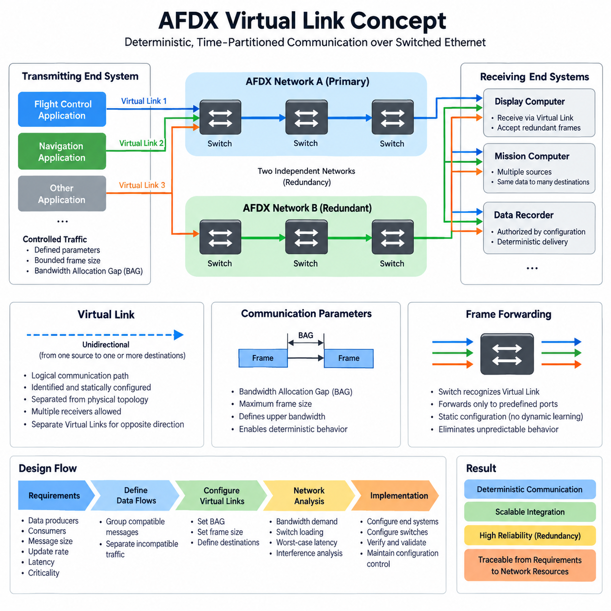
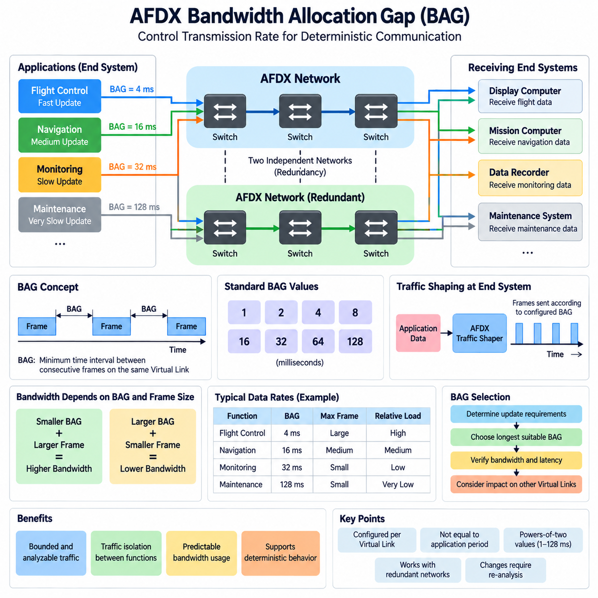
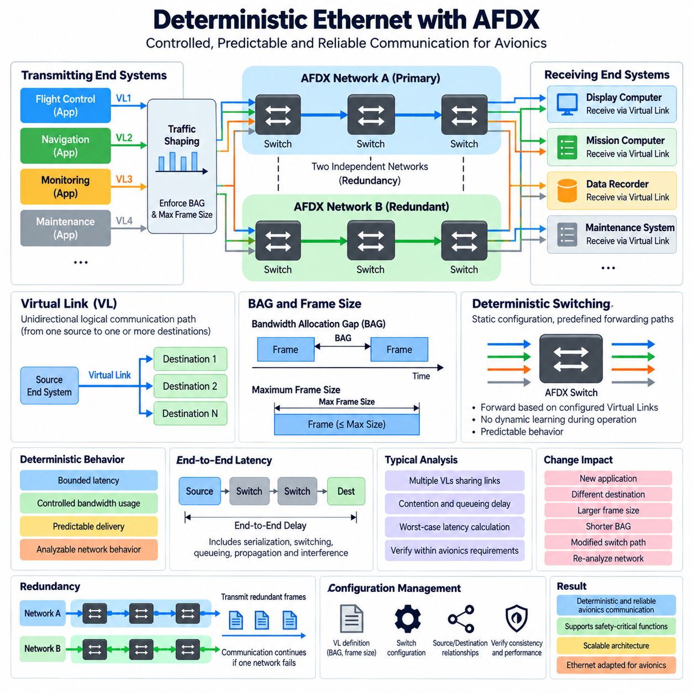
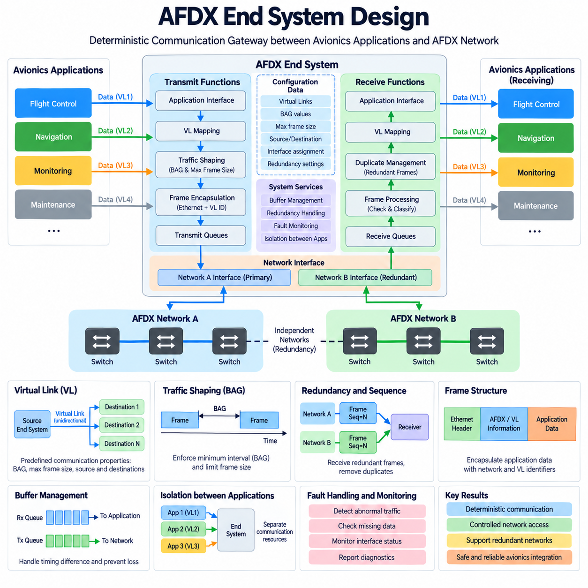
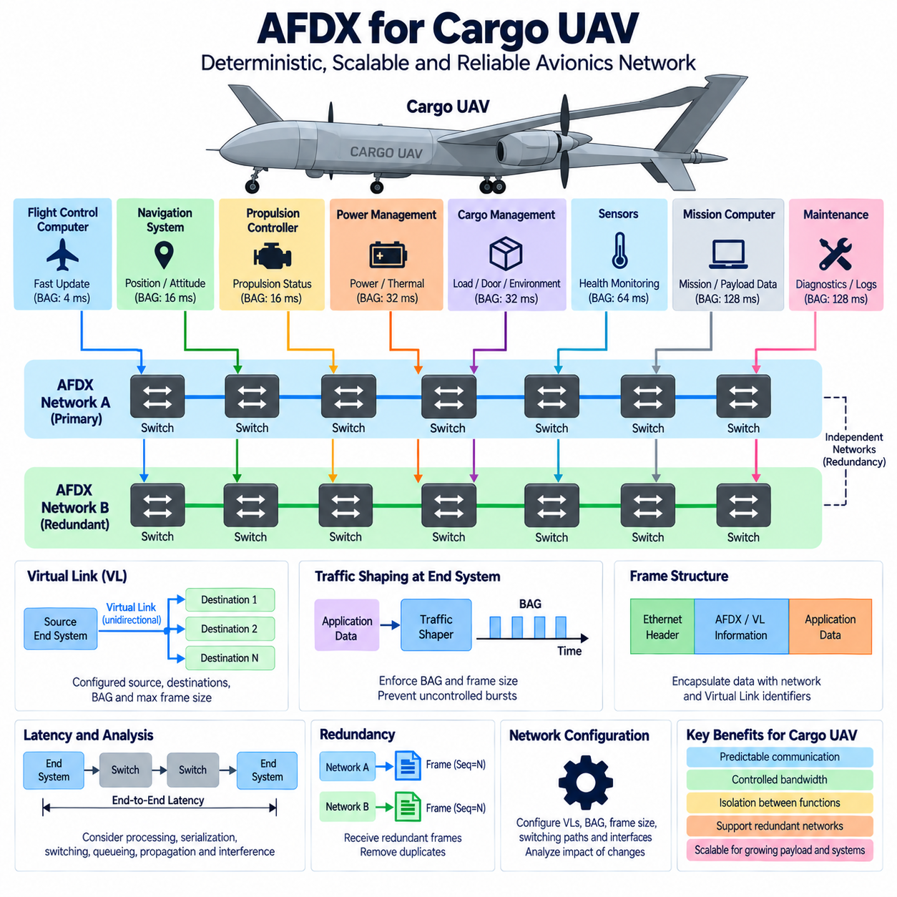

**Volume 08. Railway and Aerospace Protocols**

# Chapter 08. ARINC 664 (AFDX)

## 08.01. AFDX Virtual Link Design

{width="7.268055555555556in" height="7.268055555555556in"}

AFDX uses the Virtual Link as its fundamental mechanism for organizing deterministic communication over a switched Ethernet network. A Virtual Link is a logical, unidirectional communication path originating from one transmitting end system and delivering frames to one or more receiving end systems. This abstraction separates application communication requirements from the physical Ethernet topology.

Unlike conventional Ethernet communication, where applications may generate traffic with relatively few restrictions, an AFDX Virtual Link is configured with predefined communication parameters. Each transmitting application is associated with controlled traffic flows whose maximum transmission behavior is known before operation. This enables network designers to calculate bandwidth demand, switch loading, latency, and interference between competing data flows.

A Virtual Link is identified within the AFDX network so that switches can recognize incoming frames and forward them only through predetermined output ports. The resulting forwarding path is established through static network configuration rather than dynamically learned during aircraft operation. This approach eliminates many sources of unpredictable behavior found in general-purpose Ethernet and supports repeatable communication timing.

AFDX Virtual Links are inherently unidirectional. If two avionics computers must exchange information in both directions, separate Virtual Links are normally configured for each direction. This design simplifies traffic analysis because every Virtual Link has a clearly defined source. Multiple receiving destinations may nevertheless subscribe to the same transmitted flow, allowing one source to distribute identical information efficiently.

The communication contract of a Virtual Link is closely related to the Bandwidth Allocation Gap and the maximum frame size permitted for that link. The Bandwidth Allocation Gap defines the minimum interval governing successive frame transmissions, while the maximum frame size limits the amount of data that may be injected at each opportunity. Together, these parameters establish an upper bound on network bandwidth consumption.

For example, a flight-control computer may transmit aircraft state information through one Virtual Link while a navigation computer transmits position information through another. Although both flows can traverse common physical Ethernet switches and cables, their logical communication properties remain independent. Each flow therefore receives separately engineered bandwidth and forwarding characteristics according to its avionics function.

Virtual Link design begins with communication requirements rather than Ethernet wiring. Engineers identify data producers, required consumers, message sizes, update rates, latency constraints, and criticality characteristics. These requirements are then converted into logical flows. Related application messages may share a Virtual Link when their timing and destination requirements are compatible, while incompatible traffic is separated into different links.

Careful grouping is important because excessive consolidation can make a Virtual Link inefficient or difficult to verify, while excessive fragmentation increases configuration complexity and network-management overhead. The designer therefore balances functional separation against efficient bandwidth utilization. The resulting Virtual Link architecture should preserve clear traceability from avionics requirements to configured network communication resources.

AFDX switches use the configured Virtual Link information to perform deterministic forwarding. Rather than allowing arbitrary communication between connected devices, the network follows predefined paths from each source toward authorized destinations. Switch configuration therefore becomes part of the avionics network definition and must remain consistent with end-system configuration, physical topology, redundancy strategy, and system integration requirements.

Redundancy is another central consideration in Virtual Link design. AFDX commonly employs two physically independent networks, conventionally referred to as Network A and Network B. An end system can transmit redundant copies of a frame across both networks, allowing the receiving side to accept the valid information even if one communication path fails. Sequence information supports duplicate handling at the receiving end.

The deterministic behavior of the network emerges from the combination of Virtual Link traffic shaping, bounded frame sizes, controlled forwarding paths, and engineered switch resources. Network analysis can evaluate the interference that one Virtual Link may experience from other links sharing switch outputs. Designers can consequently estimate worst-case transmission delays rather than relying only on average Ethernet performance.

Virtual Link configuration must be considered as a system-level engineering activity because changes to one flow can influence shared network resources. Increasing a message rate, enlarging the permitted frame size, changing destinations, or introducing another Virtual Link may alter bandwidth utilization and worst-case latency. Configuration control and repeatable network analysis are therefore essential throughout avionics development.

A well-designed AFDX architecture creates a logical communication layer in which applications exchange information through explicitly engineered channels while sharing a common switched Ethernet infrastructure. The Virtual Link provides the bridge between functional avionics data flows and deterministic network behavior, enabling scalable integration without abandoning the bounded communication properties required by critical aerospace systems.

## 08.02. Bandwidth Allocation Gap (BAG)

{width="7.268055555555556in" height="7.268055555555556in"}

AFDX controls the transmission behavior of each Virtual Link through a parameter called the Bandwidth Allocation Gap, commonly abbreviated as BAG. The BAG defines the minimum permitted time interval between consecutive frames transmitted on the same Virtual Link. By restricting how frequently frames can enter the network, AFDX converts otherwise variable Ethernet traffic into a bounded and analyzable communication flow.

The BAG is configured independently for each Virtual Link according to the communication requirements of the associated avionics functions. Data requiring frequent updates can be assigned a shorter BAG, while slowly changing status or maintenance information can use a longer BAG. This allows network resources to be distributed according to functional timing needs rather than giving every application unrestricted access to Ethernet bandwidth.

In standardized AFDX operation, BAG values are selected from discrete powers-of-two intervals, typically 1, 2, 4, 8, 16, 32, 64, or 128 milliseconds. This restricted set simplifies traffic engineering and deterministic analysis. A Virtual Link configured with a BAG of 4 ms may transmit frames more frequently than one configured with 32 ms, and therefore potentially consumes a larger portion of available network capacity.

BAG should not be interpreted simply as an application message period. Applications may produce data according to their own execution cycles, but the AFDX end system regulates the actual injection of frames into the network. Traffic shaping ensures that a Virtual Link does not transmit more aggressively than its configured communication contract, even when an application temporarily produces data faster than expected.

The bandwidth demand of a Virtual Link depends on both its BAG and the maximum frame size that it is permitted to transmit. A short BAG combined with a large maximum frame creates a relatively high potential bandwidth demand. Conversely, a long BAG and a small frame size create a lighter network load. These two parameters therefore form the fundamental traffic envelope used when engineering AFDX communication capacity.

For conceptual analysis, the maximum reserved traffic rate can be approximated from the maximum amount of data that may be transmitted during each BAG interval. The actual engineering calculation must account for Ethernet and AFDX framing overhead as well as the configured frame characteristics. The important design principle is that decreasing BAG increases the possible transmission frequency and consequently increases the bandwidth that must be considered during network analysis.

BAG selection therefore begins with the required update behavior of avionics data. Flight-control, navigation, sensor, display, monitoring, and maintenance information may have very different timing requirements. Engineers determine how frequently information must reach its consumers and then select an appropriate BAG that satisfies the communication requirement without reserving unnecessarily large amounts of network capacity.

Selecting a BAG that is excessively long can increase communication latency or prevent information from being delivered at the required update rate. Selecting an unnecessarily short BAG has the opposite problem: it allocates greater transmission opportunity than the function requires and increases contention for shared switch resources. Efficient AFDX design therefore seeks the longest BAG that still satisfies the timing and performance requirements of the associated data flow.

The significance of BAG becomes especially clear when many Virtual Links share the same physical Ethernet path. Each link contributes a bounded amount of traffic, but their frames can converge at common switch output ports. Network analysis evaluates these interactions to determine whether queues, switching delays, and competing flows can still satisfy required latency limits under worst-case conditions.

Because each Virtual Link has a known BAG and bounded frame size, engineers can calculate upper limits on traffic arriving at switches. This is fundamentally different from ordinary best-effort Ethernet, where unpredictable bursts may make strict timing guarantees difficult. AFDX deliberately limits traffic generation at the end systems so that the downstream switched network can be analyzed using controlled and repeatable assumptions.

BAG also contributes to traffic isolation between avionics functions. One application cannot continuously inject frames through its Virtual Link simply because processing resources or Ethernet capacity happen to be available. Its configured transmission contract constrains its network behavior. This prevents a high-rate source from consuming uncontrolled bandwidth and helps protect other Virtual Links that share the same switching infrastructure.

When redundant AFDX Network A and Network B paths are used, the configured traffic characteristics must remain consistent with the redundancy architecture. Frames associated with the same communication flow may be transmitted across both independent networks, while receiving end systems process the redundant information appropriately. BAG-based traffic regulation therefore operates together with redundancy rather than replacing the reliability mechanisms of the dual-network architecture.

BAG configuration must remain under strict configuration management because changing it can influence more than one application. Reducing the BAG of a Virtual Link may improve its update opportunity, but it can also increase switch loading and interference experienced by other flows. Any BAG modification should therefore trigger appropriate bandwidth, latency, queueing, and worst-case network analyses before the revised configuration is accepted.

In a properly engineered AFDX network, BAG transforms Ethernet bandwidth from a largely shared and opportunistic resource into a controlled communication resource allocated according to avionics requirements. Together with Virtual Link definitions, maximum frame sizes, static forwarding, end-system traffic shaping, and redundant networks, BAG enables predictable bandwidth utilization and supports the deterministic communication behavior expected from critical aerospace networking.

## 08.03. Deterministic Ethernet (AFDX)

{width="7.268055555555556in" height="7.268055555555556in"}

AFDX achieves deterministic Ethernet communication by constraining how end systems generate traffic, how switches forward frames, and how network resources are allocated. Conventional Ethernet emphasizes flexible connectivity and statistical performance, whereas AFDX introduces predefined communication behavior so that avionics engineers can establish bounded latency, controlled bandwidth usage, and predictable delivery under specified operating conditions.

Determinism does not mean that every AFDX frame arrives at exactly the same instant. Instead, the network is engineered so that important timing characteristics can be bounded and analyzed. Transmission rates, maximum frame sizes, forwarding paths, switch behavior, and competing traffic are known through configuration, allowing engineers to determine whether communication remains within the latency and bandwidth limits required by avionics functions.

The Virtual Link is central to this deterministic architecture. Each Virtual Link defines a unidirectional logical communication path from one transmitting end system toward one or more receiving end systems. Because the source, destinations, and communication parameters are predefined, traffic can be analyzed as a collection of controlled flows rather than as arbitrary Ethernet exchanges between dynamically communicating devices.

Traffic entering the network is regulated at the transmitting end system. The Bandwidth Allocation Gap defines the minimum interval governing consecutive frame transmissions on a Virtual Link, while the configured maximum frame size limits the amount of data transmitted during each opportunity. Together, these parameters create a bounded traffic envelope that prevents applications from injecting uncontrolled bursts into the shared network infrastructure.

This traffic shaping mechanism is important because deterministic switching requires predictable input behavior. Even if an application produces data faster than expected, the end system constrains transmission according to the configured Virtual Link parameters. Consequently, one application cannot simply consume all available Ethernet capacity, and other communication flows can be analyzed with defined assumptions about the maximum interference they may experience.

AFDX switches also differ from ordinary learning Ethernet switches in an important architectural sense. Frame forwarding follows statically configured Virtual Link paths rather than depending on dynamically learned connectivity during aircraft operation. A switch identifies the relevant communication flow and forwards frames through predetermined output ports, creating a network topology whose operational forwarding behavior is established before deployment.

Multiple Virtual Links can share the same physical links and switch output ports, so deterministic operation does not eliminate contention. Instead, AFDX makes contention analyzable. Engineers determine which flows may converge at each network resource and evaluate their BAG values, frame sizes, paths, and switching interactions. This information supports calculation of worst-case delays and verification of end-to-end communication requirements.

Queueing delay is particularly important when several frames reach a common switch output within a short interval. A frame may need to wait while another frame is transmitted, even though both flows comply with their configured traffic limits. Deterministic network engineering therefore considers serialization, switching, queueing, propagation, and interference effects rather than assuming that Ethernet switching itself provides constant latency.

End-to-end latency analysis follows the complete path from the transmitting end system through intermediate network resources to the receiving end system. Each component contributes part of the overall delay budget. The objective is to demonstrate that the maximum credible communication delay remains below the limit assigned to the avionics function, including conditions where multiple compliant Virtual Links generate unfavorable traffic combinations.

AFDX also uses network redundancy to improve communication availability. Two physically independent networks, commonly identified as Network A and Network B, can carry redundant copies of the same information. A failure affecting a switch, cable, connector, or network path on one side therefore does not necessarily interrupt communication when the independent redundant path remains operational and the receiving end system can process the valid copy.

Redundancy and determinism address different but complementary requirements. Determinism controls when and how much traffic may traverse the network and provides bounded timing behavior, while redundancy protects communication against specified failures. A robust avionics architecture combines these properties so that critical information can remain both temporally predictable and available despite failures within one communication network.

Static configuration is therefore a fundamental engineering artifact in AFDX. Virtual Link definitions, BAG values, maximum frame sizes, source and destination relationships, switch forwarding information, and redundant paths must remain mutually consistent. A configuration error can affect bandwidth utilization, reachability, latency, or isolation even when all physical Ethernet components operate correctly, making configuration verification essential.

Deterministic behavior must also be preserved when the avionics system changes. Adding a new application, changing a destination, increasing a frame size, shortening a BAG, or modifying a switch path can alter contention at shared resources. Such changes require impact analysis because apparently local modifications may influence the worst-case communication performance of existing Virtual Links elsewhere in the network.

Verification therefore combines functional communication testing with timing and resource analysis. Engineers must confirm that frames reach their intended destinations while also demonstrating that network loading and worst-case latency remain within allocated limits. Testing can reveal implementation problems, while analytical methods address combinations of compliant traffic that may be difficult to reproduce exhaustively during laboratory or aircraft-level testing.

AFDX can consequently be understood as Ethernet transformed by architectural constraints into a communication infrastructure suitable for critical avionics integration. Virtual Links define controlled logical flows, BAG and frame-size limits regulate traffic, static switching constrains forwarding, redundancy improves availability, and worst-case analysis establishes timing bounds. Together, these mechanisms provide the deterministic behavior required for scalable aerospace communication systems.

## 08.04. AFDX End System Design

{width="7.268055555555556in" height="7.268055555555556in"}

An AFDX End System is the interface between avionics applications and the deterministic Ethernet network. It converts application data into network traffic that complies with predefined Virtual Link characteristics and performs the corresponding reception functions for incoming traffic. The End System therefore provides much more than an Ethernet interface; it enforces communication behavior required by the AFDX architecture.

On the transmitting side, application data is associated with one or more configured Virtual Links. Each Virtual Link has predefined communication properties, including its source, destinations, Bandwidth Allocation Gap, and permitted frame characteristics. The End System uses this configuration to determine how application information can enter the network, preventing software from transmitting arbitrary Ethernet traffic outside its allocated communication resources.

Traffic shaping is one of the most important transmitting functions. The End System regulates successive transmissions according to the Bandwidth Allocation Gap, ensuring that frames belonging to a Virtual Link are not injected into the network more frequently than permitted. Maximum frame-size constraints further bound the amount of traffic generated during each transmission opportunity, creating a predictable traffic envelope for downstream network analysis.

Application execution timing and network transmission timing must therefore be treated separately. An application may generate information according to its own computational cycle, but the End System controls when the corresponding network frame is released. Buffering and scheduling mechanisms accommodate this boundary while ensuring that the resulting Ethernet traffic remains compliant with the configured Virtual Link communication contract.

The transmitting End System also constructs the Ethernet frames required for communication across the AFDX network. Application data is encapsulated with the protocol information necessary for network transport and Virtual Link identification. Correct encapsulation is essential because switches rely on configured communication identifiers to direct frames along predefined paths toward the authorized receiving End Systems.

AFDX commonly uses two physically independent network channels, conventionally called Network A and Network B. A redundant End System interface can transmit corresponding frames through both networks so that a single network failure does not necessarily interrupt communication. The two paths must remain sufficiently independent while preserving consistent communication characteristics for the associated Virtual Link.

Sequence information supports the management of redundant transmission. When corresponding frames arrive through the independent networks, the receiving End System must recognize the relationship between them and avoid delivering unnecessary duplicate information to the application. Redundancy management therefore combines independent physical communication paths with receiver-side processing that presents an appropriate data stream to the avionics software.

On reception, the End System accepts frames associated with configured Virtual Links and processes them according to the established communication relationships. Frames are checked, classified, and mapped toward the appropriate receiving application interfaces. This controlled reception model prevents arbitrary network traffic from automatically becoming application data and maintains the logical separation established by the AFDX communication configuration.

Buffer design is important because network arrival timing and application consumption timing are not necessarily identical. Incoming frames may need temporary storage before the receiving software processes them, while outgoing application data may wait for an allowed transmission opportunity. Buffer capacity and management policies must therefore support expected traffic behavior without introducing unacceptable loss, excessive latency, or unpredictable resource consumption.

The End System also forms an important boundary for communication isolation. Multiple avionics applications may share the same physical network interface while using different Virtual Links and communication requirements. The End System must preserve separation among these flows so that the behavior of one application does not violate the bandwidth or communication properties assigned to another application sharing the network connection.

Configuration data is consequently fundamental to End System operation. Virtual Link definitions, BAG values, maximum frame sizes, source and destination relationships, interface assignments, and redundant-network information must correspond with the configuration used by AFDX switches and other End Systems. Inconsistent configuration can cause lost communication, incorrect routing, excessive network loading, or failure to satisfy timing requirements.

Deterministic performance depends not only on the network switches but also on predictable processing inside the End System. Data encapsulation, traffic shaping, queue handling, redundant transmission, frame reception, duplicate management, and application delivery all contribute to end-to-end communication behavior. Their processing delays and resource limitations must therefore be included when evaluating the complete avionics communication path.

Fault handling and monitoring are also important End System responsibilities. The implementation should provide mechanisms for detecting abnormal communication conditions such as invalid traffic, missing data, interface failures, redundancy problems, or configuration inconsistencies. Diagnostic information can then support system-level fault management while maintaining separation between communication monitoring and the normal application data path.

Verification of an AFDX End System must demonstrate both functional correctness and conformance to the configured network behavior. Testing should confirm that application data reaches the intended Virtual Links and destinations, transmission limits are respected, redundant paths operate correctly, received frames are processed appropriately, and abnormal conditions do not cause uncontrolled traffic or unacceptable interference.

A well-designed AFDX End System therefore acts as a deterministic communication gateway between avionics software and the switched network. By combining Virtual Link mapping, BAG-based traffic shaping, bounded frame generation, buffering, redundant Network A and Network B interfaces, reception processing, isolation, monitoring, and controlled configuration, it enables applications to use Ethernet while preserving the predictable communication behavior required by critical aerospace systems.

## 08.05. AFDX for Cargo UAV

{width="7.268055555555556in" height="7.268055555555556in"}

Cargo UAVs require an internal communication architecture capable of connecting flight-control computers, navigation units, propulsion controllers, power-management systems, payload equipment, sensors, and mission computers while maintaining predictable timing. AFDX provides a useful architectural model because it combines switched Ethernet bandwidth with controlled Virtual Links, bounded traffic generation, static forwarding, and redundant network paths.

In a cargo UAV, the avionics network must support functions with very different communication characteristics. Flight-state and control-related information may require frequent and tightly bounded delivery, while health monitoring, cargo status, maintenance records, and diagnostic information can tolerate slower updates. AFDX allows these traffic classes to coexist on common physical Ethernet infrastructure while maintaining separately engineered communication properties.

Virtual Links provide the logical foundation for separating these UAV data flows. A flight-control computer can transmit state information through one Virtual Link, a navigation system can distribute position and attitude information through another, and a cargo-management controller can use additional links for payload status. Each Virtual Link remains unidirectional and is configured with known sources, destinations, and traffic characteristics.

Bandwidth Allocation Gap parameters can be selected according to the timing needs of each communication flow. Fast-changing information associated with flight control or navigation can use shorter BAG values, while thermal monitoring, battery status, cargo condition, or maintenance information can use longer intervals. Combined with maximum frame-size limits, BAG establishes bounded bandwidth consumption for each Virtual Link and protects shared network resources.

Traffic shaping at the AFDX End System prevents an individual UAV application from transmitting beyond its configured communication contract. This property is particularly valuable when flight-critical and non-critical applications share networking hardware. A burst of payload data, diagnostic information, or recorded sensor data should not be allowed to consume network capacity unpredictably and interfere with communication required for flight-related functions.

Static forwarding further improves predictability. Instead of allowing switches to dynamically discover arbitrary communication relationships, Virtual Link forwarding paths are established through configuration. Flight-control data can therefore be directed only toward intended consumers, while navigation, propulsion, power, cargo, and monitoring information follow their own predefined paths. This structure also provides clear traceability between functional requirements and network configuration.

A cargo UAV can benefit from the conventional AFDX dual-network concept using independent Network A and Network B paths. Critical End Systems may transmit redundant frames over both networks so that a failure in one switch, cable, connector, or network interface does not automatically eliminate the communication function. The receiving End System processes the redundant information and delivers the appropriate data to the application.

Physical independence is important when applying this redundancy concept to an aircraft. Merely connecting two logical networks through the same vulnerable hardware or routing them through the same failure-prone installation area can reduce the intended benefit. Network architecture should therefore consider separate interfaces, switching resources, cabling routes, power dependencies, and failure propagation when determining how redundancy contributes to UAV availability.

Cargo UAV architectures also introduce communication interfaces beyond conventional avionics functions. Cargo-management systems may monitor load status, locking mechanisms, environmental conditions, doors, actuators, or mission-specific payload equipment. These functions can be integrated through dedicated Virtual Links without allowing their traffic behavior to become uncontrolled, enabling the aircraft network to scale as cargo and mission capabilities become more sophisticated.

Propulsion and electrical-energy systems represent another important integration domain. A large cargo UAV may need to exchange information related to propulsion status, battery or hybrid-power condition, power distribution, thermal state, and system faults. AFDX can provide the deterministic Ethernet backbone for supervisory information, while lower-level control interfaces may remain on specialized buses where tighter local control requirements or existing equipment interfaces make them appropriate.

The distinction between network communication and real-time actuator control is therefore important. AFDX should not automatically replace every local sensor, motor-control, or embedded control bus inside the UAV. Instead, it can serve as a deterministic avionics backbone connecting major computing and subsystem domains, while local controllers use suitable lower-level interfaces. Gateways can then expose required subsystem information to the higher-level AFDX network.

End-to-end latency analysis becomes essential for flight-relevant Virtual Links. Engineers must consider End System processing, BAG-related transmission behavior, frame serialization, switching, queueing, propagation, and interference from other compliant traffic. The objective is to demonstrate that the worst credible communication delay remains within the timing requirement assigned to each function rather than relying on average Ethernet performance.

Network configuration must evolve under controlled engineering processes as the cargo UAV grows. Adding sensors, introducing a new mission computer, increasing payload data, modifying BAG values, or changing destinations can influence shared switch resources and existing Virtual Links. Configuration changes therefore require impact assessment, updated bandwidth calculations, latency analysis, and verification before they are accepted into the aircraft communication architecture.

For larger cargo UAV platforms, the advantages of structured Ethernet become increasingly significant because the number of distributed electronic systems and the volume of exchanged information tend to grow. A deterministic switched backbone can reduce dependence on numerous independent point-to-point connections while supporting centralized and distributed computing architectures. However, scalability must remain bounded through disciplined Virtual Link and bandwidth engineering.

AFDX can therefore provide a reference architecture for integrating critical communication within advanced cargo UAV avionics. Virtual Links separate functional data flows, BAG and frame-size constraints control bandwidth, End Systems regulate network access, static switches provide predictable forwarding, and redundant networks improve availability. Together, these principles support a scalable communication backbone connecting flight, navigation, propulsion, energy, cargo, monitoring, and mission systems while preserving deterministic behavior.
