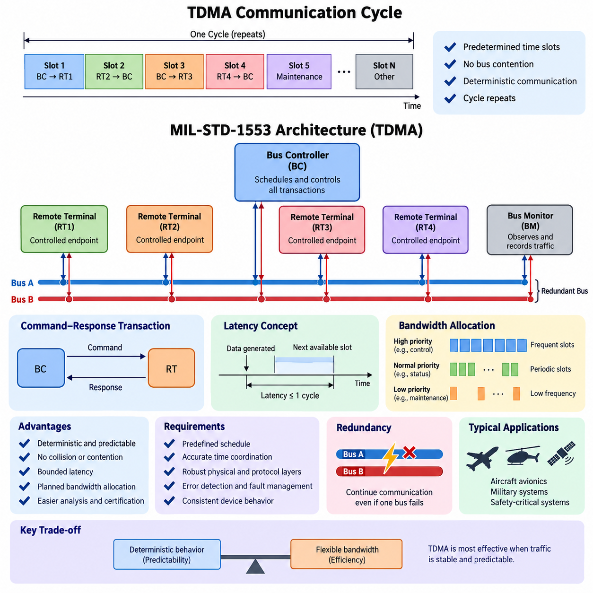
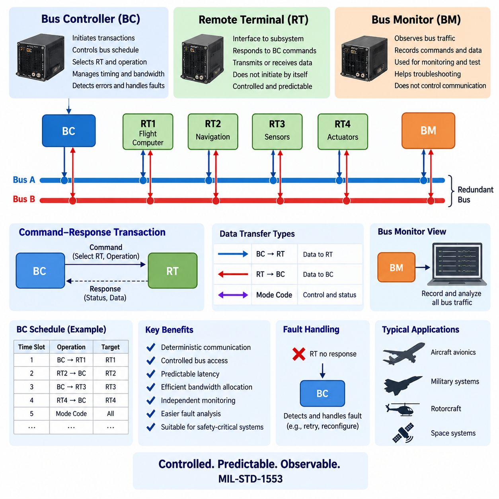
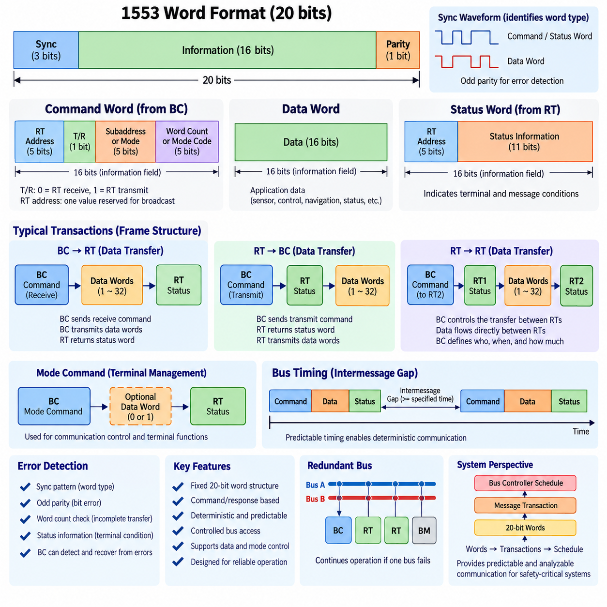
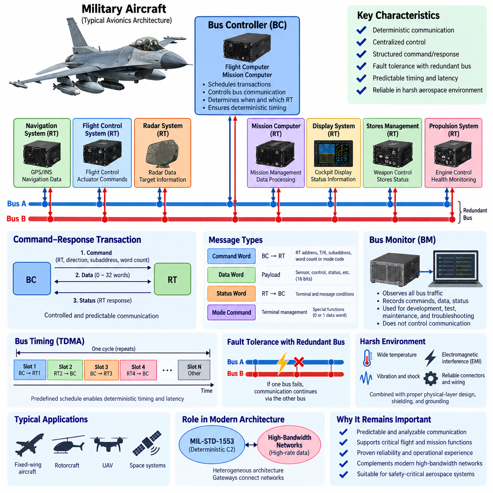
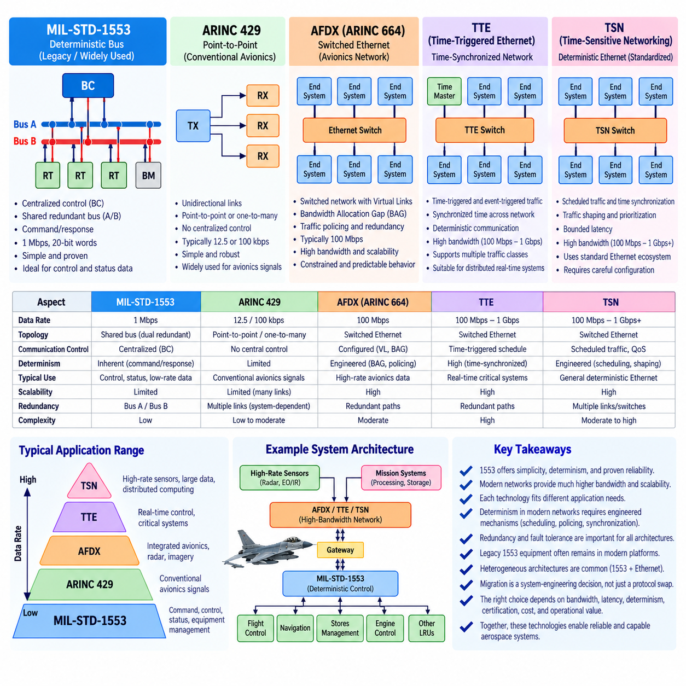

**Volume 08. Railway and Aerospace Protocols**

# Chapter 09. MIL-STD-1553

## 09.01. TDMA Bus Architecture

{width="7.268055555555556in" height="7.268055555555556in"}

Time Division Multiple Access (TDMA) is a communication architecture in which multiple communication participants share the same physical bus by transmitting during predetermined time intervals. Instead of allowing every node to compete for access whenever it has data, TDMA assigns each participant a defined transmission opportunity within a repeating communication cycle. This principle makes bus access predictable and prevents simultaneous transmissions from interfering with one another. In safety-critical aerospace systems, such determinism is valuable because communication timing can be analyzed, scheduled, and verified before operation. The communication network therefore becomes part of the system timing architecture rather than merely a general-purpose data transport mechanism.

A TDMA bus normally operates according to a predefined schedule that determines which node may transmit at a particular point in time. A communication cycle can be divided into multiple time slots, with each slot associated with a specific transmitter, receiver, message type, or communication transaction. When a node reaches its assigned slot, it transmits its message without requiring a contention procedure. Other nodes remain silent or receive the transmission according to the schedule. After the final slot is completed, the cycle repeats. This repetitive structure provides a predictable relationship between system time and message availability, allowing engineers to determine when critical information will be transmitted and when it should be received.

MIL-STD-1553 is a representative example of a deterministic aerospace communication system based on controlled bus access. Its architecture uses a centralized Bus Controller (BC) to coordinate communication transactions on the shared bus. Remote Terminals (RTs) act as controlled endpoints, while a Bus Monitor (BM) may observe and record bus traffic without participating as an active transmitter. The BC determines the sequence of communication activities, including which RT is addressed, whether information is transmitted to or received from that RT, and when the next transaction occurs. This centralized control provides a strong mechanism for maintaining deterministic communication behavior and avoiding uncontrolled bus contention.

The important characteristic of this architecture is that communication permission is explicitly controlled rather than implicitly negotiated. A Remote Terminal does not normally transmit whenever it independently decides that the bus is available. Instead, the Bus Controller initiates a transaction and specifies the required communication operation. This creates a command-response relationship between the controller and the terminal. The approach simplifies timing analysis because the communication sequence can be represented as a predefined schedule. For systems in which missed, delayed, or conflicting messages could affect system behavior, this predictability can be more important than maximizing average network utilization.

TDMA also provides a useful framework for reasoning about communication latency. Suppose a node generates new information immediately after its assigned transmission opportunity. The information cannot necessarily be transmitted immediately; it must wait until the next permitted slot. Therefore, the maximum communication delay is related to the length of the communication cycle and the location of the assigned slot within that cycle. Engineers can calculate worst-case transmission opportunities instead of relying on statistical network behavior. This makes TDMA particularly suitable for real-time control, navigation, flight management, actuator coordination, and other functions where bounded latency is required.

Another important feature is bandwidth allocation. Because transmission opportunities are planned in advance, the available bus capacity can be divided among system functions according to their communication requirements. High-priority functions can receive frequent slots, while less time-critical information can be transmitted less frequently. A periodic sensor message might therefore appear in every communication cycle, whereas a maintenance or diagnostic message might be assigned a much lower frequency. This scheduling approach transforms bandwidth from a dynamically contested resource into a designed system resource. The resulting communication behavior can be evaluated during architecture development rather than discovered only during integration testing.

TDMA requires accurate coordination between the communication schedule and the participating devices. The system must know when a transmission opportunity begins and ends, and devices must interpret the communication sequence consistently. In a centralized architecture such as MIL-STD-1553, the Bus Controller provides the primary sequencing authority, reducing the complexity of distributed arbitration. Nevertheless, the physical and protocol layers still need to tolerate electrical disturbances, timing variation, transmission errors, and equipment failures. Deterministic scheduling therefore does not eliminate the need for robust physical-layer engineering, error detection, redundancy, and fault-management mechanisms.

Redundancy can be integrated with a TDMA architecture to improve availability. MIL-STD-1553 systems commonly use redundant bus arrangements so that communication can continue when one physical bus path becomes unavailable. The logical communication schedule and the physical communication path should therefore be considered separately. The schedule defines when communication occurs, while redundancy defines how the communication can continue when a physical resource fails. This separation is important for safety-critical systems because deterministic timing must be maintained even when the architecture enters a degraded operating mode. Fault handling must consequently be considered as part of the communication architecture rather than treated only as a maintenance function.

TDMA is especially useful when communication traffic has a relatively stable and predictable structure. Aircraft avionics and military systems often contain periodic data such as attitude, navigation, engine, actuator, and status information. These functions can be mapped into predefined communication transactions. The resulting schedule can be analyzed for bus utilization, latency, repetition rate, and worst-case behavior. However, highly dynamic traffic can be less efficient because unused time slots may remain unavailable even when other nodes have additional data to transmit. This illustrates a fundamental trade-off between deterministic behavior and flexible bandwidth utilization.

The distinction between TDMA and contention-based communication is therefore important. In a contention-based network, several nodes may attempt to transmit and a protocol determines which transmission proceeds. Network behavior can depend on instantaneous traffic conditions, collisions, arbitration, or priority mechanisms. TDMA instead determines transmission opportunities before the communication takes place. The resulting system is generally easier to analyze from a worst-case timing perspective, although it requires more careful schedule design. For safety-critical aerospace applications, this trade-off often favors predictability, because deterministic behavior can support verification, validation, fault analysis, and certification activities.

A TDMA architecture can also be understood as a temporal contract between system functions. Each participating function receives a defined opportunity to publish or consume information, and the communication schedule establishes when that information becomes available. This concept is particularly relevant when communication is connected to control loops. A sensor measurement may be generated continuously, but its value becomes available to the controller only when the corresponding communication transaction occurs. The controller then processes the information and may issue another scheduled command. Consequently, network timing becomes coupled with sensing, computation, and actuation timing. Communication architecture must therefore be designed together with the overall real-time system architecture.

For aerospace systems, the value of TDMA is ultimately not simply that it allows multiple devices to share one bus. Its deeper value is that it makes communication behavior structured, repeatable, and analyzable. A predefined schedule provides a foundation for determining message timing, bus utilization, latency bounds, and expected behavior under normal operation. When combined with redundant physical paths, controlled access, error detection, monitoring, and appropriate fault-management mechanisms, TDMA can support highly dependable communication architectures. MIL-STD-1553 demonstrates this design philosophy particularly clearly: communication is treated as an engineered temporal resource whose behavior is controlled at the system level rather than left entirely to instantaneous network traffic conditions.

## 09.02. RT/BC/BM Roles

{width="7.268055555555556in" height="7.268055555555556in"}

In MIL-STD-1553, the communication architecture is organized around three logical roles: the Bus Controller (BC), Remote Terminal (RT), and Bus Monitor (BM). These roles are deliberately separated so that bus control, endpoint communication, and traffic observation are not mixed into a single uncontrolled function. The BC determines when communication occurs and which terminal participates, while RTs provide the operational endpoints that exchange application data. The BM observes bus activity for monitoring, recording, and analysis. This separation supports the deterministic communication principle introduced by the TDMA-oriented bus architecture and provides a clear basis for system-level responsibility.

The Bus Controller (BC) is the central authority for normal communication on the MIL-STD-1553 bus. It initiates communication transactions and determines which Remote Terminal is addressed, what type of transfer is required, and when the next transaction should occur. Rather than allowing individual terminals to compete independently for access, the BC maintains control of the communication sequence. This centralized role makes the overall bus behavior predictable and allows the communication schedule to be designed according to system requirements. In an aerospace system, the BC therefore functions not simply as a message router, but as the primary coordinator of time-controlled data exchange.

A Remote Terminal (RT) is an endpoint that interfaces an aircraft subsystem, sensor, actuator, computer, or other functional equipment with the 1553 bus. An RT does not normally initiate arbitrary communication whenever it has information to send. Instead, it responds to commands issued by the BC and performs the requested transmit or receive operation. This controlled behavior is fundamental to the deterministic nature of the architecture. Each RT can therefore be treated as a controlled participant whose communication activity is constrained by the bus schedule. The separation between BC authority and RT functionality also makes the responsibilities of system components easier to define during architecture development and verification.

The communication relationship between the BC and an RT is generally based on a command-and-response transaction. The BC sends a command identifying the intended RT and the required operation, and the RT responds according to that command. Depending on the transaction, data may move from the BC to the RT or from the RT to the BC. The important point is that the RT\'s communication opportunity is explicitly granted by the BC rather than obtained through contention with other terminals. This creates a controlled sequence in which the source, destination, direction, and timing of communication can be determined in advance. Such structured interaction is particularly valuable for safety-critical avionics functions.

The BC is also responsible for maintaining the logical communication schedule of the system. Periodic information can be assigned recurring transactions so that critical parameters are exchanged at predictable intervals. Less time-sensitive information can be assigned less frequent opportunities without interfering with higher-priority functions. The BC therefore becomes closely related to bandwidth allocation and latency management. If an RT produces new information immediately after its scheduled transaction, the information may have to wait until the next appropriate opportunity. Consequently, the BC schedule directly influences the maximum communication delay experienced by different system functions.

The Bus Monitor (BM) has a fundamentally different responsibility. Instead of controlling normal communication or serving as an application endpoint, the BM observes traffic occurring on the bus. It can record commands, data transfers, responses, and other bus activity for purposes such as system monitoring, maintenance, troubleshooting, test, and analysis. Because the BM is not the normal authority for initiating communication, its presence does not fundamentally change the command-driven nature of the network. The BM provides visibility into the communication system, allowing engineers and operators to examine whether the expected communication sequence is actually occurring.

The three roles can therefore be understood as complementary responsibilities rather than competing device types. The BC controls the communication process, the RT performs controlled endpoint communication, and the BM observes the resulting bus activity. This separation creates a clear functional boundary between control, participation, and observation. It also supports system verification because the expected behavior of each role can be defined independently. A communication problem can consequently be investigated by asking whether the BC issued the correct command, whether the intended RT responded correctly, and whether the observed bus traffic corresponds to the expected transaction sequence.

The architecture also provides a useful mechanism for fault analysis. If an RT fails to respond, the BC can detect that the expected transaction did not complete normally and higher-level system logic can determine an appropriate response. If unexpected traffic appears on the bus, monitoring functions can help identify the abnormal behavior. The BM can provide an important source of evidence for diagnosing communication failures because it observes actual bus activity rather than relying only on internal status information from individual devices. Thus, monitoring complements control and endpoint functionality without replacing either role.

The separation of BC, RT, and BM responsibilities is particularly important in safety-critical aerospace systems because communication behavior must be predictable and verifiable. The BC\'s centralized authority reduces uncontrolled access to the shared bus, while RTs follow defined communication procedures. The BM provides an independent view of network activity that can support testing and operational analysis. Together, these roles establish a communication model in which message exchange is deliberately controlled and observable. This is different from a general-purpose network where any node may independently transmit according to dynamically changing network conditions.

The architecture can also be extended conceptually to redundant bus operation. A system may provide more than one physical communication path so that communication can continue when one bus path becomes unavailable. The BC remains responsible for controlling the logical communication sequence, while RTs continue to perform their endpoint functions and monitoring mechanisms can observe the resulting traffic. This distinction between logical responsibility and physical redundancy is important because redundancy should preserve the intended communication behavior rather than simply provide an additional wire. Fault handling therefore needs to consider how BC, RT, and BM functions behave when the system enters a degraded operating condition.

From a system-engineering perspective, the BC, RT, and BM roles provide a simple but powerful decomposition of MIL-STD-1553 communication. The BC answers the question of who communicates and when, the RT answers the question of which subsystem provides or receives the data, and the BM answers the question of what actually occurred on the bus. These responsibilities form a controlled communication cycle in which scheduling, endpoint operation, and observation remain distinct. This separation contributes to deterministic timing, controlled bandwidth usage, fault diagnosis, and verification. The resulting architecture is therefore well suited to military and aerospace applications where communication must be structured, predictable, and capable of supporting rigorous system-level analysis.

## 09.03. MIL-STD-1553 Frame Design

{width="7.268055555555556in" height="7.268055555555556in"}

MIL-STD-1553 communication is constructed from precisely defined 20-bit words and controlled message transactions rather than variable-length network packets. Each transmitted word contains a 3-bit synchronization field, 16 information bits, and one parity bit. The synchronization waveform identifies whether the following information represents a command/status word or a data word, while odd parity provides basic transmission-error detection. This fixed word structure simplifies receiver synchronization and enables deterministic interpretation of traffic on the shared avionics bus.

The command word is generated by the Bus Controller (BC) and establishes the structure of the transaction that follows. Its 16 information bits contain a 5-bit Remote Terminal (RT) address, a transmit/receive bit, a 5-bit subaddress or mode field, and a 5-bit word-count or mode-code field. Through these fields, the BC specifies which RT must participate, the direction of the transfer, the logical data destination within the RT, and the amount or type of information involved. The command word therefore acts as the transaction descriptor for normal MIL-STD-1553 communication.

The 5-bit RT address allows the command structure to identify individual terminals on the bus, while one address value is reserved for broadcast operation. The transmit/receive bit defines the direction from the perspective of the addressed RT. A receive command instructs the RT to accept data, whereas a transmit command instructs it to place requested data onto the bus. This explicit direction control prevents terminals from transmitting independently and preserves the Bus Controller\'s authority over message sequencing and shared-bus utilization.

The subaddress field provides a mechanism for separating different logical data interfaces within the same Remote Terminal. Instead of assigning a different physical terminal address to every subsystem data function, one RT can expose multiple subaddresses associated with different buffers, functions, or application data sets. Certain subaddress values are reserved for mode-code operation rather than ordinary data transfer. This organization allows the physical communication endpoint and the logical information channels behind that endpoint to remain clearly separated.

The word-count field determines how many data words are associated with a normal data-transfer command. Because each data word carries 16 information bits, the command identifies both the communication endpoint and the expected transfer size. A special encoding represents the maximum transfer of 32 data words. When the command identifies a mode-code operation, however, the same field is interpreted as a mode code rather than an ordinary word count. The meaning of the frame is therefore determined jointly by the command fields rather than by any single field in isolation.

A data word carries the actual payload exchanged between participating devices. Its 16 information bits may represent sensor measurements, control parameters, navigation information, equipment states, actuator commands, or other application-defined data. MIL-STD-1553 defines the transport structure but does not require every application to interpret those 16 bits identically. Consequently, system designers must define data formats and scaling consistently at the interface level while preserving the standardized word-level timing, synchronization, and parity behavior of the bus.

The status word is transmitted by a Remote Terminal in response to appropriate Bus Controller commands. Like the command word, it contains the RT address together with status indicators describing terminal or message conditions. These indicators allow the BC to determine whether the addressed RT recognized the transaction and whether relevant abnormal conditions exist. Status information therefore closes the command-response loop and provides immediate protocol-level visibility into terminal behavior rather than requiring the controller to infer communication health only from application data.

A basic BC-to-RT transfer begins when the Bus Controller transmits a receive command word to the selected RT. The BC then places the specified number of data words onto the bus. After receiving and checking the transaction, the RT returns its status word. The resulting message structure can therefore be understood as command, data, and status arranged in a tightly controlled sequence. Since the BC determines the start and content of the transaction, another terminal cannot arbitrarily insert traffic into the sequence.

An RT-to-BC transfer reverses the data direction while preserving centralized control. The BC first issues a transmit command identifying the RT, subaddress, and required word count. The addressed RT responds with its status word and then transmits the requested data words. The terminal is therefore the source of application data but not the independent initiator of bus access. This distinction is central to MIL-STD-1553 frame design because deterministic communication depends on separating ownership of the data from authority to initiate the transaction.

Remote-Terminal-to-Remote-Terminal transfer allows information to move between two RTs while remaining under Bus Controller supervision. The BC issues commands that identify the receiving and transmitting terminals and coordinates the required responses and data transfer. Although the application data may travel directly between the RTs on the shared bus, the communication does not become peer-to-peer in the uncontrolled networking sense. The BC still defines who transmits, who receives, how much information is transferred, and when the transaction occurs.

Mode commands provide communication and terminal-management functions that do not behave exactly like ordinary application-data transfers. They use designated command-field combinations so that an RT recognizes the transaction as a mode operation. Depending on the particular mode command, zero or one associated data word may be involved. These mechanisms support control and status functions required for coordinated bus operation, demonstrating that the MIL-STD-1553 command format serves both normal data movement and management of communication behavior.

Intermessage gaps and response timing are also essential parts of frame design. A deterministic bus cannot be defined only by the order of command, data, and status words; participating devices must also satisfy specified timing relationships between those words and transactions. The BC uses these predictable timing characteristics to construct a repeatable communication schedule. Excessive delay, missing responses, invalid synchronization, or parity errors can consequently be recognized as abnormal conditions rather than being treated as ordinary variations in network traffic.

Error detection is distributed across several elements of the message structure. Synchronization patterns distinguish word types, parity detects certain bit-level corruption, expected word counts help identify incomplete transfers, and status responses provide information about terminal conditions. The Bus Controller can evaluate whether the expected sequence occurred and can apply system-defined recovery actions when a transaction fails. Redundant physical buses can further provide an alternate communication path, linking frame-level error handling with the broader fault-tolerant MIL-STD-1553 architecture.

From a system perspective, MIL-STD-1553 frame design creates a hierarchy extending from individual words to transactions and finally to the repeating Bus Controller schedule. Command, data, and status words define the smallest communication structures; combinations of these words form controlled messages; and scheduled messages form the deterministic bus communication cycle. This layered organization connects data representation directly with timing, control authority, diagnostics, and redundancy, providing the predictable communication behavior required by military and safety-critical aerospace systems.

## 09.04. Military Aerospace Application

{width="7.268055555555556in" height="7.268055555555556in"}

MIL-STD-1553 became an important communication standard for military aerospace systems because it provides deterministic, centrally controlled, and fault-tolerant data exchange among avionics equipment. Aircraft contain flight computers, navigation systems, sensors, displays, mission computers, weapon-management equipment, and actuators that must exchange information under strict timing requirements. The command-response architecture of MIL-STD-1553 allows these devices to share a common communication bus while preserving predictable access and clearly defined communication responsibilities.

In a typical military aircraft architecture, the Bus Controller (BC) is implemented within a flight computer, mission computer, or another system responsible for coordinating avionics communication. The BC schedules transactions and determines which Remote Terminal (RT) communicates at each point in the communication cycle. Individual RTs may interface with navigation equipment, flight-control electronics, radar systems, stores-management equipment, propulsion systems, or other subsystems. This centralized structure prevents independent terminals from competing unpredictably for bus access and provides system designers with direct control over communication timing.

The Remote Terminal role is particularly useful for integrating distributed equipment throughout an aircraft. A subsystem can communicate through its assigned RT address and multiple logical subaddresses without requiring a dedicated point-to-point connection for every data relationship. Sensor information, commands, equipment status, and control parameters can therefore be exchanged over a shared bus. This reduces communication wiring compared with architectures based entirely on individual connections while retaining the disciplined communication behavior required for military avionics.

Flight-control and vehicle-management systems benefit from predictable message timing because control functions depend on information arriving within known time boundaries. The Bus Controller can periodically schedule transactions carrying aircraft state, actuator commands, equipment status, and other operational information. Since the communication sequence is predefined, engineers can analyze repetition rates and worst-case latency before deployment. MIL-STD-1553 therefore supports the broader real-time architecture by connecting communication timing with sensing, computation, decision making, and actuation.

Mission avionics represent another important application area. Military aircraft may need coordinated communication among navigation computers, mission processors, radar, electronic systems, displays, and other mission equipment. MIL-STD-1553 provides a structured method for exchanging these data sets while keeping communication authority centralized. Different message groups can be assigned different repetition frequencies according to their operational importance. Frequently required control or status information can be scheduled more often, while maintenance or less time-sensitive information can receive fewer communication opportunities.

The fixed command, data, and status word structures are valuable in these applications because every transaction follows a known protocol format. The Bus Controller identifies the target RT, transfer direction, subaddress, and required word count. Data words carry the application information, while status words allow terminals to report relevant communication conditions. This structure provides immediate protocol-level feedback about whether expected transactions occurred correctly. Communication faults can therefore be detected without depending exclusively on higher-level application software to recognize that information is missing or invalid.

Redundant physical buses further strengthen MIL-STD-1553 for military aerospace use. A typical architecture can provide Bus A and Bus B so that communication does not depend on only one physical path. If one path becomes unavailable because of wiring damage, connector failure, electrical disturbance, or another fault, system-defined recovery mechanisms can use the alternate path. Redundancy is especially important in aircraft because communication failures may affect multiple distributed functions, making network availability part of the overall fault-tolerance strategy.

The Bus Monitor (BM) role is also valuable during aircraft development, integration, qualification, maintenance, and troubleshooting. A BM can observe command words, data transfers, status responses, and communication timing without becoming the normal authority controlling the bus. Engineers can compare recorded traffic with the expected Bus Controller schedule to identify missing responses, unexpected transactions, timing problems, or other abnormal behavior. This observability is useful when diagnosing interactions among multiple avionics subsystems that may otherwise be difficult to reproduce or isolate.

MIL-STD-1553 is also applicable to military rotorcraft and other airborne platforms where distributed subsystems must operate in electrically and mechanically demanding environments. Flight-related computers, sensors, mission equipment, and vehicle subsystems can be organized around the same BC-RT communication principle. The specific application data may differ from those of a fixed-wing aircraft, but the architectural objective remains similar: communication must remain controlled, predictable, diagnosable, and capable of supporting continued operation when faults occur.

Military aerospace communication must also consider electromagnetic interference, equipment faults, environmental stresses, and physical damage. Deterministic protocol behavior alone cannot guarantee reliable operation, so MIL-STD-1553 communication is combined with appropriate physical-layer design, shielding, grounding, connectors, wiring practices, redundancy, and fault-management strategies. The communication architecture and electrical architecture therefore need to be engineered together. A correctly scheduled transaction provides little value if the physical communication path cannot maintain sufficient signal integrity under operational conditions.

The relatively modest data rate of MIL-STD-1553 means that it is not intended to replace every modern high-bandwidth aerospace network. Large sensor streams, high-resolution imagery, advanced radar data, and other bandwidth-intensive information can require communication technologies with substantially greater capacity. However, many command, control, status, and equipment-management functions require deterministic behavior and reliability more than raw throughput. This distinction explains why a legacy bus architecture can remain technically relevant even when much faster networking technologies are available elsewhere in the same platform.

Modern military aircraft and aerospace platforms can therefore employ heterogeneous communication architectures rather than relying on a single network technology. MIL-STD-1553 may support deterministic command-and-control functions, while higher-bandwidth networks handle data-intensive applications. Gateways and system computers can connect these communication domains while preserving the timing and fault-containment requirements of each network. The engineering challenge is not simply selecting the fastest protocol, but assigning each communication function to an architecture appropriate for its bandwidth, latency, determinism, safety, and availability requirements.

From a system-engineering perspective, the enduring importance of MIL-STD-1553 in military aerospace applications comes from the relationship between centralized control, deterministic scheduling, structured transactions, monitoring, and redundancy. The Bus Controller establishes communication authority, Remote Terminals connect distributed equipment, and the Bus Monitor provides observability. Fixed message structures make transactions analyzable, while redundant buses support continued operation after certain failures. Together, these characteristics provide a communication foundation suited to aerospace systems in which predictable behavior and controlled fault response are often more important than maximizing network throughput.

## 09.05. 1553 vs Modern Alternatives

{width="7.268055555555556in" height="7.268055555555556in"}

MIL-STD-1553 represents a communication philosophy optimized for deterministic control, predictable timing, and long-term reliability rather than high data throughput. Its 1 Mbps shared serial bus, centralized Bus Controller (BC), Remote Terminals (RTs), fixed word structures, and redundant physical channels were developed for environments where communication behavior must remain controlled and analyzable. Modern aerospace platforms, however, increasingly exchange high-resolution sensor data, imagery, radar information, software updates, and distributed computing traffic, creating requirements that exceed the practical bandwidth of traditional 1553 networks.

The primary limitation of MIL-STD-1553 in modern systems is therefore bandwidth rather than architectural discipline. A 1553 transaction includes command, data, status, timing, and protocol overhead, so its available application throughput is considerably smaller than the nominal bus rate. This capacity remains adequate for many commands, equipment states, actuator parameters, and low-rate sensor values, but it becomes restrictive for cameras, advanced radar, electronic-warfare data, high-rate diagnostics, and large software transfers. Modern alternatives address this limitation by providing communication capacity measured in tens or hundreds of megabits per second, gigabits per second, or beyond.

ARINC 429 provides another established aerospace communication approach, but its architecture differs substantially from MIL-STD-1553. ARINC 429 generally uses unidirectional point-to-point or one-transmitter-to-multiple-receiver links rather than a centrally controlled multidrop command-response bus. This simplicity can be advantageous for conventional avionics signals, but larger systems may require many separate links and additional wiring. MIL-STD-1553 instead allows multiple terminals to share a controlled bus, making centralized scheduling and terminal coordination fundamental properties of its architecture.

AFDX, standardized through ARINC 664 concepts, represents a major transition toward switched Ethernet-based avionics networking. Instead of one centrally controlled shared bus, end systems communicate through Ethernet switches using configured Virtual Links (VLs). Bandwidth Allocation Gap (BAG), traffic policing, redundancy, and predefined communication characteristics are used to provide bounded and predictable network behavior. Compared with 1553, AFDX offers substantially greater bandwidth and better scalability for integrated avionics while retaining engineering mechanisms intended to constrain otherwise flexible Ethernet communication.

Time-Triggered Ethernet (TTE) extends the deterministic networking concept by coordinating critical communication according to synchronized time. Time-triggered traffic can be assigned predefined transmission opportunities, allowing network behavior to be closely integrated with distributed real-time functions. This resembles the deterministic objective of MIL-STD-1553, but it applies that objective to a switched Ethernet environment with much greater communication capacity. TTE can also support traffic classes with different timing characteristics, enabling critical scheduled communication and less deterministic data exchange to coexist within a broader network architecture.

Time-Sensitive Networking (TSN) provides another modern direction by adding deterministic communication mechanisms to standardized Ethernet. Technologies such as scheduled traffic can control when selected frames are permitted to transmit, while additional mechanisms support synchronization, traffic shaping, prioritization, and bounded latency. For aerospace designers, TSN is attractive because it combines the large ecosystem and bandwidth scalability of Ethernet with mechanisms intended for real-time communication. However, achieving deterministic behavior requires careful configuration and system-level timing design rather than assuming that ordinary Ethernet automatically provides the guarantees associated with a controlled avionics bus.

Modern Ethernet-based alternatives also change the topology of the communication architecture. MIL-STD-1553 places multiple devices on a shared redundant bus controlled by the BC, whereas AFDX, TTE, and TSN typically employ switched networks. Switching provides dedicated physical links between devices and network switches, reducing dependence on a single shared communication medium and enabling simultaneous traffic flows. The resulting architecture scales more effectively as the number of computing nodes and high-bandwidth sensors increases, although switches, configuration databases, synchronization mechanisms, and network-management functions introduce additional architectural complexity.

Determinism remains one of the strongest reasons MIL-STD-1553 cannot be evaluated solely by comparing raw data rates. Its centralized command-response mechanism provides an inherently understandable communication sequence: the BC determines which terminal communicates, when it communicates, and how much data is transferred. Modern switched networks can provide deterministic or bounded behavior, but this depends on mechanisms such as traffic scheduling, bandwidth reservation, policing, synchronization, and priority management. The comparison is therefore not simply slow bus versus fast Ethernet, but native centralized determinism versus engineered determinism on a higher-capacity network.

Fault tolerance provides another important comparison. MIL-STD-1553 commonly uses redundant Bus A and Bus B paths, allowing system-defined recovery when one physical channel becomes unavailable. AFDX similarly employs redundant network paths, while modern deterministic Ethernet architectures can incorporate multiple links, switches, redundant routes, and synchronization sources. Ethernet-based redundancy can provide greater architectural flexibility, but it also creates more configuration possibilities and potential failure interactions. The simplicity of the traditional dual-redundant 1553 architecture can therefore remain valuable where communication requirements are modest and predictable.

Legacy integration is equally important in real aerospace programs. Aircraft and military platforms may contain qualified 1553 equipment that has accumulated extensive operational history and cannot economically be replaced simply because a faster network exists. Sensors, mission equipment, stores interfaces, control electronics, and other line-replaceable units may continue using 1553 while newer computers communicate through Ethernet-based networks. Gateways can connect these domains, translating data while preserving the timing, interface, and fault-containment requirements associated with the legacy bus.

This leads naturally to heterogeneous network architectures. Instead of replacing MIL-STD-1553 everywhere, a platform can retain it for deterministic command, control, status, and equipment-management traffic while assigning high-rate sensor streams, imagery, radar products, distributed processing, and large data transfers to AFDX or newer deterministic Ethernet technologies. Such partitioning allows each network to operate where its characteristics provide the greatest engineering value. The system architecture then becomes responsible for managing data exchange, timing relationships, gateways, redundancy, and failure propagation between communication domains.

Migration from 1553 to a modern alternative must therefore be treated as a system-engineering decision rather than a protocol substitution exercise. Required bandwidth, maximum latency, timing determinism, number of nodes, wiring mass, redundancy, electromagnetic environment, certification constraints, cybersecurity, maintainability, existing equipment, and lifecycle cost all influence the appropriate choice. A network that provides dramatically greater throughput may not automatically be preferable if it increases integration complexity without providing operational value for the targeted communication functions.

MIL-STD-1553 and modern deterministic Ethernet technologies can ultimately be viewed as different generations of the same broader engineering objective: delivering predictable and dependable communication for critical systems. MIL-STD-1553 achieves this through centralized bus control, fixed transactions, modest bandwidth, and straightforward redundancy. AFDX, TTE, and TSN pursue greater capacity and scalability through switched networking combined with mechanisms that constrain timing and traffic behavior. The future aerospace architecture is therefore likely to remain heterogeneous, preserving proven deterministic buses where appropriate while progressively introducing higher-bandwidth deterministic networks for increasingly data-intensive avionics and autonomous systems.
