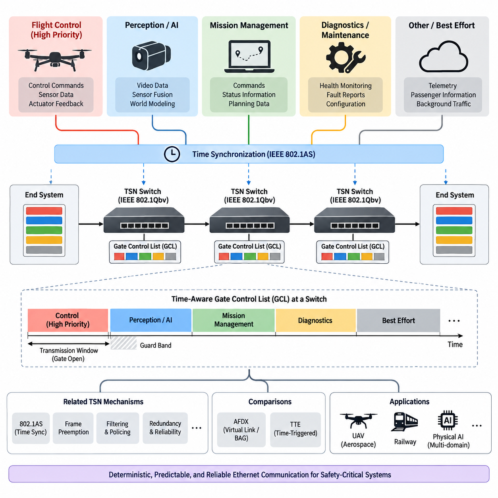
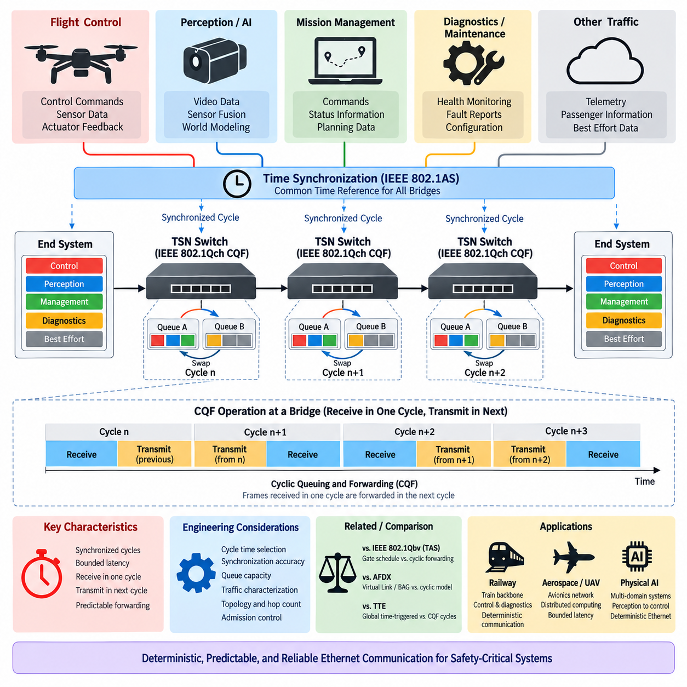
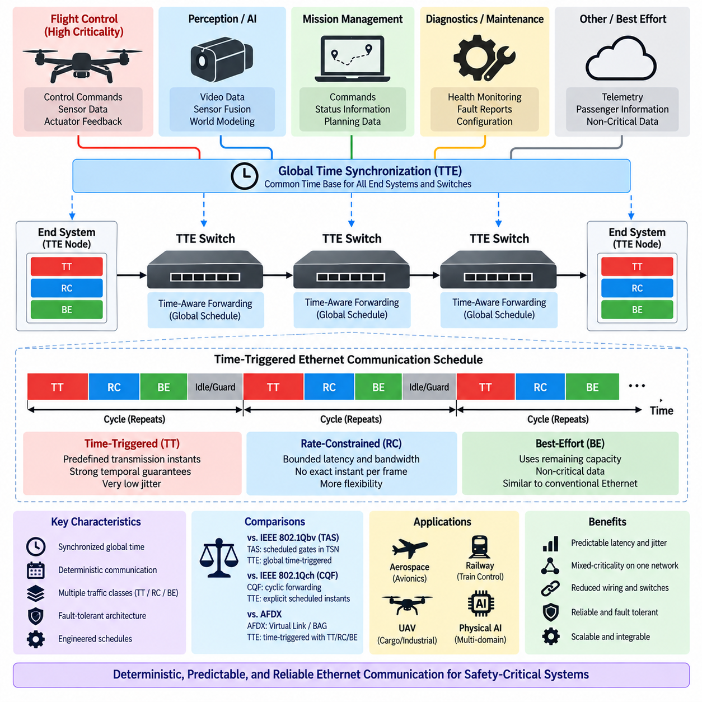
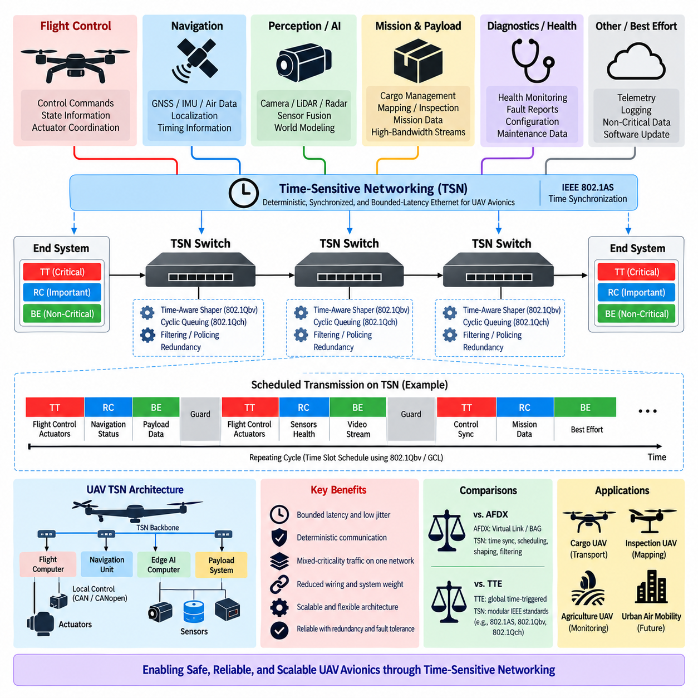
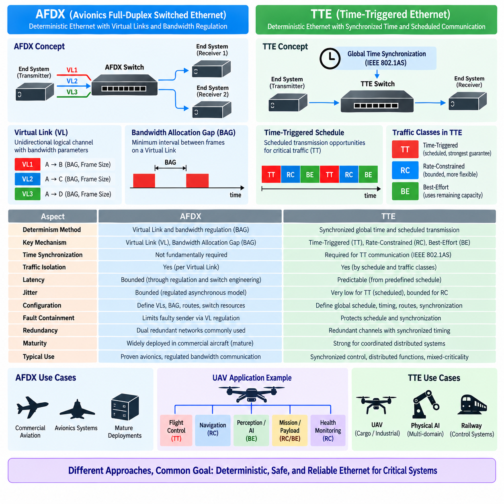

**Volume 08. Railway and Aerospace Protocols**

# Chapter 10. TT-Ethernet

## 10.01. IEEE 802.1Qbv (TAS)

{width="7.268055555555556in" height="7.268055555555556in"}

IEEE 802.1Qbv 시간 인식 셰이퍼(Time-Aware Shaper, TAS)는 이더넷 프레임이 언제 전송될 수 있는지를 제어함으로써 결정론적 이더넷 통신을 제공하도록 설계된 시간 민감형 네트워킹(Time-Sensitive Networking, TSN) 메커니즘이다. 일반적인 이더넷 스위치가 링크 사용을 위해 지속적으로 트래픽이 경쟁하도록 허용하는 것과 달리, TAS는 통신 시간을 정밀하게 정의된 전송 구간으로 나눈다. 각 트래픽 클래스는 반복되는 시간 스케줄에 따라 열리거나 닫히는 게이트와 연결된다. 이를 통해 기존의 최선 노력형(Best-Effort) 전달 장치였던 이더넷 스위치가 예측 가능한 전송 타이밍을 보장할 수 있는 네트워크 요소로 동작하게 된다.

TAS의 핵심 개념은 시간 인식 게이트 제어 목록(Time-Aware Gate Control List, GCL)이다. GCL은 게이트 상태의 순서와 각 상태가 유지되는 시간을 지정한다. 특정 시간 구간에서는 고우선순위 트래픽 클래스의 게이트를 열고 다른 게이트는 닫을 수 있다. 다른 시간 구간에서는 또 다른 트래픽 클래스가 전송하도록 허용할 수 있다. 모든 참여 네트워크 장치가 동기화된 스케줄을 따르기 때문에 트래픽에 결정론적인 전송 기회를 할당할 수 있다. 이러한 방식은 단순히 데이터가 전달되는 것보다 통신의 타이밍 자체가 시스템 요구사항의 일부가 되는 경우에 특히 중요하다.

TAS는 네트워크 전체의 시간 동기화(Network-wide Time Synchronization)에 크게 의존한다. 스위치와 종단 장치가 충분히 정확한 공통 시간 기준(Common Time Reference)을 공유해야 전송 스케줄이 의미를 갖는다. TSN 시스템에서는 일반적으로 IEEE 802.1AS가 이러한 동기화 기반을 제공하는 데 사용된다. 동기화된 클록을 통해 각 브리지와 종단 시스템은 동일한 전역 시간 개념에 따라 자신의 GCL을 실행할 수 있다. 결과적으로 예정된 프레임은 공통 시간 기준에 맞춰 여러 전송 구간을 통과하면서 예측 가능한 방식으로 네트워크를 이동할 수 있다.

TAS 전송 주기는 일반적으로 서로 다른 트래픽 요구사항에 대응하는 반복적인 시간 구간으로 구성된다. 안전 필수 제어 메시지(Safety-Critical Control Message)는 전용 전송 구간을 할당받을 수 있고, 시간 민감도가 낮은 텔레메트리(Telemetry)나 진단(Diagnostics) 트래픽은 다른 구간을 사용할 수 있다. 이후 이러한 주기가 지속적으로 반복된다. 각 구간의 정확한 길이는 애플리케이션의 타이밍 요구사항, 프레임 크기, 링크 속도, 전파 지연, 스위칭 지연, 처리 시간 및 필요한 시간 여유(Margin)에 따라 결정된다. 따라서 적절한 스케줄을 구성하려면 통신 타이밍을 네트워크의 물리적 및 논리적 아키텍처와 함께 고려해야 한다.

게이트 메커니즘은 단순히 트래픽에 정적인 우선순위를 부여하는 것이 아니라 전송 가능 여부를 트래픽 클래스별로 분리한다. 활성화된 트래픽 클래스에 속하는 프레임은 해당 게이트가 열려 있을 때 전송될 수 있지만, 닫힌 게이트와 연결된 프레임은 큐(Queue)에 대기해야 한다. 이는 일반적인 우선순위 기반 이더넷보다 강력한 시간 모델을 제공한다. 높은 우선순위의 프레임이라고 해서 링크가 사용 가능해지는 즉시 자동으로 전송되는 것이 아니라, 미리 정의된 시간 스케줄에 따라 전송이 제한되기 때문이다. 그 결과 네트워크의 동작을 보다 정밀하게 분석하고 반복적으로 재현할 수 있다.

실제 TAS 시스템에서 중요한 설계 문제 중 하나는 스케줄된 트래픽과 비스케줄 트래픽(Unscheduled Traffic)의 상호작용이다. TSN 네트워크는 일반적으로 결정론적인 제어 메시지만 전달하지 않는다. 인지 데이터(Perception Data), 진단 정보, 유지보수 정보, 설정 데이터 및 기타 배경 통신이 동시에 전달될 수 있다. TAS는 이러한 트래픽 범주가 서로 다른 전송 기회를 갖도록 하여 하나의 네트워크 인프라에서 공존할 수 있도록 한다. 중요 트래픽은 예약된 구간에서 보호하고, 중요도가 낮은 트래픽은 나머지 네트워크 용량을 사용할 수 있다. 이를 통해 완전히 분리된 물리적 네트워크를 구축하지 않고도 하나의 이더넷 인프라에서 여러 통신 중요도를 지원할 수 있다.

가드 밴드(Guard Band)는 실제 TAS 동작에서 중요한 요소이다. 예정된 고우선순위 전송 구간이 시작되기 직전에 링크를 이미 사용하고 있는 저우선순위 프레임이 해당 구간까지 전송을 계속해서는 안 된다. 따라서 다음 스케줄된 전송 기회를 보호하기 위한 충분한 보호 시간이 필요하다. TSN 구현에서는 프레임 프리엠션(Frame Preemption)과 같은 메커니즘을 통해 이러한 제한으로 인해 소비되는 대역폭을 줄일 수 있다. 가드 밴드 또는 프리엠션을 적절하게 고려하지 않으면 이론적으로 올바른 스케줄이라도 이전 시간 구간에서 이미 전송을 시작한 프레임 때문에 실제 환경에서 타이밍 간섭이 발생할 수 있다.

TAS의 결정론적 특성은 하나의 통신 도메인을 넘어 여러 통신 도메인이 통합될수록 더욱 중요해진다. 예를 들어 철도 시스템에서는 제어 기능, 차량 상태, 진단, 승객 정보 및 상위 수준의 통신이 동시에 존재할 수 있다. 항공우주 또는 UAV 시스템에서도 비행 제어 정보, 액추에이터 제어, 항법, 시스템 상태 모니터링, 임무 데이터 및 유지보수 통신이 서로 다른 특성을 가질 수 있다. TAS는 이러한 트래픽 클래스에 서로 다른 시간 보장을 할당하면서도 하나의 이더넷 기반 통신 인프라를 유지할 수 있는 개념적 메커니즘을 제공한다.

UAV 항공전자(Avionics) 시스템에서는 TAS를 컴퓨팅 및 제어 서브시스템 간의 결정론적 이더넷 통신을 구축하는 방법으로 볼 수 있다. 비행 제어 컴퓨터는 액추에이터 제어기 및 센서 처리 장치와 주기적으로 통신해야 할 수 있다. 인지 컴퓨터는 더 큰 데이터 스트림을 생성하지만 반드시 동일한 수준의 엄격한 주기성을 요구하지 않을 수 있으며, 임무 관리 소프트웨어는 상대적으로 낮은 빈도로 명령과 상태 정보를 교환할 수 있다. TAS는 이러한 요구사항에 맞춰 전송 구간을 할당함으로써 중요한 제어 트래픽에 예측 가능한 네트워크 접근을 제공하면서도 하나의 이더넷 네트워크를 사용할 수 있게 한다.

TAS와 처리 아키텍처(Processing Architecture)의 관계도 중요하다. Physical AI 시스템에는 인지(Perception), 월드 모델(World Model), 계획(Planning), 의사결정(Decision Making) 등을 담당하는 고성능 컴퓨팅 노드와 훨씬 높은 주파수로 동작하는 하위 수준 제어기가 함께 존재할 수 있다. 이러한 기능들이 모두 동일한 통신 타이밍을 필요로 하는 것은 아니다. 따라서 TAS는 서로 다른 계산 시간 스케일(Computational Time Scale)에 있는 기능 사이에 결정론적인 통신 구간을 설정하는 데 활용될 수 있다. 이러한 관점에서 TAS는 단순한 네트워크 기능이 아니라 서로 다른 계산 도메인을 연결하는 시스템 아키텍처의 일부가 된다.

TAS의 결정론적 동작은 단순히 네트워크 지연을 평균적으로 낮추는 것과는 다르다. 기존 이더넷의 성능은 평균 지연, 처리량(Throughput), 패킷 손실 등의 지표로 표현되는 경우가 많다. 그러나 이러한 지표만으로는 최대 통신 지연이 특정한 한계 이내에 유지되어야 하는 시스템의 요구사항을 충분히 설명할 수 없다. TAS는 전송 가능한 시간을 제한함으로써 이 문제에 접근한다. 스케줄, 시간 동기화 정확도, 전달 지연 및 트래픽 가정이 적절하게 설계되면 통신 동작을 보다 예측 가능하게 만들 수 있다.

그러나 TAS가 적용되었다고 해서 이더넷 시스템이 자동으로 결정론적인 시스템이 되는 것은 아니다. 결정론성은 TSN 시스템 전체의 구성에 의해 결정된다. 클록 동기화, GCL 설정, 큐 할당, 프레임 전송 시간, 브리지 전달 지연, 네트워크 토폴로지, 트래픽 생성 방식 및 링크 사용률을 모두 고려해야 한다. 하나의 네트워크 토폴로지에서 유효한 스케줄이 스위치나 종단 시스템이 추가된 후에는 더 이상 유효하지 않을 수도 있다. 따라서 TAS는 단순히 활성화할 수 있는 스위치 기능이 아니라 시스템 수준에서 설계하고 검증해야 하는 아키텍처 메커니즘으로 이해해야 한다.

따라서 스케줄 생성(Schedule Synthesis)은 중요한 엔지니어링 활동이 된다. 먼저 통신 스트림의 주기, 데드라인, 프레임 크기, 우선순위, 경로 및 필요한 신뢰성 수준을 정의해야 한다. 이후 이러한 스트림을 트래픽 클래스와 전송 구간에 매핑한다. GCL은 네트워크 경로를 따라 존재하는 각 브리지가 적절한 시간에 적절한 프레임의 전송을 허용하도록 생성된다. 이때 네트워크 요소 사이의 전파 지연과 포워딩 지연도 고려해야 한다. 노드와 트래픽 스트림의 수가 증가할수록 수작업 설정은 점점 어려워지므로 자동화된 스케줄 생성 및 검증 도구가 중요해진다.

스케줄된 이더넷 메시지의 종단 간 타이밍(End-to-End Timing)은 소스에서의 전송 구간만으로 결정되지 않는다. 프레임은 목적지에 도달하기 전에 여러 브리지를 통과할 수 있으며 각 브리지는 자신의 게이트 스케줄을 갖는다. 따라서 통신 경로 전체에서 스케줄을 조정해야 한다. 소스 전송 시간, 스위치 포워딩 동작, 큐 체류 시간, 링크 전송 시간 및 시간 동기화 오차가 최종 전달 시간에 함께 영향을 미친다. 안전 필수 애플리케이션에서는 로컬 GCL이 올바르게 구성되었다는 사실만으로 전체 통신 스케줄이 올바르다고 판단해서는 안 되며, 종단 간 관점이 반드시 필요하다.

TAS는 네트워크 사용률(Network Utilization)에 대해서도 기존과 다른 관점을 요구한다. 일반적인 이더넷에서는 사용되지 않는 링크 용량이 전송 가능한 트래픽에 의해 즉시 사용될 수 있다. 반면 스케줄된 네트워크에서는 미래의 전송 구간을 위해 용량이 사실상 예약될 수 있다. 이러한 예약은 예측 가능성을 향상시키지만 스케줄이 잘못 설계되면 유연성을 감소시킬 수 있다. 따라서 TAS 네트워크 설계에서는 결정론적 보장과 효율적인 링크 사용 사이의 균형이 필요하다. 지나치게 보수적인 스케줄은 대역폭을 낭비할 수 있으며, 지나치게 밀집된 스케줄은 타이밍 변동과 예상하지 못한 트래픽에 대응할 충분한 여유를 제공하지 못할 수 있다.

주기적인 결정론적 트래픽(Periodic Deterministic Traffic)과 이벤트 기반 트래픽(Event-Driven Traffic)의 차이도 고려해야 한다. 비행 제어 루프, 액추에이터 명령 및 일부 센서 업데이트는 규칙적인 타이밍 특성을 가지므로 예정된 전송 구간에 자연스럽게 배치할 수 있다. 반면 진단 메시지, 고장 보고 및 유지보수 데이터는 비동기적으로 발생할 수 있다. 따라서 견고한 TAS 아키텍처는 이벤트 기반 트래픽을 어떻게 수용할 것인지 정의해야 한다. 이러한 트래픽은 중요 트래픽에 영향을 주지 않도록 낮은 우선순위의 구간에 배치하거나 적절한 트래픽 셰이핑(Traffic Shaping) 메커니즘을 통해 제어할 수 있다.

TAS는 다른 TSN 메커니즘과 밀접하게 관련되어 있으며, 결정론적 이더넷은 일반적으로 하나의 기능만으로 구현되는 것이 아니라 여러 기능의 조합으로 구성된다. IEEE 802.1Qbv는 시간에 따라 전송 기회를 제어하고, IEEE 802.1AS는 이러한 스케줄에 필요한 공통 시간 기준을 제공한다. 프레임 프리엠션은 트래픽 클래스 간 블로킹 효과를 줄일 수 있으며, 다른 TSN 메커니즘은 추가적인 중복성(Redundancy), 필터링, 폴리싱(Policing) 또는 지연 제어를 제공할 수 있다. 결과적으로 TSN은 시간 동기화, 트래픽 분류, 스케줄링, 포워딩 및 고장 처리가 함께 작동하는 통합된 결정론적 통신 프레임워크로 볼 수 있다.

TAS와 AFDX의 비교는 항공우주 통신 아키텍처에서 특히 중요하다. AFDX는 Virtual Link와 Bandwidth Allocation Gap(BAG) 메커니즘을 사용하여 이더넷 기반 통신에 제어되고 예측 가능한 동작을 제공한다. TAS는 동기화된 시간에 따라 전송 기회를 명시적으로 제어하는 다른 접근방식을 사용한다. 따라서 AFDX가 Virtual Link를 통한 대역폭 할당과 트래픽 격리를 중심으로 결정론성을 제공한다면, TAS는 이더넷 브리지와 종단 시스템에서의 시간 기반 스케줄링을 중심으로 결정론성을 제공한다. 두 방식 모두 예측 가능한 통신을 목표로 하지만 이를 달성하는 아키텍처 메커니즘은 서로 다르다.

Time-Triggered Ethernet(TTE)과의 비교도 중요하다. TTE 시스템은 전역적으로 조정된 시간 기반 통신을 강하게 강조하며, 시간에 의해 트리거되는 통신을 핵심적인 아키텍처 원칙으로 사용한다. TAS는 표준화된 TSN 메커니즘으로서 이더넷 네트워크에서 스케줄된 전송을 제공하면서 다른 트래픽 클래스 및 TSN 기능과 함께 동작할 수 있다. 따라서 두 기술의 차이를 단순히 하나는 결정론적이고 다른 하나는 그렇지 않다는 식으로 이해해서는 안 된다. 실제 차이는 통신 모델, 동기화 가정, 스케줄링 메커니즘, 인증 접근방식 및 관련 생태계에 있다. 이러한 차이를 이해하는 것은 안전 필수 시스템의 통신 아키텍처를 선택할 때 중요하다.

철도 애플리케이션에서 TAS는 기존 철도 네트워크에서 발전해 온 결정론적 통신 원칙을 이더넷 기반 환경으로 확장하는 방법을 제공할 수 있다. 기존 철도 통신 아키텍처인 TCN, MVB, WTB 및 ETB는 통제된 통신 동작과 운용 요구사항을 중심으로 설계되었다. 이더넷 기반 백본으로 전환하면 대역폭과 유연성이 증가하지만, 필요한 경우 결정론적인 타이밍 특성을 유지해야 한다. TAS는 스케줄된 이더넷 전송을 제공함으로써 이러한 전환을 지원할 수 있으며, 동시에 이더넷을 여러 애플리케이션 도메인이 공유하는 공통 인프라로 사용할 수 있도록 한다.

Cargo UAV 아키텍처에서는 차량 내부에 여러 컴퓨팅 도메인이 존재하고 이들이 엄격한 타이밍 요구사항에 따라 협력해야 하는 경우 TAS가 특히 유용할 수 있다. 비행 제어, 항법, 액추에이터 제어, 인지 처리, 시스템 상태 모니터링 및 임무 수준 오케스트레이션은 서로 다른 업데이트 주기로 동작할 수 있다. 결정론적 이더넷 백본은 이러한 도메인 사이의 구조화된 통신을 제공할 수 있다. 이때 TAS는 로컬 실시간 제어기나 액추에이터 수준의 통신 프로토콜을 대체하는 것이 아니다. 대신 상위 수준의 컴퓨팅 노드와 분산 서브시스템 사이에서 결정론적인 통신 계층을 제공한다.

이러한 구분은 통신 결정론성(Communication Determinism)과 제어 루프 결정론성(Control-Loop Determinism)이 서로 관련되어 있지만 동일한 개념은 아니라는 점에서 중요하다. 모터 제어기는 상위 제어 컴퓨터가 명령을 보내는 주기보다 훨씬 높은 주파수로 내부 제어 루프를 실행할 수 있다. 따라서 네트워크가 액추에이터 내부 제어 주파수를 그대로 재현할 필요는 없다. 대신 제어 아키텍처에 적합한 시간 범위 내에서 상위 수준의 명령과 피드백을 예측 가능하게 전달해야 한다. TAS는 이러한 계산 계층 간의 분리를 지원하며, 상위 컴퓨팅 노드 사이의 결정론적 이더넷 통신을 제공하는 동시에 하위 제어기가 자신의 실시간 제어를 수행하도록 할 수 있다.

동일한 원칙은 Physical AI 시스템에도 적용된다. 인지(Perception) 또는 월드 모델링(World Modeling)은 하나의 주기로 동작하고, 계획(Planning)은 다른 주기로 동작하며, 저수준 모션 제어(Motion Control)는 훨씬 높은 주기로 동작할 수 있다. 통신 아키텍처가 모든 기능을 하나의 타이밍 도메인으로 강제할 필요는 없다. 대신 서로 다른 도메인 사이에 예측 가능한 인터페이스를 제공해야 한다. TAS는 특히 여러 중요 데이터 스트림이 동일한 이더넷 인프라를 공유하는 경우 이러한 인터페이스를 정의하는 하나의 메커니즘이 될 수 있다. 이러한 관점에서 시간 인식 네트워킹(Time-Aware Networking)은 단순한 통신 구현 기술이 아니라 시스템 아키텍처의 일부가 된다.

TAS의 검증(Verification)은 결정론적 동작이 정의된 운용 조건에서 실제로 입증되어야 하기 때문에 필수적이다. 검증 과정에서는 모든 스케줄된 프레임에 유효한 전송 기회가 존재하는지, 연속된 전송 구간에 충분한 시간 여유가 있는지, 시간 동기화 오차가 설계 시 가정한 범위 안에 있는지, 큐잉 또는 포워딩 지연이 종단 간 데드라인을 초과하지 않는지를 확인해야 한다. 또한 트래픽 과부하와 고장 조건도 평가해야 한다. 목표는 단순히 패킷이 최종적으로 전달되는지를 확인하는 것이 아니라, 중요 통신이 요구되는 시간 한계 안에서 지속적으로 동작하는지를 입증하는 것이다.

따라서 TAS 구현에는 명확한 타이밍 요구사항과 추적 가능한 설계 가정이 함께 존재해야 한다. 각각의 중요 통신 스트림에 대해 주기, 최대 프레임 크기, 데드라인, 경로, 트래픽 클래스 및 필요한 타이밍 여유를 정의해야 한다. 이러한 파라미터를 스케줄에 매핑한 후 실제 네트워크 구성과 비교하여 검증할 수 있다. 이러한 추적성(Traceability)은 특히 통신 동작이 전체 시스템의 안전성 또는 인증 논리(Safety or Certification Argument)의 일부를 구성하는 철도 및 항공우주 환경에서 매우 중요하다.

IEEE 802.1Qbv TAS의 가장 중요한 가치는 이더넷 통신에서 시간을 하나의 핵심 자원(First-Class Resource)으로 취급한다는 데 있다. 일반적인 이더넷은 전송 가능한 프레임 가운데 어떤 프레임을 다음에 전송할지를 주로 결정하지만, TAS는 여기에 더해 특정 트래픽 클래스가 언제 전송할 수 있는지를 결정한다. 이러한 시간 제어를 통해 여러 통신 클래스가 하나의 공통 이더넷 인프라를 공유하면서도 예측 가능한 전송 기회를 유지할 수 있다. 정확한 시간 동기화와 적절한 TSN 메커니즘을 함께 사용하면 TAS는 현대의 철도, 항공우주, UAV 및 Physical AI 아키텍처에서 요구되는 결정론적 통신을 지원하는 중요한 기술이 될 수 있다.

## 10.02. IEEE 802.1Qch (CQF)

{width="7.268055555555556in" height="7.268055555555556in"}

IEEE 802.1Qch 순환 큐잉 및 포워딩(Cyclic Queuing and Forwarding, CQF)은 반복되는 주기에서 프레임 수신과 전송을 조정하여 제한되고 예측 가능한 이더넷 지연시간(Ethernet Latency)을 제공하도록 설계된 시간 민감형 네트워킹(Time-Sensitive Networking, TSN) 메커니즘이다. 출력 포트가 사용 가능할 때마다 프레임을 즉시 전달하는 대신, CQF는 통신을 동기화된 시간 구간으로 구성한다. 한 주기 동안 수신된 프레임은 일반적으로 저장되었다가 다음 주기에 전달되며, 이를 통해 트래픽이 연속된 네트워크 브리지를 통과하는 과정이 제어된 형태로 이루어진다.

CQF의 기본 원리는 흔히 하나의 주기에서 수신하고 다음 주기에서 전송하는 방식으로 설명된다. 각 참여 브리지는 공통 주기에 따라 동작이 교대로 전환되는 큐(Queue)를 유지한다. 하나의 큐가 현재 시간 구간에 도착하는 프레임을 수신하는 동안 다른 큐는 이전 시간 구간에서 수집된 프레임을 전송한다. 주기 경계(Cycle Boundary)에 도달하면 두 큐의 역할이 서로 교환된다. 이러한 순환 동작은 수신과 포워딩을 분리하여 일반적인 이더넷 스위칭에서 발생하는 가변적인 큐 체류 시간(Queue Residence Time)의 불확실성을 감소시킨다.

CQF는 네트워크 전체의 동기화된 동작(Synchronized Operation)에 의존한다. 결정론적 포워딩 경로에 참여하는 브리지는 충분히 정렬된 주기 경계를 유지해야 하며, 이를 통해 하나의 브리지에서 전송된 프레임이 다음 브리지의 예상 수신 주기 내에 도착할 수 있다. IEEE 802.1AS 기반 시간 동기화(Time Synchronization)는 이러한 조정된 동작에 필요한 공통 시간 기준(Common Time Reference)을 제공할 수 있다. 따라서 CQF는 독립적인 큐 관리 기능이라기보다 전체 네트워크 타이밍 아키텍처(Network Timing Architecture)와 함께 고려해야 한다.

CQF 주기 시간(Cycle Time)은 핵심적인 엔지니어링 파라미터이다. 주기는 링크 전송 시간(Link Transmission Time), 전파 지연(Propagation Delay), 처리 지연(Processing Delay), 동기화 오차(Synchronization Error), 구현 여유(Implementation Margin)를 고려하면서 해당 주기에 예상되는 프레임을 수용할 수 있을 만큼 충분히 길어야 한다. 매우 짧은 주기는 지연시간을 감소시킬 수 있지만 타이밍 민감도와 스케줄링 복잡성을 증가시킨다. 반대로 긴 주기는 더 큰 타이밍 허용 범위를 제공하지만 종단 간 지연시간(End-to-End Delay)을 증가시킨다. 따라서 주기 길이는 결정론적 성능, 대역폭 사용률, 토폴로지 및 구현 제약 사이의 균형을 고려하여 선택해야 한다.

단순화된 CQF 브리지는 각 트래픽 클래스와 연결된 교대형 큐 집합(Alternating Queue Set)을 갖는 것으로 이해할 수 있다. 주기 n 동안 하나의 큐는 들어오는 프레임을 수신하고, 다른 큐는 주기 n−1에서 수신된 프레임을 전송한다. 주기 n+1이 시작되면 기존 수신 큐가 전송 가능한 상태가 되고, 이전에 전송하던 큐는 역할을 변경한다. 이러한 반복적인 큐 회전(Queue Rotation)은 네트워크가 요구되는 타이밍 조건에 맞게 설계되었다는 가정하에 트래픽이 각 주기마다 대략 하나의 네트워크 홉(Network Hop)을 진행하는 파이프라인을 형성한다.

이러한 파이프라인 동작(Pipeline Behavior)은 종단 간 지연시간을 보다 쉽게 분석할 수 있도록 한다. 프레임이 여러 CQF 지원 브리지를 통과한다면 포워딩 진행 과정은 네트워크 홉 수와 설정된 주기 시간의 관계로 표현할 수 있다. 네트워크 혼잡으로 인해 큐잉 지연시간이 크게 변할 수 있는 일반적인 이더넷과 달리 CQF는 프레임이 언제 수신되고 전달되는지를 제한한다. 따라서 결과적인 지연시간은 각 브리지에서 발생하는 통제되지 않은 경쟁보다 순환 포워딩 구조(Cyclic Forwarding Structure)에 의해 결정된다.

CQF의 중요한 장점 중 하나는 모든 개별 프레임에 대해 정확한 전송 시점을 정의하지 않고도 결정론적 포워딩(Deterministic Forwarding)을 구현할 수 있다는 점이다. 네트워크는 대신 반복되는 포워딩 주기를 설정하고 트래픽을 제어된 큐에 할당한다. 이는 각각의 플로우(Flow)에 명시적인 전송 구간을 지정할 수 있는 매우 세밀한 시간 트리거형 스케줄링(Time-Triggered Scheduling)과 차이가 있다. 따라서 CQF는 엄격한 시간 스케줄링과 기존의 비동기식 이더넷 포워딩 사이에서 실용적인 아키텍처 절충안을 제공할 수 있다.

CQF는 IEEE 802.1Qbv 시간 인식 셰이퍼(Time-Aware Shaper, TAS)와 밀접하게 관련되어 있지만, 두 메커니즘은 결정론적 통신의 서로 다른 측면을 강조한다. TAS는 게이트 제어 목록(Gate Control List, GCL)을 사용하여 지정된 시간에 트래픽 클래스의 게이트를 열고 닫음으로써 전송 기회를 직접 제어한다. 반면 CQF는 하나의 시간 구간에서 수신된 프레임이 이후 시간 구간에서 전송 가능해지는 순환 큐잉 및 포워딩(Cyclic Queuing and Forwarding)에 초점을 맞춘다. 두 메커니즘 모두 조정된 시간 동작을 기반으로 하며 더 넓은 TSN 아키텍처의 일부를 구성할 수 있다.

TAS와 CQF의 차이는 스케줄 복잡성(Schedule Complexity)의 관점에서도 이해할 수 있다. TAS는 서로 다른 트래픽 클래스가 출력 링크를 언제 사용할 수 있는지를 정밀하게 제어할 수 있지만, 상세한 게이트 스케줄을 설계하고 네트워크 전체에서 조정해야 한다. CQF는 반복적인 주기를 이용해 포워딩 동작을 구조화하므로 적합한 트래픽 패턴에 대해서는 지연시간 분석을 단순화할 수 있다. 그러나 이러한 단순성이 엔지니어링 요구사항을 제거하는 것은 아니며, 주기 길이, 동기화 정확도, 큐 용량, 트래픽 부하 및 토폴로지는 여전히 신중하게 설계되어야 한다.

CQF 브리지에 도착하는 트래픽은 수신 주기와 관련된 타이밍 가정을 만족해야 한다. 프레임이 주기 경계에 비해 너무 늦게 도착하면 예정된 포워딩 기회를 놓치고 이후 주기까지 지연될 수 있다. 이 경우 실제 지연시간이 명목상의 포워딩 모델보다 증가할 수 있다. 따라서 전파 지연, 전송 지연, 클록 동기화 오차(Clock Synchronization Error), 처리 시간 변동은 프레임이 의도한 수신 시간 구간에 정확히 분류될 수 있도록 충분히 제한되어야 한다.

큐 용량(Queue Capacity) 역시 중요한 고려사항이다. 프레임은 수신 주기 동안 누적된 후 포워딩되기 때문에 해당 시간 구간에 정상적으로 도착할 수 있는 트래픽을 저장할 수 있을 만큼 큐가 충분한 용량을 가져야 한다. 트래픽이 설계 시 가정한 범위를 초과하면 큐 오버플로(Queue Overflow) 또는 예상하지 못한 지연이 발생할 수 있다. 따라서 CQF에는 다른 결정론적 네트워킹 메커니즘과 마찬가지로 트래픽 특성 분석과 수락 제어(Admission Control) 개념이 필요하다. 예측 가능성은 시간 동기화뿐 아니라 가정된 트래픽 엔벌로프(Traffic Envelope)를 준수하는 것에도 의존한다.

순환 아키텍처(Cyclic Architecture)는 결정론적 트래픽을 중요도가 낮은 통신으로부터 분리하는 유용한 방법도 제공한다. 하나의 TSN 네트워크에는 제어 명령, 센서 상태, 진단, 유지보수 정보, 인지 데이터 및 최선 노력형(Best-Effort) 트래픽이 동시에 존재할 수 있다. 제한된 포워딩 지연시간을 요구하는 스트림에는 CQF로 제어되는 큐를 적용하고, 다른 트래픽 클래스에는 별도의 스케줄링 또는 셰이핑(Shaping) 메커니즘을 적용할 수 있다. 이를 통해 중요 통신과 비중요 통신이 서로 다른 서비스 품질(Quality of Service, QoS)을 유지하면서 하나의 이더넷 인프라를 공유할 수 있다.

철도 통신(Railway Communication)에서 CQF가 중요한 이유는 현대의 이더넷 백본(Ethernet Backbone)이 증가하는 대역폭 요구와 예측 가능한 데이터 전달 특성을 동시에 만족해야 하기 때문이다. 철도 시스템에는 견인 제어(Traction Control), 제동 정보, 차량 상태, 진단, 승객 시스템 및 백본 통신 등 서로 다른 타이밍 요구사항을 갖는 기능들이 존재할 수 있다. 순환 포워딩은 중요 트래픽이 동기화된 시간 구간에 따라 네트워크를 진행하도록 함으로써 일반적인 스위치드 이더넷(Switched Ethernet)보다 종단 간 타이밍을 구조화할 수 있는 모델을 제공한다.

기존 철도 통신 원칙과의 관계도 의미가 있다. MVB 및 TCN과 같은 전통적인 철도 네트워크는 통제된 통신 동작을 중심으로 설계되었으며, ETB는 열차 백본 아키텍처(Train Backbone Architecture)에 이더넷을 도입하였다. CQF와 같은 TSN 메커니즘은 현대적인 이더넷 기술을 사용하면서도 결정론적인 특성을 유지할 수 있는 발전 경로를 제공한다. CQF가 기존 철도 버스를 직접 재현하는 것은 아니지만, 예측할 수 없는 네트워크 경쟁을 허용하기보다 통신 타이밍을 제어한다는 동일한 엔지니어링 목표를 반영한다.

항공우주 및 UAV 항공전자(UAV Avionics)에서는 CQF를 통해 분산 컴퓨팅 노드 사이의 결정론적인 통신을 지원할 수 있다. 비행 제어 컴퓨터, 항법 프로세서, 액추에이터 인터페이스, 상태 모니터링 시스템 및 임무 컴퓨터는 서로 다른 타이밍 요구사항을 가진 주기적인 데이터를 교환할 수 있다. CQF는 선택된 트래픽을 동기화된 주기에 따라 포워딩함으로써 여러 이더넷 스위치를 통과하는 통신에 제한된 지연 특성을 제공하면서도 기존의 저속 항공전자 버스보다 높은 네트워크 대역폭을 활용할 수 있도록 한다.

Cargo UAV는 여러 계산 시간 스케일(Computational Time Scale)이 하나의 통신 아키텍처 안에 존재할 수 있다는 점에서 CQF의 유용성을 보여주는 좋은 사례이다. 저수준 액추에이터 제어기는 수백 또는 수천 헤르츠로 제어 루프를 실행할 수 있는 반면, 엣지 컴퓨터(Edge Computer)는 더 낮은 주파수에서 항법, 인지, 계획 또는 월드 모델(World Model) 처리를 수행할 수 있다. CQF는 로컬 모터 제어 네트워크를 대체하지 않는다. 대신 각 서브시스템 내부의 제어 주파수를 그대로 재현하는 것보다 제한된 전달 시간이 중요한 분산 컴퓨팅 도메인 사이에 결정론적 이더넷 통신을 제공할 수 있다.

이러한 구분은 네트워크 주기(Network Cycle)와 제어 주기(Control Cycle)가 반드시 동일할 필요는 없다는 것을 보여준다. 하나의 이더넷 통신 주기 동안 제어기는 여러 번의 내부 제어 연산을 실행할 수 있다. 중요한 것은 상위 제어 명령, 상태 업데이트 및 피드백이 정의된 타이밍 한계 안에서 목적지에 도달하는 것이다. 따라서 CQF는 컴퓨팅 계층 사이에서 결정론적 인터페이스 역할을 수행할 수 있으며, CAN, CANopen, EtherCAT 또는 다른 로컬 네트워크는 필요한 경우 계속해서 액추에이터 수준의 통신을 담당할 수 있다.

CQF는 인지(Perception), 월드 모델링(World Modeling), 계획(Planning), 모션 생성(Motion Generation) 및 저수준 제어(Low-Level Control)가 서로 다른 주기로 동작하는 Physical AI 시스템에도 적용할 수 있다. 고대역폭 인지 데이터가 모션 명령이나 안전 관련 상태 정보와 동일한 지연 보장을 요구하지 않을 수 있다. TSN 아키텍처는 이러한 스트림을 타이밍 요구사항에 따라 분류할 수 있으며, CQF는 예측 가능한 다중 홉 전달(Multi-Hop Delivery)을 요구하는 스트림에 순환 포워딩을 제공할 수 있다. 이를 통해 통신 중요도와 단순한 데이터 대역폭 요구를 분리할 수 있다.

CQF의 홉 단위(Hop-by-Hop) 특성으로 인해 네트워크 토폴로지(Network Topology)는 지연시간 설계에서 중요한 요소가 된다. 통신 경로에 브리지를 하나 더 추가하면 명목상의 지연 모델에 또 하나의 포워딩 주기가 추가될 수 있다. 따라서 토폴로지 변경을 단순한 물리적 변경으로 취급해서는 안 된다. 이는 네트워크의 결정론적 타이밍 특성을 변화시킬 수 있다. 결과적으로 네트워크 아키텍처, 스위치 배치, 중복 경로(Redundant Path) 및 통신 라우팅은 선택된 CQF 주기 시간과 함께 평가해야 한다.

중복성(Redundancy)은 추가적인 고려사항을 발생시킨다. 안전 필수 철도 및 항공우주 시스템에서는 고장 허용을 위해 중복 링크, 스위치 또는 통신 경로를 사용할 수 있다. CQF가 중복성 메커니즘과 결합되는 경우 두 경로 모두 수신 애플리케이션이 복제 또는 복구된 트래픽을 올바르게 처리할 수 있도록 타이밍 가정을 충분히 유지해야 한다. 다른 TSN 메커니즘은 프레임 복제(Frame Replication), 제거(Elimination), 필터링, 폴리싱(Policing) 또는 신뢰성 기능을 제공할 수 있으며, CQF는 통합된 결정론적 네트워크의 일부로서 예측 가능한 포워딩 타이밍을 제공한다.

CQF 네트워크의 검증(Verification)은 단순히 패킷이 성공적으로 전달되는지를 확인하는 것 이상을 포함해야 한다. 엔지니어는 프레임이 의도한 주기 안에 도착하는지, 큐 용량이 충분한지, 주기 경계가 지속적으로 동기화되는지, 트래픽 부하가 설계 과정에서 사용된 가정을 위반하지 않는지를 확인해야 한다. 종단 간 지연시간은 링크 전송, 브리지 포워딩, 동기화 오차, 처리 시간 변동 및 CQF 홉 수를 포함하는 전체 통신 경로에 걸쳐 평가되어야 한다.

고장 및 과부하 동작(Fault and Overload Behavior)도 분석해야 한다. 결정론적 네트워크에서는 노드가 예상보다 많은 트래픽을 생성하거나, 동기화 품질이 저하되거나, 프레임이 주기 경계 근처에 도착하거나, 네트워크 고장으로 통신 경로가 변경될 경우의 동작을 정의해야 한다. 적절한 트래픽 폴리싱(Traffic Policing)과 고장 관리가 없다면 비정상적인 트래픽이 결정론적 지연시간을 설정할 때 사용된 가정을 무너뜨릴 수 있다. 따라서 CQF는 동기화 감시, 트래픽 제어, 진단 및 네트워크 상태 모니터링을 포함하는 더 넓은 아키텍처 안에서 사용되어야 한다.

AFDX와 비교하면 CQF는 더욱 명시적으로 시간에 조정된 포워딩 모델(Time-Coordinated Forwarding Model)을 제공한다. AFDX는 가상 링크(Virtual Link)와 대역폭 할당 간격(Bandwidth Allocation Gap, BAG)을 통해 트래픽을 제어하고, 규제된 전송과 스위치드 이더넷 아키텍처를 이용하여 제한된 통신 동작을 제공한다. 반면 CQF는 동기화된 주기와 교대형 큐를 중심으로 포워딩을 구조화한다. 두 기술 모두 예측 가능한 이더넷 통신을 목표로 하지만 타이밍 모델, 트래픽 제어 메커니즘, 설정 방법 및 인증 접근방식은 서로 다르다.

시간 트리거형 이더넷(Time-Triggered Ethernet, TTE)과 비교하면 CQF는 전역적으로 스케줄된 시간 트리거 통신을 유일한 구성 원칙으로 사용하는 대신, 보다 광범위한 IEEE TSN 생태계 안에서 결정론적인 동작을 제공한다. TTE는 다른 트래픽 클래스와 함께 정밀하게 조정된 시간 트리거형 트래픽을 제공할 수 있는 반면, CQF는 브리지 사이의 순환 포워딩에 초점을 맞춘다. 적절한 기술의 선택은 요구되는 지연시간 한계, 고장 허용성, 인증 목표, 토폴로지, 생태계 호환성 및 전체 시스템 아키텍처에 따라 결정된다.

따라서 CQF는 결정론적 이더넷(Deterministic Ethernet)을 완성하는 독립적인 솔루션이라기보다 그 구성 요소 중 하나로 이해해야 한다. IEEE 802.1AS는 시간 동기화를 제공하고, IEEE 802.1Qbv는 시간 인식 전송 스케줄링(Time-Aware Transmission Scheduling)을 제공하며, 추가적인 TSN 메커니즘은 트래픽 폴리싱, 프레임 프리엠션(Frame Preemption), 중복성 및 신뢰성을 담당할 수 있다. 특정 시스템에 어떤 조합을 적용할지는 정밀한 전송 스케줄링, 제한된 다중 홉 포워딩, 대역폭 보호, 고장 허용 또는 이들 요구사항의 조합 가운데 무엇을 우선하는지에 따라 달라진다.

IEEE 802.1Qch CQF의 핵심 가치는 이더넷 포워딩을 예측 가능한 순환 파이프라인(Predictable Cyclic Pipeline)으로 변환한다는 데 있다. 프레임은 제어된 시간 구간 동안 수집되고 동기화된 포워딩 주기에 따라 네트워크를 단계적으로 진행하므로 임의적인 큐잉으로 발생하는 불확실성을 줄일 수 있다. 철도, 항공우주, Cargo UAV 및 Physical AI 시스템에서 이러한 특성은 이더넷 기반 통신의 높은 대역폭, 확장성 및 통합 장점을 유지하면서 제한된 지연시간으로 분산 컴퓨팅 도메인을 연결할 수 있는 실용적인 결정론적 통신 메커니즘을 제공한다.

## 10.03. Time Triggered Ethernet (TTE)

{width="7.268055555555556in" height="7.268055555555556in"}

시간 트리거형 이더넷(Time-Triggered Ethernet, TTE)은 여러 트래픽 클래스가 동일한 물리 네트워크를 공유하는 상황에서도 통신 타이밍을 예측 가능하게 유지해야 하는 안전 필수 분산 시스템(Safety-Critical Distributed System)을 위해 개발된 결정론적 이더넷(Deterministic Ethernet) 기술이다. 주로 네트워크의 가용성과 우선순위에 따라 프레임을 전달하는 일반적인 이더넷과 달리, TTE는 중요한 메시지를 미리 정의된 시점에 전송할 수 있도록 동기화된 전역 시간 모델(Global Time Model)을 도입한다. 이를 통해 통신 타이밍 자체를 명시적으로 설계된 시스템 특성으로 만들 수 있다.

TTE의 핵심 개념은 통신하는 종단 시스템(End System)과 스위치 사이에 공통된 시간 개념(Common Notion of Time)을 구축하는 것이다. 참여 장치들은 로컬 클록(Local Clock)을 동기화하여 예정된 통신 활동이 조정된 시간 계획에 따라 수행되도록 한다. 동기화가 확립되면 중요 프레임을 사전에 결정된 시간에 전송하고 포워딩할 수 있다. 이러한 시간적 조정(Temporal Coordination)은 실행 중 발생하는 경쟁과 가변적인 큐잉 동작에 대한 의존성을 줄여 통신 지연시간과 지터(Jitter)를 엄격하게 제어할 수 있도록 한다.

TTE는 일반적으로 시간 트리거형(Time-Triggered, TT), 전송률 제한형(Rate-Constrained, RC), 최선 노력형(Best-Effort, BE)의 세 가지 트래픽 클래스를 구분한다. TT 트래픽은 가장 강력한 시간적 보장을 제공하며 미리 정의된 전역 스케줄(Global Schedule)에 따라 전송된다. RC 트래픽은 모든 프레임에 정확한 전송 시점을 지정하지 않고도 제한된 통신 동작을 제공한다. BE 트래픽은 일반적인 이더넷과 유사하게 동작하며 중요도가 높은 통신 요구사항을 만족하고 남은 네트워크 용량을 사용한다.

시간 트리거형(Time-Triggered, TT) 트래픽은 매우 높은 수준의 결정론적 타이밍(Deterministic Timing)을 요구하는 통신을 위해 사용된다. 전송 기회는 시스템 설계 과정에서 계산되어 전역 통신 스케줄(Global Communication Schedule)에 포함된다. 각 참여 장치는 관련 TT 프레임을 언제 전송하거나 포워딩해야 하는지를 알고 있다. 이러한 전송 기회가 사전에 결정되므로 TT 통신은 다른 스케줄된 중요 트래픽과의 경쟁을 피할 수 있다. 이러한 특성은 비행 제어, 분산 제어, 동기화에 민감한 센싱 등 매우 낮은 지터를 요구하는 기능에 유용하다.

전송률 제한형(Rate-Constrained, RC) 트래픽은 엄격하게 스케줄된 TT 트래픽과 일반적인 최선 노력형 통신 사이의 중간 서비스를 제공한다. RC 트래픽은 정의된 대역폭과 타이밍 제약에 따라 제어되지만 모든 프레임에 대해 전역적으로 미리 결정된 정확한 전송 시점을 반드시 요구하지는 않는다. 따라서 TT 트래픽보다 높은 유연성을 유지하면서 제한된 지연시간과 제어된 대역폭을 필요로 하는 기능을 지원할 수 있다. 시스템 상태 모니터링, 상태 정보 교환 및 일부 임무 관리(Mission Management) 통신이 이러한 통신 모델에 적합할 수 있다.

최선 노력형(Best-Effort, BE) 트래픽은 결정론적 트래픽의 요구사항을 보호하고 남은 네트워크 자원을 사용한다. 엄격한 지연시간 보장이 필요하지 않은 진단 데이터 전송, 유지보수 정보, 설정 데이터 또는 기타 비중요 통신이 이 클래스를 사용할 수 있다. BE 트래픽을 TT 및 RC 트래픽과 통합하면 하나의 이더넷 인프라에서 서로 크게 다른 중요도와 타이밍 요구사항을 가진 통신을 함께 처리하면서도 중요 기능에 필요한 결정론적 네트워크 자원을 보호할 수 있다.

클록 동기화(Clock Synchronization)는 TT 통신 스케줄이 일관된 전역 시간 기준(Global Time Base)에 의존하기 때문에 TTE의 핵심 요소이다. 네트워크는 로컬 클록 사이의 차이를 허용 가능한 범위에서 관리하고 통신 설계가 요구하는 한계 안에서 동기화를 유지해야 한다. 따라서 동기화는 단순히 타임스탬프를 생성하기 위한 편의 기능이 아니라 고장 허용 아키텍처(Fault-Tolerance Architecture)의 일부가 된다. 시간 동기화가 허용 범위를 벗어나 악화되면 스케줄된 통신의 결정론적 가정에 영향을 줄 수 있다.

TTE의 동기화 메커니즘(Synchronization Mechanism)은 안전 필수 분산 운용을 고려하여 설계된다. 여러 장치가 동기화된 시간을 설정하고 유지하는 과정에 참여하며, 아키텍처는 일부 구성요소의 고장이나 일관되지 않은 타이밍 정보를 허용할 수 있도록 설계될 수 있다. 이는 하나의 타이밍 고장이 전체 통신 아키텍처를 반드시 손상시켜서는 안 되는 항공우주 시스템에서 특히 중요하다. 따라서 결정론적 통신은 시간적 조정뿐 아니라 제어된 고장 격리(Fault Containment)에도 의존한다.

TTE 네트워크는 일반적으로 TTE를 지원하는 스위치를 통해 연결된 종단 시스템(End System)으로 구성된다. 종단 시스템은 애플리케이션 데이터를 생성하고 소비하며, 스위치는 설정된 통신 정책과 시간 스케줄에 따라 프레임을 포워딩한다. TT 트래픽의 경우 전체 통신 경로에 존재하는 각 네트워크 요소의 포워딩 동작을 서로 조정해야 한다. 따라서 스케줄은 개별 스위치 포트에 독립적으로 적용되는 단순 설정이 아니라 종단 간 네트워크 속성(End-to-End Network Property)을 나타낸다.

스케줄 설계(Schedule Design)는 TTE 시스템에서 가장 중요한 엔지니어링 활동 중 하나이다. 설계자는 통신 스트림, 메시지 주기, 프레임 크기, 데드라인(Deadline), 경로, 중복성 요구사항 및 분산 기능 사이의 의존성을 식별해야 한다. 이후 중요 메시지가 다른 스케줄된 트래픽과 충돌하지 않고 네트워크를 통과하도록 전송 기회를 할당할 수 있다. 최종 스케줄에서는 링크 전송 시간, 스위칭 지연, 전파 지연, 동기화 정확도 및 필요한 엔지니어링 여유(Engineering Margin)를 함께 고려해야 한다.

TTE의 결정론적 특성은 일반적인 스위치드 이더넷(Switched Ethernet)에 비해 종단 간 지연시간(End-to-End Latency)을 더욱 쉽게 분석할 수 있도록 한다. TT 메시지는 송신 종단 시스템에서 중간 스위치를 거쳐 목적지까지 사전에 정의된 시간적 경로(Temporal Path)를 따른다. 포워딩 기회가 미리 알려져 있기 때문에 큐잉 불확실성을 크게 줄일 수 있다. 따라서 설계자는 메시지가 관련 제어, 모니터링 또는 안전 기능에서 요구하는 데드라인 안에 목적지에 도달하는지를 평가할 수 있다.

TTE는 서로 다른 통신 중요도 수준(Communication Criticality Level)을 아키텍처적으로 분리할 수 있도록 지원한다. 비행 제어 명령에는 TT 통신을 사용하고, 시스템 상태 정보에는 RC 트래픽을 사용하며, 유지보수 데이터 전송에는 BE 트래픽을 사용할 수 있다. 이러한 서로 다른 트래픽 클래스는 동일한 물리적 이더넷 인프라에서 공존하면서도 동일한 통신으로 취급되지 않는다. 이러한 기능은 중요 기능의 시간적 격리(Temporal Isolation)를 유지하면서 배선, 스위치 수, 커넥터 복잡성 및 네트워크 분할을 줄이고자 할 때 특히 유용하다.

중복성(Redundancy) 역시 안전 필수 TTE 아키텍처의 중요한 요소이다. 중요 통신은 중복 네트워크 경로를 통해 전송할 수 있으며, 이를 통해 하나의 링크 또는 스위치에 고장이 발생하더라도 메시지 전달이 반드시 중단되는 것은 아니다. 복제된 프레임이 허용 가능한 시간 범위 안에서 목적지에 도달해야 하므로 중복 채널은 타이밍 요구사항과 함께 설계해야 한다. 따라서 네트워크 중복성, 클록 동기화, 스케줄 설계 및 고장 관리는 하나의 통합된 신뢰성 아키텍처(Dependability Architecture)를 구성한다.

TTE는 항공전자 네트워크(Avionics Network)가 엄격한 타이밍, 신뢰성, 고장 격리 및 인증 요구사항을 함께 요구한다는 점에서 항공우주 시스템에 특히 적합하다. 비행 제어 컴퓨터, 항법 시스템, 액추에이터 인터페이스, 센서 처리 장치 및 임무 컴퓨터는 예측 가능한 시간적 동작을 유지하면서 정보를 교환해야 할 수 있다. TTE는 이러한 분산 기능의 중요도와 타이밍 요구사항에 따라 통신을 구성할 수 있는 이더넷 기반 아키텍처를 제공한다.

Cargo UAV 시스템에서 TTE는 주요 항공전자 및 컴퓨팅 도메인 사이에 결정론적 백본(Deterministic Backbone)을 제공할 수 있다. 비행 제어, 항법, 추진 시스템 감독, 액추에이터 조정, 상태 모니터링, 임무 관리 및 상위 수준 컴퓨팅은 서로 다른 주파수로 동작할 수 있다. TT 트래픽은 엄격한 타이밍이 필요한 통신을 보호하고, RC 및 BE 트래픽은 상대적으로 중요도가 낮은 정보를 처리할 수 있다. 이를 통해 모든 데이터 스트림에 동일한 타이밍 보장을 적용하지 않고도 하나의 공통 네트워크에서 이질적인 컴퓨팅 워크로드를 지원할 수 있다.

TTE를 사용한다고 해서 모든 제어 루프(Control Loop)가 반드시 이더넷 백본을 통해 직접 동작해야 하는 것은 아니다. 모터 제어기 또는 비행 제어 액추에이터는 로컬 전자장치나 전용 필드 통신(Field Communication)을 이용하여 수백 또는 수천 헤르츠의 내부 제어 루프를 실행할 수 있다. TTE 백본은 대신 분산 컴퓨팅 도메인 사이의 상위 제어 명령, 동기화된 상태 정보 및 조정 데이터를 전달할 수 있다. 이러한 분리는 네트워크 아키텍처가 각 서브시스템의 가장 높은 내부 제어 주파수에 불필요하게 종속되는 것을 방지한다.

동일한 원리는 Physical AI 시스템에도 적용할 수 있다. 인지(Perception), 월드 모델링(World Modeling), 계획(Planning), 의사결정(Decision Making), 모션 생성(Motion Generation) 및 액추에이터 제어(Actuator Control)는 자연스럽게 서로 다른 계산 주기로 동작한다. 결정론적 백본은 타이밍에 민감한 조정 트래픽을 보호하면서 고대역폭 또는 비중요 데이터에는 상대적으로 완화된 통신 클래스를 적용할 수 있다. 따라서 TTE는 인지, 계획 및 저수준 제어를 하나의 실행 주기로 강제하기보다 서로 다른 컴퓨팅 도메인 사이에 시간적 분리(Temporal Separation)를 제공할 수 있다.

IEEE 802.1Qbv 시간 인식 셰이퍼(Time-Aware Shaper, TAS)와 비교하면 TTE는 전역 시간 트리거형 통신(Global Time-Triggered Communication)을 아키텍처의 중심에 둔다. TAS는 보다 광범위한 시간 민감형 네트워킹(Time-Sensitive Networking, TSN) 프레임워크 안에서 스케줄된 게이트 제어를 제공하여 선택된 트래픽 클래스가 설정된 시간 구간에 전송되도록 한다. TTE 역시 결정론적 통신을 위해 동기화된 시간을 사용하지만, TT 트래픽 모델, 동기화 아키텍처, 고장 허용 개념 및 시스템 수준의 스케줄링 접근방식을 보다 긴밀하게 통합된 시간 트리거형 통신 아키텍처로 구성한다.

IEEE 802.1Qch 순환 큐잉 및 포워딩(Cyclic Queuing and Forwarding, CQF)과 비교하면 TTE는 중요 TT 트래픽의 전송 타이밍을 보다 명시적으로 제어한다. CQF는 하나의 주기에서 수신된 프레임을 일반적으로 이후 주기에서 포워딩하도록 동기화된 주기 단위로 포워딩을 구조화한다. 반면 TTE는 전역 시간 계획(Global Temporal Plan)에 따라 특정한 스케줄 통신 기회를 할당할 수 있다. 따라서 CQF가 예측 가능한 순환 포워딩(Predictable Cyclic Forwarding)을 강조한다면 TTE는 가장 중요한 트래픽에 대해 전역적으로 조정된 시간 트리거형 실행을 강조한다.

AFDX 역시 유용한 비교 대상이다. AFDX는 주로 가상 링크(Virtual Link), 트래픽 규제(Traffic Regulation) 및 대역폭 할당 간격(Bandwidth Allocation Gap, BAG)을 통해 예측 가능한 이더넷 통신을 구현한다. 모든 중요 프레임을 전역적으로 동기화된 시간 트리거 스케줄에 따라 전송하도록 요구하지 않으면서 대역폭을 제어하고 통신 플로우를 격리한다. TTE는 TT 통신을 통해 보다 강력하고 명시적인 시간적 차원을 추가하면서 동시에 덜 엄격하게 스케줄된 트래픽 클래스도 지원한다. 두 방식 모두 결정론적 항공우주 네트워킹에 적용할 수 있지만 서로 다른 엔지니어링 모델을 사용한다.

따라서 TTE, AFDX 및 TSN 메커니즘의 선택은 단순한 이더넷 대역폭이 아니라 시스템 요구사항을 기준으로 이루어져야 한다. 요구되는 지연시간과 지터, 동기화 정확도, 고장 허용성, 중복성, 토폴로지, 인증 전략, 트래픽 다양성, 하드웨어 생태계 및 수명주기 제약이 모두 선택에 영향을 미친다. 강하게 조정된 분산 실행이 필요한 시스템은 시간 트리거형 통신의 장점을 활용할 수 있으며, 다른 시스템은 규제형 또는 순환형 이더넷 메커니즘만으로도 충분한 결정론성을 확보할 수 있다.

TTE의 검증(Verification)은 구현된 네트워크가 설계된 시간적 특성에 따라 동작한다는 것을 입증해야 한다. 엔지니어는 동기화 정확도, 스케줄 실행, 종단 간 메시지 지연시간, 중복 경로 동작, 트래픽 클래스 격리 및 고장 조건에서의 동작을 검증해야 한다. 또한 예상하지 못한 트래픽, 타이밍 교란, 구성요소 고장 및 통신 과부하도 검증 과정에서 고려해야 한다. 결정론성은 정의된 운용 조건과 고장 가정 안에서 요구되는 타이밍 특성이 지속적으로 유지될 때 의미를 갖는다.

네트워크 토폴로지 또는 애플리케이션 통신의 변경이 전역 스케줄에 영향을 줄 수 있기 때문에 구성 관리(Configuration Management)는 특히 중요하다. 노드를 추가하거나 메시지 주기를 변경하고, 통신 경로를 수정하거나 프레임 크기를 증가시키면 네트워크의 다른 위치에서 사용되는 전송 기회에도 영향을 줄 수 있다. 따라서 TTE 아키텍처에서는 통신 요구사항을 시스템 수준 설계 데이터(System-Level Design Data)로 관리해야 한다. 네트워크 구성, 타이밍 가정, 애플리케이션 인터페이스 및 안전 요구사항은 개발과 인증 과정 전체에서 추적 가능해야 한다.

시간 트리거형 이더넷(Time-Triggered Ethernet, TTE)의 핵심 가치는 동기화된 시간, 결정론적 통신, 혼합 중요도 트래픽(Mixed-Criticality Traffic) 및 고장 허용 네트워킹(Fault-Tolerant Networking)을 하나의 이더넷 기반 아키텍처 안에서 결합할 수 있다는 점이다. TT 트래픽은 엄격하게 제어된 시간적 동작을 제공하고, RC 트래픽은 더 높은 유연성을 유지하면서 제한된 통신을 지원하며, BE 트래픽은 일반적인 비중요 데이터를 처리한다. 철도, 항공우주, Cargo UAV 및 Physical AI 시스템에서 이러한 아키텍처는 예측 가능한 타이밍과 신뢰할 수 있는 통신을 유지하면서 분산 컴퓨팅 도메인을 연결할 수 있는 강력한 모델을 제공한다.

## 10.04. TSN for UAV Avionics

{width="7.268055555555556in" height="7.268055555555556in"}

시간 민감형 네트워킹(Time-Sensitive Networking, TSN)은 UAV 항공전자(UAV Avionics)에서 결정론적이고 동기화되며 제한된 지연시간(Bounded Latency)을 갖는 통신을 지원할 수 있는 표준화된 이더넷 메커니즘의 집합을 제공한다. 현대의 UAV는 비행 제어 컴퓨터(Flight-Control Computer), 항법 프로세서(Navigation Processor), 센서 융합 시스템(Sensor-Fusion System), 임무 컴퓨터(Mission Computer), 페이로드 제어기(Payload Controller), 고성능 AI 프로세서를 점점 더 통합하고 있다. TSN은 이러한 이질적인 시스템이 하나의 이더넷 백본(Ethernet Backbone)을 공유하면서 운용 중요도에 따라 트래픽에 서로 다른 타이밍 보장을 할당할 수 있도록 한다.

기존 이더넷은 높은 대역폭과 광범위한 상호운용성을 제공하지만, 일반적인 최선 노력형 포워딩(Best-Effort Forwarding)만으로는 안전 필수 프레임(Safety-Critical Frame)이 엄격한 데드라인 안에 도착한다는 것을 보장할 수 없다. 네트워크 경쟁, 큐잉(Queueing), 고대역폭 트래픽 간의 경쟁은 가변적인 지연시간과 지터(Jitter)를 발생시킬 수 있다. UAV 항공전자에서 이러한 불확실성은 분산 제어와 조정에 영향을 줄 수 있다. TSN은 스위치드 이더넷(Switched Ethernet)에 동기화, 스케줄링, 트래픽 셰이핑(Traffic Shaping), 필터링 및 신뢰성 메커니즘을 추가하여 네트워크 동작을 더욱 예측 가능하게 만든다.

실용적인 UAV TSN 아키텍처는 참여하는 종단 시스템(End System)과 이더넷 브리지(Ethernet Bridge)가 공유하는 공통 시간 기준(Common Time Base)에서 시작한다. IEEE 802.1AS는 분산 노드가 서로 긴밀하게 조정된 클록을 유지할 수 있도록 시간 동기화(Time Synchronization) 메커니즘을 제공한다. 장치들이 동기화된 시간에 따라 동작하면 네트워크 전송을 결정론적인 스케줄 또는 주기에 맞춰 구성할 수 있다. 공통 시간 기준은 센싱 조정, 타임스탬프 정렬, 센서 융합, 제어 실행 및 분산 이벤트 상관관계 분석도 지원할 수 있다.

IEEE 802.1Qbv 시간 인식 셰이퍼(Time-Aware Shaper, TAS)는 중요한 UAV 트래픽에 스케줄된 전송 기회를 제공할 수 있다. 각각의 트래픽 클래스는 게이트 제어 목록(Gate Control List, GCL)에 의해 제어되는 게이트와 연결된다. 비행 제어 또는 액추에이터 조정 트래픽에는 보호된 전송 구간을 제공하고, 인지, 진단, 임무 데이터 또는 최선 노력형 트래픽에는 다른 시간 구간을 사용할 수 있다. 이러한 시간적 분리(Temporal Separation)는 중요도가 낮은 트래픽이 데드라인에 민감한 통신에 필요한 링크 접근을 예기치 않게 점유하는 것을 방지한다.

IEEE 802.1Qch 순환 큐잉 및 포워딩(Cyclic Queuing and Forwarding, CQF)은 또 다른 결정론적 포워딩 모델(Deterministic Forwarding Model)을 제공한다. 하나의 동기화된 주기 동안 수신된 프레임은 일반적으로 이후 주기에 포워딩되어 이더넷 브리지 전체에 걸쳐 예측 가능한 파이프라인(Pipeline)을 형성한다. 여러 스위치 홉(Switch Hop)을 포함하는 UAV 네트워크에서는 이러한 방식으로 다중 홉 지연시간(Multi-Hop Latency)을 보다 쉽게 분석할 수 있다. 네트워크 설계자는 통제되지 않은 큐잉 동작 대신 주기 길이, 토폴로지, 포워딩 동작 및 동기화 정확도를 기반으로 통신 지연시간을 분석할 수 있다.

TSN을 적용한다고 해서 모든 UAV 통신 스트림이 동일한 타이밍 특성을 가져야 하는 것은 아니다. 비행 제어 상태, 액추에이터 명령, 항법 정보, 인지 데이터, 상태 모니터링, 페이로드 데이터 및 유지보수 트래픽은 본질적으로 서로 다른 요구사항을 가진다. 따라서 네트워크는 중요도, 주기, 데드라인, 프레임 크기, 대역폭 및 신뢰성 요구사항에 따라 스트림을 분류해야 한다. 실제로 결정론성이 필요한 스트림에는 결정론적 자원을 예약하고, 나머지 트래픽은 남은 네트워크 용량을 효율적으로 사용할 수 있다.

이러한 혼합 중요도(Mixed-Criticality) 지원 능력은 UAV 컴퓨팅 아키텍처가 더욱 이질적으로 발전할수록 특히 중요하다. 비행 제어 프로세서는 결정론적인 제어 소프트웨어를 실행하는 반면, 엣지 GPU(Edge GPU)는 비전, 객체 탐지, 월드 모델링(World Modeling) 또는 AI 기반 계획을 수행할 수 있다. 동시에 페이로드 시스템은 대용량 카메라 또는 센서 스트림을 생성할 수 있다. TSN은 고대역폭 인지 스트림과 비행 제어 명령을 타이밍 중요도 측면에서 동일하게 취급하지 않으면서 이러한 기능들이 하나의 이더넷 인프라에서 공존하도록 할 수 있다.

항공전자 백본(Avionics Backbone)과 로컬 액추에이터 제어(Local Actuator Control)의 분리 역시 중요하다. 모터 제어기, 서보 드라이브 또는 추진 제어기는 전용 전자장치와 CAN, CANopen 또는 다른 실시간 인터페이스를 사용하여 수백 또는 수천 헤르츠의 내부 제어 루프를 실행할 수 있다. TSN 백본이 이러한 내부 제어 연산을 모두 그대로 재현할 필요는 없다. 대신 상위 수준의 분산 서브시스템 사이에서 감독 명령(Supervisory Command), 상태 업데이트, 동기화 및 조정 정보를 제한된 시간 안에 전달할 수 있다.

예를 들어 UAV 엣지 컴퓨터(Edge Computer)는 수십 헤르츠에서 인지와 계획을 수행하는 반면, 하위 수준 비행 제어기(Flight Controller)는 훨씬 높은 주파수에서 안정화 루프(Stabilization Loop)를 실행할 수 있다. TSN은 두 시스템을 동일한 실행 주기로 강제하지 않고도 이러한 컴퓨팅 도메인 사이에 예측 가능한 통신을 제공할 수 있다. 이를 통해 상위 수준 지능, 결정론적 비행 제어 및 액추에이터 수준 제어가 각각 적절한 시간 스케일에서 동작하면서 명시적으로 설계된 인터페이스를 통해 정보를 교환하는 계층형 아키텍처(Layered Architecture)를 구성할 수 있다.

센서 통합(Sensor Integration)은 TSN의 또 다른 중요한 적용 분야이다. 카메라, LiDAR, 레이더(Radar), GNSS, IMU 및 기타 센서는 서로 매우 다른 대역폭과 타이밍 특성을 가진 데이터를 생성할 수 있다. 정확한 타임스탬프와 동기화된 데이터 획득(Synchronized Acquisition)은 센서 융합의 시간적 일관성을 향상시킬 수 있다. 고대역폭 센서 스트림에는 제어된 네트워크 자원을 제공하고, 데이터 크기는 작지만 시간에 매우 민감한 항법 또는 제어 정보에는 더욱 강력한 지연시간 보호를 제공할 수 있다. 따라서 네트워크는 단순한 데이터 전달 매체가 아니라 센서 아키텍처의 일부가 된다.

항법 기능(Navigation Function)은 동기화된 통신으로부터 특히 큰 이점을 얻을 수 있다. GNSS, IMU, 대기 데이터 센서(Air-Data Sensor), 비전 기반 위치추정(Vision-Based Localization) 및 기타 항법 정보는 시간적으로 정확하게 연관되어야 할 수 있다. 공통 네트워크 시간 기준은 서로 다른 장치에서 생성된 측정값을 융합할 때 발생하는 시간적 모호성을 줄일 수 있다. 그러나 타임스탬프 일관성, 네트워크 스케줄링 및 애플리케이션 실행이 최종 항법 솔루션의 시간 정확도에 모두 영향을 미치므로 동기화 정확도 자체를 하나의 엔지니어링 요구사항으로 관리해야 한다.

임무 및 페이로드 시스템(Mission and Payload System)은 또 하나의 중요한 트래픽 도메인을 형성한다. 화물 관리(Cargo Management), 검사 카메라, 매핑 센서, 통신 페이로드 또는 임무 컴퓨터는 비행 제어 수준의 낮은 지연시간을 요구하지 않으면서 상당한 양의 데이터를 생성할 수 있다. TSN은 이러한 트래픽이 항공전자 백본을 공유하면서 더 중요한 통신을 방해하지 않도록 할 수 있다. 이는 비행 시스템, 페이로드 관리, 임무 오케스트레이션(Mission Orchestration), 상태 모니터링 및 고성능 컴퓨팅이 하나의 기체 안에 공존할 수 있는 Cargo UAV에서 특히 유용하다.

네트워크 토폴로지(Network Topology)는 결정론적 성능에 큰 영향을 미친다. 여러 이더넷 스위치를 통과하는 통신 경로에서는 전송, 전파, 포워딩 및 스케줄링 지연이 누적된다. 따라서 설계자는 각각의 링크를 독립적으로 평가하기보다 종단 간 타이밍(End-to-End Timing)을 분석해야 한다. 스위치 배치, 중복 경로, 링크 속도, 트래픽 경로 및 동기화 분배를 함께 고려해야 한다. 스위치를 추가하거나 스트림의 경로를 변경하면 중요 통신에 사용된 기존 타이밍 가정이 달라질 수 있다.

Cargo UAV 또는 안전 필수 UAV가 불필요하게 하나의 통신 경로에 의존해서는 안 된다는 점에서 중복성(Redundancy)은 중요하다. 중복 이더넷 링크, 스위치 또는 네트워크 채널을 적절한 TSN 신뢰성 메커니즘과 결합하여 특정 고장이 발생한 이후에도 중요 정보를 사용할 수 있도록 설계할 수 있다. 그러나 복제되거나 복구된 프레임 역시 애플리케이션 데드라인을 만족해야 하므로 중복성은 타이밍과 함께 설계되어야 한다. 따라서 신뢰성과 결정론성은 서로 연결된 네트워크 요구사항을 구성한다.

트래픽 폴리싱(Traffic Policing)과 필터링(Filtering) 역시 혼합 중요도 항공전자에서 필수적이다. 고장 난 카메라, 페이로드 컴퓨터 또는 소프트웨어 프로세스가 과도한 트래픽을 생성하여 비행 필수 통신을 방해해서는 안 된다. TSN 메커니즘은 정의된 가정에 따라 트래픽을 제한하고 비정상적인 동작을 격리할 수 있다. 이를 통해 중요도가 낮은 서브시스템이 할당된 범위를 넘어 네트워크 자원을 소비하고 기체의 다른 영역에서 결정론적 트래픽을 방해하는 것을 방지하여 고장 격리(Fault Containment)에 기여할 수 있다.

TSN 스케줄링(TSN Scheduling)을 위해서는 상세한 통신 요구사항이 필요하다. 각각의 중요 스트림에 대해 소스, 목적지, 경로, 주기, 최대 프레임 크기, 데드라인, 트래픽 클래스 및 신뢰성 요구사항을 정의해야 한다. 이러한 파라미터를 사용하여 게이트 스케줄, 포워딩 주기, 큐 할당 및 대역폭 할당을 구성할 수 있다. 애플리케이션 동작이나 네트워크 토폴로지가 변경되면 기존에 설정한 타이밍 보장이 무효화될 수 있으므로 최종 네트워크 구성은 UAV 시스템 아키텍처의 일부로 관리해야 한다.

검증(Verification)은 실제 운용 조건에서 종단 간 동작을 입증해야 한다. 개별 이더넷 링크가 명목상의 대역폭을 달성하는지만 검증해서는 충분하지 않다. 지연시간, 지터, 동기화 오차, 큐 동작, 트래픽 간섭, 과부하 조건, 중복 경로 동작 및 관련 구성요소 고장을 평가해야 한다. 중요 스트림은 정상 조건과 고장 조건에 대해 정의된 가정 안에서 지속적으로 데드라인을 만족해야 한다. 이러한 검증 결과는 네트워크 동작이 안전성 논증(Safety Argument)의 일부를 구성하는 경우 특히 중요하다.

AFDX와 비교하면 TSN은 동기화, 스케줄링, 셰이핑, 필터링 및 신뢰성을 위한 보다 광범위한 이더넷 메커니즘을 제공한다. AFDX는 가상 링크(Virtual Link), 제어된 대역폭 및 대역폭 할당 간격(Bandwidth Allocation Gap, BAG)을 통해 결정론적 항공우주 네트워킹을 제공한다. TSN은 대신 동기화된 시간, 시간 인식 스케줄링(Time-Aware Scheduling), 순환 포워딩(Cyclic Forwarding) 등의 메커니즘을 조합할 수 있다. 따라서 두 기술은 단순히 오래된 네트워크와 새로운 네트워크의 관계라기보다 제어된 이더넷 동작을 구현하기 위한 서로 다른 접근방식을 나타낸다.

시간 트리거형 이더넷(Time-Triggered Ethernet, TTE)과 비교하면 TSN은 모듈식 IEEE 이더넷 표준의 집합을 통해 결정론적 통신을 제공한다. TTE는 전역적으로 조정된 시간 트리거형 통신과 혼합 트래픽 클래스를 긴밀하게 통합된 하나의 아키텍처 안에 배치한다. 반면 TSN은 IEEE 802.1AS 시간 동기화, IEEE 802.1Qbv 스케줄링 또는 IEEE 802.1Qch 순환 포워딩과 같이 시스템 요구사항에 따라 필요한 메커니즘을 선택할 수 있도록 한다. 이러한 유연성은 장점이지만 동시에 시스템 엔지니어가 전체 결정론적 아키텍처를 구성하고 검증해야 하는 책임도 증가시킨다.

TSN은 Physical AI가 적용되는 UAV로의 발전도 지원할 수 있다. 미래의 UAV는 기존 비행 제어 기능과 함께 월드 모델(World Model), 비전-언어-행동 시스템(Vision-Language-Action System, VLA), 적응형 계획(Adaptive Planning), 플릿 지능(Fleet Intelligence) 및 고대역폭 멀티모달 센싱(Multimodal Sensing)을 결합할 수 있다. 이러한 워크로드는 네트워크 트래픽을 증가시키는 동시에 여러 계산 시간 스케일을 발생시킨다. TSN은 모든 워크로드에 동일한 통신 모델을 강제하지 않고 안전 필수 제어, 실시간 조정, AI 처리, 임무 데이터 및 비중요 통신 사이에 결정론적 경계를 제공할 수 있다.

Cargo UAV에서는 이를 통해 계층형 통신 아키텍처(Layered Communication Architecture)를 구성할 수 있다. 로컬 제어기는 빠른 액추에이터 제어를 수행하고, 비행 컴퓨터는 결정론적인 기체 제어를 실행하며, 엣지 컴퓨팅 노드(Edge Computing Node)는 인지 및 지능형 의사결정을 수행하고, 임무 시스템은 화물과 운용 목표를 조정한다. TSN 이더넷 백본은 각 도메인의 타이밍과 중요도 요구사항에 따라 네트워크 자원을 할당하면서 이러한 도메인을 연결할 수 있다. 결과적으로 로컬 실시간 제어를 유지하면서 상위 수준 컴퓨팅의 대역폭과 복잡성을 확장할 수 있다.

결정론적 네트워킹(Deterministic Networking)이 악의적인 통신으로부터 자동으로 보호해 주는 것은 아니므로 사이버보안(Cybersecurity)도 함께 고려해야 한다. 인증(Authentication), 보안 설정, 네트워크 분할(Network Segmentation), 소프트웨어 무결성(Software Integrity) 및 모니터링이 여전히 필요하다. 또한 보안 메커니즘의 계산 및 통신 오버헤드가 타이밍 요구사항을 위반하지 않도록 설계해야 한다. 따라서 중요 UAV 시스템에서는 안전성, 사이버보안, 시간 동기화 및 결정론적 통신을 서로 독립된 엔지니어링 분야가 아니라 상호작용하는 아키텍처 요소로 분석해야 한다.

UAV 항공전자에서 TSN의 핵심 가치는 고대역폭 이더넷을 타이밍 동작까지 명시적으로 설계할 수 있는 통신 인프라로 전환한다는 점에 있다. 시간 동기화는 공통된 시간적 기반을 구축하고, 스케줄링은 중요한 전송 기회를 보호하며, 순환 포워딩은 다중 홉 동작의 지연시간을 제한할 수 있고, 트래픽 제어 메커니즘은 서로 경쟁하는 워크로드를 격리하는 데 도움을 준다. 이러한 기능을 결합하면 미래 UAV 아키텍처에서 비행 제어, 항법, 센서, 임무 시스템, 화물 기능 및 Physical AI 컴퓨팅을 통합하기 위한 확장 가능한 결정론적 통신 기반을 구축할 수 있다.

## 10.05. TTE vs AFDX Comparison

{width="7.268055555555556in" height="7.268055555555556in"}

시간 트리거형 이더넷(Time-Triggered Ethernet, TTE)과 항공전자 전이중 스위치드 이더넷(Avionics Full-Duplex Switched Ethernet, AFDX)은 안전 필수 분산 시스템(Safety-Critical Distributed System)의 통신을 지원하기 위해 개발된 결정론적 이더넷(Deterministic Ethernet) 기술이다. 두 기술 모두 통제되지 않은 이더넷 경쟁을 설계된 통신 동작으로 대체하지만, 예측 가능성을 구현하는 원리는 서로 다르다. AFDX는 주로 가상 링크(Virtual Link)와 대역폭 제약을 통해 트래픽을 규제하는 반면, TTE는 가장 시간에 민감한 트래픽을 위해 동기화된 전역 시간과 스케줄된 전송을 도입한다.

AFDX는 익숙한 스위치드 이더넷(Switched Ethernet)의 기본 원리를 유지하면서 예측 가능한 통신을 제공할 수 있는 이더넷 기반 항공전자 네트워크로 개발되었다. 통신은 가상 링크(Virtual Link, VL)라고 하는 단방향 논리 채널을 중심으로 구성된다. 각각의 가상 링크는 하나의 송신 종단 시스템을 하나 이상의 수신 종단 시스템과 연결하며, 대역폭과 전송 동작을 제어하는 파라미터를 할당받는다. 이러한 구조는 트래픽 격리(Traffic Isolation)를 제공하고 네트워크 자원 사용률을 분석 가능하게 만든다.

AFDX의 핵심 파라미터 중 하나는 대역폭 할당 간격(Bandwidth Allocation Gap, BAG)으로, 하나의 가상 링크에서 연속적으로 전송되는 프레임 사이의 최소 시간 간격을 정의한다. BAG는 최대 프레임 크기와 함께 각각의 가상 링크가 네트워크에 투입할 수 있는 대역폭을 제한한다. 모든 통신 플로우가 사전에 정의된 가정에 따라 규제되므로, 모든 네트워크 장치가 전역적으로 스케줄된 전송 시간선을 공유하지 않더라도 스위치를 제한된 지연시간을 제공하도록 설계할 수 있다.

TTE는 다른 방식으로 결정론성을 구현한다. 가장 중요한 통신에는 시간 트리거형(Time-Triggered, TT) 트래픽을 사용하며, 이 트래픽의 전송 및 포워딩 기회는 동기화된 전역 스케줄(Global Schedule)에 따라 정의된다. 종단 시스템과 스위치는 조정된 시간 개념을 유지하며 미리 정의된 시간 위치에서 통신 동작을 실행한다. 따라서 소스가 얼마나 자주 전송할 수 있는지를 주로 제어하는 대신, TTE는 전역 통신 스케줄 안에서 중요 통신이 정확히 언제 발생해야 하는지를 결정할 수 있다.

이러한 차이는 서로 다른 시간적 예측 가능성(Temporal Predictability) 모델을 만든다. AFDX는 트래픽 전송률을 규제하고, 가상 링크를 제어하며, 스위치 자원을 설계함으로써 네트워크 경쟁이 알려진 범위 안에 있도록 하여 제한된 통신 동작을 제공한다. 반면 TTE는 실행 전에 서로 충돌하지 않는 전송 기회를 할당함으로써 TT 트래픽의 경쟁을 보다 직접적으로 감소시킬 수 있다. 따라서 AFDX의 결정론성은 제약된 비동기 트래픽(Constrained Asynchronous Traffic)과 밀접하게 관련되는 반면, TTE는 명시적으로 스케줄된 동기식 통신(Synchronous Communication)을 추가한다.

TTE는 TT 통신 외에도 전송률 제한형(Rate-Constrained, RC) 및 최선 노력형(Best-Effort, BE) 트래픽을 지원한다. RC 트래픽은 각 프레임마다 정확한 전송 시점을 스케줄하지 않고도 제한된 통신 특성을 제공하며, 개념적으로 전송률이 규제된 네트워킹에 가까운 요구사항을 처리한다. BE 트래픽은 가장 강력한 결정론적 보장 없이 네트워크 용량을 사용한다. 따라서 TTE는 엄격하게 스케줄된 제어 통신과 보다 유연한 데이터 트래픽을 동일한 물리적 인프라에서 결합할 수 있다.

시간 동기화(Time Synchronization)는 두 아키텍처 사이에서 가장 명확한 차이 중 하나이다. AFDX는 가상 링크와 BAG 모델을 구현하기 위해 네트워크 전체에서 동기화된 전역 클록(Global Clock)에 근본적으로 의존하지 않는다. 반면 TTE의 TT 통신에서는 참여 장치가 충분히 일관된 전역 시간 기준(Global Time Reference)을 유지해야 한다. 따라서 클록 동기화(Clock Synchronization)는 단순한 애플리케이션 수준의 서비스가 아니라 TTE의 결정론적이고 고장 허용적인 아키텍처를 구성하는 핵심 요소가 된다.

서로 다른 타이밍 모델은 네트워크 구성(Network Configuration)에도 영향을 미친다. AFDX 설계에서는 가상 링크, BAG 값, 최대 프레임 크기, 경로, 스위치 자원 및 중복성 가정을 정의한다. TTE 설계에서는 이에 더해 TT 트래픽을 위한 전역 통신 스케줄을 생성하고 유지해야 한다. 메시지 주기, 데드라인, 경로, 전송 기회, 동기화 가정 및 다른 트래픽 클래스와의 상호작용을 함께 고려해야 한다. 따라서 TTE는 더욱 정밀한 시간적 조정을 제공할 수 있지만 전역 스케줄에 대한 의존성도 증가한다.

종단 간 지연시간(End-to-End Latency)은 두 아키텍처 모두에서 예측할 수 있지만 분석 방식은 서로 다르다. AFDX에서는 트래픽 규제, 경쟁하는 가상 링크, 스위치 포워딩, 프레임 크기, 링크 사용률 및 토폴로지를 고려하여 지연시간을 분석한다. TTE의 TT 통신에서는 전송 및 포워딩 기회를 실행 전에 알 수 있기 때문에 가변적인 큐잉 효과를 줄일 수 있다. 따라서 결과적인 지연시간은 설정된 시간 스케줄 및 통신 경로와 더욱 직접적으로 연관될 수 있다.

지터(Jitter) 역시 두 아키텍처의 차이를 보여준다. AFDX는 소스 전송과 네트워크 트래픽을 제어하여 변동 범위를 제한할 수 있지만, 프레임은 여전히 규제된 비동기식 스위칭 모델(Regulated Asynchronous Switching Model) 안에서 동작한다. 반면 TTE의 TT 트래픽은 사전에 정의된 시간 위치에 따라 전송되므로 동기화와 스케줄 가정이 유지되는 경우 매우 낮은 통신 지터를 구현할 수 있다. 이러한 특성은 긴밀하게 조정되는 분산 제어 및 동기화 센싱(Synchronized Sensing)에 유용할 수 있다.

두 기술 모두 중복성(Redundancy)을 중요하게 다룬다. AFDX는 일반적으로 물리적으로 중복된 네트워크를 사용하여 프레임이 서로 독립적인 경로를 통해 전송될 수 있도록 한다. 수신 시스템은 두 채널 가운데 유효한 정보를 사용할 수 있으므로 하나의 통신 경로에 대한 의존성을 줄일 수 있다. TTE 역시 중복 채널과 복제 통신을 사용할 수 있지만, 중복성을 동기화된 타이밍 및 고장 허용 모델(Fault-Tolerance Model)과 통합하여 공간적 동작과 시간적 동작을 함께 설계할 수 있다.

고장 격리(Fault Containment)는 두 아키텍처 모두에서 중요하다. AFDX는 설정된 가상 링크와 관련된 트래픽을 규제하고 네트워크 자원을 제어함으로써 고장 난 송신기의 영향을 제한한다. TTE에서는 추가적으로 결함이 있는 타이밍 참여자로부터 전역 시간 모델을 보호하고, 통신이 스케줄된 시간 경계를 위반하지 않도록 해야 한다. 따라서 TTE의 고장 모델은 과도한 데이터 전송뿐 아니라 동기화 또는 스케줄된 실행을 방해할 수 있는 타이밍 고장까지 포함한다.

AFDX는 항공우주 분야에서 축적된 실제 적용 경험이라는 중요한 장점을 가진다. AFDX 아키텍처는 대형 상용 항공기에 적용되어 왔으며 결정론적 스위치드 이더넷 항공전자를 위한 성숙한 엔지니어링 모델을 제공한다. 이러한 접근방식을 중심으로 개발 프로세스, 네트워크 분석 기술, 하드웨어 생태계 및 인증 경험이 축적되어 있다. 실제 항공우주 적용 경험과 확립된 인증 절차가 중요한 시스템에서는 이러한 성숙도가 매우 중요한 요소가 될 수 있다.

TTE는 분산 기능 사이에 더욱 강력한 시간적 조정이 필요한 경우 매력적이다. 전역적으로 동기화된 네트워크는 결정론적 제어 통신, 동기화된 센서 데이터 획득, 조정된 계산 및 혼합 중요도 통합(Mixed-Criticality Integration)을 지원할 수 있다. 이러한 특성은 항공전자 아키텍처가 점점 더 분산된 컴퓨팅 및 자율 기능을 포함하면서 특히 중요해진다. 그러나 강력한 시간적 조정은 스케줄 생성, 동기화, 구성 관리 및 검증을 핵심적인 시스템 엔지니어링 활동으로 만든다.

따라서 두 기술은 아키텍처 변경에 대응하는 방식에서도 차이가 있다. AFDX에서는 가상 링크를 추가하거나 수정할 경우 대역폭, 라우팅, 스위치 부하 및 지연시간 가정을 다시 평가해야 한다. TTE에서는 TT 메시지를 수정하면 전역 통신 스케줄에 영향을 줄 수 있으며 네트워크의 다른 영역에 있는 전송 기회까지 변경될 가능성이 있다. 두 아키텍처 모두 분석 없이 자유롭게 변경할 수는 없지만, TTE의 명시적인 시간 스케줄은 통신 구성과 시스템 타이밍 사이에 더욱 강한 결합 관계를 만들 수 있다.

대역폭 효율(Bandwidth Efficiency)은 단순히 명목상의 이더넷 링크 속도만 비교해서 판단할 수 없다. AFDX는 가상 링크의 트래픽 제약과 네트워크 설계를 통해 간접적으로 통신 용량을 예약한다. TTE는 스케줄된 TT 통신에 시간적 전송 기회를 예약하면서 RC와 BE 트래픽이 다른 네트워크 자원을 사용하도록 한다. 실제 효율은 트래픽 특성, 스케줄 설계, 토폴로지, 중복성, 프레임 크기, 필요한 여유 및 결정론적 운용을 위해 의도적으로 예약한 네트워크 용량에 따라 달라진다.

비행 제어 통신(Flight-Control Communication)의 경우 분산 노드 사이에 정밀하게 조정된 전송과 매우 낮은 지터가 필요하다면 TTE가 유리할 수 있다. AFDX 역시 많은 항공전자 기능에 적합한 제한된 지연시간을 제공할 수 있지만, BAG 기반 규제는 각각의 중요 프레임에 정확한 전역 전송 시점을 본질적으로 할당하지는 않는다. 따라서 기술 선택은 제한된 시간 안에 전달되는 것으로 충분한지, 아니면 통신 자체가 전역적으로 조정된 시간 실행 모델(Global Temporal Execution Model)에 직접 참여해야 하는지에 따라 달라진다.

고대역폭 임무 및 페이로드 트래픽(High-Bandwidth Mission and Payload Traffic)의 경우 두 아키텍처 모두 중요 데이터와 중요도가 낮은 데이터를 신중하게 분리해야 한다. AFDX에서는 각각의 통신 플로우에 서로 다른 가상 링크와 대역폭 제약을 할당할 수 있다. TTE에서는 시간 요구사항에 따라 트래픽을 TT, RC 또는 BE로 분류할 수 있다. 어느 방식을 사용하더라도 대용량 센서, 유지보수 또는 페이로드 데이터 전송이 비행 필수 통신을 위해 예약된 자원을 침해해서는 안 된다.

Cargo UAV는 두 접근방식을 비교하기에 유용한 환경을 제공한다. 비행 제어, 항법, 추진 시스템 감독, 페이로드 관리, 상태 모니터링, 임무 컴퓨팅 및 AI 처리가 하나의 기체 안에서 공존할 수 있다. AFDX는 규제된 가상 링크를 기반으로 항공우주 분야에서 검증된 모델을 제공하는 반면, TTE는 시간적 조정이 필요한 기능을 위해 보다 강력한 동기화 스케줄링(Synchronized Scheduling)을 제공한다. 적절한 아키텍처는 인증 목표, 시스템 규모, 타이밍 요구사항, 하드웨어 가용성 및 통합 전략에 따라 결정된다.

Physical AI는 인지(Perception), 월드 모델링(World Modeling), 계획(Planning) 및 지능형 의사결정(Intelligent Decision Making)이 고대역폭이면서 계산적으로 불규칙한 워크로드를 생성하기 때문에 추가적인 통신 요구사항을 발생시킨다. 이러한 워크로드가 결정론적인 비행 통신을 방해해서는 안 된다. AFDX는 가상 링크 및 대역폭 설계를 통해 이를 격리할 수 있으며, TTE는 중요한 TT 트래픽을 RC 또는 BE 워크로드와 분리할 수 있다. 두 아키텍처 모두에서 통신 중요도는 단순한 데이터 크기나 대역폭과 독립적으로 관리되어야 한다.

TTE와 AFDX 모두 로컬 실시간 액추에이터 제어(Local Real-Time Actuator Control)를 대체하지 않는다. 모터 제어기, 서보 드라이브 및 추진 제어기는 로컬 전자장치 또는 CAN이나 CANopen과 같은 프로토콜을 통해 빠른 내부 제어 루프를 계속 실행할 수 있다. 항공전자 이더넷 백본은 주로 분산 컴퓨터와 서브시스템 사이의 통신을 조정한다. 이러한 계층형 접근방식은 고주파 로컬 제어를 액추에이터 가까이에 유지하면서 결정론적 이더넷이 상위 수준 도메인 사이의 제한된 통신을 담당하도록 한다.

검증 전략(Verification Strategy)은 서로 다른 결정론적 모델을 반영한다. AFDX 검증에서는 가상 링크 구성, BAG 준수, 대역폭 할당, 라우팅, 스위치 동작, 중복성 및 최악 조건 지연시간(Worst-Case Latency)을 중점적으로 검증한다. TTE 검증에서는 이에 더해 동기화 정확도, 전역 스케줄의 올바른 실행, 시간적 격리 및 타이밍 고장 조건에서의 동작을 입증해야 한다. 두 기술 모두 명목상의 이더넷 성능에만 의존하지 않고 종단 간 분석(End-to-End Analysis)을 요구한다.

따라서 TTE가 AFDX보다 새로운 기술이기 때문에 자동으로 우수하다는 식으로 비교해서는 안 된다. AFDX는 상당한 항공우주 적용 경험을 갖춘 성숙하고 확립된 결정론적 항공전자 네트워킹 접근방식을 제공한다. TTE는 동기화된 시간 트리거형 통신과 혼합 트래픽 클래스를 중심으로 하는 다른 아키텍처 모델을 제공한다. 두 기술의 상대적인 가치는 시스템 요구사항, 인증 전략, 통합 복잡성, 필요한 시간 정밀도, 고장 허용성 및 수명주기 제약에 따라 달라진다.

미래의 UAV 아키텍처에서는 결정론적 네트워킹을 하나의 보편적인 솔루션으로 간주하기보다 여러 개념을 결합할 수도 있다. 기존 항공전자 도메인은 AFDX 또는 다른 확립된 인터페이스를 유지하고, 새로운 컴퓨팅 도메인은 동기화된 이더넷 기술을 채택할 수 있다. 게이트웨이(Gateway)는 이러한 네트워크 사이에 제어된 경계를 제공할 수 있지만, 이 경우 게이트웨이 지연시간, 고장 동작, 타이밍 변환 및 인증에 미치는 영향을 전체 통신 아키텍처의 일부로 분석해야 한다.

따라서 근본적인 차이는 각 아키텍처가 가장 명시적으로 제어하는 자원이 무엇인지에 따라 요약할 수 있다. AFDX는 가상 링크와 BAG 규제를 통해 통신 플로우와 대역폭을 주로 제어하여 스위치드 이더넷 네트워크에서 제한된 통신 동작을 구현한다. TTE는 여기에 더해 동기화된 전역 클록을 기준으로 중요 통신을 스케줄링함으로써 시간 자체를 네트워크 자원(Network Resource)으로 직접 제어한다. 두 기술 모두 결정론적 항공전자 통신을 제공할 수 있지만, 그 목적을 달성하는 시간적 아키텍처(Temporal Architecture)는 근본적으로 다르다.

철도, 항공우주, Cargo UAV 및 첨단 Physical AI 플랫폼에서는 특정 프로토콜에 대한 선호보다 요구되는 통신 동작을 기준으로 엔지니어링 결정을 시작해야 한다. 항공우주 분야에서 확립된 적용 경험, 규제된 대역폭 및 가상 링크 격리가 주요 요구사항이라면 AFDX가 강력한 아키텍처를 제공한다. 반면 전역적으로 동기화된 실행, 매우 낮은 지터 및 긴밀하게 조정된 분산 기능이 핵심 요구사항이라면 TTE가 추가적인 능력을 제공한다. 최종 선택에서는 결정론성, 인증, 고장 허용성, 복잡성, 확장성 및 장기적인 시스템 진화를 함께 균형 있게 고려해야 한다.
