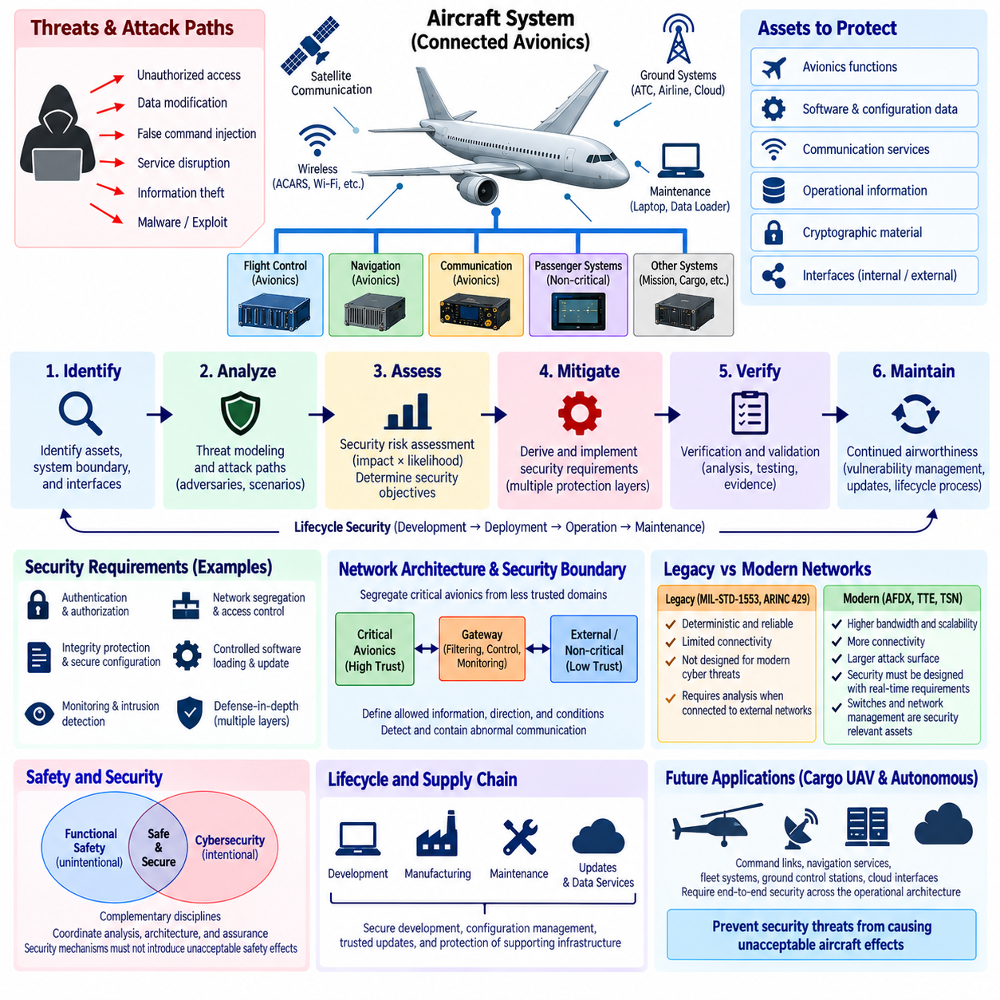
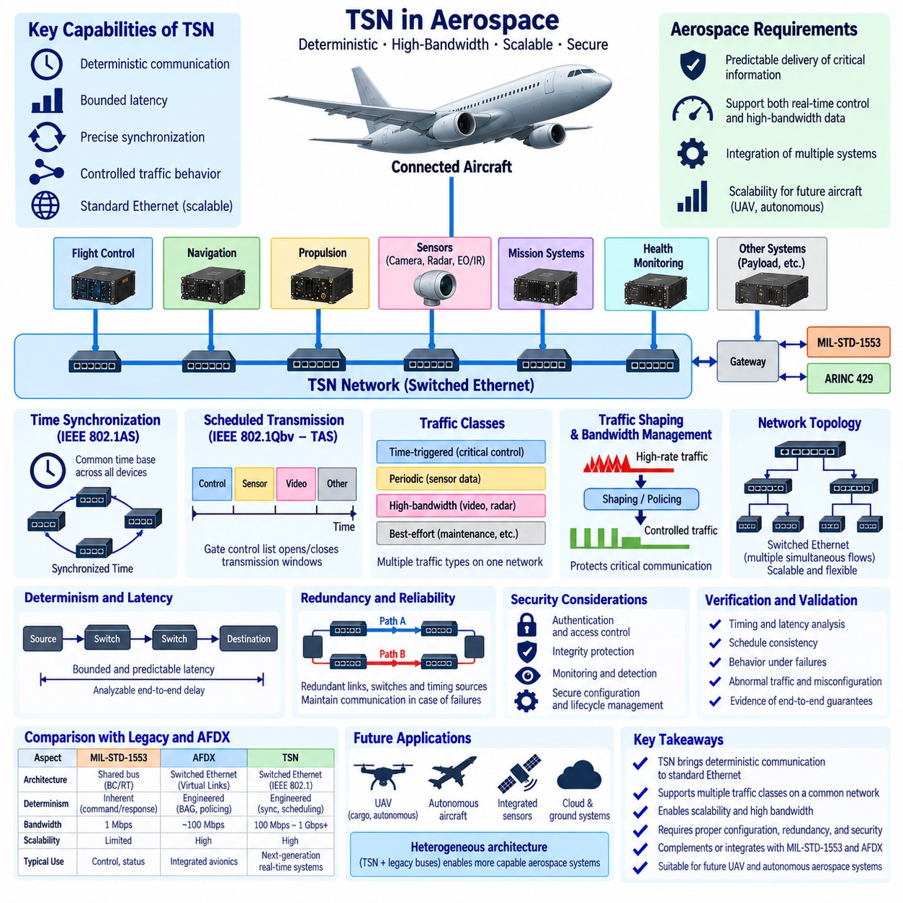
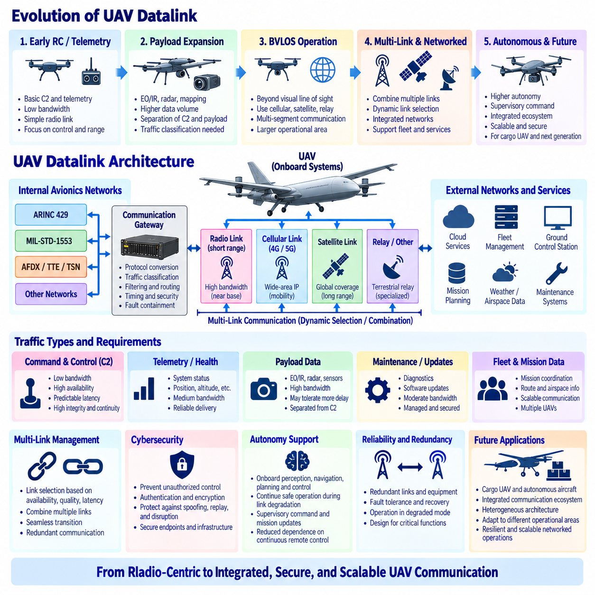
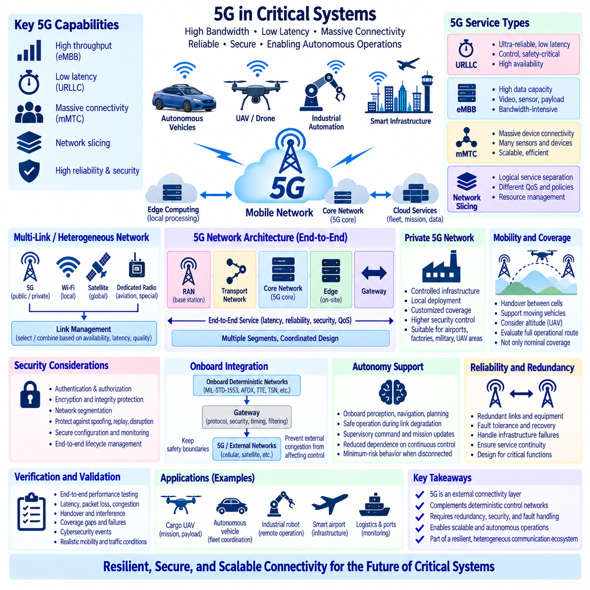
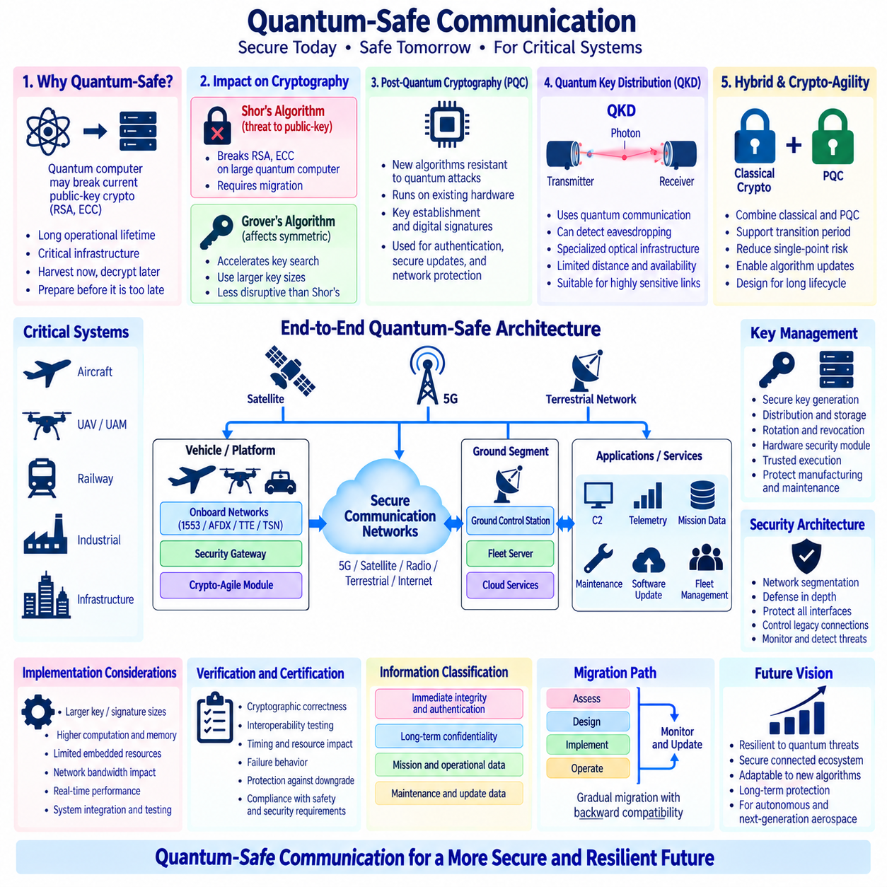

**Volume 08. Railway and Aerospace Protocols**


# Chapter 11. Future Critical Communication

##  

## 11.01. DO-326A Cybersecurity

{width="7.268055555555556in" height="7.268055555555556in"}

DO-326A defines an aviation security process for addressing intentional unauthorized electronic interaction with aircraft systems throughout their lifecycle. Unlike traditional safety engineering, which primarily considers accidental failures and unintended conditions, aviation cybersecurity must consider deliberate actions performed by capable adversaries. The objective is not simply to protect individual computers or networks, but to ensure that security threats cannot produce unacceptable effects on aircraft operation, safety, or continued airworthiness.

The standard is closely associated with airworthiness security because modern aircraft increasingly depend on interconnected digital systems. Avionics networks, maintenance interfaces, wireless communication, ground systems, software-loading mechanisms, and external data services create pathways through which information enters or leaves the aircraft. Security engineering must therefore examine the complete system boundary rather than treating cybersecurity as an isolated information-technology function. Connectivity that improves operational capability can simultaneously increase the number of potential attack paths requiring analysis and protection.

A central concept is the identification of assets that require protection. These assets can include avionics functions, software, configuration data, communication services, operational information, cryptographic material, and interfaces whose compromise could affect aircraft behavior. Security analysis examines how these assets interact with external and internal systems and determines where unauthorized access, manipulation, corruption, or disruption could occur. Asset identification provides the foundation for relating cybersecurity concerns to actual aircraft functions instead of evaluating threats only as abstract network events.

Threat modeling considers potential adversaries, attack paths, interfaces, and possible consequences of unauthorized interaction. An attacker may attempt to modify information, inject false commands, disrupt communication, obtain protected information, or exploit software and configuration weaknesses. The important engineering question is not merely whether an attack is technically possible, but what aircraft-level effect could result if the attack succeeds. Cybersecurity assessment therefore connects threat scenarios with system functions and operational consequences, allowing security requirements to be derived according to the significance of the resulting effects.

Security risk assessment evaluates identified threats together with their potential impact and the difficulty or feasibility of successful exploitation. This allows engineering effort to focus on scenarios that could create meaningful aircraft consequences rather than applying identical protection to every interface. The resulting security objectives can then be allocated to systems, networks, software, hardware, operational procedures, and supporting infrastructure. In this sense, DO-326A promotes a risk-based engineering process in which cybersecurity controls are justified by the threats and aircraft effects they are intended to address.

Security requirements may include authentication, authorization, integrity protection, access control, network segregation, secure configuration, controlled software loading, monitoring, and protection of sensitive communication. No single mechanism is sufficient for every architecture. Instead, multiple protection layers can be combined so that failure or compromise of one mechanism does not automatically expose critical aircraft functions. This defense-in-depth principle is particularly important where external connectivity must coexist with safety-critical avionics and where complete physical isolation is impractical.

Network architecture is therefore a major cybersecurity consideration. Critical avionics domains should be protected from less trusted domains through appropriate partitioning, gateways, filtering, controlled interfaces, and information-flow restrictions. A communication gateway should not be considered merely a protocol converter; it may also represent a security boundary between systems with different levels of trust. The design must determine which information is permitted to cross that boundary, in which direction, under what conditions, and how abnormal communication is detected or contained.

Legacy deterministic networks such as MIL-STD-1553 or ARINC 429 were developed primarily around reliability, predictable communication, and controlled system integration rather than contemporary cybersecurity threats. Their constrained communication behavior can reduce some forms of uncontrolled network interaction, but determinism alone does not provide cybersecurity. When such networks are connected through gateways to Ethernet, wireless links, maintenance systems, or external services, the resulting attack surface must be evaluated at the complete architecture level. A trusted legacy bus can become exposed indirectly through a poorly protected integration path.

Modern Ethernet-based avionics networks such as AFDX, TTE, and emerging TSN-based architectures provide greater bandwidth and connectivity, but increased connectivity also expands cybersecurity considerations. Switches, end systems, configuration data, synchronization mechanisms, gateways, and network-management functions can become security-relevant assets. Deterministic scheduling can constrain expected communication patterns, which may assist monitoring, but it does not replace authentication, integrity protection, secure configuration, or access control. Cybersecurity must therefore be designed alongside real-time communication requirements.

Aircraft cybersecurity also extends beyond operation in flight. Software development environments, manufacturing systems, maintenance equipment, data loaders, diagnostic tools, update infrastructure, and ground networks can influence the security of airborne systems. An attacker does not necessarily need direct access to an aircraft network if malicious software or corrupted configuration data can enter through the supply chain or maintenance process. Lifecycle security consequently requires controlled development, configuration management, trusted update mechanisms, vulnerability management, and protection of supporting infrastructure.

Verification and validation are necessary to demonstrate that security requirements have been implemented correctly and that the resulting architecture provides the intended protection. Analysis can include examination of interfaces, security controls, data flows, failure and attack scenarios, and evidence that unauthorized interactions are adequately prevented, detected, or contained. Security testing complements analytical activities by examining how implemented systems behave when exposed to malformed inputs, unauthorized access attempts, unexpected communication, or other adversarial conditions relevant to the defined threat model.

Cybersecurity differs from functional safety, but the two disciplines must interact closely. A safety analysis may identify an aircraft function whose incorrect behavior could produce a hazardous consequence, while security analysis considers whether intentional electronic interaction could cause that same behavior. Security mechanisms themselves must also avoid introducing unacceptable safety effects. For example, authentication, filtering, isolation, or security monitoring must not create timing behavior or failure modes that violate critical real-time requirements. Safety and security therefore require coordinated architecture and assurance activities.

Continued airworthiness introduces another important dimension because cyber threats evolve after an aircraft enters service. Newly discovered vulnerabilities, changes in external systems, new attack techniques, and software updates can alter the security environment even when the original aircraft architecture remains unchanged. Operators and manufacturers therefore need processes for receiving vulnerability information, assessing its relevance, implementing appropriate mitigations, and maintaining configuration control. Cybersecurity becomes a lifecycle activity rather than a one-time certification exercise completed at initial entry into service.

For future cargo UAVs and increasingly autonomous aerospace systems, the principles associated with DO-326A become even more significant because command links, navigation services, fleet systems, ground control stations, cloud interfaces, maintenance networks, and onboard autonomous computers create a larger connected ecosystem. Security boundaries must extend beyond the individual vehicle to the complete operational architecture. The fundamental engineering objective remains consistent: identify critical assets, understand credible attack paths, evaluate aircraft-level consequences, establish proportionate security requirements, verify their effectiveness, and maintain those protections throughout the operational lifecycle.

DO-326A는 항공기 시스템(aircraft system)에 대한 의도적인 비인가 전자적 상호작용(intentional unauthorized electronic interaction)을 항공기의 전체 수명주기(lifecycle)에 걸쳐 다루기 위한 항공 보안 프로세스(aviation security process)를 정의한다. 주로 우발적 고장(accidental failure)과 의도하지 않은 상태를 고려하는 전통적인 안전 엔지니어링(safety engineering)과 달리, 항공 사이버보안(aviation cybersecurity)은 역량을 가진 공격자가 수행하는 의도적인 행위를 고려해야 한다. 목적은 단순히 개별 컴퓨터나 네트워크를 보호하는 것이 아니라 보안 위협이 항공기 운용, 안전 또는 지속 감항성(continued airworthiness)에 허용할 수 없는 영향을 발생시키지 못하도록 하는 것이다.

이 표준은 현대 항공기가 상호 연결된 디지털 시스템(interconnected digital system)에 점점 더 의존하고 있기 때문에 감항 보안(airworthiness security)과 밀접하게 관련된다. 항공전자 네트워크(avionics network), 정비 인터페이스(maintenance interface), 무선 통신, 지상 시스템(ground system), 소프트웨어 로딩 메커니즘(software-loading mechanism), 외부 데이터 서비스는 정보가 항공기로 들어오거나 나갈 수 있는 경로를 형성한다. 따라서 보안 엔지니어링(security engineering)은 사이버보안을 독립적인 정보기술 기능으로 취급하는 대신 전체 시스템 경계(system boundary)를 검토해야 한다. 운용 능력을 향상시키는 연결성(connectivity)은 동시에 분석하고 보호해야 할 잠재적인 공격 경로(attack path)의 수를 증가시킬 수 있다.

핵심 개념 가운데 하나는 보호가 필요한 자산(asset)을 식별하는 것이다. 이러한 자산에는 항공전자 기능, 소프트웨어, 구성 데이터(configuration data), 통신 서비스, 운용 정보, 암호화 자료(cryptographic material), 그리고 침해될 경우 항공기 동작에 영향을 줄 수 있는 인터페이스가 포함될 수 있다. 보안 분석(security analysis)은 이러한 자산이 외부 및 내부 시스템과 어떻게 상호작용하는지를 검토하고 비인가 접근, 조작, 손상 또는 서비스 방해가 어디에서 발생할 수 있는지를 판단한다. 자산 식별은 위협을 추상적인 네트워크 사건으로만 평가하는 대신 사이버보안 문제를 실제 항공기 기능과 연결하는 기반을 제공한다.

위협 모델링(threat modeling)은 잠재적인 공격자(adversary), 공격 경로, 인터페이스 및 비인가 상호작용으로 인해 발생할 수 있는 결과를 고려한다. 공격자는 정보를 변경하거나, 허위 명령을 주입하거나, 통신을 방해하거나, 보호된 정보를 획득하거나, 소프트웨어 및 구성상의 취약점(vulnerability)을 악용하려 할 수 있다. 중요한 엔지니어링 질문은 단순히 공격이 기술적으로 가능한지 여부가 아니라 공격이 성공했을 때 어떠한 항공기 수준 영향(aircraft-level effect)이 발생할 수 있는가이다. 따라서 사이버보안 평가는 위협 시나리오(threat scenario)를 시스템 기능 및 운용 결과와 연결하여 발생 가능한 영향의 중요도에 따라 보안 요구사항을 도출할 수 있도록 한다.

보안 위험 평가(security risk assessment)는 식별된 위협을 잠재적인 영향 및 공격 성공의 난이도 또는 실현 가능성과 함께 평가한다. 이를 통해 모든 인터페이스에 동일한 보호를 적용하는 대신 의미 있는 항공기 영향을 발생시킬 수 있는 시나리오에 엔지니어링 노력을 집중할 수 있다. 이후 도출된 보안 목표(security objective)는 시스템, 네트워크, 소프트웨어, 하드웨어, 운용 절차 및 지원 인프라에 할당될 수 있다. 이러한 의미에서 DO-326A는 사이버보안 통제가 대응하려는 위협과 항공기 영향을 근거로 정당화되는 위험 기반 엔지니어링 프로세스(risk-based engineering process)를 지향한다.

보안 요구사항(security requirement)에는 인증(authentication), 권한 부여(authorization), 무결성 보호(integrity protection), 접근 제어(access control), 네트워크 분리(network segregation), 안전한 구성(secure configuration), 통제된 소프트웨어 로딩(controlled software loading), 모니터링 및 민감한 통신의 보호가 포함될 수 있다. 하나의 보안 메커니즘만으로 모든 아키텍처를 충분히 보호할 수는 없다. 대신 여러 보호 계층을 결합하여 하나의 메커니즘이 실패하거나 침해되더라도 중요한 항공기 기능이 자동으로 노출되지 않도록 구성할 수 있다. 이러한 심층 방어 원칙(defense-in-depth principle)은 외부 연결성과 안전 필수 항공전자 시스템(safety-critical avionics)이 공존해야 하고 완전한 물리적 격리가 현실적으로 어려운 환경에서 특히 중요하다.

따라서 네트워크 아키텍처(network architecture)는 사이버보안의 주요 고려사항이다. 중요 항공전자 도메인(critical avionics domain)은 적절한 파티셔닝(partitioning), 게이트웨이(gateway), 필터링(filtering), 통제된 인터페이스 및 정보 흐름 제한(information-flow restriction)을 통해 신뢰 수준이 낮은 도메인으로부터 보호되어야 한다. 통신 게이트웨이는 단순한 프로토콜 변환기(protocol converter)로만 간주해서는 안 되며 서로 다른 신뢰 수준을 가진 시스템 사이의 보안 경계(security boundary)가 될 수 있다. 설계에서는 어떤 정보가 해당 경계를 통과할 수 있는지, 어느 방향으로 이동할 수 있는지, 어떠한 조건에서 허용되는지, 그리고 비정상적인 통신을 어떻게 검출하거나 격리할지를 결정해야 한다.

MIL-STD-1553이나 ARINC 429와 같은 기존 결정론적 네트워크(legacy deterministic network)는 현대적인 사이버보안 위협보다는 주로 신뢰성, 예측 가능한 통신 및 통제된 시스템 통합을 중심으로 개발되었다. 제한적인 통신 동작은 일부 형태의 통제되지 않은 네트워크 상호작용을 감소시킬 수 있지만 결정론적 특성만으로 사이버보안이 제공되는 것은 아니다. 이러한 네트워크가 게이트웨이를 통해 이더넷, 무선 링크, 정비 시스템 또는 외부 서비스와 연결되면 전체 아키텍처 수준에서 결과적인 공격 표면(attack surface)을 평가해야 한다. 신뢰할 수 있는 기존 버스도 제대로 보호되지 않은 통합 경로를 통해 간접적으로 노출될 수 있다.

AFDX, TTE 및 새롭게 등장하는 TSN 기반 아키텍처와 같은 현대적인 이더넷 기반 항공전자 네트워크(Ethernet-based avionics network)는 더 높은 대역폭과 연결성을 제공하지만, 증가한 연결성은 사이버보안 고려사항 역시 확대시킨다. 스위치, 종단 시스템(end system), 구성 데이터, 동기화 메커니즘, 게이트웨이 및 네트워크 관리 기능이 보안 관련 자산이 될 수 있다. 결정론적 스케줄링(deterministic scheduling)은 예상되는 통신 패턴을 제한하여 모니터링에 도움을 줄 수 있지만 인증, 무결성 보호, 안전한 구성 또는 접근 제어를 대체하지는 않는다. 따라서 사이버보안은 실시간 통신 요구사항과 함께 설계되어야 한다.

항공기 사이버보안은 비행 중 운용에만 국한되지 않는다. 소프트웨어 개발 환경(software development environment), 제조 시스템, 정비 장비, 데이터 로더(data loader), 진단 도구, 업데이트 인프라 및 지상 네트워크도 항공 시스템의 보안에 영향을 줄 수 있다. 악성 소프트웨어나 손상된 구성 데이터가 공급망(supply chain)이나 정비 프로세스를 통해 유입될 수 있다면 공격자가 항공기 네트워크에 직접 접근할 필요조차 없을 수 있다. 따라서 수명주기 보안(lifecycle security)에는 통제된 개발, 구성 관리(configuration management), 신뢰할 수 있는 업데이트 메커니즘, 취약점 관리(vulnerability management), 지원 인프라 보호가 필요하다.

검증 및 확인(verification and validation)은 보안 요구사항이 올바르게 구현되었으며 결과적인 아키텍처가 의도한 보호 수준을 제공한다는 것을 입증하기 위해 필요하다. 분석에는 인터페이스, 보안 통제, 데이터 흐름, 고장 및 공격 시나리오를 검토하고 비인가 상호작용이 적절하게 방지, 검출 또는 격리된다는 증거를 확인하는 과정이 포함될 수 있다. 보안 시험(security testing)은 정의된 위협 모델과 관련된 비정상 입력(malformed input), 비인가 접근 시도, 예상하지 못한 통신 또는 기타 적대적 조건(adversarial condition)에 노출되었을 때 구현된 시스템이 어떻게 동작하는지를 평가함으로써 분석 활동을 보완한다.

사이버보안은 기능 안전(functional safety)과 서로 다른 분야이지만 두 분야는 긴밀하게 상호작용해야 한다. 안전 분석(safety analysis)은 잘못 동작할 경우 위험한 결과를 발생시킬 수 있는 항공기 기능을 식별할 수 있으며, 보안 분석은 의도적인 전자적 상호작용이 동일한 동작을 발생시킬 수 있는지를 검토한다. 또한 보안 메커니즘 자체가 허용할 수 없는 안전 영향을 발생시키지 않아야 한다. 예를 들어 인증, 필터링, 격리 또는 보안 모니터링이 중요한 실시간 요구사항을 위반하는 타이밍 동작이나 고장 모드(failure mode)를 만들어서는 안 된다. 따라서 안전과 보안은 조정된 아키텍처 및 보증 활동(assurance activity)을 필요로 한다.

지속 감항성(continued airworthiness)은 항공기가 운용에 투입된 이후에도 사이버 위협이 계속 변화하기 때문에 또 다른 중요한 측면을 제공한다. 새롭게 발견되는 취약점, 외부 시스템의 변화, 새로운 공격 기법 및 소프트웨어 업데이트는 원래의 항공기 아키텍처가 변경되지 않더라도 보안 환경을 변화시킬 수 있다. 따라서 운용자와 제조업체는 취약점 정보를 수집하고, 관련성을 평가하며, 적절한 완화 조치(mitigation)를 구현하고, 구성 통제를 유지하기 위한 프로세스를 필요로 한다. 결과적으로 사이버보안은 최초 운용 승인 시점에 완료되는 일회성 인증 활동이 아니라 전체 수명주기에 걸친 활동이 된다.

미래의 화물 무인항공기(cargo UAV)와 점점 더 자율화되는 항공우주 시스템에서는 명령 링크(command link), 항법 서비스, 플릿 시스템(fleet system), 지상 통제소(Ground Control Station, GCS), 클라우드 인터페이스, 정비 네트워크 및 온보드 자율 컴퓨터(onboard autonomous computer)가 더욱 광범위한 연결 생태계를 형성하기 때문에 DO-326A와 관련된 원칙의 중요성이 더욱 커진다. 보안 경계는 개별 비행체를 넘어 전체 운용 아키텍처로 확장되어야 한다. 기본적인 엔지니어링 목표는 일관된다. 즉, 중요 자산을 식별하고, 신뢰할 수 있는 공격 경로를 이해하며, 항공기 수준의 결과를 평가하고, 그에 비례하는 보안 요구사항을 수립하며, 그 효과를 검증하고, 전체 운용 수명주기에 걸쳐 이러한 보호 수준을 유지하는 것이다.

##  

## 11.02. TSN in Aerospace

{width="7.268055555555556in" height="7.268055555555556in"}

Time-Sensitive Networking (TSN) extends standard Ethernet with mechanisms that support deterministic communication, bounded latency, precise synchronization, and controlled traffic behavior. These capabilities make TSN relevant to aerospace systems that increasingly depend on high-bandwidth sensors, distributed computing, autonomous functions, and integrated avionics. Unlike conventional Ethernet, where delay can vary with traffic conditions, properly engineered TSN networks can provide predictable communication behavior while retaining the scalability and ecosystem advantages of Ethernet.

The fundamental aerospace requirement is not simply high network speed but predictable delivery of critical information. Flight-control commands, navigation states, actuator data, synchronization information, and health-monitoring messages may have strict timing constraints, while cameras, radar, mission data, diagnostics, and software services can require substantially greater bandwidth. TSN provides mechanisms for carrying these different traffic types over a common Ethernet infrastructure while controlling how network resources are allocated among them.

Precise time synchronization is one of the foundations of TSN. Distributed computers, sensors, switches, and control devices require a consistent understanding of network time so that scheduled communication and coordinated processing can occur correctly. IEEE 802.1AS provides mechanisms for distributing synchronized time across participating network devices. In an aerospace architecture, this common time base can support coordinated sensing, timestamping, distributed control, data fusion, and deterministic transmission schedules across multiple computing nodes.

IEEE 802.1Qbv introduces the Time-Aware Shaper (TAS), which controls when selected traffic queues are allowed to transmit. Switch output ports can follow a repeating Gate Control List that opens and closes transmission gates according to a predefined schedule. Critical traffic can therefore receive protected transmission windows in which competing lower-priority traffic is prevented from interfering. Conceptually, this brings a TDMA-like scheduling principle into switched Ethernet while allowing different communication classes to share the same physical network infrastructure.

Scheduled transmission helps establish bounded latency because engineers can analyze when a critical frame is permitted to leave each switch along its path. If synchronization, schedules, frame sizes, and routes are properly configured, worst-case communication delay can be evaluated more systematically than in ordinary best-effort Ethernet. This is particularly valuable for distributed aerospace control functions where network delay becomes part of the complete sense-compute-actuate timing chain and must remain within defined real-time limits.

TSN also supports traffic classes that do not require strict time-triggered transmission. Critical control messages may use scheduled communication, while other traffic can use priority-based or shaped transmission according to its timing requirements. This allows one physical Ethernet architecture to support hard real-time control, periodic sensor traffic, diagnostic communication, and less time-sensitive data. The ability to integrate multiple traffic classes is important as aerospace platforms move toward increasingly consolidated computing and communication architectures.

Traffic shaping and bandwidth management are essential because high-rate sources can otherwise interfere with critical communication. Cameras, radar, high-resolution perception sensors, data recorders, and autonomous computing systems may generate large traffic bursts. TSN mechanisms can regulate these flows so that bandwidth-intensive traffic does not consume resources reserved for critical functions. Network design therefore becomes an explicit resource-allocation problem involving bandwidth, latency, queue behavior, transmission schedules, and end-to-end paths.

Switched Ethernet topology provides important scalability advantages over traditional shared buses. Individual end systems connect through switches, allowing multiple communication flows to occur simultaneously on different links. Additional sensors and computing nodes can be integrated without forcing every device to share one serial transmission medium. For modern aircraft, cargo UAVs, and autonomous aerospace platforms, this scalability becomes increasingly important as onboard perception, AI processing, mission computing, and distributed control generate larger and more diverse communication requirements.

Redundancy must be designed together with deterministic communication. Critical aerospace systems cannot depend on a single switch, link, timing source, or communication route if failure of that element could create unacceptable system effects. TSN-based architectures can employ redundant physical paths, duplicated network components, and appropriate recovery or replication strategies. However, additional redundancy increases configuration complexity, so engineers must verify not only normal timing behavior but also communication behavior after failures and during degraded operation.

TSN differs fundamentally from MIL-STD-1553 in the way determinism is achieved. MIL-STD-1553 uses a centralized Bus Controller and command-response transactions on a shared bus, making communication authority inherently explicit. TSN uses switched Ethernet and obtains deterministic behavior through synchronization, scheduling, traffic shaping, prioritization, and engineered network configuration. TSN therefore offers much greater bandwidth and scalability, but its deterministic properties depend on correct system-level configuration rather than emerging automatically from ordinary Ethernet operation.

Compared with AFDX, TSN represents a broader standardized Ethernet technology family with mechanisms that can support increasingly sophisticated real-time communication. AFDX uses configured Virtual Links, Bandwidth Allocation Gap, traffic policing, and redundant networks to constrain Ethernet behavior for avionics. TSN adds standardized techniques for precise synchronization and scheduled traffic, among other mechanisms. Aerospace adoption therefore involves determining which TSN capabilities can satisfy the timing, fault tolerance, verification, interoperability, and certification requirements of a particular aircraft architecture.

Cybersecurity becomes increasingly important as Ethernet connectivity expands. Switches, synchronization services, configuration data, gateways, network-management interfaces, and connected end systems can become security-relevant assets. An attacker who alters a communication schedule, configuration, or synchronization source could potentially affect deterministic behavior even without directly modifying application data. TSN security must therefore be considered together with aerospace cybersecurity processes, network segregation, authentication, integrity protection, controlled configuration, monitoring, and secure lifecycle management.

Verification of a TSN aerospace network must address more than basic connectivity. Engineers need evidence that critical frames meet their latency and delivery requirements under expected traffic loads, that schedules remain consistent across switches, and that lower-priority traffic cannot violate reserved communication behavior. Verification must also consider synchronization errors, link failures, switch failures, abnormal traffic, configuration mistakes, and degraded modes. Deterministic networking becomes useful for critical aerospace systems only when its timing guarantees can be demonstrated at the complete end-to-end architecture level.

Future cargo UAVs and autonomous aircraft provide a strong application case for TSN because their onboard networks may combine flight control, navigation, propulsion, perception, AI computing, mission systems, health monitoring, and high-bandwidth sensors. A heterogeneous architecture may retain proven legacy buses for selected equipment while using TSN-based Ethernet as a higher-capacity backbone. Gateways can connect these domains while preserving their timing and fault-containment requirements. TSN therefore represents an important direction for future critical aerospace communication, combining Ethernet scalability with engineered determinism for increasingly connected and computationally intensive aircraft systems.

시간 민감형 네트워킹(Time-Sensitive Networking, TSN)은 표준 이더넷(Ethernet)에 결정론적 통신(deterministic communication), 제한된 지연 시간(bounded latency), 정밀한 시간 동기화(precise synchronization), 통제된 트래픽 동작(controlled traffic behavior)을 지원하는 메커니즘을 추가한다. 이러한 기능은 고대역폭 센서, 분산 컴퓨팅(distributed computing), 자율 기능(autonomous function), 통합 항공전자 시스템(integrated avionics)에 대한 의존도가 증가하는 항공우주 시스템에서 TSN의 중요성을 높인다. 트래픽 상황에 따라 지연 시간이 달라질 수 있는 일반적인 이더넷과 달리, 적절하게 설계된 TSN 네트워크는 이더넷의 확장성과 생태계 장점을 유지하면서 예측 가능한 통신 동작을 제공할 수 있다.

항공우주 시스템의 핵심 요구사항은 단순히 높은 네트워크 속도를 확보하는 것이 아니라 중요한 정보를 예측 가능한 시간 안에 전달하는 것이다. 비행 제어 명령(flight-control command), 항법 상태(navigation state), 액추에이터 데이터, 동기화 정보, 상태 모니터링 메시지(health-monitoring message)는 엄격한 타이밍 제약을 가질 수 있는 반면, 카메라, 레이더, 임무 데이터, 진단 정보 및 소프트웨어 서비스에는 훨씬 높은 대역폭이 필요할 수 있다. TSN은 서로 다른 유형의 트래픽을 하나의 공통 이더넷 인프라에서 전달하면서 네트워크 자원이 어떻게 배분되는지를 통제하는 메커니즘을 제공한다.

정밀 시간 동기화(precise time synchronization)는 TSN을 구성하는 핵심 기반 중 하나이다. 분산된 컴퓨터, 센서, 스위치 및 제어 장치는 스케줄링된 통신과 조정된 처리를 올바르게 수행하기 위해 일관된 네트워크 시간(network time)을 공유해야 한다. IEEE 802.1AS는 네트워크에 참여하는 장치 사이에서 동기화된 시간을 배포하기 위한 메커니즘을 제공한다. 항공우주 아키텍처에서는 이러한 공통 시간 기준(common time base)을 통해 여러 컴퓨팅 노드에 걸쳐 센싱 조정, 타임스탬핑(timestamping), 분산 제어, 데이터 융합(data fusion), 결정론적 전송 스케줄을 지원할 수 있다.

IEEE 802.1Qbv는 선택된 트래픽 큐(traffic queue)가 언제 전송할 수 있는지를 제어하는 시간 인식 셰이퍼(Time-Aware Shaper, TAS)를 도입한다. 스위치 출력 포트는 사전에 정의된 스케줄에 따라 전송 게이트를 열고 닫는 반복적인 게이트 제어 목록(Gate Control List)을 사용할 수 있다. 따라서 중요 트래픽은 낮은 우선순위의 경쟁 트래픽으로부터 간섭받지 않는 보호된 전송 시간 구간을 확보할 수 있다. 개념적으로 이는 서로 다른 통신 클래스가 동일한 물리적 네트워크 인프라를 공유하면서도 TDMA와 유사한 스케줄링 원리를 스위치 기반 이더넷에 적용하는 것이다.

스케줄 전송(scheduled transmission)은 엔지니어가 중요 프레임(critical frame)이 통신 경로상의 각 스위치에서 언제 전송될 수 있는지를 분석할 수 있기 때문에 제한된 지연 시간을 확보하는 데 도움이 된다. 동기화, 스케줄, 프레임 크기 및 경로가 적절하게 구성되면 일반적인 최선형 이더넷(best-effort Ethernet)보다 최악 조건 통신 지연(worst-case communication delay)을 더욱 체계적으로 평가할 수 있다. 이는 네트워크 지연이 전체 센싱-연산-액추에이션(sense-compute-actuate) 타이밍 체인의 일부가 되고 정의된 실시간 한계 내에서 유지되어야 하는 분산 항공우주 제어 기능에서 특히 중요하다.

TSN은 엄격한 시간 트리거 전송(time-triggered transmission)을 요구하지 않는 트래픽 클래스도 지원한다. 중요한 제어 메시지는 스케줄링된 통신을 사용할 수 있는 반면, 다른 트래픽은 타이밍 요구사항에 따라 우선순위 기반 또는 셰이핑된 전송(shaped transmission)을 사용할 수 있다. 따라서 하나의 물리적 이더넷 아키텍처가 하드 실시간 제어(hard real-time control), 주기적 센서 트래픽, 진단 통신 및 시간적으로 덜 민감한 데이터를 함께 지원할 수 있다. 여러 트래픽 클래스를 통합할 수 있는 능력은 항공우주 플랫폼이 더욱 통합된 컴퓨팅 및 통신 아키텍처로 발전함에 따라 중요해진다.

고속 데이터 소스가 중요한 통신을 방해하지 않도록 하기 위해 트래픽 셰이핑(traffic shaping)과 대역폭 관리(bandwidth management)가 필수적이다. 카메라, 레이더, 고해상도 인지 센서(perception sensor), 데이터 기록 장치(data recorder), 자율 컴퓨팅 시스템은 대규모 트래픽 버스트(traffic burst)를 생성할 수 있다. TSN 메커니즘은 이러한 데이터 흐름을 조절하여 대역폭 집약적인 트래픽이 중요 기능에 예약된 자원을 소비하지 않도록 할 수 있다. 따라서 네트워크 설계는 대역폭, 지연 시간, 큐 동작, 전송 스케줄 및 종단 간 경로(end-to-end path)를 포함하는 명시적인 자원 할당 문제(resource-allocation problem)가 된다.

스위치 기반 이더넷 토폴로지(switched Ethernet topology)는 기존 공유 버스(shared bus)에 비해 중요한 확장성 이점을 제공한다. 개별 종단 시스템(end system)은 스위치를 통해 연결되며, 서로 다른 링크에서 여러 통신 흐름을 동시에 처리할 수 있다. 모든 장치가 하나의 직렬 전송 매체(serial transmission medium)를 공유하도록 만들지 않고도 추가 센서와 컴퓨팅 노드를 통합할 수 있다. 현대 항공기, 화물 무인항공기(cargo UAV), 자율 항공우주 플랫폼에서는 온보드 인지(onboard perception), 인공지능 처리(AI processing), 임무 컴퓨팅 및 분산 제어로 인해 더욱 크고 다양한 통신 요구사항이 발생하므로 이러한 확장성이 점점 중요해진다.

이중화(redundancy)는 결정론적 통신과 함께 설계되어야 한다. 중요 항공우주 시스템에서는 특정 요소의 고장이 허용할 수 없는 시스템 영향을 발생시킬 수 있다면 하나의 스위치, 링크, 시간 기준 소스(timing source) 또는 통신 경로에 의존해서는 안 된다. TSN 기반 아키텍처는 이중화된 물리 경로, 복제된 네트워크 구성요소 및 적절한 복구 또는 복제 전략(replication strategy)을 적용할 수 있다. 그러나 추가적인 이중화는 구성 복잡성을 증가시키므로 엔지니어는 정상 상태의 타이밍 동작뿐만 아니라 고장 발생 이후와 성능 저하 운용(degraded operation) 상태에서의 통신 동작도 검증해야 한다.

TSN은 결정론적 특성을 구현하는 방식에서 MIL-STD-1553과 근본적인 차이가 있다. MIL-STD-1553은 공유 버스에서 중앙집중식 버스 컨트롤러(Bus Controller)와 명령-응답 트랜잭션(command-response transaction)을 사용하기 때문에 통신 제어 권한이 본질적으로 명확하다. 반면 TSN은 스위치 기반 이더넷을 사용하며 동기화, 스케줄링, 트래픽 셰이핑, 우선순위 지정 및 엔지니어링된 네트워크 구성을 통해 결정론적 동작을 확보한다. 따라서 TSN은 훨씬 높은 대역폭과 확장성을 제공하지만, 그 결정론적 특성은 일반적인 이더넷 동작에서 자동으로 발생하는 것이 아니라 올바른 시스템 수준 구성에 의존한다.

AFDX와 비교하면 TSN은 더욱 정교한 실시간 통신을 지원할 수 있는 메커니즘을 포함하는 광범위한 표준 이더넷 기술군(standardized Ethernet technology family)을 나타낸다. AFDX는 설정된 가상 링크(Virtual Link), 대역폭 할당 간격(Bandwidth Allocation Gap, BAG), 트래픽 폴리싱(traffic policing), 이중화 네트워크를 사용하여 항공전자 환경에서 이더넷의 동작을 통제한다. TSN은 여기에 정밀 동기화와 스케줄 트래픽을 비롯한 표준화된 기술을 제공한다. 따라서 항공우주 분야에 TSN을 적용할 때에는 특정 항공기 아키텍처의 타이밍, 고장 허용, 검증, 상호운용성(interoperability), 인증(certification) 요구사항을 어떠한 TSN 기능이 충족할 수 있는지를 판단해야 한다.

이더넷 연결성이 확대됨에 따라 사이버보안(cybersecurity)의 중요성도 증가한다. 스위치, 동기화 서비스, 구성 데이터, 게이트웨이, 네트워크 관리 인터페이스 및 연결된 종단 시스템은 보안 관련 자산(security-relevant asset)이 될 수 있다. 공격자가 애플리케이션 데이터를 직접 변경하지 않더라도 통신 스케줄, 구성 또는 동기화 소스를 변경한다면 결정론적 동작에 영향을 미칠 가능성이 있다. 따라서 TSN 보안은 항공우주 사이버보안 프로세스, 네트워크 분리(network segregation), 인증(authentication), 무결성 보호(integrity protection), 통제된 구성, 모니터링 및 안전한 수명주기 관리(secure lifecycle management)와 함께 고려되어야 한다.

TSN 항공우주 네트워크의 검증(verification)은 단순한 연결성 확인 이상의 내용을 포함해야 한다. 엔지니어는 예상되는 트래픽 부하에서 중요 프레임이 지연 시간 및 전달 요구사항을 충족하고, 여러 스위치 사이에서 스케줄이 일관되게 유지되며, 낮은 우선순위 트래픽이 예약된 통신 동작을 침해할 수 없다는 증거를 확보해야 한다. 또한 동기화 오류, 링크 고장, 스위치 고장, 비정상 트래픽, 구성 오류 및 성능 저하 모드도 검증해야 한다. 결정론적 네트워킹은 그 타이밍 보장을 완전한 종단 간 아키텍처(end-to-end architecture) 수준에서 입증할 수 있을 때 비로소 중요 항공우주 시스템에 실질적인 가치를 제공한다.

미래의 화물 무인항공기(cargo UAV)와 자율 항공기(autonomous aircraft)는 온보드 네트워크에서 비행 제어, 항법, 추진, 인지, AI 컴퓨팅, 임무 시스템, 상태 모니터링 및 고대역폭 센서를 결합할 수 있기 때문에 TSN의 강력한 적용 사례가 된다. 이기종 아키텍처(heterogeneous architecture)는 일부 장비에 검증된 기존 버스를 유지하면서 TSN 기반 이더넷을 더 높은 용량의 백본(backbone)으로 사용할 수 있다. 게이트웨이는 각 통신 도메인의 타이밍 및 고장 격리 요구사항을 유지하면서 이들을 연결할 수 있다. 따라서 TSN은 점점 더 연결되고 연산 집약적으로 발전하는 항공기 시스템을 위해 이더넷의 확장성과 엔지니어링된 결정론(engineered determinism)을 결합하는 미래 중요 항공우주 통신의 핵심적인 발전 방향 중 하나라고 할 수 있다.

##  

## 11.03. UAV Datalink Evolution

{width="7.268055555555556in" height="7.268055555555556in"}

Unmanned Aerial Vehicle (UAV) datalinks have evolved from relatively simple remote-control radio channels into integrated communication systems that support command and control, telemetry, navigation assistance, payload data, mission coordination, and increasingly autonomous operation. This evolution reflects a broader change in UAV architecture: the aircraft is no longer merely a remotely piloted platform, but a distributed computing node connected to ground stations, other aircraft, fleet services, and external information systems.

Early UAV communication architectures were primarily designed around command and control (C2) and basic telemetry. The ground operator transmitted flight commands while the aircraft returned information such as position, altitude, speed, system status, and basic sensor measurements. Bandwidth requirements were relatively modest because most onboard processing and mission functions were limited. Communication design therefore emphasized reliable radio coverage, sufficient range, simple modulation, and the ability to maintain control of the aircraft rather than continuous transmission of large data volumes.

As UAV payload capabilities expanded, the datalink became responsible for substantially more information. Electro-optical and infrared cameras, radar, mapping sensors, and other mission payloads generated data streams that could exceed the requirements of traditional control links by several orders of magnitude. This created a natural separation between low-bandwidth but highly critical C2 traffic and high-bandwidth payload communication. The two traffic categories have fundamentally different requirements, making traffic classification and resource allocation increasingly important in UAV communication architecture.

Command-and-control communication must prioritize availability, predictable latency, integrity, and continuity over maximum throughput. A delayed video frame may reduce mission effectiveness, but excessive delay or corruption in a flight command can directly influence vehicle operation. Modern UAV architectures therefore need to protect C2 traffic from congestion caused by payload or maintenance data. Priority mechanisms, dedicated channels, traffic shaping, redundant links, or logically separated communication services can be used to ensure that high-rate application traffic does not interfere with safety-relevant control information.

The growth of Beyond Visual Line of Sight (BVLOS) operation further changes datalink requirements. A UAV operating beyond direct visual range may depend on communication infrastructure extending far beyond a local ground-control radio. Cellular networks, satellite communication, terrestrial relay systems, or combinations of several communication technologies can become part of the end-to-end link. The datalink must consequently be considered as a communication system composed of multiple segments rather than a single radio connection between one aircraft and one ground station.

Modern cellular technologies introduce another path for UAV connectivity. 4G and 5G networks can provide wide-area IP connectivity, substantial bandwidth, mobility support, and access to terrestrial communication infrastructure. Such connectivity can support telemetry, mission updates, payload data, fleet coordination, maintenance information, and selected C2 functions where the operational and assurance requirements are satisfied. However, cellular communication is dependent on coverage, network loading, mobility behavior, infrastructure availability, and service configuration, so its use in critical UAV functions requires careful end-to-end engineering.

Satellite communication becomes particularly important when UAV operations extend beyond terrestrial network coverage. Long-range cargo aircraft, maritime UAVs, remote inspection platforms, and other extended-range systems may require satellite links for command, telemetry, tracking, or mission communication. Satellite links can provide broad geographic coverage but introduce constraints such as latency, antenna requirements, link availability, bandwidth cost, and environmental sensitivity. A robust UAV architecture may therefore combine satellite communication with terrestrial links rather than depending exclusively on either technology.

Multi-link communication represents a major direction in datalink evolution. Instead of designing the aircraft around one radio technology, future UAVs can contain several communication interfaces and dynamically select or combine them according to mission conditions. A short-range high-bandwidth link may be preferred near the operating base, cellular communication may support regional flight, and satellite connectivity may provide coverage in remote areas. Link-management logic then becomes responsible for evaluating availability, quality, latency, security, and mission requirements before selecting an appropriate communication path.

This transition also changes the role of the onboard communication gateway. The gateway must increasingly connect internal deterministic avionics networks with external IP-based wireless networks. Internal communication may use ARINC 429, MIL-STD-1553, AFDX, TTE, TSN, or other vehicle-specific technologies, while external links may use cellular, satellite, or specialized radio systems. The gateway therefore becomes both a protocol boundary and an architectural boundary where traffic classification, filtering, routing, timing, cybersecurity, and fault containment must be carefully controlled.

Cybersecurity becomes more important as UAV datalinks evolve toward IP connectivity and distributed services. Command channels must be protected against unauthorized control, manipulation, spoofing, replay, and disruption. Telemetry and mission information may require confidentiality and integrity protection, while communication endpoints need appropriate authentication and authorization. Ground stations, fleet servers, maintenance systems, cloud services, and update infrastructure also become part of the attack surface. Datalink security must consequently extend beyond encryption of the radio channel to the complete operational architecture.

Autonomy changes communication requirements in another important way. A highly autonomous UAV should not require continuous high-rate remote piloting commands for every movement. Onboard perception, navigation, planning, and control allow the aircraft to continue safe operation during temporary communication degradation according to predefined operational rules. The datalink can therefore evolve from continuous low-level control toward supervisory command, mission updates, health reporting, fleet coordination, and exception handling. Greater autonomy can reduce dependence on uninterrupted communication, although it does not eliminate the need for reliable C2 connectivity.

Fleet operation expands the communication model from one ground station and one aircraft to many vehicles and distributed services. Cargo UAV fleets may exchange mission assignments, route constraints, health information, airspace data, weather information, charging status, maintenance requirements, and fleet-level coordination messages. Communication architecture must therefore support scalable addressing, service discovery, traffic prioritization, time synchronization, and secure management of many connected nodes. The UAV becomes part of a networked operational system rather than an isolated airborne platform.

Future UAV datalinks are consequently likely to use heterogeneous communication architectures combining multiple radio technologies, onboard deterministic networks, IP-based services, redundant communication paths, and intelligent link management. Critical C2 traffic can be separated from high-bandwidth payload and maintenance traffic while gateways enforce security and fault-containment boundaries. Cellular, satellite, and specialized aviation links can complement one another according to coverage and mission requirements, allowing communication resources to adapt as the aircraft moves through different operational environments.

For future cargo UAV and autonomous aerospace systems, datalink evolution ultimately represents a transition from a radio-centric design to an integrated communication architecture. The engineering objective is no longer simply to maintain a wireless connection, but to guarantee appropriate communication behavior across aircraft networks, external links, ground systems, fleet services, and operational infrastructure. Reliability, latency, bandwidth, redundancy, cybersecurity, autonomy, and coverage must be designed together, creating a resilient communication fabric capable of supporting increasingly connected, distributed, and autonomous aerospace operations.

무인항공기(Unmanned Aerial Vehicle, UAV)의 데이터링크(datalink)는 비교적 단순한 원격 제어 무선 채널(remote-control radio channel)에서 명령 및 제어(Command and Control, C2), 텔레메트리(telemetry), 항법 지원(navigation assistance), 페이로드 데이터(payload data), 임무 조정(mission coordination), 그리고 점차 자율 운용(autonomous operation)까지 지원하는 통합 통신 시스템(integrated communication system)으로 발전해 왔다. 이러한 발전은 UAV 아키텍처의 보다 광범위한 변화를 반영한다. 즉, 항공기는 더 이상 단순한 원격 조종 플랫폼이 아니라 지상 통제소, 다른 항공기, 플릿 서비스(fleet service), 외부 정보 시스템과 연결되는 분산 컴퓨팅 노드(distributed computing node)로 변화하고 있다.

초기의 UAV 통신 아키텍처는 주로 명령 및 제어(Command and Control, C2)와 기본적인 텔레메트리를 중심으로 설계되었다. 지상 운용자는 비행 명령을 전송하고 항공기는 위치, 고도, 속도, 시스템 상태 및 기본적인 센서 측정값 등의 정보를 반환하였다. 대부분의 온보드 처리(onboard processing)와 임무 기능이 제한적이었기 때문에 대역폭 요구사항도 비교적 낮았다. 따라서 당시의 통신 설계는 대용량 데이터를 지속적으로 전송하는 것보다 신뢰성 있는 무선 통신 범위, 충분한 통신 거리, 단순한 변조(modulation), 그리고 항공기에 대한 제어를 유지하는 능력에 중점을 두었다.

UAV의 페이로드 기능(payload capability)이 확대되면서 데이터링크는 훨씬 더 많은 정보를 처리해야 하게 되었다. 전자광학 및 적외선 카메라(Electro-Optical and Infrared camera), 레이더, 매핑 센서(mapping sensor) 및 기타 임무 페이로드는 기존 제어 링크보다 몇 배 이상 높은 데이터 전송량을 요구하는 데이터 스트림을 생성할 수 있다. 이에 따라 낮은 대역폭을 사용하지만 매우 중요한 C2 트래픽과 높은 대역폭을 요구하는 페이로드 통신이 자연스럽게 분리되기 시작하였다. 두 종류의 트래픽은 근본적으로 서로 다른 요구사항을 가지므로 UAV 통신 아키텍처에서는 트래픽 분류(traffic classification)와 자원 할당(resource allocation)이 점점 더 중요해지고 있다.

명령 및 제어 통신은 최대 처리량(maximum throughput)보다 가용성(availability), 예측 가능한 지연 시간(predictable latency), 무결성(integrity), 연속성(continuity)을 우선해야 한다. 영상 프레임이 지연되면 임무 효율성이 저하될 수 있지만, 비행 명령이 지나치게 지연되거나 손상되면 항공기의 운용에 직접적인 영향을 줄 수 있다. 따라서 현대적인 UAV 아키텍처에서는 페이로드 또는 정비 데이터로 인한 네트워크 혼잡(congestion)으로부터 C2 트래픽을 보호해야 한다. 우선순위 메커니즘(priority mechanism), 전용 채널, 트래픽 셰이핑(traffic shaping), 이중화 링크(redundant link), 논리적으로 분리된 통신 서비스를 사용하여 고속 애플리케이션 트래픽이 안전 관련 제어 정보를 방해하지 않도록 할 수 있다.

가시권 밖 비행(Beyond Visual Line of Sight, BVLOS)의 확대는 데이터링크 요구사항을 더욱 변화시킨다. 직접적인 가시 범위를 벗어나 운용되는 UAV는 하나의 지역 지상 통제 무선 링크를 훨씬 넘어서는 통신 인프라에 의존할 수 있다. 셀룰러 네트워크(cellular network), 위성 통신(satellite communication), 지상 중계 시스템(terrestrial relay system), 또는 여러 통신 기술의 조합이 종단 간 링크(end-to-end link)의 일부가 될 수 있다. 따라서 데이터링크는 하나의 항공기와 하나의 지상 통제소를 연결하는 단일 무선 연결이 아니라 여러 구간(segment)으로 구성된 통신 시스템으로 고려되어야 한다.

현대적인 셀룰러 기술(cellular technology)은 UAV 연결성을 위한 또 다른 경로를 제공한다. 4G와 5G 네트워크는 광역 인터넷 프로토콜 연결성(wide-area IP connectivity), 높은 대역폭, 이동성 지원(mobility support), 지상 통신 인프라에 대한 접근을 제공할 수 있다. 이러한 연결은 텔레메트리, 임무 업데이트, 페이로드 데이터, 플릿 조정(fleet coordination), 정비 정보 및 운용·보증 요구사항이 충족되는 경우 일부 C2 기능을 지원할 수 있다. 그러나 셀룰러 통신은 통신 범위, 네트워크 부하(network loading), 이동성 동작, 인프라 가용성 및 서비스 구성에 의존하므로 중요 UAV 기능에 적용하려면 신중한 종단 간 엔지니어링(end-to-end engineering)이 필요하다.

위성 통신(satellite communication)은 UAV 운용이 지상 네트워크의 통신 범위를 넘어설 때 특히 중요해진다. 장거리 화물 항공기(long-range cargo aircraft), 해상 UAV(maritime UAV), 원격 검사 플랫폼(remote inspection platform) 및 기타 장거리 시스템은 명령, 텔레메트리, 추적 또는 임무 통신을 위해 위성 링크를 필요로 할 수 있다. 위성 링크는 광범위한 지리적 통신 범위를 제공하지만 지연 시간, 안테나 요구사항, 링크 가용성, 대역폭 비용 및 환경 민감성(environmental sensitivity)과 같은 제약을 가진다. 따라서 견고한 UAV 아키텍처는 위성 통신이나 지상 링크 중 하나에만 의존하기보다 두 가지를 결합할 수 있다.

다중 링크 통신(multi-link communication)은 데이터링크 발전의 중요한 방향을 나타낸다. 항공기를 하나의 무선 기술만을 중심으로 설계하는 대신 미래의 UAV는 여러 통신 인터페이스를 탑재하고 임무 조건에 따라 이들을 동적으로 선택하거나 결합할 수 있다. 운용 기지 근처에서는 단거리 고대역폭 링크(short-range high-bandwidth link)를 우선 사용할 수 있고, 지역 비행에서는 셀룰러 통신을 사용할 수 있으며, 원격 지역에서는 위성 연결을 통해 통신 범위를 확보할 수 있다. 이때 링크 관리 로직(link-management logic)은 가용성, 품질, 지연 시간, 보안 및 임무 요구사항을 평가하여 적절한 통신 경로를 선택하는 역할을 담당한다.

이러한 변화는 온보드 통신 게이트웨이(onboard communication gateway)의 역할도 변화시킨다. 게이트웨이는 점차 내부의 결정론적 항공전자 네트워크(deterministic avionics network)와 외부의 IP 기반 무선 네트워크(IP-based wireless network)를 연결해야 한다. 내부 통신에는 ARINC 429, MIL-STD-1553, AFDX, TTE, TSN 또는 기타 기체별 기술이 사용될 수 있으며, 외부 링크에는 셀룰러, 위성 또는 특수 무선 시스템이 사용될 수 있다. 따라서 게이트웨이는 프로토콜 경계(protocol boundary)이면서 동시에 트래픽 분류, 필터링, 라우팅, 타이밍, 사이버보안 및 고장 격리(fault containment)를 신중하게 통제해야 하는 아키텍처 경계(architectural boundary)가 된다.

UAV 데이터링크가 IP 연결성(IP connectivity)과 분산 서비스(distributed service) 중심으로 발전하면서 사이버보안(cybersecurity)의 중요성도 더욱 커진다. 명령 채널(command channel)은 비인가 제어, 조작, 스푸핑(spoofing), 재전송 공격(replay), 서비스 방해로부터 보호되어야 한다. 텔레메트리와 임무 정보에는 기밀성(confidentiality) 및 무결성 보호가 필요할 수 있으며, 통신 종단점에는 적절한 인증(authentication)과 권한 부여(authorization)가 필요하다. 지상 통제소, 플릿 서버, 정비 시스템, 클라우드 서비스 및 업데이트 인프라도 공격 표면(attack surface)의 일부가 된다. 따라서 데이터링크 보안은 단순한 무선 채널 암호화를 넘어 전체 운용 아키텍처로 확장되어야 한다.

자율성(autonomy)은 또 다른 중요한 측면에서 통신 요구사항을 변화시킨다. 높은 수준의 자율성을 가진 UAV는 모든 움직임에 대해 지속적인 고속 원격 조종 명령을 필요로 하지 않아야 한다. 온보드 인지(onboard perception), 항법, 계획(planning), 제어 기능을 통해 항공기는 일시적인 통신 성능 저하가 발생하더라도 사전에 정의된 운용 규칙에 따라 안전한 운용을 지속할 수 있다. 따라서 데이터링크는 지속적인 저수준 제어(continuous low-level control)에서 감독 명령(supervisory command), 임무 업데이트, 상태 보고(health reporting), 플릿 조정 및 예외 처리(exception handling) 중심으로 발전할 수 있다. 높은 자율성은 지속적인 통신에 대한 의존성을 줄일 수 있지만 신뢰성 있는 C2 연결의 필요성을 제거하지는 않는다.

플릿 운용(fleet operation)은 하나의 지상 통제소와 하나의 항공기 사이의 통신 모델을 다수의 비행체와 분산 서비스가 연결되는 형태로 확장한다. 화물 UAV 플릿은 임무 할당(mission assignment), 경로 제약(route constraint), 상태 정보, 공역 데이터(airspace data), 기상 정보, 충전 상태, 정비 요구사항 및 플릿 수준 조정 메시지를 교환할 수 있다. 따라서 통신 아키텍처는 확장 가능한 주소 지정(scalable addressing), 서비스 탐색(service discovery), 트래픽 우선순위 지정, 시간 동기화 및 다수의 연결된 노드에 대한 안전한 관리를 지원해야 한다. 이에 따라 UAV는 독립된 공중 플랫폼이 아니라 네트워크화된 운용 시스템(networked operational system)의 일부가 된다.

따라서 미래의 UAV 데이터링크는 여러 무선 기술, 온보드 결정론적 네트워크, IP 기반 서비스, 이중화된 통신 경로 및 지능형 링크 관리(intelligent link management)를 결합하는 이기종 통신 아키텍처(heterogeneous communication architecture)를 사용할 가능성이 높다. 중요 C2 트래픽은 고대역폭 페이로드 및 정비 트래픽으로부터 분리할 수 있으며, 게이트웨이는 보안과 고장 격리 경계를 강제할 수 있다. 셀룰러, 위성 및 특수 항공 통신 링크는 통신 범위와 임무 요구사항에 따라 서로 보완할 수 있으며, 항공기가 서로 다른 운용 환경을 이동함에 따라 통신 자원을 적응적으로 사용할 수 있게 한다.

미래의 화물 무인항공기(cargo UAV)와 자율 항공우주 시스템(autonomous aerospace system)에서 데이터링크의 발전은 궁극적으로 무선 중심 설계(radio-centric design)에서 통합 통신 아키텍처(integrated communication architecture)로의 전환을 의미한다. 엔지니어링 목표는 더 이상 단순히 무선 연결을 유지하는 것이 아니라 항공기 네트워크, 외부 링크, 지상 시스템, 플릿 서비스 및 운용 인프라 전체에서 적절한 통신 동작을 보장하는 것이다. 신뢰성, 지연 시간, 대역폭, 이중화, 사이버보안, 자율성 및 통신 범위를 함께 설계함으로써 점점 더 연결되고 분산되며 자율화되는 항공우주 운용을 지원할 수 있는 복원력 있는 통신 구조(resilient communication fabric)를 구축해야 한다.

##  

## 11.04. 5G in Critical Systems

{width="7.268055555555556in" height="7.268055555555556in"}

Fifth-generation mobile communication, commonly known as 5G, introduces capabilities that make cellular networking increasingly relevant to critical transportation, industrial, aerospace, and autonomous systems. Compared with earlier generations, 5G is designed to support higher throughput, lower latency, massive device connectivity, and differentiated communication services. However, using 5G in a critical system requires more than achieving high radio performance. Availability, bounded delay, security, redundancy, coverage, fault behavior, and end-to-end service assurance must be engineered together.

One of the most important 5G concepts for critical applications is Ultra-Reliable Low-Latency Communication (URLLC). URLLC is intended for services where information must be delivered with high reliability and low delay, such as industrial control and other time-sensitive applications. For autonomous vehicles or UAVs, these characteristics can support supervisory control, coordinated operations, telemetry, and selected real-time services. Nevertheless, radio-interface latency alone does not define system performance because the complete communication path may also include the radio access network, transport network, core network, gateways, and application servers.

Enhanced Mobile Broadband (eMBB) addresses a different requirement by providing high data capacity for bandwidth-intensive applications. Critical autonomous platforms may generate high-resolution camera streams, radar information, mapping data, diagnostic records, and mission payload data that require substantially more bandwidth than conventional control messages. A 5G architecture can therefore support both low-rate critical information and high-rate application data, but these traffic classes must be appropriately separated and managed so that bandwidth-intensive services do not interfere with more important control or health-monitoring functions.

Massive Machine-Type Communication (mMTC) extends the architecture toward large populations of connected devices. In industrial sites, airports, logistics facilities, smart infrastructure, and fleet environments, many sensors, machines, vehicles, and monitoring devices may exchange relatively small amounts of information. For critical systems, the significance of mMTC is not simply the number of devices that can connect. Identity management, traffic isolation, resource allocation, congestion behavior, cybersecurity, and failure containment become increasingly important as the communication ecosystem grows.

Network slicing provides a mechanism for creating logically differentiated communication services over shared 5G infrastructure. A critical-control service can conceptually be separated from payload data, maintenance traffic, passenger services, or general information exchange by assigning different service characteristics and policies. This separation can improve resource management and architectural clarity. However, logical isolation must not automatically be interpreted as complete physical independence. Critical-system designers still need to understand which infrastructure components, radio resources, core-network functions, and operational dependencies remain shared.

Private 5G networks are particularly relevant to factories, airports, ports, logistics centers, military facilities, and controlled UAV operating areas. A private network can provide greater control over radio coverage, infrastructure configuration, access policies, quality of service, and cybersecurity than dependence solely on a public cellular service. Local deployment can also place computing resources close to operational systems. Nevertheless, private ownership does not itself guarantee critical-system reliability; base stations, core functions, timing sources, power supplies, backhaul connections, and management systems still require appropriate fault-tolerance engineering.

Edge computing can reduce dependence on distant cloud infrastructure by placing application processing near the radio network or operational site. A UAV fleet, autonomous ground vehicle, or industrial robot can exchange information with a nearby edge server for perception support, fleet coordination, map distribution, diagnostics, or mission services. Shorter communication paths can reduce latency and external-network dependency. For safety-critical functions, however, designers must determine what happens if the edge service becomes unavailable and which capabilities must remain executable locally on the vehicle.

Mobility introduces additional complexity because critical vehicles may move between radio cells, coverage areas, or even different communication technologies. Handover procedures must maintain acceptable communication continuity while the system transitions between serving cells. UAVs create additional challenges because altitude and flight trajectory can produce radio conditions different from terrestrial users. A critical architecture should therefore evaluate coverage along the complete operational route rather than relying only on nominal network coverage maps or average performance measurements.

Communication availability can be improved through multi-link and heterogeneous networking. A critical platform does not necessarily need to depend exclusively on 5G. It may combine 5G with Wi-Fi, dedicated radio, satellite communication, aviation-specific links, or other technologies. Link-management logic can select or combine paths according to availability, latency, signal quality, security, and mission requirements. This approach treats 5G as one component of a resilient communication architecture rather than assuming that a single wireless technology can satisfy every operational condition.

Cybersecurity is fundamental because 5G connects critical platforms to a broader IP-based communication ecosystem. Authentication, authorization, encryption, integrity protection, secure configuration, network segmentation, monitoring, and lifecycle management must extend across user equipment, radio infrastructure, core-network functions, edge servers, gateways, and applications. Compromise of configuration or management systems can be as significant as compromise of application data. Security architecture must therefore protect both the communication traffic and the infrastructure responsible for providing the communication service.

Deterministic onboard networks and 5G serve different architectural purposes. Technologies such as MIL-STD-1553, AFDX, TTE, or TSN can provide controlled communication among onboard sensors, computers, and actuators, while 5G provides wireless connectivity between the vehicle and external infrastructure. A gateway may connect these domains, but it must preserve timing, security, and fault-containment boundaries. External network congestion or loss should not automatically propagate into the internal control architecture in a way that destabilizes safety-critical vehicle functions.

Autonomy can reduce the safety consequences of temporary wireless communication loss. A critical autonomous vehicle should ideally maintain essential stabilization, navigation, collision avoidance, and minimum-risk behavior using onboard capabilities when external communication becomes degraded. 5G can then support supervisory commands, mission updates, fleet coordination, high-bandwidth data exchange, and operational monitoring without becoming the sole mechanism required for every low-level control action. This separation between onboard autonomy and external connectivity is particularly important for UAV and robotic systems.

Verification of 5G-based critical communication must evaluate the complete end-to-end service rather than only nominal radio performance. Testing should consider latency distributions, packet loss, congestion, handovers, interference, coverage gaps, infrastructure failures, cybersecurity events, backhaul degradation, and recovery behavior. Performance should also be evaluated under realistic mobility and traffic conditions. A network that performs well during laboratory testing may behave differently when many users, moving vehicles, environmental obstacles, or infrastructure failures are introduced.

For future cargo UAVs and other autonomous aerospace platforms, 5G can provide an important communication layer for telemetry, fleet coordination, mission management, maintenance, payload transfer, and selected command-and-control functions. Private 5G may support controlled operating zones, while public cellular networks can extend regional connectivity and satellite links can provide coverage beyond terrestrial infrastructure. The resulting architecture is likely to be heterogeneous, combining onboard deterministic networks, autonomous fallback behavior, edge computing, multiple wireless links, and secure gateways.

The role of 5G in critical systems is therefore best understood as part of a resilient communication ecosystem rather than as a direct replacement for deterministic control networks. Its high bandwidth, low-latency capabilities, service differentiation, mobility support, edge integration, and broad connectivity create significant opportunities, but critical operation requires systematic treatment of failures and dependencies. When redundancy, cybersecurity, autonomy, coverage, service assurance, and fault containment are designed together, 5G can become a powerful external connectivity layer for increasingly distributed and autonomous critical systems.

5세대 이동통신(Fifth-Generation Mobile Communication), 일반적으로 5G라고 불리는 기술은 셀룰러 네트워킹(cellular networking)을 중요 교통, 산업, 항공우주 및 자율 시스템(critical transportation, industrial, aerospace, and autonomous systems)에 점점 더 적합하게 만드는 기능을 제공한다. 이전 세대와 비교하여 5G는 더 높은 처리량(throughput), 더 낮은 지연 시간(latency), 대규모 장치 연결(massive device connectivity), 차별화된 통신 서비스(differentiated communication service)를 지원하도록 설계되었다. 그러나 중요 시스템에서 5G를 사용하려면 높은 무선 성능을 확보하는 것만으로는 충분하지 않다. 가용성(availability), 제한된 지연 시간(bounded delay), 보안(security), 이중화(redundancy), 통신 범위(coverage), 고장 동작(fault behavior), 종단 간 서비스 보증(end-to-end service assurance)을 함께 설계해야 한다.

중요 애플리케이션을 위한 가장 중요한 5G 개념 가운데 하나는 초고신뢰 저지연 통신(Ultra-Reliable Low-Latency Communication, URLLC)이다. URLLC는 산업 제어(industrial control) 및 기타 시간 민감형 애플리케이션(time-sensitive application)처럼 높은 신뢰성과 낮은 지연 시간으로 정보를 전달해야 하는 서비스를 대상으로 한다. 자율주행 차량이나 UAV에서는 이러한 특성을 통해 감독 제어(supervisory control), 협조 운용(coordinated operation), 텔레메트리(telemetry), 일부 실시간 서비스를 지원할 수 있다. 그러나 무선 인터페이스 지연(radio-interface latency)만으로 전체 시스템 성능이 결정되는 것은 아니다. 전체 통신 경로에는 무선 접속망(Radio Access Network, RAN), 전송망(transport network), 코어 네트워크(core network), 게이트웨이(gateway), 애플리케이션 서버(application server)가 포함될 수 있기 때문이다.

향상된 모바일 광대역(Enhanced Mobile Broadband, eMBB)은 대역폭 집약적 애플리케이션에 높은 데이터 용량을 제공함으로써 서로 다른 요구사항을 해결한다. 중요 자율 플랫폼은 기존 제어 메시지보다 훨씬 높은 대역폭을 필요로 하는 고해상도 카메라 스트림, 레이더 정보, 매핑 데이터(mapping data), 진단 기록 및 임무 페이로드 데이터(mission payload data)를 생성할 수 있다. 따라서 5G 아키텍처는 저속의 중요 정보와 고속 애플리케이션 데이터를 모두 지원할 수 있지만, 대역폭 집약적 서비스가 더 중요한 제어 또는 상태 모니터링 기능을 방해하지 않도록 이러한 트래픽 클래스를 적절하게 분리하고 관리해야 한다.

대규모 기계형 통신(Massive Machine-Type Communication, mMTC)은 아키텍처를 대규모 연결 장치 환경으로 확장한다. 산업 현장, 공항, 물류 시설, 스마트 인프라(smart infrastructure), 플릿 환경(fleet environment)에서는 많은 센서, 기계, 차량 및 모니터링 장치가 비교적 적은 양의 정보를 서로 교환할 수 있다. 중요 시스템에서 mMTC의 의미는 단순히 얼마나 많은 장치를 연결할 수 있는가에만 있지 않다. 통신 생태계가 확장됨에 따라 식별 관리(identity management), 트래픽 격리(traffic isolation), 자원 할당(resource allocation), 혼잡 동작(congestion behavior), 사이버보안(cybersecurity), 고장 격리(failure containment)가 더욱 중요해진다.

네트워크 슬라이싱(network slicing)은 공유된 5G 인프라에서 논리적으로 차별화된 통신 서비스를 생성하기 위한 메커니즘을 제공한다. 중요 제어 서비스(critical-control service)는 서로 다른 서비스 특성과 정책을 할당함으로써 개념적으로 페이로드 데이터, 정비 트래픽, 승객 서비스 또는 일반 정보 교환으로부터 분리될 수 있다. 이러한 분리는 자원 관리와 아키텍처의 명확성을 향상시킬 수 있다. 그러나 논리적 격리(logical isolation)를 완전한 물리적 독립성(physical independence)으로 자동 해석해서는 안 된다. 중요 시스템 설계자는 어떤 인프라 구성요소, 무선 자원, 코어 네트워크 기능 및 운용 의존성이 여전히 공유되는지를 파악해야 한다.

사설 5G 네트워크(private 5G network)는 공장, 공항, 항만, 물류센터, 군사 시설 및 통제된 UAV 운용 구역에서 특히 중요하다. 사설 네트워크는 공용 셀룰러 서비스(public cellular service)에만 의존하는 것보다 무선 통신 범위, 인프라 구성, 접근 정책(access policy), 서비스 품질(Quality of Service, QoS), 사이버보안에 대해 더 높은 수준의 제어를 제공할 수 있다. 또한 로컬 배치를 통해 컴퓨팅 자원을 운용 시스템 가까이에 배치할 수 있다. 그러나 사설 네트워크라는 사실 자체가 중요 시스템의 신뢰성을 보장하지는 않는다. 기지국(base station), 코어 기능, 시간 기준 소스(timing source), 전원 공급 장치, 백홀 연결(backhaul connection), 관리 시스템에도 적절한 고장 허용 엔지니어링(fault-tolerance engineering)이 필요하다.

엣지 컴퓨팅(edge computing)은 애플리케이션 처리를 무선 네트워크 또는 운용 현장 가까이에 배치함으로써 원격 클라우드 인프라에 대한 의존성을 줄일 수 있다. UAV 플릿, 자율 지상 차량(autonomous ground vehicle), 산업용 로봇은 인지 지원(perception support), 플릿 조정, 지도 배포(map distribution), 진단 또는 임무 서비스를 위해 인근 엣지 서버(edge server)와 정보를 교환할 수 있다. 통신 경로가 짧아지면 지연 시간과 외부 네트워크 의존성을 감소시킬 수 있다. 그러나 안전 필수 기능(safety-critical function)의 경우 엣지 서비스가 사용할 수 없게 되었을 때 어떻게 동작할 것인지와 차량 자체에서 계속 실행되어야 하는 기능이 무엇인지를 설계 단계에서 결정해야 한다.

이동성(mobility)은 중요 차량이 여러 무선 셀(radio cell), 통신 영역 또는 서로 다른 통신 기술 사이를 이동할 수 있기 때문에 추가적인 복잡성을 발생시킨다. 핸드오버 절차(handover procedure)는 시스템이 서비스 셀 사이를 전환하는 동안 허용 가능한 통신 연속성을 유지해야 한다. UAV의 경우 고도와 비행 궤적(flight trajectory)으로 인해 지상 사용자와 다른 무선 환경이 형성될 수 있어 추가적인 문제가 발생한다. 따라서 중요 아키텍처는 명목상의 네트워크 통신 범위 지도나 평균 성능 측정에만 의존하지 않고 전체 운용 경로에 걸쳐 통신 범위를 평가해야 한다.

통신 가용성은 다중 링크 및 이기종 네트워킹(multi-link and heterogeneous networking)을 통해 향상시킬 수 있다. 중요 플랫폼이 반드시 5G에만 의존해야 하는 것은 아니다. 5G를 Wi-Fi, 전용 무선 통신(dedicated radio), 위성 통신(satellite communication), 항공 전용 링크(aviation-specific link) 또는 기타 기술과 결합할 수 있다. 링크 관리 로직(link-management logic)은 가용성, 지연 시간, 신호 품질, 보안 및 임무 요구사항에 따라 통신 경로를 선택하거나 결합할 수 있다. 이러한 접근 방식은 하나의 무선 기술이 모든 운용 조건을 충족할 수 있다고 가정하는 대신 5G를 복원력 있는 통신 아키텍처(resilient communication architecture)의 하나의 구성요소로 취급한다.

5G는 중요 플랫폼을 보다 광범위한 IP 기반 통신 생태계(IP-based communication ecosystem)에 연결하기 때문에 사이버보안은 필수적인 요소이다. 인증(authentication), 권한 부여(authorization), 암호화(encryption), 무결성 보호(integrity protection), 안전한 구성(secure configuration), 네트워크 분할(network segmentation), 모니터링 및 수명주기 관리(lifecycle management)는 사용자 장비, 무선 인프라, 코어 네트워크 기능, 엣지 서버, 게이트웨이 및 애플리케이션 전체에 적용되어야 한다. 구성 또는 관리 시스템의 침해는 애플리케이션 데이터의 침해만큼 심각할 수 있다. 따라서 보안 아키텍처는 통신 트래픽뿐만 아니라 통신 서비스를 제공하는 인프라도 보호해야 한다.

결정론적 온보드 네트워크(deterministic onboard network)와 5G는 서로 다른 아키텍처 목적을 가진다. MIL-STD-1553, AFDX, TTE 또는 TSN과 같은 기술은 온보드 센서, 컴퓨터 및 액추에이터 사이에서 통제된 통신을 제공할 수 있는 반면, 5G는 차량과 외부 인프라 사이의 무선 연결성을 제공한다. 게이트웨이는 이러한 통신 도메인을 연결할 수 있지만 타이밍, 보안 및 고장 격리 경계(fault-containment boundary)를 유지해야 한다. 외부 네트워크의 혼잡이나 통신 손실이 내부 제어 아키텍처로 직접 전파되어 안전 필수 차량 기능을 불안정하게 만들어서는 안 된다.

자율성(autonomy)은 일시적인 무선 통신 손실이 안전에 미치는 영향을 줄일 수 있다. 중요 자율 차량은 외부 통신 성능이 저하되더라도 온보드 기능을 사용하여 필수적인 안정화(stabilization), 항법, 충돌 회피(collision avoidance), 최소 위험 동작(minimum-risk behavior)을 유지하는 것이 바람직하다. 이 경우 5G는 모든 저수준 제어 동작(low-level control action)을 수행하는 유일한 수단이 되기보다 감독 명령, 임무 업데이트, 플릿 조정, 고대역폭 데이터 교환 및 운용 모니터링을 지원할 수 있다. 온보드 자율성과 외부 연결성의 이러한 분리는 UAV와 로봇 시스템에서 특히 중요하다.

5G 기반 중요 통신의 검증(verification)은 명목상의 무선 성능만이 아니라 완전한 종단 간 서비스(end-to-end service)를 평가해야 한다. 시험에서는 지연 시간 분포(latency distribution), 패킷 손실(packet loss), 혼잡, 핸드오버, 간섭(interference), 통신 음영 지역(coverage gap), 인프라 고장, 사이버보안 이벤트, 백홀 성능 저하 및 복구 동작을 고려해야 한다. 또한 실제 이동성과 트래픽 조건에서 성능을 평가해야 한다. 실험실 환경에서 우수하게 동작하는 네트워크도 다수의 사용자, 이동 차량, 환경 장애물 또는 인프라 고장이 발생하면 서로 다른 동작을 나타낼 수 있다.

미래의 화물 무인항공기(cargo UAV)와 기타 자율 항공우주 플랫폼에서 5G는 텔레메트리, 플릿 조정, 임무 관리(mission management), 정비, 페이로드 전송 및 일부 명령 및 제어 기능을 위한 중요한 통신 계층이 될 수 있다. 사설 5G는 통제된 운용 구역을 지원할 수 있으며, 공용 셀룰러 네트워크는 지역 단위의 연결성을 확장하고, 위성 링크는 지상 인프라 범위를 벗어난 지역까지 통신을 제공할 수 있다. 결과적인 아키텍처는 온보드 결정론적 네트워크, 자율 폴백 동작(autonomous fallback behavior), 엣지 컴퓨팅, 다중 무선 링크 및 보안 게이트웨이를 결합하는 이기종 구조가 될 가능성이 높다.

따라서 중요 시스템에서 5G의 역할은 결정론적 제어 네트워크를 직접 대체하는 기술이라기보다 복원력 있는 통신 생태계(resilient communication ecosystem)의 일부로 이해하는 것이 적절하다. 높은 대역폭, 저지연 기능, 서비스 차별화(service differentiation), 이동성 지원, 엣지 통합(edge integration), 광범위한 연결성은 중요한 가능성을 제공하지만 중요 시스템의 운용을 위해서는 고장과 의존성을 체계적으로 다루어야 한다. 이중화, 사이버보안, 자율성, 통신 범위, 서비스 보증 및 고장 격리를 함께 설계할 경우 5G는 점점 더 분산되고 자율화되는 중요 시스템을 위한 강력한 외부 연결 계층(external connectivity layer)이 될 수 있다.

##  

## 11.05. Quantum Safe Communication

{width="7.268055555555556in" height="7.268055555555556in"}

Quantum-safe communication addresses the long-term security risk created by the development of large-scale quantum computers. Many current digital systems depend on public-key cryptography whose security is based on mathematical problems that are extremely difficult for classical computers. A sufficiently capable quantum computer could fundamentally change this assumption. Critical aerospace, railway, industrial, and autonomous systems with long operational lifecycles must therefore consider how protected communication can remain secure in a future quantum-computing environment.

The principal concern arises from quantum algorithms that affect widely deployed asymmetric cryptography. Shor's algorithm provides a theoretical means of efficiently solving the mathematical problems underlying RSA and elliptic-curve cryptography when executed on a sufficiently powerful fault-tolerant quantum computer. This does not mean that present quantum computers can immediately break deployed systems, but it creates a strategic migration requirement because aircraft, infrastructure, and critical platforms may remain operational for decades.

Symmetric cryptography is affected differently by quantum computing. Grover's algorithm can theoretically accelerate exhaustive key search, but its impact is less disruptive than Shor's algorithm is for public-key cryptography. Increasing symmetric key sizes can provide additional security margin against this type of quantum acceleration. Quantum-safe architecture therefore does not require abandoning all conventional cryptography. Instead, it requires understanding which cryptographic functions are most exposed and selecting appropriate algorithms, key sizes, protocols, and migration strategies.

Post-Quantum Cryptography (PQC) is one of the primary approaches to quantum-safe communication. PQC uses mathematical problems that are believed to remain computationally difficult for both classical and quantum computers. These algorithms are designed to operate on conventional processors and communication networks, making them attractive for existing digital infrastructure. Their applications include key establishment and digital signatures, which are essential for secure software updates, authentication, command systems, configuration management, and protected network sessions.

PQC migration is not simply an algorithm replacement. New cryptographic mechanisms can have different public-key, ciphertext, signature, memory, computation, and communication characteristics. Critical embedded systems may have limited processors, storage, network bandwidth, or deterministic timing budgets. Engineers must therefore evaluate whether quantum-safe operations can be integrated without violating real-time requirements or creating unacceptable resource consumption. Cryptographic performance becomes part of system architecture rather than an isolated cybersecurity implementation detail.

Quantum Key Distribution (QKD) represents a fundamentally different approach. Instead of relying only on computational difficulty, QKD uses properties of quantum communication to establish cryptographic key material while providing mechanisms that can reveal certain forms of interception. QKD is conceptually attractive for highly sensitive communication, but it requires specialized physical infrastructure and has practical constraints involving distance, optical channels, equipment complexity, availability, and integration. It should therefore be distinguished clearly from software-based post-quantum cryptography.

For aerospace and mobile autonomous systems, PQC is generally more directly compatible with existing radio and IP communication architectures because it can operate over conventional communication channels. QKD may be more applicable to selected fixed infrastructure, terrestrial backbone connections, specialized optical links, or future satellite-based security services. A complete quantum-safe strategy can therefore contain different technologies at different architectural layers rather than assuming that one security mechanism will protect every communication path.

The concept of "harvest now, decrypt later" creates an immediate reason to consider future quantum threats before large quantum computers become available. An adversary can potentially capture encrypted information today and preserve it until future computing capabilities allow decryption. Information that must remain confidential for many years is particularly exposed to this strategy. Long-lived military, aerospace, infrastructure, intellectual-property, and mission information may consequently require quantum-resistant protection well before practical cryptographically relevant quantum computers exist.

Crypto-agility is therefore a central architectural requirement. A system should ideally allow cryptographic algorithms, key sizes, certificates, trust anchors, and related protocols to be updated without redesigning the entire platform. This is especially important for aircraft, UAVs, railway systems, and industrial equipment whose operational lives may greatly exceed the lifecycle of a particular cryptographic algorithm. Crypto-agile design transforms cryptography from a permanently embedded implementation choice into a managed and replaceable security capability.

Hybrid cryptographic approaches can support migration by combining established classical cryptography with post-quantum mechanisms. During a transition period, systems can derive protection from more than one cryptographic technique while interoperability, implementation maturity, and operational experience with PQC continue to develop. Hybrid designs can reduce dependence on a single new mechanism, but they also increase protocol and key-management complexity. Their security benefits therefore depend on careful composition, implementation, testing, and lifecycle management.

Key management remains essential regardless of the cryptographic algorithms selected. Strong quantum-resistant mathematics cannot compensate for poorly protected private keys, compromised credentials, insecure provisioning, weak random-number generation, or uncontrolled certificate management. Critical systems require secure key generation, distribution, storage, rotation, revocation, recovery, and destruction. Hardware security modules, secure elements, trusted execution mechanisms, and protected manufacturing or maintenance processes can become important components of the overall architecture.

Quantum-safe communication must also integrate with network segmentation and defense-in-depth. An aerospace platform may contain deterministic onboard networks, Ethernet backbones, wireless datalinks, maintenance interfaces, gateways, ground stations, fleet servers, and cloud services. Not every interface requires identical cryptographic protection, but security boundaries must be defined according to assets, threats, data lifetime, and operational consequences. Gateways become particularly important because they can connect legacy communication domains with modern IP-based systems using different security capabilities.

Future UAV and autonomous aerospace architectures illustrate this challenge clearly. Command and control, telemetry, mission planning, fleet coordination, software updates, navigation information, maintenance data, and payload services may traverse 5G, satellite, specialized radio, or terrestrial networks. Some information requires immediate integrity and authentication, while other information may require confidentiality for many years. Quantum-safe design must therefore classify communication according to security objectives rather than applying the same cryptographic mechanism indiscriminately to every data flow.

Verification and certification will need to consider both cryptographic correctness and system-level behavior. Engineers must verify implementation, key handling, interoperability, timing, resource consumption, failure behavior, update mechanisms, and protection against downgrade to weaker algorithms. For critical real-time systems, security mechanisms must not create unpredictable delays or resource exhaustion that compromise essential functions. Quantum-safe communication therefore intersects with cybersecurity assurance, functional safety, real-time networking, configuration management, and continued airworthiness.

The transition toward quantum-safe critical communication will be gradual rather than instantaneous. Existing systems will continue using established cryptography while new platforms introduce crypto-agile architectures, post-quantum algorithms, hybrid mechanisms, and stronger lifecycle management. Legacy equipment may require secure gateways rather than direct modification. The long-term objective is not simply to deploy a particular quantum-resistant algorithm, but to build communication architectures capable of adapting as cryptographic standards, quantum capabilities, vulnerabilities, and operational requirements evolve.

For future critical communication, quantum safety represents a lifecycle engineering problem extending from individual algorithms to complete connected systems. Post-quantum cryptography can protect conventional digital networks, QKD can provide specialized key-distribution capabilities where suitable, and crypto-agility enables future migration. Combined with secure key management, segmentation, redundancy, monitoring, and controlled updates, these technologies can form a resilient security architecture for aircraft, cargo UAVs, autonomous systems, and critical infrastructure expected to remain operational through the transition into the quantum-computing era.

양자 안전 통신(Quantum-Safe Communication)은 대규모 양자 컴퓨터(large-scale quantum computer)의 발전으로 인해 발생하는 장기적인 보안 위험을 다룬다. 현재 많은 디지털 시스템은 고전 컴퓨터(classical computer)로 해결하기 매우 어려운 수학적 문제를 보안의 기반으로 사용하는 공개키 암호화(public-key cryptography)에 의존한다. 충분한 성능의 양자 컴퓨터는 이러한 전제를 근본적으로 변화시킬 수 있다. 따라서 긴 운용 수명주기(operational lifecycle)를 갖는 중요 항공우주, 철도, 산업 및 자율 시스템은 미래의 양자 컴퓨팅 환경에서도 보호된 통신이 어떻게 안전하게 유지될 수 있는지를 고려해야 한다.

주요 우려는 널리 사용되는 비대칭 암호화(asymmetric cryptography)에 영향을 미치는 양자 알고리즘(quantum algorithm)에서 발생한다. 쇼어 알고리즘(Shor's algorithm)은 충분히 강력한 고장 허용 양자 컴퓨터(fault-tolerant quantum computer)에서 실행될 경우 RSA와 타원곡선 암호(Elliptic-Curve Cryptography, ECC)의 기반이 되는 수학적 문제를 효율적으로 해결할 수 있는 이론적 방법을 제공한다. 이것이 현재의 양자 컴퓨터가 즉시 배치된 암호 시스템을 해독할 수 있다는 의미는 아니지만, 항공기, 인프라 및 중요 플랫폼이 수십 년 동안 운용될 수 있기 때문에 전략적인 마이그레이션 요구사항(migration requirement)을 발생시킨다.

대칭키 암호화(symmetric cryptography)는 양자 컴퓨팅의 영향을 다른 방식으로 받는다. 그로버 알고리즘(Grover's algorithm)은 이론적으로 전수 키 탐색(exhaustive key search)을 가속할 수 있지만, 그 영향은 공개키 암호화에 대한 쇼어 알고리즘의 영향보다 상대적으로 제한적이다. 대칭키 크기를 증가시키면 이러한 양자 가속에 대응할 수 있는 추가적인 보안 여유(security margin)를 확보할 수 있다. 따라서 양자 안전 아키텍처는 모든 기존 암호화 기술을 폐기하는 것이 아니라 어떤 암호 기능이 가장 큰 영향을 받는지 이해하고 적절한 알고리즘, 키 크기, 프로토콜 및 마이그레이션 전략을 선택하는 것을 요구한다.

양자내성암호(Post-Quantum Cryptography, PQC)는 양자 안전 통신을 구현하기 위한 주요 접근 방법 가운데 하나이다. PQC는 고전 컴퓨터와 양자 컴퓨터 모두에서 계산적으로 해결하기 어렵다고 여겨지는 수학적 문제를 사용한다. 이러한 알고리즘은 기존 프로세서와 통신 네트워크에서 동작하도록 설계되므로 기존 디지털 인프라에 적용하기에 유리하다. 주요 응용에는 키 설정(key establishment)과 디지털 서명(digital signature)이 포함되며, 이는 안전한 소프트웨어 업데이트, 인증(authentication), 명령 시스템, 구성 관리(configuration management), 보호된 네트워크 세션에 필수적이다.

PQC 마이그레이션은 단순한 알고리즘 교체가 아니다. 새로운 암호 메커니즘은 공개키(public key), 암호문(ciphertext), 서명(signature), 메모리, 연산 및 통신 특성에서 서로 다른 요구사항을 가질 수 있다. 중요 임베디드 시스템(critical embedded system)은 제한된 프로세서 성능, 저장 공간, 네트워크 대역폭 또는 결정론적 타이밍 예산(deterministic timing budget)을 가질 수 있다. 따라서 엔지니어는 양자 안전 연산을 통합할 때 실시간 요구사항을 위반하거나 허용할 수 없는 자원 소비를 발생시키지 않는지를 평가해야 한다. 이에 따라 암호 성능은 독립적인 사이버보안 구현 요소가 아니라 시스템 아키텍처의 일부가 된다.

양자 키 분배(Quantum Key Distribution, QKD)는 근본적으로 다른 접근 방법을 나타낸다. QKD는 계산 난이도에만 의존하는 대신 양자 통신(quantum communication)의 특성을 이용하여 암호화 키 자료(cryptographic key material)를 설정하고 특정 형태의 도청(interception)을 탐지할 수 있는 메커니즘을 제공한다. QKD는 매우 민감한 통신에 개념적으로 매력적이지만 특수한 물리적 인프라가 필요하며 통신 거리, 광학 채널(optical channel), 장비 복잡성, 가용성 및 시스템 통합과 관련된 현실적인 제약을 가진다. 따라서 QKD는 소프트웨어 기반 양자내성암호와 명확하게 구분되어야 한다.

항공우주 및 이동형 자율 시스템(mobile autonomous system)의 경우 PQC는 기존의 무선 및 IP 통신 아키텍처에서 동작할 수 있기 때문에 일반적으로 기존 시스템과 더욱 직접적으로 호환된다. 반면 QKD는 일부 고정형 인프라, 지상 백본 연결(terrestrial backbone connection), 특수 광학 링크 또는 미래의 위성 기반 보안 서비스에 더욱 적합할 수 있다. 따라서 완전한 양자 안전 전략은 하나의 보안 메커니즘이 모든 통신 경로를 보호한다고 가정하는 대신 서로 다른 아키텍처 계층에서 서로 다른 기술을 적용하는 형태로 구성될 수 있다.

현재 수집 후 미래 해독(Harvest Now, Decrypt Later)이라는 개념은 대규모 양자 컴퓨터가 등장하기 이전부터 미래의 양자 위협을 고려해야 하는 직접적인 이유를 제공한다. 공격자는 현재 암호화된 정보를 수집하여 저장한 후 미래의 컴퓨팅 기술이 해당 정보를 해독할 수 있을 때까지 보존할 수 있다. 특히 수년 또는 수십 년 동안 기밀성을 유지해야 하는 정보는 이러한 전략에 취약하다. 따라서 장기간 보호해야 하는 군사, 항공우주, 인프라, 지식재산(intellectual property) 및 임무 정보는 암호학적으로 유의미한 양자 컴퓨터가 실제로 등장하기 훨씬 이전부터 양자내성 보호가 필요할 수 있다.

따라서 암호 민첩성(crypto-agility)은 핵심적인 아키텍처 요구사항이 된다. 시스템은 전체 플랫폼을 다시 설계하지 않고도 암호 알고리즘, 키 크기, 인증서(certificate), 신뢰 앵커(trust anchor) 및 관련 프로토콜을 업데이트할 수 있는 것이 이상적이다. 이는 특정 암호 알고리즘의 수명보다 훨씬 긴 운용 기간을 가질 수 있는 항공기, UAV, 철도 시스템 및 산업 장비에서 특히 중요하다. 암호 민첩성 설계(crypto-agile design)는 암호 기술을 영구적으로 고정된 구현 선택에서 관리 가능하고 교체 가능한 보안 기능으로 변화시킨다.

하이브리드 암호화 접근 방식(hybrid cryptographic approach)은 기존의 고전 암호화(classical cryptography)와 양자내성 메커니즘을 결합하여 마이그레이션을 지원할 수 있다. 전환 기간 동안 시스템은 PQC의 상호운용성(interoperability), 구현 성숙도 및 운용 경험이 발전하는 과정에서 하나 이상의 암호 기술을 통해 보호 기능을 확보할 수 있다. 하이브리드 설계는 하나의 새로운 메커니즘에 대한 의존성을 줄일 수 있지만 프로토콜과 키 관리의 복잡성을 증가시킨다. 따라서 보안상의 이점은 신중한 조합, 구현, 시험 및 수명주기 관리에 의존한다.

어떤 암호 알고리즘을 선택하더라도 키 관리(key management)는 필수적이다. 강력한 양자내성 수학도 제대로 보호되지 않은 개인키(private key), 침해된 자격 증명(credentials), 안전하지 않은 프로비저닝(provisioning), 취약한 난수 생성(random-number generation), 통제되지 않은 인증서 관리를 보완할 수는 없다. 중요 시스템에는 안전한 키 생성, 배포, 저장, 교체(rotation), 폐기(revocation), 복구 및 파기가 필요하다. 하드웨어 보안 모듈(Hardware Security Module, HSM), 보안 요소(secure element), 신뢰 실행 메커니즘(trusted execution mechanism), 보호된 제조 및 정비 프로세스가 전체 아키텍처의 중요한 구성요소가 될 수 있다.

양자 안전 통신은 네트워크 분할(network segmentation) 및 심층 방어(defense-in-depth)와도 통합되어야 한다. 항공우주 플랫폼에는 결정론적 온보드 네트워크(deterministic onboard network), 이더넷 백본(Ethernet backbone), 무선 데이터링크, 정비 인터페이스, 게이트웨이, 지상 통제소, 플릿 서버(fleet server), 클라우드 서비스가 포함될 수 있다. 모든 인터페이스에 동일한 암호 보호가 필요한 것은 아니지만 자산, 위협, 데이터의 보호 수명(data lifetime), 운용 결과에 따라 보안 경계를 정의해야 한다. 특히 게이트웨이는 서로 다른 보안 기능을 가진 기존 통신 도메인과 현대적인 IP 기반 시스템을 연결할 수 있기 때문에 중요하다.

미래의 UAV 및 자율 항공우주 아키텍처는 이러한 문제를 명확하게 보여준다. 명령 및 제어(Command and Control, C2), 텔레메트리, 임무 계획(mission planning), 플릿 조정(fleet coordination), 소프트웨어 업데이트, 항법 정보, 정비 데이터 및 페이로드 서비스는 5G, 위성, 특수 무선 통신 또는 지상 네트워크를 통해 전달될 수 있다. 일부 정보에는 즉각적인 무결성과 인증이 필요한 반면, 다른 정보에는 수년간의 기밀성이 요구될 수 있다. 따라서 양자 안전 설계는 모든 데이터 흐름에 동일한 암호 메커니즘을 일률적으로 적용하기보다 보안 목표(security objective)에 따라 통신을 분류해야 한다.

검증 및 인증(verification and certification)은 암호 기술의 정확성뿐만 아니라 시스템 수준의 동작도 고려해야 한다. 엔지니어는 구현, 키 처리, 상호운용성, 타이밍, 자원 소비, 고장 동작, 업데이트 메커니즘 및 더 취약한 알고리즘으로의 다운그레이드(downgrade)에 대한 보호를 검증해야 한다. 중요 실시간 시스템에서 보안 메커니즘이 필수 기능을 손상시키는 예측 불가능한 지연이나 자원 고갈(resource exhaustion)을 발생시켜서는 안 된다. 따라서 양자 안전 통신은 사이버보안 보증(cybersecurity assurance), 기능 안전(functional safety), 실시간 네트워킹(real-time networking), 구성 관리 및 지속 감항성(continued airworthiness)과 상호 연계된다.

양자 안전 중요 통신(quantum-safe critical communication)으로의 전환은 즉각적인 변화가 아니라 점진적으로 이루어질 것이다. 기존 시스템은 확립된 암호화 기술을 계속 사용하는 동시에 새로운 플랫폼은 암호 민첩성 아키텍처, 양자내성 알고리즘, 하이브리드 메커니즘 및 강화된 수명주기 관리를 도입하게 될 것이다. 기존 장비(legacy equipment)는 직접적인 수정 대신 보안 게이트웨이를 필요로 할 수도 있다. 장기적인 목표는 특정 양자내성 알고리즘 하나를 배치하는 것이 아니라 암호 표준, 양자 기술의 능력, 취약점 및 운용 요구사항의 변화에 따라 적응할 수 있는 통신 아키텍처를 구축하는 것이다.

미래의 중요 통신에서 양자 안전(quantum safety)은 개별 알고리즘에서 완전히 연결된 시스템 전체로 확장되는 수명주기 엔지니어링 문제(lifecycle engineering problem)를 의미한다. 양자내성암호는 기존 디지털 네트워크를 보호할 수 있고, 양자 키 분배는 적절한 환경에서 특수한 키 분배 기능을 제공할 수 있으며, 암호 민첩성은 미래의 마이그레이션을 가능하게 한다. 이러한 기술을 안전한 키 관리, 네트워크 분할, 이중화, 모니터링 및 통제된 업데이트와 결합하면 양자 컴퓨팅 시대로 전환되는 동안에도 장기간 운용되어야 하는 항공기, 화물 무인항공기(cargo UAV), 자율 시스템 및 중요 인프라를 위한 복원력 있는 보안 아키텍처(resilient security architecture)를 구축할 수 있다.
